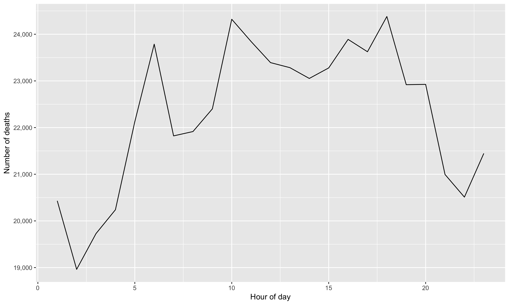
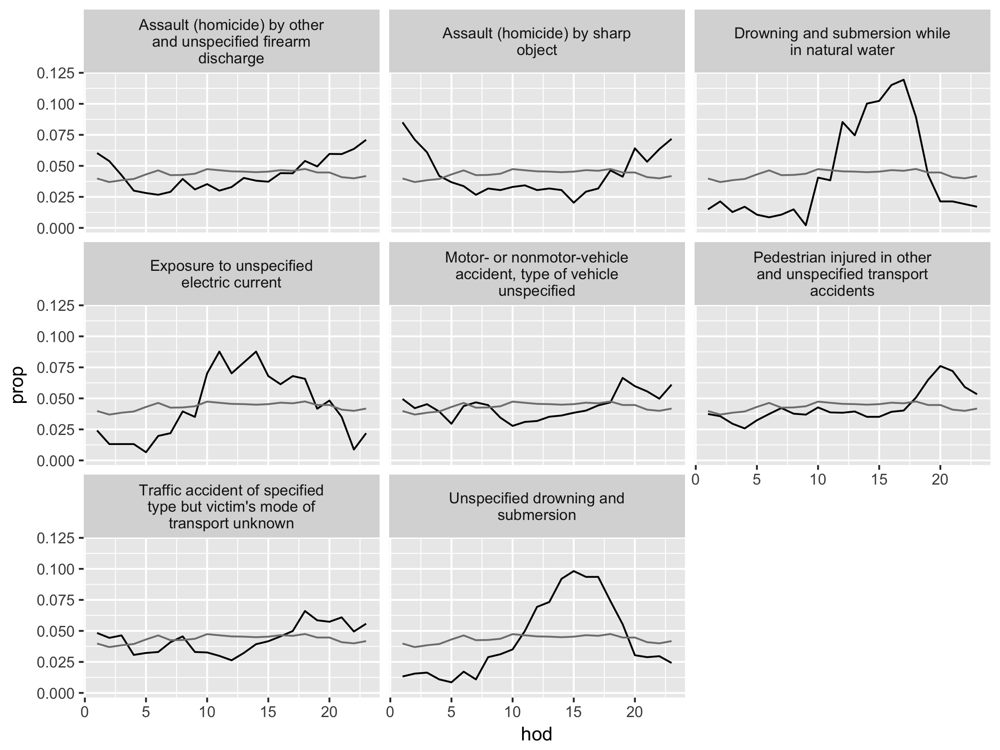
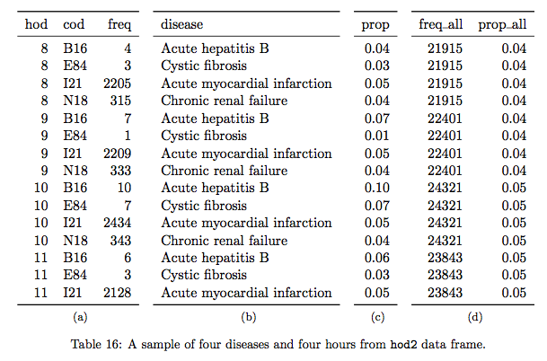
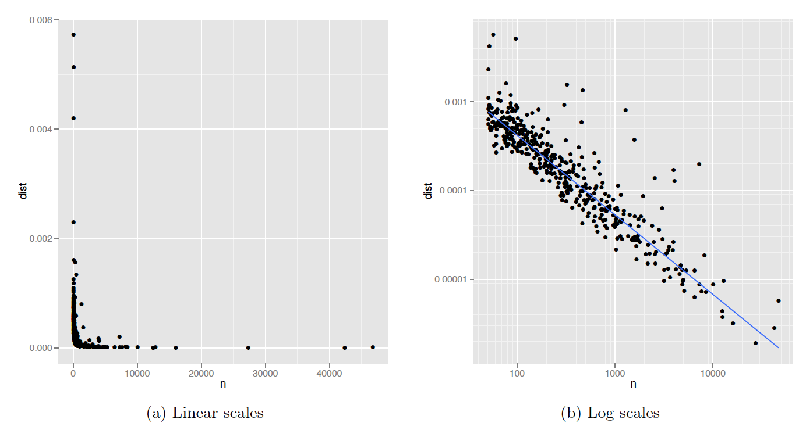
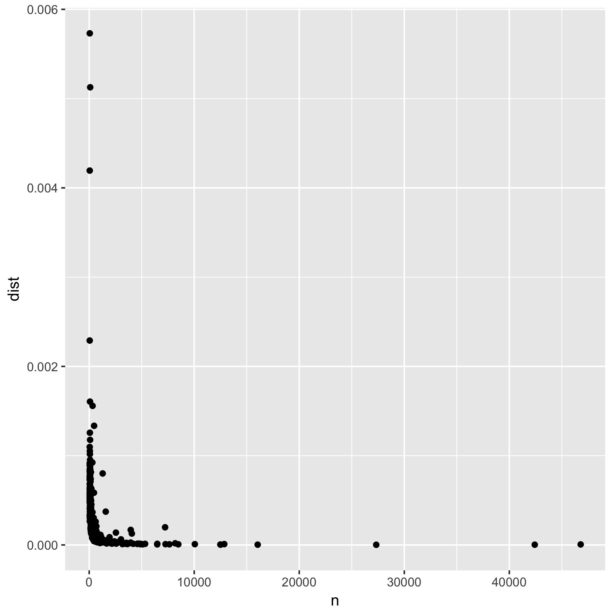
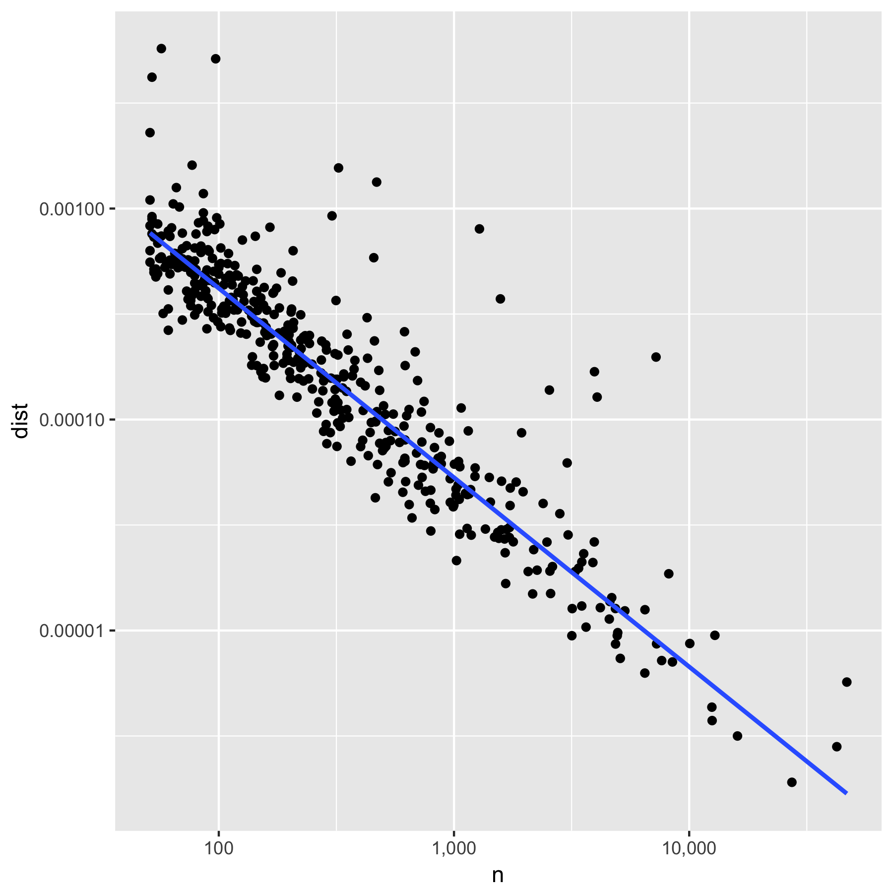
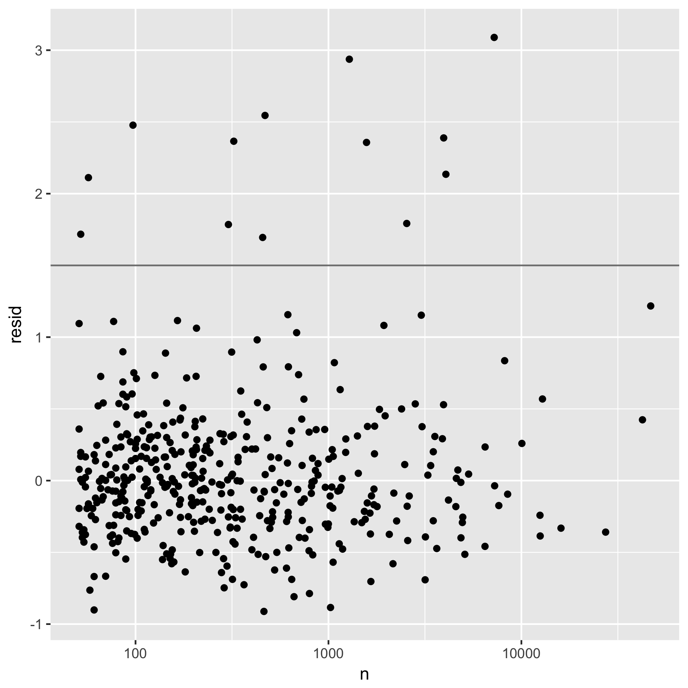
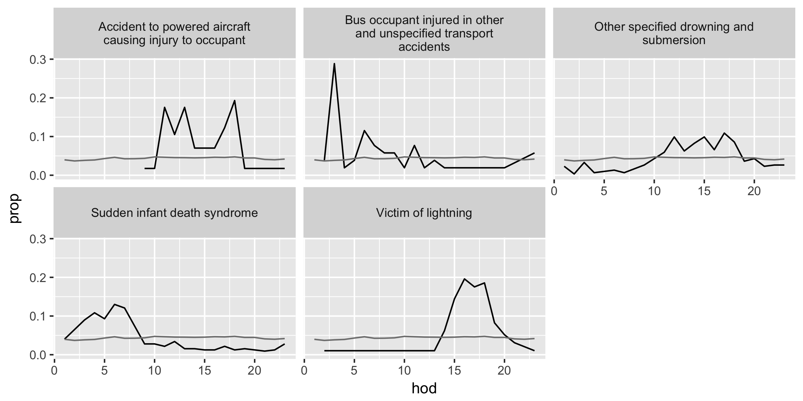

## Unusual Deaths in Mexico {#dplyr}

```{r setup, include=FALSE}
knitr::opts_chunk$set(cache=TRUE, 
                      warnings=FALSE, 
                      messages=FALSE)
knitr::opts_chunk$set(cache.path="../piecemealR_cache/04-tidy-dplyr_cache/")
```

```{r, echo=FALSE}
library(dplyr)
library(ggplot2)
library(knitr)
library(DT)
library(webshot)

load(file="tidy_case_study/tidy_case_study.RData")
deaths08 <- deaths %>% filter(yod == 2008, mod != 0, dod != 0, !is.na(hod))
deaths08b <- deaths08
colnames(deaths08b) <- c("Year of Death (yod)", "Month of Death (mod)", 
                    "Day of Death (dod)", "Hour of Death (hod)", "Cause of Death (cod)")
```

### Materials {-}
This is a practice session of [dplyr](http://docs.ggplot2.org/current/) and [ggplot2](http://docs.ggplot2.org/current/) using [a case study](http://vita.had.co.nz/papers/tidy-data.html) related to [tidyr](https://www.r-bloggers.com/data-manipulation-with-tidyr/) package.

The case is about investigating the causes of death in Mexico that have unusual temporal patterns within a day.  The data on mortality in 2008 have the following pattern by hour;    


```{r, echo=FALSE, fig.cap = 'Temporal pattern of all causes of death', out.width="90%", fig.asp=.75, fig.align='center'}
 
```

Do you find anything unusual or unexpected? The figure shows several peaks within a day, indicating some increased risk of death during certain times of the day. What could generate these patterns? 

Wickham, the author of the case study, finds; 

> The causes of [unusual] death fall into three main groups: murder, drowning, and transportation related. Murder is more common at night, drowning in the afternoon, and transportation related deaths during commute times [@Wickham2014]. 


```{r unusual-big, echo=FALSE, fig.cap = 'Causes of death with unusual temporal courses. Hour of day (hod) on the x-axis and proportion (prop) on the y-axis. Overall hourly death rate shown in grey. Causes of death with more than 350 deaths over a year. ', out.width="100%", fig.asp=.75}
 
```


We will use two datasets: 

  - `deaths` containing the timing and coded causes of deaths 
  - `codes` containing the look-up table for the coded causes. 

<!--
# ```{r, echo=FALSE} 
# DT::datatable(deaths08[1:200,],
#       colnames =  c("Year of Death (yod)", "Month of Death (mod)", 
#                     "Day of Death (dod)", "Hour of Death (hod)", "Cause of Death (cod)")
# )
# ```
-->

The dataset `deaths` has over 53,000 records (rows), so we use `head()` to look at the first several rows.

```{r}
# "deaths08b" is a renamed dataset with easier-to-read column names 
head(deaths08b) 
```


The dataset `codes` has 1851 records. 

```{r, echo=FALSE} 
DT::datatable(codes, 
              colnames = c("Cause of Death (cod)", "Disease")
              )
```

This table is generated by [DT](https://rstudio.github.io/DT/) and [webshot](https://cran.r-project.org/web/packages/webshot/vignettes/intro.html) packages. In the search box, you can type in key words like "bacteria", "nutrition", and "fever", as well as "assault" and "exposure" to see what items are in the data.  

We will reproduce this case study and practice using functions of `dplyr` and `ggplot2`. 


### Arts & Crafts {-}

Let's recap the key ingredients of [dplyr](http://docs.ggplot2.org/current/) and [ggplot2](http://docs.ggplot2.org/current/) from the introduction in Section \@ref(intro).

The six important functions in `dplyr` are:

* `filter()`: extracts rows (e.g., observations) of a data frame. We put logical vectors in its arguments.  

* `select()`: extracts columns (e.g., variables) of a data frame. We put column names in its arguments. 

* `arrange()`: orders rows of a data frame. We put column names in its arguments. 

* `summarise()`: collapses a data frame into summary statistics. We put **summary functions**  (e.g., statistics functions) using column names in its arguments.     

* `mutate()`: creates new variables and adds them to the existing columns. We put  **window functions** (e.g., transforming operations) using column names in its arguments.  

* `group_by()`: assigns rows into groups within a data frame. We put column names in its arguments.  


We use piping operator `%>%` (read as **then**) to translate a sentence of sequential instructions. For example, start with dataset `deaths08`, **then** group the data by month of death, and **then** summarize the grouped data for the number of observations.   

```{r} 
deaths08 %>% 
  group_by(mod) %>% # mod: month of death
  summarise(nobs = n()) # n(): a dplyr funciton to count rows 
```


The graphics with `ggplot2`  consist of three components: 

* **data**: a data frame e.g., the first argument in `ggplot(data, ...)`.    

* **geom**: geometric objects such as points, lines, bars, etc. with parameters in parenthesis; e.g., `geom_point()`, `geom_line()`, `geom_histogram()`  

* **aes**:  specifications for x-y variables, as well as variables to differentiate **geom** objects by color, shape, or size. e.g., `aes(x = var_x, y = var_y, shape = var_z)` 
 

We specify **data** and **aes** in `ggplot()` and then add **geom** objects followed by `+` symbol (read as **add a layer of**);  e.g., `ggplot(data = dataset, mapping = aes(x = ...)) + geom_point()`. The order of layers added by `+` symbol is mostly interchangeable. 

Combined with `%>%` operator, we can think of the code as a sentence. For example, consider a histogram of the line-graph for the total number of deaths above. 
We can formulate the following sequence of steps; "start with dataset `deaths08`, **then** plot data via `gglpot()` where `aes()` features hour of day on the x-axis **and add a player of** geom object `geom_histogram()`."       

```{r}
deaths08 %>% 
  ggplot(aes(x = hod)) + geom_histogram(binwidth = 1, color = "white") 
```

Here are a few more examples. 

```{r}  
# a summary by month of day and hour of day.
# e.g, Jan-1am, ..,Jan-12pm, Feb-1am,..., Feb-12pm, ...   
n_month_hour <- deaths08 %>%
  group_by(mod, hod) %>%
  summarise( nobs = n() )

n_month_hour %>%
  ggplot(aes(x = hod, y = nobs, color = as.factor(mod))) + 
  geom_point() 
  
# "last_plot() + " allows for adding more layers to the previous plot
last_plot() + geom_line()
```
 

### Exercise {-}

Now it is your turn. The exercise is to reproduce the above results for the unusual causes of deaths. 

1. Download materials: [case study paper](http://vita.had.co.nz/papers/tidy-data.html) and [case study data](https://github.com/kotamine/piecemealR/raw/master/tidy_case_study/tidy_case_study.RData)

2.  Set working directly: `setwd(your_directory)`

3. Load libraries: `library(dplyr)`, `library(ggplot2)`, `library(MASS)` (used for fitting data by robust regression)

* Note 1: There is a minor error in the case study where the author accidentally kept several records of data from years other than 2008. This has virtually no effect on the results, and we are seeking to reproduce the same results as in the case study.     

* Note 2: You could look at the code in the paper for hints. However, the code is written with the functions of [plyr](https://cran.r-project.org/web/packages/plyr/index.html) package, which is sort of like a predecessor of `dplyr`. 

Speaking of `plyr`, when loaded together, `plyr` and `dplyr` can cause namespace issues (having the same function names from different packages!). `plyr` namespace is automatically loaded with `ggplot2`. If you type `?summarise` and `?arrange` you will see that these functions are loaded from the two packages. 

This problem is not uncommon in R, as notified upon loading packages by the warnings about masked functions. To call a function from a specific package, use double-colon operator (e.g., `dplyr::summarise()`). The reference before `::` is called **namespace**, and you can find out all namespaces loaded in the current session; 
```{r}
 loadedNamespaces()
```

<!-- get('summarise',  pos = "package:plyr") -->
<!-- get('summarise',  pos = "package:dplyr") -->


For example, the following commands produce different results; 
```{r}
mtcars  %>% group_by(cyl) %>% dplyr::summarise(avgwt = mean(wt))
mtcars  %>% group_by(cyl) %>% plyr::summarise(avgwt = mean(wt))
```

One way to ensure that we refer to `dplyr` functions, we can overwrite function names and pass the arguments; 
```{r}
# force function namespace for key dplyr functions  
select <- function(...) dplyr::select(...)
filter <- function(...) dplyr::filter(...)
arrange <- function(...) dplyr::arrange(...)
summarise <- function(...) dplyr::summarise(...)
summarize <- function(...) dplyr::summarise(...)
mutate <- function(...) dplyr::mutate(...) 
group_by <- function(...) dplyr::group_by(...) 
```


#### Part A. Display overall hourly deaths {-}

We will reproduce the following plot:


Hints:

* Filter `NA` in the hour of day (hod) variable and define a new dataset

* Use `group_by()`,  `summarise()`, `n()` to obtain death counts by group

* Use `ggplot() + geom_line()` to produce plot  

* Use `+ labs( x = "x lable", y = "y label")` for axis labels

* see help file of `scale_y_continous()` for comma (use `?function_name` for help) 


#### Part B. Count deaths per hour, per disease {-}

We will reproduce the following table: 

```{r, echo=FALSE, out.width="90%", fig.asp=.75, fig.align='center'}
 
```
<!--
<figure>

</figure>
-->

The table shows the first 15 rows of a transformed dataset. Panel (a) shows a frequency  (i.e. the number of rows) for each combination of hour of day (hod) and cause of death (cod), supplemented by the disease description in panel (b).  Panel (c) shows the proportion (prop) of these combinations within the cause of death; which likely a given cause of death is observed across hours of the day? Panel (d) presents the overall hourly death counts and rates (freq_all and prop_all); if every hour has the same probability of death, we would see prop_all $\approx$ 0.042 (i.e., 1/24). 

Here, we see the author's idea of identifying "unusual deaths" by looking at how "prop" of each **hod-cod pairs** deviates from "prop_all" (see figure \@ref(fig:unusual-big)). 
What would this comparison mean?  Intuitively, we can think of "prop_all" as the **normal death rate in a given hour**. The key here is to recognize how the author defines **unusual deaths**. Clearly,  there are a small set of common causes of death and a large set of many rare (and obscure) causes of death. The causes of death that are simply rare are not particularly interesting to examine. Here, the author defines  **unusual deaths** as the deaths occurred in unusual hours of the day and examines the associated causes. The variable "prop" describes how each cause of death appears each hour of the day as its total proportion of deaths by that cause.   


Hints for creating panel (a) 

* Use more than one variable in `group_by()` 

* Use `summarise()` with `n()` to obtain death counts by group

Hints for creating panel (b)

* Use `left_join()` to add the information from dataset `codes` 

Hints for creating panel (c)

* Use `mutate()` with `sum()` on the joined dataset above

Hints for creating panel (d) 

* Create a new data frame by using `summarise()` on the joined and mutated data frame above. `summarise()` will reduce the dimension of the data frame to its summary, which is the basis of panel (d). Once the desired summary is created, merge it to the data frame of panels (a)-(c).

* Before using `summarise()` above, use `group_by()` to specify new grouping

* First create `freq_all` variable via `summarise()` with `n()`, use `ungroup()`, then create `prop_all` variable via `mutate()` with `sum()`. Call this data frame `overall_freq`, which will be used again at the very end.   

* Use `left_join()` to join panels (a)-(c) and panel (d) (`overall_freq`), which we refer to as `master_hod` data frame.  

Hints for displaying the same rows as in the Table 16 above 

* Create a subset of the `master_hod` data under a new name 

* Use `filter()` to select  `cod` being either  "I21", "N18", "E84", or "B16" and `hod` being greater or equal to 8 and smaller or less than 11

* Use `select()` to pick columns in a desired order and `arrange()` to sort


#### Part C. Find outliers {-}

We will reproduce the following plots: 


```{r, echo=FALSE, fig.cap = 'Figure 2: (a) Plot of n vs deviation. Variability of deviation is dominated by sample size: small samples have large variability. (b) Log-log plot makes it easy to see the pattern of variation as well as unusually high values. The blue line is a robust line of best fit.', out.width="100%", fig.asp=.75}

 
```

<!--  -->
<!--  -->

<!--
```{r, echo=FALSE, out.width="50%", fig.asp=.75, fig.align='center'}


```
-->

We will create a deviation variable named *dist* by taking the mean of squared differences between *prop* and *prop_all*. The above figures show the the number of deaths *n* by each cause of death and this distance measure *dist* in the raw-data scale (left) and in the log scale (right).       

The author's intuition is that we may observe a pattern that **the more common the cause, the smaller the deviation (dist) tends to be.**  The author uses a linear model to account for such a relationship between the variability and sample size in the logarithmic scale. Once the model is defined and estimated, we can identify "outliers" that deviate largely from its prediction. Those outliers then become the candidates for usual deaths. 

Hints

* Use `group_by()` and `summarise()` on the `master_hod` data frame to generate `n` with function `sum()` and `dist` by `mean((prop - prop_all)^2)`

* Filter this summary for `n > 50` and call it `devi_cod` (deviations by cause of death)

* Use `ggplot() + geom_point()` with  `data = devi_cod` to produce the raw-scale figure 

* Additionally use `scale_x_log10()`, `scale_y_log10()`, and `geom_smooth(method = "rlm", se = FALSE)` to produce the log-scale figure 

* See help for `scale_x_log10()` to adjust axis labels (look for "comma")

* Technically speaking, we should change the axis labels to indicate the logarithmic transformation, but we skip it here.  

* Let's not worry about reproducing the exact grids as they appear in the paper


#### Part D. Fit data by a regression and plot residuals {-}

We will reproduce the following plot:

<!--
<figure>

</figure>
--> 
```{r, echo=FALSE, out.width="50%", fig.asp=.75, fig.align='center', fig.cap ='Figure 3: Residuals from a robust linear model predicting log(dist) by log(n). Horizontal line at 1.5 shows threshold for further exploration.'} 

```

The figure is a plot of the regression residuals *resid* of *log(dist)* on *log(n)*. By visual inspection, the points lying above the horizontal line at *resid=1.5* are considered to be "unusual causes of deaths" by the author.

Here the author used the robust linear model (`rlm()`) regression, but the syntax is mostly the same as that of the standard linear model regression (`lm()` ).  

Here is an example of regression by `lm()`. 

```{r}
df <- data.frame(
  x1 <-  c(1:10),
  y1 <-  c(1,3,2,4,6,5,7,5,7,8)
)

df %>% 
  ggplot(aes(x = x1, y = y1)) + geom_point() +
  geom_smooth(method = "lm", se = FALSE)
```

The `geom_smooth()` is estimating the following linear regression:
$$ y1 = intercept + coefficient * x1 + residual$$
The model is estimated by `lm()` as follows; 

```{r}
f1 <- lm(formula = y1 ~ x1,  data = df) 
```

Let's see what we get out of the estimation results `f1`. 

```{r}
class(f1)    # class "lm"
summary(f1)  # summary() knows how to summarise an object of class "lm" 
coefficients(f1)  # coefficient point estimate
vcov(f1)          # coefficient variance-covariance matrix
predict(f1)       # predicted (fitted) values with the estimated coefficients 
resid(f1)         # residuals:  
```

Let's get back to our exercise and reproduce the figure above. 

Hints 

* Run a regression by `rlm` with `formula = log(dist) ~ log(n)` and store the residuals in `devi_cod` data. To read more about linear regressions, see the help file of `lm()` (type `?lm`).  For adding a column of residuals, you can use assignment `devi_cod$resid <- your_residuals`.  

* Plot the residual against log-scale `n` 

* Note: Check the dataset `devi_cod` for missing values of `dist` and `n` before running a regression (you should not have missing values in this case).  Most regression functions, including `lm()` and `rlm()`, drop any row with missing values. This becomes an issue if we want to add a new column containing predicted values or residuals to the original dataset. (When rows containing missing values are dropped, the vector generated by `predict()` or  `resid()` will be shorter than the number of rows in the original dataset.)      

* Use `ggplot() + geom_point()` structure for the plot

* Add  `+ scale_x_log10()` and `+ geom_hline(yintercept = 1.5)` 


#### Part E. Visualize unusual causes of death {-}

We will reproduce the following plots:

```{r, echo=FALSE, out.width="100%", fig.asp=.75, fig.align='center'}


```
<!--
<figure>


</figure>
--> 

The first figure is the unusual causes of deaths in `devi_cod` with a relatively large number of deaths  (`n > 350`) and the second is that of a relatively small number of deaths (`n <= 350`). 

Hints

* Using the cut-toff value `resid > 1.5`, filter `devi_cod` and call it `unusual` data frame. Join `master_hod` and `unusual` data frames. Then create two subsets of data with conditions  `n > 350` and `n <= 350`.  

* Use `ggplot() + geom_line()` structure with `+ facet_warp(~ disease, ncol = 3)` 

* To include the overall hourly proportions of deaths (`prop_all`) representing the average of all causes of deaths in a given hour, add another layer by `geom_line(aes(...), data = overall_freq)` with a local `aes()` argument and a data argument. With the data argument, variables in another data frame can be combined (assuming the axes have the same measurements), and here we use the `overall_freq` data frame from the panel (d) portion of Table 16 above.  

* `last_plot() %+% another_data_frame `  reproduces a plot of the same structure with a different data frame


### The Key {-}

<a href="tidy_case_study/04_01_key.nb.html">Click here</a>

<!--

[Solution using dplyr](https://github.com/kotamine/piecemealR/blob/master/tidy_case_study/tidy_case_study.R)

[Solution using plyr](https://github.com/kotamine/piecemealR/blob/master/tidy_case_study/tidy_case_study_plyr.R)

-->

### Reflections {-}

Let's recap. The author (Wickham) investigates the temporal pattern of death in Mexico to find the causes of death that have unusual temporal patterns within a day.  Here are the five steps used in his approach. 

* A. Visualize the overall hourly frequency of death within a day 

* B. Construct variables to compare the proportion of death for each hour per cause against the overall proportion of hourly death

* C. Plot the data to identify a general relationship among key variables 

* D. Create a linear model (i.e., data point = model prediction + residual)

* E. Visualize the temporal pattern of the "unusual" cases, or the causes of death that have relatively large residuals  


While these steps may not serve as a template for your data analysis, the thought process and techniques in the above exercise will be applicable to various situations. 


In case you need to see more examples, here are additional `dplyr` and `ggplot2` tutorials.  

* [R for data science](http://r4ds.had.co.nz/visualize.html)

* [100 Free Tutorials for Learning R](http://www.listendata.com/p/r-programming-tutorials.html)

* [RPubs - Data Processing with dplyr &amp; tidyr](https://rpubs.com/bradleyboehmke/data_wrangling)

* [Discovering Python & R](https://pythonandr.com/2015/12/17/data-manipulation-in-r-with-dplyr-part-1/)

* [Aggregating and analyzing data with dplyr](http://tracykteal.github.io/R-genomics/04-dplyr.html)

* [genomics class dplyr tutorial](http://genomicsclass.github.io/book/pages/dplyr_tutorial.html)

* [dplyr Tutorial (With 50 Examples)](http://www.listendata.com/2016/08/dplyr-tutorial.html)


