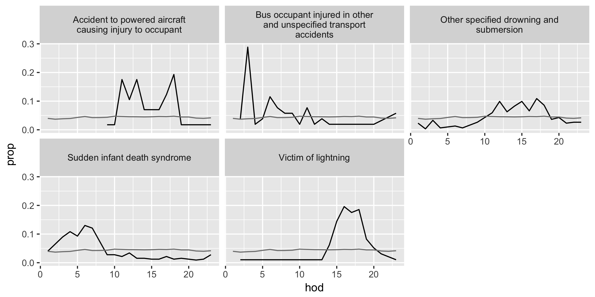

--- 
title: "Piecemeal R"
subtitle: "A Tutorial for Data Exploration with R"
author: "Kota Minegishi"
date: "Last updated: `r Sys.Date()`"
site: bookdown::bookdown_site
always_allow_html: yes
output: 
  gitbook: 
  pdf_document:
    keep_tex: yes
  epub_book: default
documentclass: book
bibliography: [articles.bib, book.bib, packages.bib]
biblio-style: apalike
link-citations: yes
github-repo: /kotamine/piecemealR
description: "This is a R tutorial. "
---

# Welcome {-}

Welcome to a tutorial website for data analysis and visualization with [R](https://www.r-project.org/). This site provides a quick overview and topic-based tutorials in a piecemeal fashion. 

The site is organized based on two questions: 

* How best to quickly introduce R to new audiences and showcase its data analytics tools? 

* How best to provide tutorials for topic-based data applications with R? 


To answer the first question, Section \@ref(intro) *Introduction* demonstrates a set of modern data analysis tools in R. Sections  \@ref(essentials) describes essential concepts of R. For the second question, Section \@ref(piecemeal-top) provides topic-based tutorials. Additional resources are listed in Section \@ref(resources).   

More content will be added when the author hosts a small workshop  _"Data Exploration with R"_  at his workplace.     


__New Contents__

* `r Sys.Date()`: <span style="color:red">*Test upload. VERY Preliminary!*</span>


```{r include=FALSE}
# automatically create a bib database for R packages
knitr::write_bib(c(
  .packages(), 'bookdown', 'knitr', 'rmarkdown'
), 'packages.bib')
```

<!--chapter:end:index.Rmd-->


# About {-} 

__Kota Minegishi__ is an assistant professor of Dairy Analytics at the University of Minnesota. He is an agricultural economist by training and works in the Department of Animal Science.    


__Workshop__ 

- dplyr and ggplot2 exercise \@ref(dplyr): TBA 


<!--chapter:end:00-About.Rmd-->


# Introduction {#intro} 

`r Sys.Date()`: <span style="color:red">*VERY Preliminary!*</span>

```{r setup, include=FALSE}
knitr::opts_chunk$set(cache=TRUE)
```


**A Few Words from the Author** 

[R](https://www.r-project.org/) has come a long way in its evolution. [Its download page](https://cran.r-project.org/) looks unchanged from many years ago. Don't be fooled by its archaic first look.  This may be something to do with how the R developer community honors its history of turning the open-source project into one of the most popular data analytic tools today. The community is extremely supportive, and there are numerous learning resources. Please don't mistake that archaic look as a sign of snobbishness, and I hope you too will appreciate it some day. Welcome to the community.      

In below, we assume that you have  [R](https://cran.r-project.org/) and [RStudio Desktop](https://www.rstudio.com/products/rstudio/download/) (free IDE) installed. It will be handy to have cheat sheets for [base R](http://github.com/rstudio/cheatsheets/raw/master/source/pdfs/base-r.pdf), 
[RStudio IDE](https://www.rstudio.com/wp-content/uploads/2016/01/rstudio-IDE-cheatsheet.pdf), [dplyr](https://github.com/rstudio/cheatsheets/raw/master/source/pdfs/data-transformation-cheatsheet.pdf), and [ggplot2](https://www.rstudio.com/wp-content/uploads/2016/11/ggplot2-cheatsheet-2.1.pdf) as well.  

If you find this introduction too technical, please start with [ModernDive](https://ismayc.github.io/moderndiver-book/4-viz.html) open-source textbook (say, up to Chapter 5). The book gave an initial inspiration to start this site. Also, more information on R is available in Section \@ref(essentials), as well as various sources listed in Section \@ref(resources).   

## Materials

The power of R grows with each addition of user-contributed R packages, or a bundle of user-developed programs. Recent developments such as [tidy](https://cran.r-project.org/web/packages/tidyr/vignettes/tidy-data.html),  [dplyr](https://cran.r-project.org/web/packages/dplyr/vignettes/introduction.html), and [ggplot2](http://docs.ggplot2.org/current/)
have greatly streamlined the coding for data manipulation and analysis, which is the starting point for learning R that is chosen for this site.  With this new syntax system, you will learn the basic operations of data wrangling and visualization in a very intuitive  *data operation language*. Like any language, its grammar and framework provide a particular way of understanding the world. In this case, it will influence your thinking about data.     

Following the documentation of [dplyr](https://cran.r-project.org/web/packages/dplyr/vignettes/introduction.html), let's start with a sample dataset of airplane departures and arrivals. The dataset contains information on about 337,000 flights departed from New York City in 2013 (source: [Bureau of Transportation Statistics](https://www.transtats.bts.gov/DatabaseInfo.asp?DB_ID=120&Link=0)). We load a built-in data frame by command `library(nycflights13)` where `library(package_name)` loads an R package named `package_name` in the current R *session*, or the computing environment. In the R console (i.e., the left bottom pane in RStudio), type `install.packages("nycflights13")` and hit enter. 

Generally, R packages are installed in the local computer as an as-needed basis. To install several more packages that we will use, copy the following code and execute it in your R console. 
```{r}
# Don't worry about understanding the code here
# "#"" symbole is used to insert comments that are helpful to humans but are ignored by R 

required_pkgs <- c("nycflights13", "dplyr", "ggplot2", "lubridate", "knitr", "tidyr", "broom")   
  #  creating a new object "required_pkgs" containing strings "nycflights13", "dplyr",..
  # "c()" concatenates string names here. 
  # "<-" operator assigns from the object on the right to left

new_pkgs <- required_pkgs[!(required_pkgs  %in% installed.packages())] 
  # checking whether "required_pkgs" are already installed 
  # "[]" of required_pkgs[ ] is extraction by logical TRUE or FALSE
  # "%in%" checks whether items on the left are members of the items on the right.
  # ! is a negation 

if (length(new_pkgs)) {
  install.packages(new_pkgs, repos = "http://cran.rstudio.com")
}   
```


In each R session, we load libraries. Here we load the following;
```{r}
suppressWarnings({
  suppressMessages({
    library(dplyr)  # for data manipulation 
    library(ggplot2)  # for figures  
    library(lubridate) # for date manipulation
    library(nycflights13)  # sample data of NYC flights
    library(knitr) # for table formatting
    library(tidyr) # for table formatting
    library(broom)  # for table formatting
  })
})
```

Let's see the data. 
```{r, results = "hold"}
class(flights) # shows the class attribute
dim(flights)   # obtains dimention of rows and columns 
```
 
```{r} 
head(flights)  # displays first seveal rows and columns 
```

`dim()` command returns the dimension of a data frame, and `head()` command returns the first several rows and columns. The `flights` dataset contains information on dates, actual departure and arrival times, scheduled departure and arrival times, carriers, origins, destinations, travel times, and distances. These variables are arranged in columns, and each row is an observation of flight.   


In R, we refer to a dataset as **data frame**, which is a *class* of R object.  The **data frame** class is more general than the **matrix** class in that it can contain variables of more than one mode (numeric, character, factor etc). In case you want an overview of data types right away, here is a [summary](http://www.statmethods.net/input/datatypes.html). 


## Arts & Carfts 

### Crafts  {-}

We will focus on six data wrangling functions in the `dplyr` package.  

* `filter()`: extracts rows (e.g., observations) of a data frame. We put logical vectors in its arguments.  

* `select()`: extracts columns (e.g., variables) of a data frame. We put column names in its arguments. 

* `arrange()`: orders rows of a data frame. We put column names in its arguments. 

* `summarise()`: collapses a data frame into summary statistics. We put **summary functions**  (e.g., statistics functions) using column names in its arguments.     

* `mutate()`: creates new variables and adds them to the existing columns. We put  **window functions** (e.g., transforming operations) using column names in its arguments.  

* `group_by()`: assigns rows into groups within a data frame. We put column names in its arguments.  

The very first argument in all these functions is a **data frame**, and by using this we can easily **pipe** a sequence of data wrangling operations through `%>%` operator. The key is to start with a data frame and then formulate a sequence of data wrangling operations in plain English, which we can translate into codes by replacing **then** in the sequence with the `%>%` operator.  Say, we want to find the average delays in departures and arrivals from New York to St. Paul-Minneapolis airport (MSP). We can construct the following sequence of instructions; take the flight data frame, apply `filter()` to extract the rows of flights to MSP, and then apply `summarise()` to calculate the mean.  

````{r}
flights %>%  # take data frame "flights", then
  filter(dest == "MSP") %>%  # filter rows, then  
  summarise(   
    # summarise departure and arrival delays for their means 
    # and call them mean_dep_delay and mean_arr_delay respectively
    mean_dep_delay = mean(dep_delay, na.rm = TRUE), 
    mean_arr_delay = mean(arr_delay, na.rm = TRUE)
    )    # calculate the mean, while removing NA values  
````

In `summarise()`, one can use **summary functions** that takes a vector as an input and produces a scaler as an output. This includes functions like `mean()`, `sd()` (standard deviation), `quantile()`, `min()`, `max()`, and `n()` (observation count in the `dplyr` package).      

Each time we apply `%>%` operator above, we pass a modified data frame from one data operation to another through the first argument. The above code is equivalent to  
````{r} 
summarise(   # data frame "flights" is inside filter(), which is inside summarise() 
    filter(flights, dest == "MSP"), 
    mean_dep_delay = mean(dep_delay, na.rm = TRUE),
    mean_arr_delay = mean(arr_delay, na.rm = TRUE)
    )
````

You will quickly discover that `%>%` operator makes the code much easier to read, write, and edit and how that makes you want to play with the data more.  

Let's add a few more lines to the previous example. Say, additionally we want to see the average delays by carrier and sort the results by the number of observations (e.g. flights) in descending order. 

Okay, what do we do?  We make **a sequence of data wrangling operations in plain English** and translate that into **codes** by replacing **then** with `%>%` operator. 
For example, we say, "take the data frame `flights`; **then** (`%>%`)  `filter()` to extract the rows of flights to MSP;  **then** (`%>%`) group rows by carrier; **then** (`%>%`) `summarise()` data for the number of observations and the means; **then** (`%>%`) `arrange()` the results by the observation count in descending order."   

````{r}
flight_stats_MSP <- flights %>%  # assign the results to an object named "flight_stats"
  filter(dest == "MSP") %>% 
  group_by(carrier) %>%  #  group rows by carrier 
  summarise(
    n_obs = n(),  # count number of rows 
    mean_dep_delay = mean(dep_delay, na.rm = TRUE),
    mean_arr_delay = mean(arr_delay, na.rm = TRUE)
  ) %>% 
  arrange(desc(n_obs))  # sort by n_obs in descending order

flight_stats_MSP  # show flight_stats object
````


Carrier variable is expressed in the International Air Transportation Association (IATA) code, so let's add a column of carrier names by joining another data frame called `airlines`. In RStudio, you can find this data frame under the **Environment**  tab (in the upper right corner); switch the display option from *Global Environment* to *package:nycflights13*. To inspect the data frame, type `View(airlines)` in R console. Also, by typing `data()`  you can see a list of all datasets that are loaded with libraries. 

```{r}
left_join(flight_stats_MSP, airlines, by="carrier") %>%
  # left_join(a,b, by="var") joins two data frames a, b by matching rows of b to a 
  # by identifier variable "var".  
  kable(digits=2)  # kable() prints a better-looking table here
``` 


In the next example, we add new variables to `flights` using `mutate()`.   

```{r}
flights %>%
  # keep only columns named "dep_delay" and "arr_delay"
  select(dep_delay, arr_delay) %>% 
  mutate(
    gain = arr_delay - dep_delay,
    gain_rank = round(percent_rank(gain), digits = 2)
      # Note: we can immediately use the "gain" variable we just defined. 
  )
``` 

We extracted specific columns of `flights` by `select()` and added new columns defined in `mutate()`.  `mutate()` differs from `summarise()` in that  `mutate()` adds new columns to the data frame, while `summarise()` collapses the data frame into a summary table. 


There are roughly five types of [window functions](https://cran.r-project.org/web/packages/dplyr/vignettes/window-functions.html) that are commonly used inside `mutate()`: (1)  **summary functions**, which are interpreted as a vector of repeated values (e.g., a column of an identical mean value) : (2)  ranking or ordering functions (e.g., `row_number()`, `min_rank()`, `dense_rank()`, `cume_dist()`,`percent_rank()`, and `ntile()`): (3) offset functions, say defining a lagged variable in time series data (`lead()` and `lag()`): (4)  cumulative aggregates (e.g., `cumsum()`, `cummin()`, `cummax()`, `cumall()`, `cumany()`, and `cummean()`): (5) fixed-window rolling aggregates such as a windowed mean, median, etc.  To find help files for these function, for example, type `?cumsum`.  


Before moving to the graphics, let's quickly go over what a **function** is in R and how you can use a custom function inside `summarise()` or  `mutate()`. In R, we use `function()` to create a function, which has its name, input arguments separated by comma, and a body (e.g., tasks to perform and what to return as an output).    

```
your_function_name <- function(input arguments) {
                        task1
                        task2
                        .
                        .
                        .
                        output_to_return 
                      } 
```

For a function having only a single expression to execute, we can omit brackets `{ }`.

```
another_function <- function(input args) task_and_output_in_a_single_expression                    
```

Let's go through a few examples. 

```{r} 
# generate a sequence from 1 to 10 (by the increment of 1) and name it "vec1".  
vec1 <- 1:10
vec1            
# c() concatenates 
vec2 <- c(vec1, NA, NA)
vec2
my_mean_1 <- function(x)  mean(x, na.rm = TRUE)
  # Input arguments: x 
  # Output: the calculation result of mean(x, na.rm = TRUE). 
  # x is required by mean() (and implicitly assumed to be a vector of numeric values). 
  # mean() is an existing function. The "na.rm" argument of mean() is set to be TRUE.  

my_mean_1(vec1)

my_mean_2 <- function(x, na.rm=TRUE)  mean(x, na.rm = na.rm)   
  # Input arguments: x and na.rm (optional with the default value of TRUE) 
  # Output: the calculation result of mean(x, na.rm = na.rm).
  # The input argument "na.rm" is passed to the input argument "na.rm" of mean() 

my_mean_2(vec2)
my_mean_2(vec2, na.rm=FALSE)  # not removing NA returns NA for the mean calculation.  


my_zscore <- function(x, remove_na=TRUE) { 
  (x - my_mean_2(x, na.rm = remove_na))/sd(x, na.rm = remove_na)  
}
  # Inputs: x and remove_na (optional: default = TRUE)
  # Output: z-score of vector x
  # my_mean2() and sd() return scalers but are interpreted 
  # as a vector of repeated valuses that has the same length as x. 

my_zscore(vec1) %>% round(2)
```


Let's apply functions`my_mean_2()` and `my_zscore()` in `summarise()` and `mutate()`. 
```{r}
flights %>% 
  select(dep_delay) %>% 
  summarise(
    mean_dep_delay = my_mean_2(dep_delay),  # using my_mean_2()  
    mean_dep_delay_na = my_mean_2(dep_delay, na.rm = FALSE)  # this returns NA
  ) %>%
  kable(digits=2)

flights_gain <- flights %>%
  select(dep_delay, arr_delay) %>% 
  mutate(
    gain = arr_delay - dep_delay,
    gain_z = (gain - my_mean_2(gain))/sd(gain, na.rm=TRUE),  # using my_mean_2()  
    gain_z2 = my_zscore(gain_z)  # using my_zscore()   
  )

head(flights_gain) %>%  # show the first several rows
  kable(digits=2)
```

Creating a function spares us from writing similar codes in multiple places. Avoiding such repetitions is important for making reading and editing codes easier and reducing coding errors. 

One situation you may consider use of custom function is inside functions like `summarise_each()` and `mutate_each()`. The two functions allow for applying **summary functions** like `mean()` or `sd()` to each column in a data frame.  `summarise_each()` and `mutate_each()` work by  *calling* a function by its name. They are very easy to use when an operation is to summarize a vector into a statistics without needing to specify additional arguments, say `mean(var1)`. However, providing additional arguments into a function, say `mean(var1, na.rm=TRUE)`, becomes somewhat cumbersome in terms of its syntax. 

One approach to get around this problem is to pre-process the data frame before getting to a `summarise_each()` or `mutate_each()` section. For example, if we want to pass the argument `na.rm=TRUE` to `mean()`,  we can first filter out rows that contain missing values  (`NA`) and then apply `summarise_each()`. 

```{r}
flights_gain %>% 
  select(dep_delay, arr_delay, gain)  %>%
  filter(!is.na(dep_delay) & !is.na(arr_delay)) %>%  
    # filter out rows that have NA values in dep_delay or arr_deplay
  summarise_each("mean") %>%  
  kable(digits=2) 
```
 
The other approach is to use a custom function. For instance, `my_mean_2()` we defined above has default argument `na.rm=TRUE` that gets passed into `mean()`, effectively overwriting the default argument `na.rm=FALSE` of `mean()`. A custom function (as well as any standard summary function) can be called in `summarise_each()` or `mutate_each()` using `funs()`;   

```{r}
flights_gain %>% 
  select(dep_delay, arr_delay, gain) %>%
  summarise_each(funs("my_mean_2")) %>%
    kable(digits=2)
```

Being able to use your own functions in `dplyr`-style data wrangling operations will greatly enhance your ability to quickly analyze data in R.  


### Arts  {-}

Now we will cover the basics of data visualization via the [ggplot2](http://docs.ggplot2.org/current/) package. 
The `ggplot2` syntax has three essential components for generating graphics:  **data**,  **aes**,  and **geom**. This implements the following philosophy (a quote mentioned in [ModernDive](https://ismayc.github.io/moderndiver-book/4-viz.html)); 

> 
A statistical graphic is a mapping of **data** variables to **aesthetic** attributes of **geometric** objects.  
--- [@Wilkinson2005]
>  


While coding complex graphics via `ggplot()` may appear intimidating at first, it  boils down to the three primary components:

* **data**: a data frame e.g., the first argument in `ggplot(data, ...)`.    

* **aes**:  specifications for x-y variables, as well as variables to differentiate **geom** objects by color , shape, or size. e.g., `aes(x = var_x, y = var_y, shape = var_z)` 

* **geom**: geometric objects such as points, lines, bars, etc. e.g., `geom_point()`,  `geom_line()`,  `geom_histogram()`  
 
 
One can refine a plot figure by adding secondary components or characteristics such as: 

* stat: data transformation, overlay of statistical inferences etc. 

* scales: scaling data points etc. 

* coord: Cartesian coordinates, polar coordinates, mapping projections etc.

* facet: laying out multiple plot panels in a grid etc. 

In below, we will generate five common types of plots: 
**scatter-plots**, **line-graphs**, **boxplots**, **histograms**, and **barplots**. 
To provide a context, let's use these plots to investigate what may explain patterns of flight departure delays.   

First, let's consider a possibility of congestion at the airport during certain times of the day or certain seasons. We can use  **barplots** to see whether there is any obvious pattern in the flight distribution across flight origins (i.e., airports) in New York City. A barplot shows observation counts (e.g., rows) by category. 

````{r}
ggplot(data = flights,  # the first argument is the data frame
       mapping = aes(x = origin)) +   # the second argument is "mapping", which is aes()   
  geom_bar()  #  after "+" piping operator of ggplot(), we add geom_XXX() elements 
```

We can make the plot more informative and aesthetic. 
```{r}
ggplot(data = flights, 
       mapping = aes(x = origin, fill = origin)) +  # here "fill" gives bars distinct colors 
  geom_bar() +  
  facet_wrap( ~ hour)  #  "facet_wrap( ~ var)" generates a grid of plots by var 
```

Another way to see the same information is a **histogram**. 
```{r}
flights %>% 
  filter(hour >= 5) %>%  # exclude hour earlier than 5 a.m.
  ggplot(aes(x = hour, fill = origin)) + geom_histogram(binwidth = 1, color = "white") 
```
 
While mornings and late afternoons tend to get busy, there is not much difference in the number of flights across airports. 

Let's see if there are distinct patters of departure delays over the course of a year. We do this by taking the average of departure delays for each day by flight origin and plot the data as a time series using **line-graphs**.   

```{r}
delay_day <- flights %>% 
  group_by(origin, year, month, day) %>% 
  summarise(dep_delay = mean(dep_delay, na.rm = TRUE))  %>% 
  mutate(date = as.Date(paste(year, month, day), format="%Y %m %d")) %>%
 filter(!is.na(dep_delay))  #  exclude rows with dep_delay == NA 

delay_day %>%     # "facet_grid( var ~ .)" is similar to "facet_wrap( ~ var)" 
  ggplot(aes(x = date, y = dep_delay)) + geom_line() + facet_grid( origin ~ . ) 
```

The seasonal pattern seems similar across airports, and summer months appear to be busier on average. Let's see how closely these patterns across airports are related to each other by focusing on a few summer months and overlying the line-graphs.

```{r}
delay_day %>% 
  filter("2013-07-01" <= date, "2013-08-31" >= date)  %>% 
  ggplot(aes(x = date, y = dep_delay, color = origin)) + geom_line()  
```

We can see similar patterns of spikes across airports occurring on certain days, indicating a tendency that the three airports get busy on the same days. Would this mean that the three airports tend to be congested at the same time? 

In the previous figure, there seems to be some cyclical pattern of delays. A good place to start would be comparing delays by day of the week. Here is a function to calculate day of the week for a given date.   

```{r}
my_dow <- function(date) {
  # as.POSIXlt(date)[['wday']] returns integers 0, 1, 2, .. 6, for Sun, Mon, ... Sat.  
  # We extract one item from a vector (Sun, Mon, ..., Sat) by position numbered from 1 to 7. 
  dow <- as.POSIXlt(date)[['wday']] + 1
  c("Sun", "Mon", "Tue", "Wed", "Thu", "Fri", "Sat")[dow]  # extract "dow"-th element    
} 
  # Input: date in the format as in "2017-01-23"
  # Output: day of week 
Sys.Date()  # Sys.Date() returns the current date 
my_dow(Sys.Date()) 
```

Now, let's take a look at the mean delay by day of the week using  **boxplots**.

```{r}
delay_day <- flights %>% 
  group_by(year, month, day) %>% 
  summarise(dep_delay = mean(dep_delay, na.rm = TRUE))  %>% 
  mutate(date = as.Date(paste(year, month, day), format="%Y %m %d"),  
         # date defined by as.Data() function 
         wday = my_dow(date),
         weekend = wday %in% c("Sat", "Sun")  
         # %in% operator: A %in% B returns TRUE/FALSE for whether each element of A is in B. 
  )

# show the first 10 elements of "wday" variable in "delay_day" data frame 
delay_day$wday[1:10]  
delay_day$wday <- ordered(delay_day$wday, 
                         levels = c("Mon", "Tue", "Wed", "Thu", "Fri", "Sat", "Sun"))
                            # adding a sorting order (Mon, Tue, ..., Sun)   
delay_day$wday[1:10]  

delay_day  %>% 
  filter(!is.na(dep_delay)) %>%
  ggplot(aes(x = wday, y = dep_delay, fill = weekend)) + geom_boxplot() 
```

It appears that delays are on average longer on Thursdays and Fridays and shorter on Saturdays. This is plausible if more people are traveling on Thursdays and Fridays before the weekend, and less are traveling on Saturdays to enjoy the weekend. Are Saturdays really less busy? Let's find out.  

```{r}
flights_wday <- flights %>% 
  mutate(date = as.Date(paste(year, month, day), format="%Y %m %d"),  
         wday = ordered(my_dow(date),
                        levels = c("Mon", "Tue", "Wed", "Thu", "Fri", "Sat", "Sun")),
         weekend = wday %in% c("Sat", "Sun")  
  )

flights_wday %>% 
  group_by(wday) %>%
  summarise( nobs = n() )
  
flights_wday  %>% 
  ggplot(aes(x = wday)) + geom_bar() 
```

Yes, Saturdays are less busy for the airports in terms of flight numbers.   

Could we generalize this positive relationship between the number of flights and the average delays, which we find across days of the week?  To investigate this, we can summarize the data into the average delays by date-hour and see if the busyness of a particular hour of a particular day is correlated with the mean delay. We visualize these data using a **scatter plot**.     

```{r}
delay_day_hr <- flights %>% 
  group_by(year, month, day, hour) %>%  # grouping by date-hour 
  summarise(
    n_obs = n(),
    dep_delay = mean(dep_delay, na.rm = TRUE)
    )  %>% 
  mutate(date = as.Date(paste(year, month, day), format="%Y %m %d"),
         wday = my_dow(date)
  )

plot_delay <- delay_day_hr  %>%
  filter(!is.na(dep_delay)) %>% 
  ggplot(aes(x = n_obs, y = dep_delay)) + geom_point(alpha = 0.1)  
    # plot of n_obs and the average dep_delay 
    # where each point represents an date-hour average
    # "alpha = 0.1"  controls the degree of transparency of points 

plot_delay 
```

Along the horizontal axis, we can see how the number of flights is distributed across date-hours.  Some days are busy, and some hours busier still. It appears that there are two clusters in the number of lights, showing very slow date-hours (e.g., less than 10 flights flying out of New York city per hour) and normal date-hours (e.g., about 50 to 70 flights per hour). We could guess that the delays in the slow hours be caused by bad weather. On the other hand, we may wonder if the excess delays in the normal hours, compared to the slow hours, are caused by congestion at the airports. To see this, let's fit a curve that captures the relationships between `n_obs` and `dep_delay`.  Our hypothesis is that the delay would become more likely and longer as the number of flights increases.     

```{r}
plot_delay  +
  geom_smooth()   #  geom_smooth() addes a layer of fitted curve(s) 
```

We cannot see any clear pattern.    How about fitting a curve by day of the week? 

```{r}
plot_delay  +
     # additional aes() argument for applying different colors to the day of the week
  geom_smooth(aes(color = wday), se=FALSE) 
 
```

Surprisingly, the delay does not seem to increase with the flights.  There are more delays on Thursdays and Fridays and less delays on Saturdays, but we see no evidence of congestion as a cause of delay.   

Let's take a closer look at the distribution of the delays. If it is not normally distributed, we may want to apply a transformation.  

```{r}
delay_day_hr %>%  filter(!is.na(dep_delay)) %>% 
  ggplot(aes(x = dep_delay)) + geom_histogram(color = "white") 
```

The distribution of the average delays are greatly skewed.   
In applying a logarithmic transformation, here we have to shift the variable so that its minimum is greater than zero.

```{r}
# define new column called "dep_delay_shifted"
delay_day_hr$dep_delay_shifted <- delay_day_hr %>%  
  with(dep_delay - min(dep_delay, na.rm = TRUE) + 1) 
    # with() function takes a data frame in the first argument and allows for 
    # referencing its variable names. 

delay_day_hr %>% 
  ungroup() %>%   # removing group_by() attribute
  select(dep_delay, dep_delay_shifted) %>%
  with(
    apply(., 2, summary)
    # apply(data, num, fun)  applies function "fun" for each item 
    # in dimension "num" (1 = cows, 2= columns) of the data frame    
    # Data referenced by "." means all variables of the dataset inside with().   
    ) %>% t() #  transpose rows and columns  
```      

Now the transformed distribution; 

```{r}
# Under the log of 10 transformation, the distribution looks closer to a normal distribution.
delay_day_hr %>% filter(!is.na(dep_delay_shifted)) %>% 
  ggplot(aes(x = dep_delay_shifted))  +  
  scale_x_log10() + 
  geom_histogram(color = "white") 

# Alternatively, one can apply the natural logarithm to transform a variable. Histogram shows no difference here.    
delay_day_hr %>% filter(!is.na(dep_delay_shifted)) %>% 
  ggplot(aes(x = dep_delay_shifted)) +  
  scale_x_continuous(trans = "log") +  
  geom_histogram(color = "white")
```

The transformed distribution is much less skewed than the original. Now, let's plot the relationship between delays and flights again. 

```{r}
delay_day_hr  %>% filter(!is.na(dep_delay_shifted), dep_delay_shifted > 5) %>% 
  ggplot(aes(x = n_obs, y = dep_delay_shifted)) + 
  scale_y_log10() +     # using transformation scale_y_log10() 
  geom_point(alpha = 0.1)  + 
  geom_smooth()  
``` 

We still do not see a pattern that busier hours have more delays.  This seems to suggest that the airports in New York City manage the fluctuating number of flights without causing congestion.  

## Huning down numbers

This section is optional but contains more examples of `dplyr` and `ggplot2` functions.  

Previously, we find that the congestion at the airports is unlikely the cause of delays. Then, what else may explain the patterns of delays? Are the airlines partly responsible?  Recall that earlier we observe that some airlines have longer delays than others for NYC-MSP flights. Let's take a look at the overall average delays by carrier.   

```{r}
stat_carrier <- flights %>% 
  group_by(carrier) %>%
  summarise(n_obs = n(),
            dep_delay = mean(dep_delay, na.rm = TRUE),
            arr_delay = mean(arr_delay, na.rm = TRUE)
            ) %>% 
  left_join(airlines, by="carrier") %>%
  arrange(desc(n_obs)) 

stat_carrier %>% kable(digit=2)
```

There could be some differences across carriers. However, the simple average of delays across various routes, days, and hours of flights may not be a good measure to compare the carriers. For example, some carriers may serve the routes and hours that tend to have more delays. Also, given that our dataset covers only the flights from New York City, the comparison may not be  nationally representative since carriers use different airports around the country for their regional hubs. 

For our purposes, let's compare the average air time among carriers, while accounting for flight's destination and timing.  The differences in air time are not the same as the differences in delays, but they may indicate some efficiency difference among carriers. 

Let's first check how air time relates to flight distance.   
```{r}
flights %>% 
  filter (month == 1, day == 1, !is.na(air_time)) %>%
  ggplot(aes(x = distance, y = air_time)) + 
  geom_point(alpha = 0.05)  +  
  geom_smooth()
```

`air_time` and `distance` shows a general linear relationship. We can better account for this relationship if we calculate the average air time for each flight destination from New York City.  

First, we will consider a simple approach to control for such average air time for each destination and compare the variation in air time among carriers. We can do this by fitting a linear regression model with fixed destination effects and comparing the residuals. This resembles the ANOVA for comparing the mean air times among carriers, but the fixed destination effects here difference out the average air time for each destination from the total variation.  

```{r}
# a copy of flights data
flights2 <- flights

# TRUE/FALSE vector showing whther air_time is not NA. 
idx0 <- flights %>% with(!is.na(air_time))  

flights2$res <- NA # prepare a column of residuals to be defined below 

flights2$res[idx0] <- flights2 %>%  # replace rows with idx0 = TRUE
  filter(!is.na(air_time)) %>% 
  with( 
   lm( air_time ~ as.factor(dest))  
        # lm() estimates a linear model. 
        # "y ~ x"" is the formula for regressing y on x. 
        # as.factor() converts "dest" to a factor (categorical) class
        # which is used as a set of dummy variables in the regression.  
   ) %>% 
  residuals()  # obtains residuals of the lm() object 

stat_res <- flights2 %>% 
  group_by(carrier) %>%
  summarise(
    mean_res = mean(res, na.rm = TRUE), # mean residual by carrier 
    sd_res = sd(res, na.rm = TRUE)
    ) 

left_join(stat_carrier, stat_res, by="carrier") %>% kable(digit=2)
```

The differences in air time across carriers ("mean_res") somewhat differ from the patterns of differences in the simple averages of delays ("dep_delay" and "arr_delay"). The patterns are different between "dep_delay" and "arr_delay" for that matter. 

To some extent, it appears to make sense that the average air time is longer for low-cost carriers such as Virgin America,  Frontier Airlines, and Hawaiian Airlines.  The differences across other carriers, on the other hand, are small, compared to the standard deviations. To get a sense of whether these differences have any statistical significance, let's use t-test to compare the mean residual between United Airlines and American Airlines.    
```{r} 
# t-test comparing UA vs AA for the mean air time 
flights2 %>%
  with({
    idx_UA <- carrier == "UA"
    idx_AA <- carrier == "AA"
    t.test(res[idx_UA], res[idx_AA])
    })
```

With a large number of observations, a seemingly-small difference in the means often turn out to be a statistically significant difference. Nonetheless, statistical significance is not sufficient for being an empirically significant difference that matters in the real world. The average difference of about 1.5 minute air time per flight appears very small. 

In fact, we can do this sort of pair-wise comparisons all at once using a regression. Using carrier fixed effects in addition to destination fixed effects, we can directly compare the mean effects across carriers. We will set United Airlines to be a reference of the carrier fixed effects, so that the fixed effect for United Airlines is set to zero (i.e., omitted category), from which the fixed effects of all other airlines are estimated. 

```{r}
flights2$carrier <- relevel(factor(flights2$carrier), ref="UA")  
# reference level is United Airlines
flights2$carrier %>% table()

flights2 %>% 
  with({
    n_carrier <- unique(carrier) %>% length()
    n_dest <- unique(dest) %>% length() 
    print(paste('There are', n_carrier, 'distinct carriers and', 
                n_dest,'distinct destinations in the data.' ))
  })
```

With 16 carriers and 105 destinations minus 2 reference levels for carriers and destinations, the total of 119 coefficients will be estimated for the fixed effects.  

```{r}
f1 <- flights2 %>%
 with(
   lm( air_time  ~  as.factor(carrier) + as.factor(dest) )  
    # fixed effects for carriers and destinations
 )

tidy(f1)[1:20,] # show the first 20 coefficients
```

```{r}
# a function to clean up the coefficient table above  
clean_lm_rlt <- function(f) {
  # keep only rows for which column "term" contains "carrier"  e.g., rows 2 to 16 above
  rlt <- tidy(f) %>% filter(grepl("carrier",term)) 

  # create column named carrier 
  rlt <- rlt %>% mutate(carrier = gsub('as.factor\\(carrier\\)','', term)) 

  # drop column term
  rlt <- rlt %>% select(-term)
  
  # add columns of carrier, name, and n_obs from the stat_carrier data frame
  stat_carrier %>%  
    select(carrier, name, n_obs) %>%
    left_join(rlt, by="carrier") 
}

lm_rlt1 <- clean_lm_rlt(f1)
lm_rlt1 %>% kable(digit=2)
```
 
The "estimate" column shows the mean difference in air time with United Airlines, accounting for flight destination. The estimate tends to be more precise (i.e., smaller standard errors) for carriers with a larger number of observations. This time, we find that Virgin America, Air Tran, Frontier Airlines, and Hawaiian Airlines tend to show particularly longer air times than United Airlines. 

Next, let's take a step further to account for flight timing as well. We can do this by adding fixed effects for flight dates and hours. 

```{r}
flights2 <- flights2 %>%
  mutate( date_id = month*100 + day )

flights2$date_id %>% unique() %>% length()

f2 <- flights2 %>%
 with(
   lm( air_time ~  as.factor(carrier) + as.factor(dest) +
        + as.factor(date_id) + as.factor(hour) )
 )

lm_rlt2 <- clean_lm_rlt(f2)
lm_rlt2 %>% kable(digit=2)

lm_rlt2 %>% filter(carrier!='UA') %>%
  ggplot(aes(x = carrier, y = estimate)) + geom_col() +
  labs(title = "Mean Air Time Compared to United Airlines")
```

The results are similar to the previous linear mode except that this time SkyWest Airlines shows much longer air time.  

Before wrapping up, our final model is a check for the robustness of the above results. We would like to replace the date and hour fixed effects in the previous model with date-hour fixed effects (i.e., the interaction between date and hour). We could add such fixed effects using `time_hour` variable defined above. However, that would mean adding nearly 7,000 dummy variables to our linear regression, which is computationally too intensive. 

To work around this issue, we approximate this estimation by pre-processing the dependent variable. Specifically, we calculate the average air time for each combination of `time_hour` and `dest` and define a new dependent variable by subtracting this average value from the original air time variable (i.e., the new variable is centered at zero-mean for each combination of `time_hour` and `dest`).  Then, we estimate a linear model with carrier and destination fixed effects. 

```{r}
## Adding time_hour fixed effects is too computationally intensive 
# f1 <- flights %>%
#  with(
#    lm( air_time  ~  as.factor(carrier) + as.factor(dest) + as.factor(time_hour))   
#  )

unique(flights2$time_hour) %>% length()  # 6,936 unique time_hour 

flights2 <- flights2 %>% 
  group_by(dest, time_hour) %>%   
  mutate(
    air_time_centered = air_time - mean(air_time, na.rm=TRUE) 
  )

f3 <- flights2 %>%
 with(
   lm( air_time_centered  ~  as.factor(carrier) + as.factor(dest) )
 )
  
lm_rlt3 <- clean_lm_rlt(f3)
lm_rlt3 %>% kable(digit=2) # Note: standard errors, t-stat, and p-val are incorrect

lm_rlt3 %>% filter(carrier!='UA') %>%
  ggplot(aes(x = carrier, y = estimate)) + geom_col() +
  labs(title = "Mean Air Time Compared to United Airlines: Robustness Check")
```

The point estimates should be *approximately* close to what we would obtain if we regress `air_time` on the fixed effects of `carrier`, `dest`, and `time_hour`. However, the standard errors are not correctly displayed in the table because the centered variable has less total variation compared to the original `air_time` variable. (Correct standard errors can be obtained, for example, through a bootstrapping technique.)  

Overall, we see again a tendency that low-cost carriers like Sky West Airlines, Virgin America, Frontier Airlines, and Air Tran show particularly longer air time than United Airlines. Jet Blue Airways, another low-cost carrier, shows a less obvious difference from  United Airlines, possibly suggesting that their operation focused on the East Cost is efficient for the flights departing from New York City.  Hawaiian Airlines and Alaskan Airlines appear to be somewhat different from other carriers perhaps because they are more specialized in particular flight times and destinations compared to their rivals. In particular, the flights to Hawaii may have distinct delay patterns that are concentrated on certain date-hours of the peak vacation seasons. 

##  Reflections 

In this introduction, we have reviewed the tools of `deplyr` and `ggplot2` packages as a starting point for data analyses and visualization in R. This new generation of tools is a data exploration language as much as a set of functions to shortcut traditional data manipulation  methods in R. This language provides a very intuitive system of translating our inquiries to the data analysis in R.      

Using the flight dataset, we have also investigated flight delay patterns. We find that airport congestion is unlikely a major cause of delay in New York City.  There are small differences in the air time (e.g. less than 5 minutes) across carriers for a given destination although it remains unclear how this relates to the delay patterns.  

In fact, the concept of "delay" is complicated because it is defined in reference to the scheduled departure and arrival times, which may differ by carrier. A delay would not include the time sitting in the airplane before taking off or after landing as long as it is within the schedule. It might be more interesting to compare scheduled flight duration instead of delays or air time. (Such an analysis would involve somewhat complicated manipulations of date and time with our flight data.)  

This leads us to the final point of this exercise; an interesting data analysis requires **knowledge on the real-world process that generated the data** and **the ability to ask interesting questions**.  `deplyr` and `ggplot2` packages can let you employ a variety of data analytics tools with ease, but the ultimate power of the analysis will always rest on your knowledge and creativity. 
 

<!--chapter:end:01-Introduction.Rmd-->

--- 
# title: "Piecemeal R"
# subtitle: "Fast-track Introduction to Data Exploration with R and Piecemeal Topics"
date: "Last updated: `r Sys.Date()`"
output: bookdown::gitbook
documentclass: book
# bibliography: [book.bib, packages.bib]
# biblio-style: apalike
# link-citations: yes
# github-repo: /kotamine/piecemealR
# description: "This is a piecemeal R tutorial. "
---

```{r, echo=FALSE }
suppressWarnings({
  suppressMessages({
    library(dplyr)
    library(knitr)
  })  
})
```

# Essentials {#essentials}

`r Sys.Date()`: <span style="color:red">*VERY Preliminary!*</span>

This section provides an overview of the essential concepts for manipulating data and programming in R. 


## Cheatsheets 

Cheatsheets are useful for glancing at various functions.    

* [Base R](http://github.com/rstudio/cheatsheets/raw/master/source/pdfs/base-r.pdf)

* [RStudio IDE](https://www.rstudio.com/wp-content/uploads/2016/01/rstudio-IDE-cheatsheet.pdf)

* [dplyr](https://github.com/rstudio/cheatsheets/raw/master/source/pdfs/data-transformation-cheatsheet.pdf)

* [ggplot2](https://www.rstudio.com/wp-content/uploads/2016/11/ggplot2-cheatsheet-2.1.pdf)


## Data types

### Atomic 

In most cases, each atomic element has a type (mode) of;

* `numeric`: number

* `logical`: TRUE or FALSE (T or F for shortcuts)

* `character`: character string

* `factor`: a level of categorical variable   

Other types include [date](http://www.statmethods.net/input/dates.html) and nonexistent `NULL`. The factor is also a *class* of its own, meaning that many R functions apply operations that are specific to the *factor class*.  

```{r} 
# assess objects 123, "abc", and TRUE for their types 
str(123)  # str() returns the structure
str("abc")
str(TRUE)
c(is.numeric(123), is.numeric("abc"), is.numeric(TRUE))
c(is.logical(123), is.logical("abc"), is.logical(TRUE))
c(is.character(123), is.character("abc"), is.character(TRUE))

# "<-" means an assignment from right to left
factor1 <- as.factor(c(1,2,3)) # Looks like numeric but not
factor1
factor2 <- as.factor(c("a","b","c"))  # Looks like characters but not
factor2
factor3 <- as.factor(c(TRUE,FALSE,T)) # Looks like logicals but not
factor3
c(is.factor(factor1[1]), is.factor(factor2[1]), is.factor(factor3[1]))

# Extract the first element (factor1[1] etc.) 
factor1[1]
factor2[2]
factor3[3]
```

`NULL` has zero-length. Also, empty numeric, logical, and character objects have zero-length.  
```{r}
length(NULL) 
length(numeric(0))  # numeric(N) returns a vector of N zeros 
length(logical(0))  # logical(N) returns a vector of N FALSE objects
length(character(0)) # character(N) returns a vector of N "" objects
```

Each **vector** has a type of `numeric`, `logical`, `character`, or `factor`.
Each **matrix** has a type of `numeric`, `logical`, or `character`.
A **data frame** can contain mixed types across columns where each column (e.g., a variable) has a type of `numeric`, `logical`, `character` or `factor`. 

```{r}
vector1 <- c(1, NA, 2, 3) # read as numeric
vector1
vector2 <- c(TRUE, FALSE, T, F) # read as logical
vector2
vector3 <- c(1, NA, "abc", TRUE, "TRUE") # read as character
vector3
vector4 <- as.factor(c(1, NA, "abc", TRUE, "TRUE")) # read as factor 
vector4
```

```{r}
matrix1 <- matrix(c(1:6), nrow = 3) # read as numeric
matrix1
matrix2 <- matrix(c(TRUE,FALSE,rep(T,3),F), nrow = 3)  # read as logical
matrix2
matrix3 <- matrix(c(1,2,3,"a","b","abc"), nrow = 3) # read as character
matrix3

df1 <- data.frame(
        num  = c(1,2,3),           # read as numeric
        fac1 = c("a","b","abc"),   # read as factor
        logi = c(TRUE, FALSE, T),  # read as logical
        fac2  = c(1,"a",TRUE)      # read as factor
       )  
df1
df1$num   # "$" symbol is used to extract a column 
df1$fac1  # character type is converted into a factor 
df1$logi
df1$fac2  # mixed types within a column is converted into a factor

# additional argument "stringsAsFactors = FALSE" preserves character types.
df2 <- data.frame(
        num  = c(1,2,3),           # read as numeric
        char = c("a","b","abc"),   # read as character
        logi = c(TRUE, FALSE, T),  # read as logical
        fac2  = as.factor(c(1,"a",TRUE)),      # read as factor
        stringsAsFactors = FALSE
       )  
df2
df2$num  
df2$char
df2$logi
df2$fac2
```

### Factor

A factor object is defined with a set of categorical levels, which may be labeled. The levels are either  **ordered** (defined by `ordered()`) or **unordered** (defined by `factor()`). 
Ordered factor objects are treated in the specific order by certain statistical and graphical procedures.    

```{r}
# We will convert the columns of df into factors   
df <- data.frame(
      fac1 = c(0,1,1,4,4,2,2,3),
      fac2 = c(1,2,3,1,1,2,2,3),
      fac3 = c(4,2,3,4,4,2,2,3)
      )

# convert fac1 to ordered factors
df$fac1 <- ordered(df$fac1,
                  levels = c(0,4,3,2,1) # defines the order
                  ) 
df$fac1
summary(df$fac1)  # gives the table of counts for each level


# convert fac2 to unordered factors with labels
df$fac2 <- factor(df$fac2,
                  levels = c(1,2,3), #  no particular order
                  # attach labels to factors: 1=red, 2=blue, 3=green
                  labels = c("red", "blue", "green")
                  ) 
df$fac2
summary(df$fac2)                

# convert fac3 to ordered factors with labels
df$fac3 <- ordered(df$fac3,
                  levels = c(2,3,4),
                  # attach labels to factors: 2=Low, 3=Medium, 4=High
                  labels = c("Low", "Medium", "High")
                  ) 
df$fac3
summary(df$fac3)
```

### Matrix

`matrix()` defines a matrix from a vector. The default is to arrange the vector by column (`byrow = FALSE`).  

```{r}
# byrow = FALSE  (the default)
matrix(data = c(1:6), nrow = 2, ncol = 3, byrow = FALSE, dimnames = NULL)

# byrow = TRUE 
matrix(data = c(1:6), nrow = 2, ncol = 3, byrow = TRUE, dimnames = NULL)

# give row and column names to a matrix 
mat1 <- matrix(data = c(1:6), nrow = 2, ncol = 3, byrow = FALSE, 
       dimnames = list(c("r1","r2"), c("c1","c2","c3")))
mat1
dim(mat1)  # dimension: row by column
colnames(mat1)
rownames(mat1)

colnames(mat1) <- c("v1","v2","v3")  # change column names by assignment "<-" 
mat1

# R makes a guess when only nrow or ncol is supplied
matrix(data = c(1:6), nrow = 2)
matrix(data = c(1:6), ncol = 3)

# combine matrices by column via "cbind()" or by row via "rbind()"
cbind(mat1,mat1)
rbind(mat1,mat1)

```

There are recycling rules in R. 

```{r}
# the vector shorter than the length of all elements of a matrix
matrix(data = c(1:4), nrow = 2, ncol= 3)

# R treats a scaler as a vector of length that conforms cbind() or rbind()  
cbind(mat1, colA = 1)
rbind(mat1, rowA= 1, rowB= 2, rowC= 3)

```

To replace elements of a matrix, we can use assignment operator `<-`. 
```{r}
mat1[1,1] <- 10
mat1

mat1[,2] <- c(7,8)
mat1

mat1[,1] <- 0  # recycling rule
mat1
```

Matrix allows for easy extraction for rows and columns separated by comma. 
```{r}
mat1
mat1[1, ]  # row = 1 and all columns
mat1[, 1]  # all rows and col = 1 

mat1[c(TRUE,FALSE),]  # by a logical vector 
mat1[, c(TRUE,FALSE)]

mat1[2,3]  # row = 2 and col = 3
mat1[1:2, 2:3]  # row = 1:2 and col = 2:3
mat1[1:2, 2:3][2,2]  # subset of a subset
mat1[, 1][2]  # vector extraction is done with one-dimensional index  
```

Important: when a single row or column is extracted, it gets converted to a vector with no dimension. 
```{r}
mat1[1,]
is.matrix(mat1[1, ])  
dim(mat1[1,])
length(mat1[1, ])  

# to keep a row or column vector structure, use drop = FALSE
mat1[1,, drop = FALSE]
is.matrix(mat1[1,,drop = FALSE])  
dim(mat1[1,,drop = FALSE])
length(mat1[1,,drop = FALSE])  

mat1[,1, drop = FALSE]
is.matrix(mat1[,1,drop = FALSE])  
dim(mat1[,1,drop = FALSE])
length(mat1[,1,drop = FALSE])  
```

Another way of extraction from a matrix is to use row or column names.
```{r}
mat1[,'v1']
mat1[,c('v1','v3')]
mat1['r2',,drop= FALSE]
```

`apply()` applies a function for a specified margin (dimension index number) of the matrix. 

```{r}
mat1
apply(mat1,1,mean)  # dimension 1 (across rows)
apply(mat1,2,mean)  # dimension 2 (across columns)

# one can write a custom function inside apply(). (called annonymous function)    
# Its argument corresponds to the row or column vector passed by apply(). 
apply(mat1,2, function(x) sum(x)/length(x) )  # x is the internal vector name

ans1 <- apply(mat1,2, function(x) {   
                         avg = mean(x)
                         sd = sd(x)
                          # return the results as a list
                         list(Avg = avg, Sd = sd)
                      }
        )

unlist(ans1[[2]])  # results for the second column  
unlist(ans1[[3]])  # results for the third column  
```


Arrays are a generalization of matrices and can be more than 2 dimension. 
```{r}
array(c(1:18), c(2,3,3))  # dimension 2 by 2 by 3

array(c(1:9), c(2,3,3))  # R recycles the vector 
```

### Data Frame
A data frame is similar to a matrix, but it accepts multiple types (modes) of variables across columns (e.g., a dataset in typical data analysis programs like SAS, SPSS, Stata etc.). In some cases matrices and data frames may be treated interchangeably, but generally they need to be distinguished. Data manipulation functions are often written for data frames, while some base R functions are written for matrices.    

```{r}
mymat1 <- matrix(data = c(1:6), nrow = 2, ncol = 3, 
       dimnames = list(c("r1","r2"), c("c1","c2","c3"))) 
mymat1

class(mymat1)
colnames(mymat1)
names(mymat1)

mydf1 <- data.frame(
                mymat1, 
                num  = c(1,2),         
                fac1 = c("a","abc"),    
                logi = c(TRUE, FALSE), 
                fac2  = c(1,"a")   
              )  
mydf1

class(mydf1)
colnames(mydf1)
names(mydf1)   # colnames and names are the same 
```

Extracting elements from a data frame is similar to extracting from a matrix, but there are a few additional methods.
```{r}
mydf1[1,]   # row = 1 and all columns 
mydf1[,1]   # all rows and col = 1

# data frame preserves dimension while extracting a row but not a column
dim(mydf1[1,])  
dim(mydf1[,1])  
dim(mydf1[,1,drop=FALSE])   # use drop = FALSE to keep a column vector
mydf1[,1,drop=FALSE]

mydf1[, c('c1','num','logi')]
class(mydf1[, c('c1','num','logi')])

# extraction by column name with "$" symbol:  df$varname  
mydf1$c1
dim(mydf1$c1)
# one can use quote ' ' or " " as well 
mydf1$'c1'

# similarly, extraction by column name with [[ ]]: df[['varname']]    
mydf1[['c1']]
dim(mydf1[['c1']])

# or by index 
mydf1[[1]]


# [[ ]] method is useful when passing a variable name as a string
set_to_na <- function(df, var) {
                df[[var]] <- NA  
                df 
              }
mydf1
mydf2 <- set_to_na(mydf1, "c2") 
mydf2

# add a variable 
mydf1$newvar <- c(4, 4)
mydf1

mydf1$newvar2 <- mydf1$c2 + mydf1$c3
mydf1
```

`apply()` may not work well with data frames since data frames are not exactly matrices. We can use simplified apply `sapply()` or list apply `lapply()` instead.  

```{r}
mydf1 

# sapply() 
idx_num <- sapply(mydf1, is.numeric) 
idx_num
apply(mydf1[,idx_num], 2, mean)
sapply(mydf1[,idx_num], mean)

# lapply() 
idx_num2 <- unlist(lapply(mydf1, is.numeric)) 
idx_num2
unlist(lapply(mydf1[,idx_num2], mean))
```

### List

A list is an ordered collection of (possibly unrelated) objects.  The objects in a list are referenced by [[1]], [[2]], ..., or [['var1']], [['var2']], ... etc.   

```{r}
mylist1 <- list(v1 = c(1,2,3),
             v2 = c("a","b"),
             v3 = factor(c("blue","red","orange","yellow")),
             v4 = data.frame( u1 = c(1:3), u2 = c("p","q","r"))
             )
mylist1 

# extraction
mylist1[[1]]             
mylist1[["v2"]]             
mylist1$v3      
mylist1$v4$u2

# assignment
mylist1$v5 <- c("a",NA)
mylist1$v5 

# a list can be nested 
mylist1$v6 <- list(y1 = c(2,9), y2 = c(0,0,0,1))
mylist1$v6
```

`lapply()` is very versatile since the items in a list can be completely unrelated. 

```{r}
unlist(lapply(mylist1, class))
unlist(lapply(mylist1, attributes))  # some variables have attributes

lapply(mylist1, function(x) {
                  if (is.numeric(x)) return(summary(x))
                  if (is.character(x)) return(x)
                  if (is.factor(x)) return(table(x))
                  if (is.data.frame(x)) return(head(x))
                  if (is.list(x)) return(unlist(lapply(x,class)))
                }
)
```

## Programming

### Operator

```{r, echo=FALSE}
tbl_operator <- data.frame(
                  Operation = c("x + y", "x - y", "x * y", "x / y", "x ^ y",
                                "x %% y", "x %/% y", "x == y", "x <= y", "x >= y",
                                "x && y", "x || y", "x & y", "x | y", "!x"),
                  Description = c("Addition","Subtraction","Multiplication","Division","Exponentiation",
                                  "Modular arithmatic","Integer division","Test for equality",
                                  "Test for less than or equal to","Test for greater than or equal to",
                                  "Boolean AND for scalars", "Boolean OR for scalers",
                                  "Boolean AND for vectors", "Boolean OR for vectors",
                                  "Boolean negation")
                )
```

`r tbl_operator %>% kable(caption = "Basic R Operators")`

source: [@Matloff2011]


### If else

```{r}
if (1 > 0) {
  print("result: if")
} else {
  print("result: else")
}

# {} brackets can be used to combine multiple expressions 
# They can be skipped for a single-expression if-else statement. 
if (1 > 2) print("result: if")  else print("result: else")

ifelse(c(1,2,3) > 2, 1, -1)  # return 1 if TRUE and -1 if else  

Sys.time()
time <- Sys.time()
hour <- as.integer(substr(time, 12,13))
# sequential if-else statements
if (hour > 8 & hour < 12) {
    print("morning")
} else if (hour < 18) {
    print("afternoon")
} else {
    print("private time")
}
```

### Loop

```{r}
for (i in 1:3) {
  print(i)
}

for (i in c(1,3,5)) print(i)

i <- 1 
while (i < 5) {
  print(i) 
  i <- i + 1
}
```


### Function

We can avoid repeating ourselves with writing similar lines of codes if we turn them into a function. Functions contain a series of tasks that can be applied to varying objects such as different vectors, matrices, characters, data frames, lists, and functions.

A function consists of input arguments, tasks (R expressions), and output as an object (e.g. a vector, matrix, character, data frame, list, or function etc.). It can be named or remain anonymous (typically used inside a function like `lapply()`). 

```{r}
##  name_to_be_assigned  <- function(input args) {
##                            tasks 
##                           }
```

The output of the function, aside from those that are printed, saved, or exported, is the very last task (expression). If variable `result` is created inside the function, having `result` at the very end will return this item as an output. When multiple objects are created, it is often convenient to return those as a *list*. Use `return()` to return a specific item in the middle of the function and skip the rest of the evaluations.  For checking errors and halting evaluations, use `stop()` or `stopifnot()`.           


```{r}
myfun1 <- function() print("Hello world")  # just returning "Hello world"
myfun1()  

myfun2 <- function(var) var^2 
myfun2(var = 3)

myfun3 <- function(var = 1)  ifelse(var>0, log(var), var) 
myfun3()   # default argument is var = 1
myfun3(2)

myfun4 <- function(x1, x2) {
            if (!is.numeric(x1) | !is.numeric(x2)) stop('demo of error: numeric args needed')
            x1*x2
          }
# try(myfun4(1, "a"))  
myfun4(4, 3)
```


### Environment

A function, formally known as a *closure*, consists of its arguments (called *formals*), a body, and an *environment*. An *environment*  is a collection of existing objects at the time when the function is created. Functions created at the *top level* have `.GlobalEnv` as their environments (R may refer to it as `R_GlobalEnv` as well).  


```{r}
environment()  # .GlobalEnv  (or R_GlobalEnv) is the top-level environment 
f1 <- function(arg1) environment()  
formals(f1)  # arguments of f1()
body(f1)     # body of f1()
environment(f1)  # environment of f1(), which is .GlobalEnv 
f1()  # inside f1 has its own enviornment 
```

A function can access to the objects in its environment (i.e., *global* to the function) and those defined inside (i.e., *local* to the function) and generally cannot overwrite the global objects. It allows for using common names such as "x1", "var1" etc. defined inside functions, but those objects are only accessible within the function. 

```{r}
a <- NULL  # object named "a" in .GlobalEnv
f2 <- function() {
        a <- 1  # object named "a" in an environment inside f2
        print(a)
        environment()
      }
f2()  #  one instance creating an environment   
f2()  #  another instance creating another environment
a  # stays NULL 

ls()  # ls() shows all objects of an environment (here .GlobablEnv)
rm(list = ls())  # rm() removes items of an  environment (here .GlobablEnv)
ls()  # all gone in GlobalEnv
```

Using  global assignment `<<-` operator,  one can bend this general rule of not affecting global objects. This can be useful when it is desirable to make certain objects accessible across multiple functions without explicitly passing them through arguments.  

```{r}
a <- NULL
b <- NULL
f1 <- function() {
        a <<- 1  # global assignment
        # another way to assign to GlobalEnv 
        assign("b", 2, envir = .GlobalEnv)  
      }
f1() 
a
b

a <- 2
f2 <- function() {
        # Since there is no "a" local to f2, R looks for "a" 
        # in a parent environment, or .GlobalEnv  
        print(a) 
        
        # g() assigns a number to "a" in g()'s environment 
        g <- function() a <<- 5
        
        a <- 0  #  object called "a" local to f2   
        print(a)
        
        # g() updates only the local "a" to f2(), but not "a" in GlobalEnv 
        # R's scope hierarchy starts from local to its environment  
        g()   
        print(a)
      }
a <- 3

# the first "a" is in .GlobalEnv when f2() is called
# the second "a" is local to an instace of f2()
# the third "a" is the updated version of the local "a" by g() 
f2() 
a   # object "a" in GlobalEnv: unchanged by g()
```

It is convenient to use `<<-` if you are sure about which object to overwrite. Otherwise, the use of `<<-` should be avoided.    

### Debugging 

`browser()` and `traceback()` are common debugging tools. A debugging session starts where `browser()` is inserted and allows for a line by line execution onward. Putting `browser()` inside a loop or function is useful because it allows for accessing the objects at a particular moment of execution in its environment.  After an error, executing `traceback()` shows  at which process the error occurred. Other tools include `debug()`, `debugger()`, and `stopifnot()`. 


### Stat func.

```{r, echo=FALSE}
tbl_statfunc <- data.frame(
                  Distribution = c("Normal", "Chi square", "Binomial"),
                  Density_pmf =c("dnorm( )","dchisq( )", "dbinom( )"),
                  cdf = c("pnorm( )", "pchisq( )", "pbinom( )"),
                  Quantiles = c("qnorm( )","qchisq( )", "qbinom( )"),
                  Random_draw = c("rnorm( )", "rchisq( )","rbinom()")
                )
```

`r tbl_statfunc %>% kable(caption = "Common R Statistical Distribution Functions")`

source: [@Matloff2011]

### String func.

R has built-in string manipulation functions. They are commonly used for;

* detecting a certain pattern in a vector (`grep()` returning a location index vector, `grepl()` returning a logical vector)

* replacing a certain pattern with another (`gsub()`)

* counting the length of a string (`nchar()`) 

* concatenating characters and numbers as a string (`paste()`, `paste0()`, `sprintf()`)

* extracting a segment of a string by character position range (`substr()`)

* splitting a string with a particular pattern (`strsplit()`)

* finding a character position of a pattern in a string (`regexpr()`)

```{r}
oasis <- c("Liam Gallagher", "Noel Gallagher", "Paul Arthurs", "Paul McGuigan", "Tony McCarroll") 
grep(pattern = "Paul", oasis)

grepl(pattern = "Gall", oasis)

gsub("Gallagher", "Gallag.", oasis)

nchar(oasis)

paste(oasis)

paste(oasis, collapse=", ")

sprintf("%s from %d to %d", "Oasis", 1991, 2009)

substr(oasis, 1, 6)

strsplit(oasis, split=" ")  # split by a blank space

regexpr("ll", oasis[1])[1]
```

Common regular expressions used in R include;

* `"[char]"` (any string containing either "c", "h", "a", or "r" )

* `"a.c"` (any string containing "a" followed by any letter followed by "c")

* `"\\."` (any string containing symbol ".").   

```{r}
grepl("[is]", oasis)

grepl("P..l", oasis)

grepl("\\.", c("Liam", "Noel", "Paul A.", "Paul M.", "Tony"))
```


### Set func.
The functions for common set operations include `union()`, `intersect()`, `setdiff()`, and `setequal()`. The most commonly used function is `%in%` operator; `X %in% Y` returns a logical vector indicating whether an each element of `X` is a member of `Y`.        
```r
c(1,2,3,4,5) %in% c(3,2,5)
c("a","b","t","s") %in% c("t","a","a")
```


## Housekeeping

### Working directory

`getwd()` returns the current working directly.  `setwd(new_directory)`  sets a specified working directory. 

### R session

`sessionInfo()` shows the current session information. In RStudio, `.rs.restartR()` restarts a session. 

### Save & load 

R objects can be saved and loaded by `save(object1, object2, ..., file="file_name.RData")` and `load(file="file_name.RData")`. A `ggplot` object can be save by `ggsave("file_name.png")`.   


### Input & Output

A common method to read and write data files is `read.csv("file_name.csv")` and `write.csv(data_frame, file = "file_name.csv")`. `scan()` is a more general function to read data files and interact with user keyboard inputs. `file()`  is also a general functions to read data through *connections*, which refer to R's mechanism for various I/O operations. `dir()` returns the file names in your working directory.     

A useful function is `cat()`, which can print a cleaner output to the screen, compared to `print()`.
```{r}
print("example")

cat("example\n")  # end with \n

cat("some string", c(1:4), "more string\n")
cat("some string", c(1:4), "more string\n", sep="_")
```


### Updating

R needs regular updates for R distribution, individual R packages, and RStudio. Generally, updating once or twice a year would suffice.  For updating RStudio, go to `Help` and then `Check for Updates`. Also, RStudio also makes it easy to update packages; go to `Tools` and the `Check for Package Updates`.  Do these updates when you have time or you know that you need to update a particular package; updating R and R packages can be trickier than it seems.    

```{r}
# check R version
getRversion()
version

# check installed packages
## installed.packages()

# list all packages where an update is available
## old.packages()

# update all available packages of installed packages 
## update.packages()

# update, without prompt
## update.packages(ask = FALSE)
```

For windows users, one can automate the process using `installr` package. 
```{r}
## --- execute the following ---
## install.packages("installr") # install
## setInternet2(TRUE) # only for R versions older than 3.3.0
## installr::updateR() # updating R.
```

<!-- not sure if this works
Another way to automate is discussed [here](http://bioinfo.umassmed.edu/bootstrappers/bootstrappers-courses/courses/rCourse/Additional_Resources/Updating_R.html).
```{r}
### get packages installed
## packs = as.data.frame(installed.packages(.libPaths()[1]), stringsAsFactors = F)

### and now re-install install packages using install.packages()
## install.packages(packs$Package)
```
--> 

Sometimes, you can accidentally corrupt sample datasets that come with packages. To restore the original datasets, you have to remove the package by `remove.packages()` and then install it again. Use `class()`, `attributes()`, and `str()` to check for any unrecognized attributes attached to the dataset. Also, if you suspect that you have accidentally corrupted R itself, you should re-install the R distribution.  


<!--chapter:end:02-Essentials.Rmd-->

# Piecemeal Topics {#piecemeal-top}

Workshop materials will be added here.  


<!--chapter:end:04-00-Piecemeal-Topic.Rmd-->

---
always_allow_html: yes
---

## Unusual Deaths in Mexico {#dplyr}

`r Sys.Date()`: <span style="color:red">*VERY Preliminary!*</span>


```{r, echo=FALSE}
suppressWarnings({
  suppressMessages({
    library(dplyr)
    library(ggplot2)
    library(knitr)
    library(DT)
    library(webshot)
  })  
})

load(file="tidy_case_study/tidy_case_study.RData")
deaths08 <- deaths %>% filter(yod == 2008, mod != 0, dod != 0, !is.na(hod))
deaths08b <- deaths08
colnames(deaths08b) <- c("Year of Death (yod)", "Month of Death (mod)", 
                    "Day of Death (dod)", "Hour of Death (hod)", "Cause of Death (cod)")
```

### Materials {-}
This is a practice session of [dplyr](http://docs.ggplot2.org/current/) and [ggplot2](http://docs.ggplot2.org/current/) using [a case study](http://vita.had.co.nz/papers/tidy-data.html) related to [tidyr](https://www.r-bloggers.com/data-manipulation-with-tidyr/) package.

The case is about investigating the causes of death in Mexico that have unusual temporal patterns within a day.  The data on mortalities in 2008 has the following pattern by hour;    


```{r, echo=FALSE, fig.cap = 'Temporal pattern of all causes of death', out.width="90%", fig.asp=.75, fig.align='center'}
include_graphics("tidy_case_study/overall.png") 
```

Do you find anything unusual or unexpected?  The figure shows several peaks within a day, indicating some increased risks of deaths in certain times of the day.  What would be generating these patterns? 

Wickham, the author, finds; 

> The causes of [unusual] death fall into three main groups: murder, drowning, and transportation related. Murder is more common at night, drowning in the afternoon, and transportation related deaths during commute times [@Wickham2014]. 


```{r unusual-big, echo=FALSE, fig.cap = 'Causes of death with unusual temporal courses. Overall hourly death rate shown in grey. Causes of death with more than 350 deaths over a year.', out.width="100%", fig.asp=.75}
include_graphics("tidy_case_study/unusual-big.png") 
```


We will use two datasets: `deaths` containing the timing and coded causes of deaths and `codes` containing the lookup table for the coded causes. 

<!--
# ```{r, echo=FALSE} 
# DT::datatable(deaths08[1:200,],
#       colnames =  c("Year of Death (yod)", "Month of Death (mod)", 
#                     "Day of Death (dod)", "Hour of Death (hod)", "Cause of Death (cod)")
# )
# ```
-->

The dataset `deaths` has over 53,000 records (rows), so we use `head()` to look at the first several rows.

```{r}
# "deaths08b" is a renamed dataset with easier-to-read column names 
head(deaths08b) 
```


The dataset `codes` has 1851 records. 

```{r, echo=FALSE} 
DT::datatable(codes, 
              colnames = c("Cause of Death (cod)", "Disease")
              )
```

This table is generated by [DT](https://rstudio.github.io/DT/) and [webshot](https://cran.r-project.org/web/packages/webshot/vignettes/intro.html) packages. In the search box, you can type in key words like "bacteria", "nutrition", and "fever", as well as "assault" and "exposure" to see what items are in the data.  

We will reproduce this case study and practice using functions of `dplyr` and `ggplot2`. 


### Arts & Crafts {-}

Let's recap key ingredients of [dplyr](http://docs.ggplot2.org/current/) and [ggplot2](http://docs.ggplot2.org/current/) from the introduction in Section \@ref(intro).

The six important functions in `dplyr` are:

* `filter()`: extracts rows (e.g., observations) of a data frame. We put logical vectors in its arguments.  

* `select()`: extracts columns (e.g., variables) of a data frame. We put column names in its arguments. 

* `arrange()`: orders rows of a data frame. We put column names in its arguments. 

* `summarise()`: collapses a data frame into summary statistics. We put **summary functions**  (e.g., statistics functions) using column names in its arguments.     

* `mutate()`: creates new variables and adds them to the existing columns. We put  **window functions** (e.g., transforming operations) using column names in its arguments.  

* `group_by()`: assigns rows into groups within a data frame. We put column names in its arguments.  


We use piping operator `%>%` (read as *then*) to translate a sentence of sequential instructions. For example, take dataset `deaths08`, `%>%` (*then*) group the data by month of death, and `%>%` (*then*) summarise the grouped data for the number of observations.   

```{r} 
deaths08 %>% 
  group_by(mod) %>%   # mod: month of death
  summarise( nobs = n() )  # n(): a dplyr funciton to count rows 
```


The graphics with `ggplot2`  consist of three components: 

* **data**: a data frame e.g., the first argument in `ggplot(data, ...)`.    

* **aes**:  specifications for x-y variables, as well as variables to differentiate **geom** objects by color , shape, or size. e.g., `aes(x = var_x, y = var_y, shape = var_z)` 

* **geom**: geometric objects such as points, lines, bars, etc. e.g., `geom_point()`,  `geom_line()`,  `geom_histogram()`  
 

We specify **data** and **aes** in `ggplot()` and then add **geom** objects followed by `+` symbol (read as *add a layer of*);  e.g., `ggplot(data = dataset, mapping = aes(x = ...)) + geom_point()`. The order of layers added by `+` symbol is generally interchangeable. 

Combined with `%>%` operator, we can think of the code as a sentence. For example, take dataset `deaths08`, `%>%` (*then*) plot with `gglpot()` with `aes()` featuring hour of day on the x-axis, `+` (*and add a player of*) geom object `geom_histogram()`.       

```{r}
#  a histogram version of the line-graph for the total number of deaths above
deaths08 %>% 
  ggplot(aes(x = hod)) + geom_histogram(binwidth = 1, color = "white") 
```

```{r}  
# a summary by month of day and hour of day.
# e.g, Jan-1am, ..,Jan-12pm, Feb-1am,..., Feb-12pm, ...   
n_month_hour <- deaths08 %>%
  group_by(mod, hod) %>%
  summarise( nobs = n() )

n_month_hour %>%
  ggplot(aes(x = hod, y = nobs, color = as.factor(mod))) + 
  geom_point() 
  
# "last_plot() + " allows for adding more layers to the previous plot
last_plot() + geom_line()
```
 

### Exercise {-}

Now it is your turn. The exercise is to reproduce the above results for the unusual causes of deaths. 

1. Download materials: [case study paper](http://vita.had.co.nz/papers/tidy-data.html) and [case study data](https://github.com/kotamine/piecemealR/raw/master/tidy_case_study/tidy_case_study.RData)

2.  Set working directly: `setwd(your_directory)`

3. Load libraries: `library(dplyr)`, `library(ggplot2)`, `library(MASS)` (used for fitting data by robust regression)

* Note 1: There is a minor error in the case study that the author accidentally kept several records of data from years other than 2008. This virtually has no effect on the results, and we would do the same to reproduce the exact results.    

* Note 2: You could look at the codes in the paper for hints. However, the code is written with the functions of [plyr](https://cran.r-project.org/web/packages/plyr/index.html) package, or the precesssor of `dplyr`. Do not load both `plyr` and `dplyr` libraries in the same R session; they do not seem to have good compatibility. Restart R if you accidentally loaded both.  

#### Part A. Display overall hourly deaths {-}

We will reproduce:


Hints:

* Filter `NA` in the hour of day (hod) variable

* Use `group_by()`,  `summarise()`, `n()` to obtain death counts by group

* Use `ggplot() + geom_line()` to produce plot  

* Use `+ labs( x = "x lable", y = "y label")` for axis labels

* see help file of `scale_y_continous()` for comma (use `?function_name` for help) 


#### Part B. Count deaths per hour, per disease {-}

We will reproduce: 

```{r, echo=FALSE, out.width="90%", fig.asp=.75, fig.align='center'}
include_graphics("tidy_case_study/table16.png") 
```
<!--
<figure>

</figure>
-->

Panel (a) of the table contains the frequency (i.e. the number of rows) for each combination of hour of day (hod) and cause of death (cod), supplemented by the disease description in panel (b). Panel (c) shows the proportion (prop) of each hod-cod combination in the total deaths by the cod. Panel (d) contains the frequency and proportion (freq_all and prop_all) of the deaths by hour of day.  

That is, panel (a) is the raw counts (e.g., frequency) of observations by **each pair** of hour of day (hod) and cause of death (cod), and panel (b) makes it easy to see the cause of death (cod).  Panel (c) converts this frequency of *hod-cod pair* into the relative frequency within the total frequency of **cod**, so that we see at which **hour** a disproportinately large number of deaths occurs for  **cod**. Panel (d), on the other hand, presents the overall hourly death rates; if every hour has the same probablity of death, we would see prop_all $\approx$ 0.042 (i.e., 1/24).  Here, we see the author's idea of identifying "unusual deaths" by comparing "prop" of each **hod-cod pairs** for the deviation from to "prop_all" (see figure \@ref(fig:unusual-big)).  


Hints for creating panels (a) 

* Use more than one variable in `group_by()` 

* Use `summarise()` with `n()` to obtain death counts by group

Hints for creating panels (b)

* Use `left_join()` to add the information from dataset `codes` 

Hints for creating panel (c)

* Use `mutate()` with `sum()` on the joined dataset 

Hints for creating panels (d) 

* Create a new data frame by using `summarise()` on the joined and mutated data frame. (`summarise()` will reduce the dimension of the data frame to its summmary, which is the basis of panel (d). Once the desired summary is created, merge it to the data frame of panels (a)-(c).)

* Before using `summarise()` above, use `group_by()` to specify new grouping

* First create `freq_all` variable via `summarise()` with `n()` and then create `prop_all` variable via `mutate()` with `sum()` (call this data frame `overall_freq`, which will be used again at the very end)  

* Use `left_join()` to join panels (a)-(c) and panel (d) (`overall_freq`), which we refer to as `master_hod` data frame.  

Hints for extracting the same rows as in the Table 16 above 

* Create a subset of the `master_hod` data under a new name 

* Use `filter()` to select  `cod` being either  "I21", "N18", "E84", or "B16" and `hod` being greater or equal to 8 and smaller or less than 11

* Use `select()` to pick columns in a desired order and `arrange()` to sort


#### Part C. Find outliers {-}

We will reproduce: 

<!--


--> 
```{r, echo=FALSE, out.width="50%", fig.asp=.75, fig.align='center'}
include_graphics("tidy_case_study/n-dist-raw.png")
include_graphics("tidy_case_study/n-dist-log.png")
```

We will create a deviation variable named `dist` by taking the mean of squared differences between `prop` and `prop_all`. The above figures show the the number of observations `n` and this distance measure `dist` by cause of death in the raw scale (left) and in the log scale (right).     

Hints

* Use `group_by()` and `summarise()` on the `master_hod` data frame to generate `n` with function `sum()` and `dist` by `mean((prop - prop_all)^2)`

* Filter this summary for `n > 50` and call it `devi_cod` (deviations by cause of death)

* Use `ggplot() + geom_point()` with  `data = devi_cod` to produce the raw-scale figure 

* Additionally use `scale_x_log10()`, `scale_y_log10()`, and `geom_smooth(method = "rlm", se = FALSE)` to produce the log-scale figure 

* See help for `scale_x_log10()` to adjust axis labels (look for "comma")

* Technically speaking, we should change the axis labels to indicate the logarithmic transformation, but we skip it here.  

* Let's not worry about  reproducing the exact grids as they appear in the paper


#### Part D. Fit data by a regression and plot residuals {-}

We will reproduce:

<!--
<figure>

</figure>
--> 
```{r, echo=FALSE, out.width="50%", fig.asp=.75, fig.align='center'}
include_graphics("tidy_case_study/n-dist-resid.png")
```

The figure is a plot of the regression residuals `resid` of `log(dist)` on `log(n)`. By visual inspection, the points lying above the holizontal line at `resid=1.5` are considered to be "unusual causes of deaths" by the author.

Here the author used the robust linear model (`rlm()`) regression, but the syntax is mostly the same as that of the standard linear model regression (`lm()` ).  

Here is an example of regression by `lm()`. 

```{r}
df <- data.frame(
  x1 <-  c(1:10),
  y1 <-  c(1,3,2,4,6,5,7,5,7,8)
)

df %>% 
  ggplot(aes(x = x1, y = y1)) + geom_point() +
  geom_smooth(method = "lm", se = FALSE)
```

The geom_smooth() is estimating the following linear regression:
$$ y1 = intercept + coefficient * x1 + residual$$
The model is estimated by `lm()` as follows; 

```{r}
f1 <- lm(formula = y1 ~ x1,  data = df) 
```

Now let's see what we get out of the estimation results `f1`. 

```{r}
class(f1)    # class "lm"
summary(f1)  # summary() knows how to summarise an object of class "lm" 
coefficients(f1)  # coefficient point estimate
vcov(f1)          # coefficient variance-covariance matrix
predict(f1)       # predicted (fitted) values with the estimated coefficients 
resid(f1)         # residuals:  
```

Now let's get back to our exercise and reproduce the figure above. 

Hints 

* Run a regression by `rlm` with `formula = log(dist) ~ log(n)` and store the residuals in `devi_cod` data. To read more about linear regressions, see the help file of `lm()` (type `?lm`).  For adding a column of residuals, you can use assignment `devi_cod$resid <- your_residuals`.  

* Plot the residual against log-scale `n` 

* Note: Check the dataset `devi_cod` for missing values of `dist` and `n` before running a regression (you should not have missing values in this case).  Most regression functions, including `lm()` and `rlm()`, drop any row with missing values from the estimation. This becomes an issue if we want to add a new column containing predicted values or residuals to the original dataset. (When rows containing missing values are dropped, the vector generated by `predict()` or  `resid()` will be shorter than the number of rows in the original dataset.)      

* Use `ggplot() + geom_point()` structure for the plot

* Add  `+ scale_x_log10()` and `+ geom_hline(yintercept = 1.5)` 


#### Part E. Visualise unusual causes of death {-}

We will reproduce:

```{r, echo=FALSE, out.width="100%", fig.asp=.75, fig.align='center'}
include_graphics("tidy_case_study/unusual-big.png")

```
<!--
<figure>


</figure>
--> 

The first figure is the unusual causes of deaths in `devi_cod` with a relatively large number of deaths  (`n > 350`) and the second is that of a relatively small number of deaths (`n <= 350`). 

Hints

* Using the cuttoff value `resid > 1.5`, filter `devi_cod` and call it `unusual` data frame. Join `master_hod` and `unusual` data frames. Then create two subsets of data with conditions  `n > 350` and `n <= 350`.  

* Use `ggplot() + geom_line()` structure with `+ facet_warp(~ disease, ncol = 3)` 

* To include the overall hourly proportions of deaths (`prop_all`) representing the average of all causes of deaths in a given hour, add another layer by `geom_line(aes(...), data = overall_freq)` with a local `aes()` argument and a data argument. With the data argument, variables in another data frame can be combined (assuming the axes have the same measurements), and here we use the `overall_freq` data frame from the panel (d) portion of Table 16 above.  

* `last_plot() %+% another_data_frame `  reproduces a plot of the same structure with a different data frame


### The Key {-}

The solution will be presented at the workshop and later posted.  

<!--

[Solution using dplyr](https://github.com/kotamine/piecemealR/blob/master/tidy_case_study/tidy_case_study.R)

[Solution using plyr](https://github.com/kotamine/piecemealR/blob/master/tidy_case_study/tidy_case_study_plyr.R)

-->

<!-- ### Reflections


`r if (knitr:::is_html_output()) '# References {-}'`
-->


<!--chapter:end:04-01-tidy-dplyr.Rmd-->

## Upcoming topics {#next}

* Statistical inferences with simulations

* Linear regressions


<!--chapter:end:04-02-next.Rmd-->

# Resources {#resources}

Here are more resources for learning R. 

__Free Books__

* [Official CRAN R Manual](http://cran.r-project.org/doc/manuals/R-intro.pdf)

* [Quick R](http://www.statmethods.net/)

* [The Art of R Programming by  Norman Matloff](http://heather.cs.ucdavis.edu/~matloff/132/NSPpart.pdf)

* [ModernDive](https://ismayc.github.io/moderndiver-book/)

* [Impatient R](http://www.burns-stat.com/documents/tutorials/impatient-r/#keyobjects)

* [Simple R by John Verzani](http://cran.r-project.org/doc/contrib/Verzani-SimpleR.pdf)

* [Introduction to Probability and Statistics Using R  By Jay Kerns](http://ipsur.org/install.html)

* [R Wikibook](https://en.wikibooks.org/wiki/R_Programming)

* [Cookbook for R by Winston Chang](http://www.cookbook-r.com/)

* [OnePageR](https://togaware.com/onepager/)

* [The R Inferno](http://www.burns-stat.com/documents/books/the-r-inferno/)


__Videos__ 

* [Courseras four week course videos](http://blog.revolutionanalytics.com/2012/12/coursera-videos.html)

* [Workflow example video by Jermey Chacon](http://bitesizebio.com/webinar/20600/beginners-introduction-to-r-statistical-software/)

* [Video on Youtube](https://www.youtube.com/watch?v=cX532N_XLIs&list=PLqzoL9-eJTNBDdKgJgJzaQcY6OXmsXAHU)

__Tutorials__ 

* [R Tutorial](https://www.tutorialspoint.com/r/index.htm)

* [R Bootcamp - Jared Knowles](https://www.jaredknowles.com/r-bootcamp/)

* [Step-by-step (sequential) interactive tutorial- Try R](http://tryr.codeschool.com/)

* [Another step-by-step interactive tutorial - swirl](http://swirlstats.com/students.html)

__With Small Fees:  Tutorials from DataCamp__

* [Cleaning Data in R](https://www.datacamp.com/courses/cleaning-data-in-r)

* [Data Manipulation in R with dplyr](https://www.datacamp.com/courses/dplyr-data-manipulation-r-tutorial)

* [Data Visualization in R with ggvis](https://www.datacamp.com/courses/ggvis-data-visualization-r-tutorial)

* [Data Visualization with ggplot2](https://www.datacamp.com/courses/data-visualization-with-ggplot2-1)


__Introduction to Coding__ 

* [Coding Resources for Beginners by Tori Dykes](http://toridykes.com/blog/2015/10/25/coding-resources-for-beginners#.WMf84xCNooE)


<!-- 
Many More
Intro Predictive Model by Machine Learning 
[How to Build an Ensemble Of Machine Learning Algorithms in R (ready to use boosting, bagging and stacking) - Machine Learning Mastery](http://machinelearningmastery.com/machine-learning-ensembles-with-r/)
[A quick introduction to machine learning in R with caret | R-bloggers](https://www.r-bloggers.com/a-quick-introduction-to-machine-learning-in-r-with-caret/)
[The caret Package](http://topepo.github.io/caret/index.html)
http://www-bcf.usc.edu/~gareth/ISL/

[Whats the difference between machine learning, statistics, and data mining? | R-bloggers](https://www.r-bloggers.com/whats-the-difference-between-machine-learning-statistics-and-data-mining/)

ggmap
[Geographic visualization with Rs ggmap](https://blog.dominodatalab.com/geographic-visualization-with-rs-ggmaps/)
[RPubs - ggmap examples](https://rpubs.com/jiayiliu/ggmap_examples)

Spatial Analysis : Using R as a GIS 
[Spatial data in R: Using R as a GIS](http://pakillo.github.io/R-GIS-tutorial/#intro)

An example of customized plot with plot
[Visualizing Google Analytics Data With R Tutorial | Analytics & Optimization](http://online-behavior.com/analytics/r)

Heatmap
[How to Make a Heatmap  a Quick and Easy Solution | FlowingData](http://flowingdata.com/2010/01/21/how-to-make-a-heatmap-a-quick-and-easy-solution/)

RStudios Resource Links
[Online Learning  RStudio](https://www.rstudio.com/online-learning/#R)

Adventures in Analytics and Visualizations Resource Links
[Adventures in Analytics and Visualization: R Resources](http://www.analyticsandvisualization.com/p/r.html)

21 R navigation tools
[21 R navigation tools - Burns Statistics](http://www.burns-stat.com/r-navigation-tools/)


Quick R
http://www.statmethods.net/

For inspirations, visit the R Graph Gallery:
http://www.r-graph-gallery.com/


Intro to R graphics with ggplot  (**)
http://tutorials.iq.harvard.edu/R/Rgraphics/Rgraphics.html

Intro to interactive graphics with plotly (*)
http://moderndata.plot.ly/interactive-r-visualizations-with-d3-ggplot2-rstudio/

Intro to cluster analysis with R
http://www.sthda.com/english/wiki/cluster-analysis-in-r-unsupervised-machine-learning#at_pco=smlwn-1.0&at_si=58c2f64159dc191f&at_ab=per-2&at_pos=0&at_tot=1

Intro to variable selection via LASSO (least absolute shrinkage and selection operator)
https://web.stanford.edu/~hastie/glmnet/glmnet_alpha.html

Intro to large data processing with Spark
http://spark.rstudio.com/

Intro to online applications with Shiny (***)
https://shiny.rstudio.com/

RStudio cheat sheets (**)
https://www.rstudio.com/resources/cheatsheets/


--- Some Shiny online tool examples ---

Demo of Ancombe's Quartet
https://mangothecat.shinyapps.io/Anscombes-Quartet/

Quick CSV data exploration tool
https://jhubiostatistics.shinyapps.io/shinycsv/

More detailed data exploration tool with Radiant
https://vnijs.shinyapps.io/radiant

New Zealand Tourist Industry's Dashboard
https://mbienz.shinyapps.io/tourism_dashboard_prod/

Shiny Gallery
https://shiny.rstudio.com/gallery/
https://www.rstudio.com/products/shiny/shiny-user-showcase/
https://plot.ly/r/shiny-gallery/


Regression Tutorials (basic)
http://tutorials.iq.harvard.edu/R/Rstatistics/Rstatistics.html#orgheadline6
[R](http://data.princeton.edu/R/linearModels.html
[Understanding Diagnostic Plots for Linear Regression Analysis | University of Virginia Library Research Data Services + Sciences](http://data.library.virginia.edu/diagnostic-plots/) 

[A quick and easy function to plot lm() results with ggplot2 in R | Susan E Johnston](https://susanejohnston.wordpress.com/2012/08/09/a-quick-and-easy-function-to-plot-lm-results-in-r/)


-- >

<!--chapter:end:05-Resources.Rmd-->

---
always_allow_html: yes
---

`r if (knitr:::is_html_output()) '# References {-}'`


<!--chapter:end:06-References.Rmd-->

