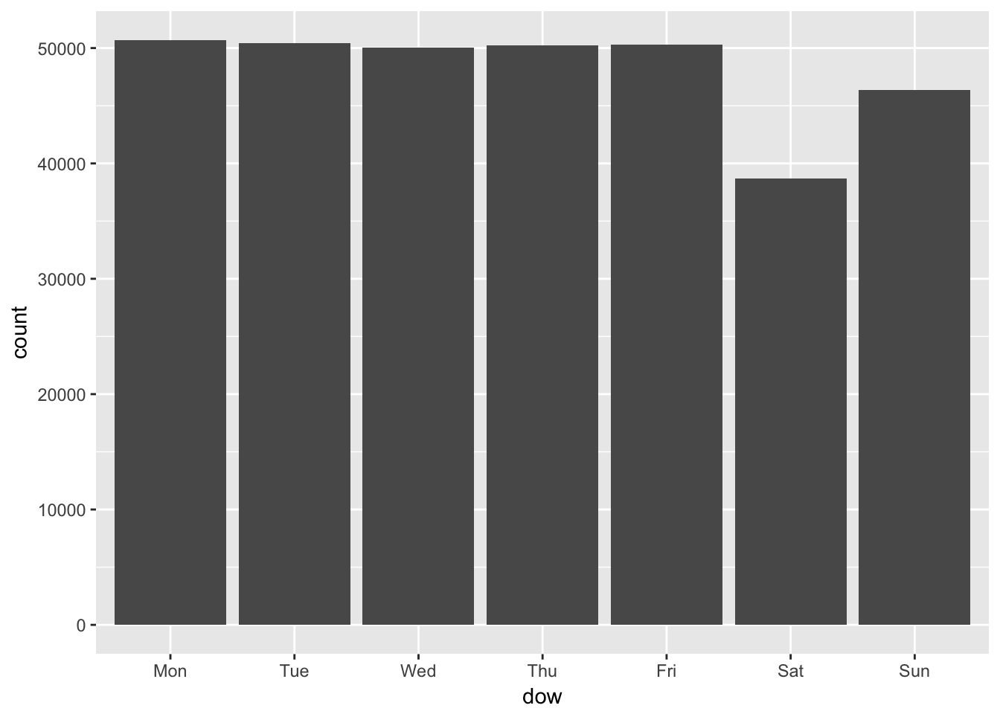

# Introduction {#intro} 

2017-04-05: <span style="color:red">*VERY Preliminary!*</span>


A Few Words 

[R](https://www.r-project.org/) has come a long way in its evolution. Its [download page](https://cran.r-project.org/) looks the same as it was many years ago when I started using R. Don't be fooled by its archaic first look. My personal guess is that this has to do with how the R developer community honors its history of turning this open-source software into one of the most popular data analytic tools today. The community is extremely supportive, and learning resources abound. That archaic look is not a sign of snobbishness, and I hope you too will appreciate it. Welcome to the community.      

In below, we assume that you have  [R](https://cran.r-project.org/) and [RStudio Desktop](https://www.rstudio.com/products/rstudio/download/) (free IDE) installed. It will be handy to have cheat sheets for [base R](http://github.com/rstudio/cheatsheets/raw/master/source/pdfs/base-r.pdf), 
[RStudio IDE](https://www.rstudio.com/wp-content/uploads/2016/01/rstudio-IDE-cheatsheet.pdf), [dplyr](https://github.com/rstudio/cheatsheets/raw/master/source/pdfs/data-transformation-cheatsheet.pdf), and [ggplot2](https://www.rstudio.com/wp-content/uploads/2016/11/ggplot2-cheatsheet-2.1.pdf). 

If you find this introduction too technical, please start with [ModernDive](https://ismayc.github.io/moderndiver-book/4-viz.html) open-source textbook (say, up to Chapter 5). The book gave an initial inspiration to start this site.  

## Materials

R becomes more capable with each addition of user-contributed R package, or a bundle of user-developed programs. Recent developments such as [tidy](https://cran.r-project.org/web/packages/tidyr/vignettes/tidy-data.html),  [dplyr](https://cran.r-project.org/web/packages/dplyr/vignettes/introduction.html), and [ggplot2](http://docs.ggplot2.org/current/)
have streamlined much of coding for data manipulation and analysis, and this can be a good place to start learning R.  With this new syntax system, you will learn the components of data wrangling and visualization as *your data operation language*.  Like any language, its grammar and framework provide a particular way of understanding the world. In this case, it will influence your thinking about data.     

Let's start with a sample dataset of airplane departures and arrivals. The dataset contains information on about 337,000 flights departed from New York City in 2013 (source: [Bureau of Transportation Statistics](https://www.transtats.bts.gov/DatabaseInfo.asp?DB_ID=120&Link=0)). We load a built-in data frame by command `library(nycflights13)` where `library(package_name)` loads a R package named `package_name` in the current R session, or the computing environment. In the R console (the left bottom pane in RStudio), type `install.packages("nycflights13")` and hit enter. 


Generally, R packages are installed to a local computer as an as-needed basis. To install several more packages that we will use, copy the following code and execute it in your R console. 

```r
# Don't worry about understanding the code here
# `#` symbole is used to insert comments that are helpful to humans but are ignored by R 

required_pkgs <- c("nycflights13", "dplyr", "ggplot2", "lubridate", "knitr", "tidyr", "broom")   
  #  creating a new object "required_pkgs" containing strings "nycflights13", "dplyr",..
  # "c()" concatenates string names here. 
  # "<-" operator assigns from the object on the right to left

new_pkgs <- required_pkgs[!(required_pkgs  %in% installed.packages())] 
  # checking whether "required_pkgs" are already installed 
  # required_pkgs[ ] here is an extraction by logical TRUE or FALSE
  # "%in%" checks whether items on the left are members of the items on the right.
  # ! is a negation 

if (length(new_pkgs)) {
  install.packages(new_pkgs, repos = "http://cran.rstudio.com")
}   # "repos =" specifies the repository from which you download packages.
```


Each time we start a new session in R, we load libraries. In this session, we load the following;

```r
suppressWarnings({
  suppressMessages({
    library(dplyr)  # for data manipulation 
    library(ggplot2)  # for figures  
    library(lubridate) # for date manipulation
    library(nycflights13)  # sample data of NYC flights
    library(knitr) # for table formatting
    library(tidyr) # for table formatting
    library(broom)  # for table formatting
  })
})
```

Let's see the data. 

```r
class(flights) # shows the class attribute
dim(flights)   # obtains dimention rows by columns 
```

```
## [1] "tbl_df"     "tbl"        "data.frame"
## [1] 336776     19
```
 

```r
head(flights)  # displays first seveal rows and columns 
```

```
## # A tibble: 6 × 19
##    year month   day dep_time sched_dep_time dep_delay arr_time
##   <int> <int> <int>    <int>          <int>     <dbl>    <int>
## 1  2013     1     1      517            515         2      830
## 2  2013     1     1      533            529         4      850
## 3  2013     1     1      542            540         2      923
## 4  2013     1     1      544            545        -1     1004
## 5  2013     1     1      554            600        -6      812
## 6  2013     1     1      554            558        -4      740
## # ... with 12 more variables: sched_arr_time <int>, arr_delay <dbl>,
## #   carrier <chr>, flight <int>, tailnum <chr>, origin <chr>, dest <chr>,
## #   air_time <dbl>, distance <dbl>, hour <dbl>, minute <dbl>,
## #   time_hour <dttm>
```

`dim()` command returns the dimension (rows and columns) of `flights` data frame, and `head()` command returns the first several rows and columns of the data frame. The dataset contains information on dates, actual departure and arrival times, scheduled departures and arrivals, carriers, origins, destinations, travel times, and distances. These variables are arranged in columns, and each row is a observation, or a flight.  


In R, we refer to a dataset as **data frame**, which is a *class* of R object.  The **data frame** class is more general than the **matrix** class in that it can contain variables of more than one mode (numeric, character, factor etc). In case you cannot wait to know more about data types, here is a [summary](http://www.statmethods.net/input/datatypes.html). 


## Arts & Carfts 

### Crafts  {-}

We will focus on six data wrangling functions in the `dplyr` package.  

* `filter()`: extracts rows (e.g. observations) of a data frame. We put logical vectors in its arguments.  

* `select()`: extracts columns (e.g. variables) of a data frame. We put column names in its arguments. 

* `arrange()`: orders rows of a data frame. We put column names in its arguments. 

* `summarise()`: collapses a data frame into summary statistics. We put **summary functions**  (e.g. statistics functions) using column names in its arguments.     

* `mutate()`: creates new variables and adds them to the existing columns. We put  **window functions** (e.g. transforming operations) using column names in its arguments.  

* `group_by()`: assigns rows into groups in a data frame. We put column names in its arguments.  

The very first argument in all these functions is a **data frame**, and by knowing this we can easily **pipe** a sequence of data operations through `%>%` operator. The key is to start with a data frame and then form a sequence of data operations in plain English, which  we can translate into codes by  replacing **then** in the sequence with `%>%` operator.  For example, if we want to find the average delays in departures and arrivals from New York to St. Paul-Minneapolis airport (MSP), we take the flight data frame, apply `filter()` to subset rows of the flights to MSP, and then apply `summarise()` to calculate the mean.  


```r
flights %>%  # take data frame "flights", then
  filter(dest == "MSP") %>%  # filter rows, then  
  summarise(   
    # summarise departure and arrival delays for their means 
    # and call them mean_dep_delay and mean_arr_delay 
    mean_dep_delay = mean(dep_delay, na.rm = TRUE), 
    mean_arr_delay = mean(arr_delay, na.rm = TRUE)
    )    # calculate the mean, while removing NA values  
```

```
## # A tibble: 1 × 2
##   mean_dep_delay mean_arr_delay
##            <dbl>          <dbl>
## 1       13.32481       7.270169
```

In `summarise()`, one can use **summary functions** that takes a vector as an input and produces a scaler as an output such as `mean()`, `sd()` (standard deviation), `quantile()`, `min()`, `max()`, and `n()` (observation count: `dplyr` package).      

Each time we apply `%>%` operator above, we pass a modified data frame from one data operation to another through the first argument. This code is equivalent to  

```r
summarise(   # data frame "flights" is inside filter(), which is inside summarise() 
    filter(flights, dest == "MSP"), 
    mean_dep_delay = mean(dep_delay, na.rm = TRUE),
    mean_arr_delay = mean(arr_delay, na.rm = TRUE)
    )
```

```
## # A tibble: 1 × 2
##   mean_dep_delay mean_arr_delay
##            <dbl>          <dbl>
## 1       13.32481       7.270169
```

You will quickly discover that `%>%` operator makes the code much easier to read, write, and edit and how that makes you want to play with the data more.  

Let's add a few more lines to the previous example. Say, additionally we want to see the average delays by carrier and sort the results by the number of observations (e.g. flights) in descending order. Okay, what do we do now?  We make **a sequence of operations in plain English** and translate that into **codes** by replacing **then** with `%>%` operator. Thus, we take the data frame `flights`; **then** (`%>%`)  `filter()` to extract the rows of flights to MSP;  **then** (`%>%`) group rows by carrier; **then** (`%>%`) `summarise()` data for the number of observations and the means. 


```r
flight_stats_MSP <- flights %>%  # assign the results to an object named "flight_stats"
  filter(dest == "MSP") %>% 
  group_by(carrier) %>%  #  group rows by carrier 
  summarise(
    n_obs = n(),  # count number of rows 
    mean_dep_delay = mean(dep_delay, na.rm = TRUE),
    mean_arr_delay = mean(arr_delay, na.rm = TRUE)
  ) %>% 
  arrange(desc(n_obs))  # sort by n_obs in descending order

flight_stats_MSP  # show flight_stats object
```

```
## # A tibble: 6 × 4
##   carrier n_obs mean_dep_delay mean_arr_delay
##     <chr> <int>          <dbl>          <dbl>
## 1      DL  2864      10.651392       4.035702
## 2      EV  1773      17.093413      10.527995
## 3      MQ  1293       8.255457       9.559350
## 4      9E  1249      19.658113       8.089776
## 5      OO     4       0.750000      -2.000000
## 6      UA     2      -6.000000      -5.500000
```


Carrier variable is expressed in the International Air Transportation Association (IATA) code, so let's add a column of carrier names by joining a data frame called `airlines`. In RStudio, you can find this data frame under the **Environment**  tab (in the upper right corner) if you switch the display option from **Global Environment** to **package:nycflights13**. To inspect the data frame, type `View(airlines)` in R console. Also, by command  `data()`  you can see a list of all datasets that are loaded with libraries. 


```r
left_join(flight_stats_MSP, airlines, by="carrier") %>%
  # left_join(a,b, by="var") joins two data frames a, b by matching rows of b to a by identifier "var".  
  kable(digits=2)  # kable() prints a better-looking table here
```


carrier    n_obs   mean_dep_delay   mean_arr_delay  name                     
--------  ------  ---------------  ---------------  -------------------------
DL          2864            10.65             4.04  Delta Air Lines Inc.     
EV          1773            17.09            10.53  ExpressJet Airlines Inc. 
MQ          1293             8.26             9.56  Envoy Air                
9E          1249            19.66             8.09  Endeavor Air Inc.        
OO             4             0.75            -2.00  SkyWest Airlines Inc.    
UA             2            -6.00            -5.50  United Air Lines Inc.    


In the next example, we add new variables to `flights` using `mutate()`.   


```r
flights %>%
  select(dep_delay, arr_delay) %>% 
    # keep only columns named "dep_delay" and "arr_delay"
  mutate(
    gain = arr_delay - dep_delay,
    gain_rank = round(percent_rank(gain), digits = 2)
      # Note: we can immediately use the "gain" variable we just defined. 
  )
```

```
## # A tibble: 336,776 × 4
##    dep_delay arr_delay  gain gain_rank
##        <dbl>     <dbl> <dbl>     <dbl>
## 1          2        11     9      0.81
## 2          4        20    16      0.88
## 3          2        33    31      0.94
## 4         -1       -18   -17      0.22
## 5         -6       -25   -19      0.18
## 6         -4        12    16      0.88
## 7         -5        19    24      0.92
## 8         -3       -14   -11      0.37
## 9         -3        -8    -5      0.54
## 10        -2         8    10      0.82
## # ... with 336,766 more rows
```

We extracted specific columns of `flights` by `select()` and added new columns defined in `mutate()`.  `mutate()` differs from `summarise()` in that  `mutate()` expand the data frame in the column dimension and makes not change in the row dimension, while    `summarise()` collapses the data frame into a summary table of much smaller column and row dimensions. 


There are about five types of [window functions](https://cran.r-project.org/web/packages/dplyr/vignettes/window-functions.html) that may be used in `mutate()`: (1)  any **summary function**, which is interpreted as a vector of repeated values (e.g., the same mean value in a column) : (2)  ranking or ordering function (e.g., `row_number()`, `min_rank()`, `dense_rank()`, `cume_dist()`,`percent_rank()`, and `ntile()`): (3) offset function, say defining a lagged variable in time series data (`lead()` and `lag()`): (4)  cumulative aggregate (e.g., `cumsum()`, `cummin()`, `cummax()`, `cumall()`, `cumany()`, and `cummean()`): (5) fixed-window rolling aggregate such as a windowed mean, median, etc.  You can find a help file for any function, for example, by typing `?cumsum`.  


Before moving to the graphics, let's quickly go over what a **function** is in R and how you can use a custom function in `summarise()` or  `mutate()`. In R, we use `function()` to create a function, which has its name, input arguments separated by comma, and body (e.g., tasks to perform and what to return as an output).    

```
your_function_name <- function(input arguments) {
                        task1
                        task2
                        .
                        .
                        .
                        output_to_return 
                      } 
                      

# For a function having only a single expression to execute, we can omit brakets { }. 
another_function <- function(input args) task/output_in_a_single_expression                    
```

Let's go through a few examples. 


```r
# generate a sequence from 1 to 10 (by the increment of 1) and name it  "vec1".  
vec1 <- 1:10
vec1            
```

```
##  [1]  1  2  3  4  5  6  7  8  9 10
```

```r
# c() concatenates 
vec2 <- c(vec1, NA, NA)
vec2
```

```
##  [1]  1  2  3  4  5  6  7  8  9 10 NA NA
```

```r
my_mean_1 <- function(x)  mean(x, na.rm = TRUE)
  # Input arguments: x 
  # Output: the calculation result of mean(x, na.rm = TRUE). 
  # x is required by mean() (and implicitly assumed to be a vector of numeric values). 
  # mean() is an existing function. The "na.rm" argument of mean() is set to be TRUE.  

my_mean_1(vec1)
```

```
## [1] 5.5
```

```r
my_mean_2 <- function(x, na.rm=TRUE)  mean(x, na.rm = na.rm)   
  # Input arguments: x and na.rm (optional with the default value of TRUE) 
  # Output: the calculation result of mean(x, na.rm = na.rm).
  # The input argument "na.rm" is passed to the input argument "na.rm" of mean() 

my_mean_2(vec2)
```

```
## [1] 5.5
```

```r
my_mean_2(vec2, na.rm=FALSE)  # not revmoving NA returns NA for the mean calculation.  
```

```
## [1] NA
```

```r
my_zscore <- function(x, remove_na=TRUE) { 
  # A function body may be enclosed by { }.  
  # That is optional for a single expression but required for multiple expressions
  (x - my_mean_2(x, na.rm = remove_na))/sd(x, na.rm = remove_na)  
}
  # Inputs: x and remove_na (optional: default = TRUE)
  # Output: z-score of vector x
  # my_mean() and sd() are scalers but are interpreted 
  # as a vector of repeated valuses that has the same length as x. 

my_zscore(vec1) %>% round(2)
```

```
##  [1] -1.49 -1.16 -0.83 -0.50 -0.17  0.17  0.50  0.83  1.16  1.49
```


Let's apply functions`my_mean_2()` and `my_zscore()` in `summarise()` and `mutate()`. 

```r
flights %>% 
  select(dep_delay) %>% 
  summarise(
    mean_dep_delay = my_mean_2(dep_delay),  # using my_mean_2()  
    mean_dep_delay_na = my_mean_2(dep_delay, na.rm = FALSE)  # this returns NA
  ) %>%
  kable(digits=2)
```


 mean_dep_delay   mean_dep_delay_na
---------------  ------------------
          12.64                  NA

```r
flights_gain <- flights %>%
  ungroup() %>%
  select(dep_delay, arr_delay) %>% 
  mutate(
    gain = arr_delay - dep_delay,
    gain_z = (gain - my_mean_2(gain))/sd(gain, na.rm=TRUE),  # using my_mean_2()  
    gain_z2 = my_zscore(gain_z)  # using my_zscore()   
  )

head(flights_gain) %>%
  kable(digits=2)
```


 dep_delay   arr_delay   gain   gain_z   gain_z2
----------  ----------  -----  -------  --------
         2          11      9     0.81      0.81
         4          20     16     1.20      1.20
         2          33     31     2.03      2.03
        -1         -18    -17    -0.63     -0.63
        -6         -25    -19    -0.74     -0.74
        -4          12     16     1.20      1.20

Creating a function helps avoid repeating ourselves with writing similar codes in multiple places. Avoiding such repetitions is important for making reading and editing codes easier, which helps reduce coding errors.      

What if we want to apply the same function, say `mean()`, in `summary()` or `mutate()` to several columns in a data frame?  The `dplyr` package also has `summarise_each()` and `mutate_each()` functions that apply a variety of standard **summary functions** to each variables in columns. They are very easy to use, but it will be helpful to remember a few things. 

`summarise_each()` or `mutate_each()` *calls* a function by its name, and it is straightforward when you only need to pass a column vector into a function, say `mean(var1)`. However, providing additional arguments into the function, say `mean(var1, na.rm=TRUE)`, becomes somewhat cumbersome in terms of its syntax. 

There are two easy ways to get around this problem. The first approach is to pre-process the data frame before getting to `summarise_each()` or `mutate_each()`. For example, if we want to pass the argument `na.rm=TRUE` to `mean()`,  we can first filter out rows that contain missing values  (`NA`) and then apply `summarise_each()`. 


```r
flights_gain %>% 
  select(dep_delay, arr_delay, gain)  %>%
  filter(!is.na(dep_delay) & !is.na(arr_delay)) %>%  
    # filter out rows that have NA values in dep_delay or arr_deplay
  summarise_each("mean") %>%  
    # summarise_each(func_names) applies functions named func_names to each column. 
  kable(digits=2) 
```


 dep_delay   arr_delay    gain
----------  ----------  ------
     12.56         6.9   -5.66
 
The other approach is to use a custom function. For instance, in the `my_mean_2()` above we specified default argument `na.rm=TRUE` that gets passed into `mean()`, effectively overwriting the default argument `na.rm=FALSE` of `mean()`. A custom function (as well as any standard summary function) can be called in `summarise_each()` or `mutate_each()` using `funs()`;   

```r
flights_gain %>% 
  select(-contains("_z")) %>%  
  summarise_each(funs("my_mean_2")) %>%
    kable(digits=2)
```


 dep_delay   arr_delay    gain
----------  ----------  ------
     12.64         6.9   -5.66


Being able to use your own functions in `dplyr`-style data operations will dramatically enhance your ability to wrangle data for analysis.    


### Arts  {-}

Now we will cover the basics of data visualization via  [ggplot2](http://docs.ggplot2.org/current/) package. 
The `ggplot2` syntax has three essential components to generating graphics:  **data**,  **aes**,  and **geom**. This implements a philosophy stated as follows (a quote mentioned in [ModernDive](https://ismayc.github.io/moderndiver-book/4-viz.html)); 

> 
A statistical graphic is a mapping of **data** variables to **aesthetic** attributes of **geometric** objects.  
--- [@Wilkinson2005]
>  


While coding complex graphics via `ggplot()` function may appear intimidating at first, it  boils down to the three primary components:

* **data**: a data frame e.g., the first argument in `ggplot(data, ...)`.    

* **aes**:  specifications for x-y variables, as well as variables to differentiate **geom** objects by color , shape, or size. e.g., `aes(x = var_x, y = var_y, shape = var_z)` 

* **geom**: geometric objects such as points, lines, bars, etc. e.g., `geom_point()`,  `geom_line()`,  `geom_histogram()`  
 
 
Given the large flexibility with graphics in R, one can refine the plot figure by adding secondary components or characteristics such as: 

* stat: data transformation, overlay of statistical inferences etc. 

* scales: scaling data points etc. 

* coord: Cartesian coordinates, polar coordinates, mapping projections etc.

* facet: laying out multiple plot panels in a grid etc. 

Let's generate plots of five common types: 
**scatter-plots**, **line-graphs**, **boxplots**, **histograms**, and **barplots**.  We will use these plots to investigate  what may explain patterns in flight departure delays.   

First, let's consider a possibility of congestion at the airport during certain times of the day or certain seasons. We can use  **barplots** to see whether there is any obvious pattern in the flight distribution across flight origins (i.e., airports) in New York City. A barplot shows observation counts (e.g., rows of a data frame) by category. 


```r
ggplot(data = flights,  # the first argument is the data frame
       mapping = aes(x = origin)) +   # the second argument is "mapping", which is aes()   
  geom_bar()  #  after "+" piping operator of ggplot(), we add geom_XXX() elements 
```


We can make this more informative and aesthetic. 

```r
ggplot(data = flights, 
       mapping = aes(x = origin, fill = origin)) +  # here "fill" gives bars distinct colors 
  geom_bar() +  
  facet_wrap( ~ hour)  #  "facet_wrap( ~ var)" generates a grid of plots by var 
```


Another way to see the same information is a **histogram**. 

```r
flights %>% 
  filter(hour >= 5) %>%  # exclude hour earlier than 5 a.m.
  ggplot(aes(x = hour, fill = origin )) + geom_histogram(binwidth = 1, color = "white") 
```


 
While mornings and late afternoons get busy, there is not much difference in the number of flights across origins throughout the day. 

Let's see if there are distinct patters in departure delays over the course of a year. We do this by taking the average of departure delays for each day by flight origin and plot as a time series using **line-graphs**.   


```r
delay_day <- flights %>% 
  group_by(origin, year, month, day) %>% 
  summarise(dep_delay = mean(dep_delay, na.rm = TRUE))  %>% 
  mutate(date = as.Date(paste(year, month, day), format="%Y %m %d")) %>%
  filter(!is.na(dep_delay))  #  exclude rows with dep_delay == NA 

delay_day %>%     # "facet_grid( var ~ .)" is similar to "facet_wrap( ~ var)" 
  ggplot(aes(x = date, y = dep_delay)) + geom_line() + facet_grid( origin ~ . ) 
```


The months in summer appear to be busier on average, and the seasonal pattern seems similar across airports.  Let's see how closely these patterns are related to each other by focusing on  a few summer months and overlying the line-graphs in a single plot. 


```r
delay_day %>% 
  filter("2013-07-01" <= date, "2013-08-31" >= date)  %>% 
  ggplot(aes(x = date, y = dep_delay, color = origin)) + geom_line()  
```


We can see similar patterns of spikes across airports occurring on certain days, which indicate that all three airports get busy on the same days. Does that mean they tend to be congested at the same time? 

In the previous figure, it appears that there is some cyclical pattern of delays. Let's compare delays by day of the week. Here is a function to calculate day of the week for a given date.   


```r
my_dow <- function(date) {
  dow <- as.POSIXlt(date)[['wday']] + 1
  # as.POSIXlt(date)[['wday']] returns integers 0, 1, 2, .. 6, for Sun, Mon, ... Sat.  
  # Here we extract one item from a vector (Sun, Mon, ..., Sat) by position numbered between 1 to 7. 
  c("Sun", "Mon", "Tue", "Wed", "Thu", "Fri", "Sat")[dow]  # extract "dow"-th element    
} 
  # Input: date in the format as in "2017-01-23"
  # Output: day of week 
Sys.Date()  # Sys.Date() returns the current date 
```

```
## [1] "2017-04-05"
```

```r
my_dow(Sys.Date()) 
```

```
## [1] "Wed"
```

Now let's take a look at the mean delays by day of the week in  **boxplots**.


```r
delay_day <- flights %>% 
  group_by(year, month, day) %>% 
  summarise(dep_delay = mean(dep_delay, na.rm = TRUE))  %>% 
  mutate(date = as.Date(paste(year, month, day), format="%Y %m %d"),  
         # date defined by as.Data() function 
         wday = my_dow(date),
         weekend = wday %in% c("Sat", "Sun")  
         # %in% operator: A %in% B returns TRUE/FALSE for whether each element of A is in B. 
  )

# show the first 20 elements of "wday" variable in "delay_day" data frame 
delay_day$wday[1:20] %>% print()   
```

```
##  [1] "Tue" "Wed" "Thu" "Fri" "Sat" "Sun" "Mon" "Tue" "Wed" "Thu" "Fri"
## [12] "Sat" "Sun" "Mon" "Tue" "Wed" "Thu" "Fri" "Sat" "Sun"
```

```r
delay_day$wday <- ordered(delay_day$wday, 
                         levels = c("Mon", "Tue", "Wed", "Thu", "Fri", "Sat", "Sun"))
                            # adding a sorting order (Mon, Tue, ..., Sun)   
delay_day$wday[1:20] %>% print() 
```

```
##  [1] Tue Wed Thu Fri Sat Sun Mon Tue Wed Thu Fri Sat Sun Mon Tue Wed Thu
## [18] Fri Sat Sun
## Levels: Mon < Tue < Wed < Thu < Fri < Sat < Sun
```

```r
delay_day  %>% 
  filter(!is.na(dep_delay)) %>%
  ggplot(aes(x = wday, y = dep_delay, fill = weekend)) + geom_boxplot() 
```



It appears that delays are on average longer on Thursdays and Fridays and shorter on Saturdays. You might think that it makes sense that more people are traveling on Thursdays and Fridays before the weekend, and less are traveling on Saturdays to enjoy the weekend. Are Saturdays busier? Let's find out.  


```r
flights_wday <- flights %>% 
  mutate(date = as.Date(paste(year, month, day), format="%Y %m %d"),  
         wday = ordered(my_dow(date),
                        levels = c("Mon", "Tue", "Wed", "Thu", "Fri", "Sat", "Sun")),
         weekend = wday %in% c("Sat", "Sun")  
  )

flights_wday %>% 
  group_by(wday) %>%
  summarise( nobs = n() )
```

```
## # A tibble: 7 × 2
##    wday  nobs
##   <ord> <int>
## 1   Mon 50690
## 2   Tue 50422
## 3   Wed 50060
## 4   Thu 50219
## 5   Fri 50308
## 6   Sat 38720
## 7   Sun 46357
```

```r
flights_wday  %>% 
  ggplot(aes(x = wday)) + geom_bar() 
```


Yes, Saturdays are less busy for the airports in terms of flight numbers.   

Can we generalize this positive relationship between the number of flights and the average delays, which we see across day of the week?  Let's summarize the data into the average delays by date-hour and see if the business of a particular hour of a particular day is correlated with the mean delay. We visualize these data using a **scatter plot**.     


```r
delay_day_hr <- flights %>% 
  group_by(year, month, day, hour) %>%  # grouping by date-hour 
  summarise(
    n_obs = n(),
    dep_delay = mean(dep_delay, na.rm = TRUE)
    )  %>% 
  mutate(date = as.Date(paste(year, month, day), format="%Y %m %d"),
         wday = my_dow(date)
  )

plot_delay <- delay_day_hr  %>% filter(!is.na(dep_delay)) %>% 
  ggplot(aes(x = n_obs, y = dep_delay)) + geom_point(alpha = 0.1)  
    # plot of n_obs and the average dep_delay 
    # where each point represents an date-hour average
    # "alpha = 0.1"  controls the degree of transparency of points 

plot_delay 
```


Along the horizontal axis, we can see how the number of flights is distributed across date-hours.  Some days are busy, and some hours busier still. It appears that there are two clusters in the number of lights, showing very slow date-hours (e.g., less than 10 flights flying out of New York city per hour) and normal date-hours (e.g., about 60 flights per hour). We may guess that the delays in the slow hours be caused by bad weather. On the other hand, we may wonder if the excess delays in normal hours, compared to slow hours, are caused by congestion at the airports. To see this, let's fit a curve that captures the relationships between `n_obs` and `dep_delay`.  Our hypothesis is that the delay would become more likely and longer as the number of flights increases.     


```r
plot_delay  +
  geom_smooth()   #  geom_smooth() addes a layer of fitted curve(s) 
```

```
## `geom_smooth()` using method = 'gam'
```


We cannot see any clear pattern.    How about fitting a curve by day of the week? 


```r
plot_delay  +
     # additional aes() argument for applying different colors to the day of the week
  geom_smooth(aes(color = wday), se=FALSE) 
```

```
## `geom_smooth()` using method = 'gam'
```


Surprisingly, the delay does not seem to increase with the flights.  There are more delays on Thursdays and Fridays and less delays on Saturdays, but we see no evidence of congestion as a cause of delay.   

Let's take a closer look at the distribution of the delays. If it is not normally distributed, we may want to apply a transformation.  

```r
delay_day_hr %>%  filter(!is.na(dep_delay)) %>% 
  ggplot(aes(x = dep_delay)) + geom_histogram(color = "white") 
```

```
## `stat_bin()` using `bins = 30`. Pick better value with `binwidth`.
```


```r
delay_day_hr$dep_delay_shifted <- delay_day_hr %>% 
  with(dep_delay - min(dep_delay, na.rm = TRUE) + 1) 
    # with() function takes a data frame in the first argument and allows for 
    # referencing its variable names
    # Before we apply a logarithmic transformation, we shift the variable so that
    # its minimum is greater than zero. 

delay_day_hr %>% 
  ungroup() %>%   # removing group_by() attribute
  select(dep_delay, dep_delay_shifted) %>%
  with(
    apply(., 2, summary)
    # apply(data, num, fun)  applies function "fun" for each item 
    # in dimention "num" (1 = cows, 2= columns) of the data frame    
    # The data referenced by "." (all variables).  
    ) %>% t() #  transpose rows and columns  
```

```
##                   Min. 1st Qu. Median  Mean 3rd Qu. Max. NA's
## dep_delay          -18   1.054  6.571 12.99   15.44  269   13
## dep_delay_shifted    1  20.050 25.570 31.99   34.44  288   13
```

Now the transformed distribution; 


```r
delay_day_hr %>% filter(!is.na(dep_delay_shifted), dep_delay_shifted > 5) %>% 
  ggplot(aes(x = dep_delay_shifted))  +  
  scale_x_log10() + 
    # Under the log of 10 transformation, the distribution looks closer to a normal distribution.
  geom_histogram(color = "white") 
```

```
## `stat_bin()` using `bins = 30`. Pick better value with `binwidth`.
```


```r
delay_day_hr %>% filter(!is.na(dep_delay_shifted), dep_delay_shifted > 5) %>% 
  ggplot(aes(x = dep_delay_shifted)) +  
  scale_x_continuous(trans = "log") +  
    # Alternatively, one can apply the natural logarithm to transform a variable. Histogram shows no difference here.    
  geom_histogram(color = "white")
```

```
## `stat_bin()` using `bins = 30`. Pick better value with `binwidth`.
```


The transformed distribution is much less skewed than the original. Now, let's plot the relationship between delays and flights again. 


```r
delay_day_hr  %>% filter(!is.na(dep_delay_shifted), dep_delay_shifted > 5) %>% 
  ggplot(aes(x = n_obs, y = dep_delay_shifted)) + 
  scale_y_log10() +     # using transformation scale_y_log10() 
  geom_point(alpha = 0.1)  + 
  geom_smooth()  
```

```
## `geom_smooth()` using method = 'gam'
```


We still do not see a pattern that busier hours have more delays.  This seems to suggest that the airports in New York City manage the fluctuating number of flights without causing congestion.  

## Huning down numbers

If not the congestion at airports, what else can explain the delays? Are the airlines partly responsible?  Previously, we observe that some airlines have longer delays than others for NYC-MSP flights. Let's take a look at the overall average delays by carrier.   


```r
stat_carrier <- flights %>% 
  group_by(carrier) %>%
  summarise(n_obs = n(),
            dep_delay = mean(dep_delay, na.rm = TRUE),
            arr_delay = mean(arr_delay, na.rm = TRUE)
            ) %>% 
  left_join(airlines, by="carrier") %>%
  arrange(desc(n_obs)) 

stat_carrier %>% kable(digit=2)
```


carrier    n_obs   dep_delay   arr_delay  name                        
--------  ------  ----------  ----------  ----------------------------
UA         58665       12.11        3.56  United Air Lines Inc.       
B6         54635       13.02        9.46  JetBlue Airways             
EV         54173       19.96       15.80  ExpressJet Airlines Inc.    
DL         48110        9.26        1.64  Delta Air Lines Inc.        
AA         32729        8.59        0.36  American Airlines Inc.      
MQ         26397       10.55       10.77  Envoy Air                   
US         20536        3.78        2.13  US Airways Inc.             
9E         18460       16.73        7.38  Endeavor Air Inc.           
WN         12275       17.71        9.65  Southwest Airlines Co.      
VX          5162       12.87        1.76  Virgin America              
FL          3260       18.73       20.12  AirTran Airways Corporation 
AS           714        5.80       -9.93  Alaska Airlines Inc.        
F9           685       20.22       21.92  Frontier Airlines Inc.      
YV           601       19.00       15.56  Mesa Airlines Inc.          
HA           342        4.90       -6.92  Hawaiian Airlines Inc.      
OO            32       12.59       11.93  SkyWest Airlines Inc.       

There may be some differences across carriers. However, the simple average of delays across various routes, days, and hours of flights may not be a good measure to compare carriers. For example, some carriers may serve the routes and hours that tend to have more delays. Also, given that our dataset covers only the flights from New York City, the comparison may not be  nationally representative since carriers use different airports around the country as their regional hubs. 

For our purposes, let's compare the average air time among carriers while accounting for flight's destination and timing.  The differences in air time are not the same as the differences in delays, but they may tell us some efficiency difference among carriers. 

Let's first check how air time relates to flight distance.   

```r
flights %>% 
  filter (month == 1, day == 1, !is.na(air_time)) %>%
  ggplot(aes(x = distance, y = air_time)) + 
  geom_point(alpha = 0.05)  +  
  # alpha is useful for showing overlapping data points. 
  geom_smooth()
```

```
## `geom_smooth()` using method = 'loess'
```


`air_time` and `distance` shows a general linear relationship. We can better account for this relationship if we calculate an average air time for each flight destination from New York City.  

Consider a simple approach that controls for such average air time for each destination and compares the remaining variation in air time among carriers. We can do this by fitting a linear regression model with fixed destination-fixed effects and comparing the residuals.   

```r
# TRUE/FALSE vector showing whther air_time is not NA. 
idx0 <- flights %>% with(!is.na(air_time))  

flights$res <- NA # prepare a column of residuals that will be defined below 

flights$res[idx0] <- flights %>% 
  filter(!is.na(air_time)) %>% 
 with( 
   lm( air_time ~ as.factor(dest))  
        # lm() estimates a linear model. 
        # "y ~ x"" is the formula for regressing y on x. 
        # as.factor() converts "dest" to a factor (categorical) class
        # used as a set of dummy variables in the regression.  
   ) %>% 
  residuals()  # obtains residuals of the lm() object 

stat_res <- flights %>% 
  group_by(carrier) %>%
  summarise(
    mean_res = mean(res, na.rm = TRUE),
    sd_res = sd(res, na.rm = TRUE)
    ) 

left_join(stat_carrier, stat_res, by="carrier") %>% kable(digit=2)
```


carrier    n_obs   dep_delay   arr_delay  name                           mean_res   sd_res
--------  ------  ----------  ----------  ----------------------------  ---------  -------
UA         58665       12.11        3.56  United Air Lines Inc.             -0.87    14.59
B6         54635       13.02        9.46  JetBlue Airways                    0.28    11.55
EV         54173       19.96       15.80  ExpressJet Airlines Inc.          -0.37     8.94
DL         48110        9.26        1.64  Delta Air Lines Inc.              -0.20    12.32
AA         32729        8.59        0.36  American Airlines Inc.             0.68    13.86
MQ         26397       10.55       10.77  Envoy Air                          0.45     8.87
US         20536        3.78        2.13  US Airways Inc.                   -0.42     9.43
9E         18460       16.73        7.38  Endeavor Air Inc.                  0.84     8.76
WN         12275       17.71        9.65  Southwest Airlines Co.             0.16    12.55
VX          5162       12.87        1.76  Virgin America                     3.26    17.58
FL          3260       18.73       20.12  AirTran Airways Corporation        1.16     8.75
AS           714        5.80       -9.93  Alaska Airlines Inc.              -2.13    16.17
F9           685       20.22       21.92  Frontier Airlines Inc.             3.12    15.16
YV           601       19.00       15.56  Mesa Airlines Inc.                -0.05     7.06
HA           342        4.90       -6.92  Hawaiian Airlines Inc.             5.64    20.69
OO            32       12.59       11.93  SkyWest Airlines Inc.              1.02     7.26

The differences in air time across carriers greatly differ from the averages delays we calculated previously. These differences are also small, compared to their standard deviations.

To get a sense of whether these differences have any statistical significance, let's use t-test to compare the mean residual between the United Airlines and the American Airlines.    

```r
# t-test comparing UA vs AA for the mean air time 
flights %>%
  with({
    idx_UA <- carrier == "UA"
    idx_AA <- carrier == "AA"
    t.test(res[idx_UA], res[idx_AA])
    })
```

```
## 
## 	Welch Two Sample t-test
## 
## data:  res[idx_UA] and res[idx_AA]
## t = -15.722, df = 68826, p-value < 2.2e-16
## alternative hypothesis: true difference in means is not equal to 0
## 95 percent confidence interval:
##  -1.741133 -1.355142
## sample estimates:
##  mean of x  mean of y 
## -0.8689523  0.6791852
```

With a large number of observations, even a seemingly-small difference in the means tend to be statistically significant. 


We can do this sort of pair-wise comparisons all at once using a regression. For this, we use  carrier fixed effects in addition to destination fixed effects and directly compare the carrier fixed effects. We will set the United Airlines to be a reference of carrier fixed effects, so that the fixed effect for the United Airlines is set to zero (i.e., omitted category), from which the fixed effects of all other airlines are estimated. 


```r
flights$carrier %>% table()
```

```
## .
##    9E    AA    AS    B6    DL    EV    F9    FL    HA    MQ    OO    UA 
## 18460 32729   714 54635 48110 54173   685  3260   342 26397    32 58665 
##    US    VX    WN    YV 
## 20536  5162 12275   601
```

```r
flights$carrier <- relevel(factor(flights$carrier), ref="UA")  
  # reference level at the United Airlines
flights$carrier %>% table()
```

```
## .
##    UA    9E    AA    AS    B6    DL    EV    F9    FL    HA    MQ    OO 
## 58665 18460 32729   714 54635 48110 54173   685  3260   342 26397    32 
##    US    VX    WN    YV 
## 20536  5162 12275   601
```

```r
flights %>% 
  with({
    n_carrier <- unique(carrier) %>% length()
    n_dest <- unique(dest) %>% length() 
    print(paste('There are', n_carrier, 'distinct carriers and', 
                n_dest,'distinct destinations in the data.' ))
  })
```

```
## [1] "There are 16 distinct carriers and 105 distinct destinations in the data."
```

```r
f1 <- flights %>%
 with(
   lm( air_time  ~  as.factor(carrier) + as.factor(dest) )  
    # fixed effects for carriers and destinations
 )

# 119 coefficients are estimated in f1 for the fixed effects for 
#  16 carriers + 105 destinations - 2 (reference carrier and destination)

tidy(f1)[1:20,] # show the first 20 coefficients
```

```
##                    term     estimate  std.error    statistic       p.value
## 1           (Intercept)  247.9884874 0.75069658  330.3445016  0.000000e+00
## 2  as.factor(carrier)9E    1.8015498 0.12723996   14.1586788  1.702649e-45
## 3  as.factor(carrier)AA    1.9326712 0.09731105   19.8607572  1.002388e-87
## 4  as.factor(carrier)AS   -1.9071536 0.49596319   -3.8453531  1.204017e-04
## 5  as.factor(carrier)B6    1.1808039 0.08495098   13.8998267  6.535025e-44
## 6  as.factor(carrier)DL    0.7531812 0.08722600    8.6348244  5.907432e-18
## 7  as.factor(carrier)EV    0.4174574 0.11044837    3.7796605  1.570702e-04
## 8  as.factor(carrier)F9    3.8891981 0.48090201    8.0872985  6.120836e-16
## 9  as.factor(carrier)FL    2.6434074 0.27600661    9.5773336  1.002386e-21
## 10 as.factor(carrier)HA   11.0125104 0.89821710   12.2604106  1.503557e-34
## 11 as.factor(carrier)MQ    1.4592669 0.11892133   12.2708590  1.321669e-34
## 12 as.factor(carrier)OO    1.8091432 2.21222472    0.8177936  4.134757e-01
## 13 as.factor(carrier)US    0.1319337 0.13826299    0.9542230  3.399715e-01
## 14 as.factor(carrier)VX    4.5298528 0.18441295   24.5636378 4.086448e-133
## 15 as.factor(carrier)WN    1.2226161 0.17520980    6.9780125  2.999500e-12
## 16 as.factor(carrier)YV    0.5167461 0.52737831    0.9798395  3.271661e-01
## 17   as.factor(dest)ACK -207.1011095 1.04478912 -198.2228803  0.000000e+00
## 18   as.factor(dest)ALB -216.6188634 0.95130943 -227.7059972  0.000000e+00
## 19   as.factor(dest)ANC  165.1365126 4.26930687   38.6799351  0.000000e+00
## 20   as.factor(dest)ATL -136.1282095 0.75641976 -179.9638460  0.000000e+00
```


```r
# cleaning up the coefficient table above   
# keep only rows with term-column containing "carrier"
lm_rlt1 <- tidy(f1) %>% filter(grepl("carrier",term)) 

# create column named carrier 
lm_rlt1 <- lm_rlt1 %>% mutate(carrier = gsub('as.factor\\(carrier\\)','', term)) 

# drop column term
lm_rlt1 <- lm_rlt1 %>% select(-term)  

stat_carrier %>%
  select(carrier, name, n_obs) %>%
  left_join(lm_rlt1, by="carrier") %>% kable(digit=2)
```


carrier   name                           n_obs   estimate   std.error   statistic   p.value
--------  ----------------------------  ------  ---------  ----------  ----------  --------
UA        United Air Lines Inc.          58665         NA          NA          NA        NA
B6        JetBlue Airways                54635       1.18        0.08       13.90      0.00
EV        ExpressJet Airlines Inc.       54173       0.42        0.11        3.78      0.00
DL        Delta Air Lines Inc.           48110       0.75        0.09        8.63      0.00
AA        American Airlines Inc.         32729       1.93        0.10       19.86      0.00
MQ        Envoy Air                      26397       1.46        0.12       12.27      0.00
US        US Airways Inc.                20536       0.13        0.14        0.95      0.34
9E        Endeavor Air Inc.              18460       1.80        0.13       14.16      0.00
WN        Southwest Airlines Co.         12275       1.22        0.18        6.98      0.00
VX        Virgin America                  5162       4.53        0.18       24.56      0.00
FL        AirTran Airways Corporation     3260       2.64        0.28        9.58      0.00
AS        Alaska Airlines Inc.             714      -1.91        0.50       -3.85      0.00
F9        Frontier Airlines Inc.           685       3.89        0.48        8.09      0.00
YV        Mesa Airlines Inc.               601       0.52        0.53        0.98      0.33
HA        Hawaiian Airlines Inc.           342      11.01        0.90       12.26      0.00
OO        SkyWest Airlines Inc.             32       1.81        2.21        0.82      0.41

In the table, the estimate column shows the mean difference in air time with the United, accounting for flight destination. The estimate tends to be more precise for carriers with a larger number of observations. In this estimation, we see the tendency that low-cost carriers such as the Virgin America, the Air Tran, and the Frontier Airlines, as well as the Hawaiian Airlines, tend to show particularly longer air times than the United. 

Now, let's take a step further to account for flight timing. We can do this by adding fixed effects for flight dates and hours of the day. 


```r
flights <- flights %>%
  mutate( date_id = month*100 + day )

flights$date_id %>% unique() %>% length()
```

```
## [1] 365
```

```r
f2 <- flights %>%
 with(
   lm( air_time ~  as.factor(carrier) + as.factor(dest) +
        + as.factor(date_id) + as.factor(hour) )
 )


lm_rlt2 <- tidy(f2) %>% filter(grepl("carrier",term)) 
lm_rlt2 <- lm_rlt2 %>% mutate(carrier = gsub('as.factor\\(carrier\\)','', term)) 
lm_rlt2 <- lm_rlt2 %>% select(-term)  

lm_rlt2 <- stat_carrier %>%
  select(carrier, name, n_obs) %>%
  left_join(lm_rlt2, by="carrier") 

lm_rlt2 %>% kable(digit=2)
```


carrier   name                           n_obs   estimate   std.error   statistic   p.value
--------  ----------------------------  ------  ---------  ----------  ----------  --------
UA        United Air Lines Inc.          58665         NA          NA          NA        NA
B6        JetBlue Airways                54635       1.60        0.07       22.50      0.00
EV        ExpressJet Airlines Inc.       54173       0.61        0.09        6.67      0.00
DL        Delta Air Lines Inc.           48110       0.95        0.07       13.03      0.00
AA        American Airlines Inc.         32729       1.84        0.08       22.81      0.00
MQ        Envoy Air                      26397       1.45        0.10       14.70      0.00
US        US Airways Inc.                20536       0.17        0.11        1.51      0.13
9E        Endeavor Air Inc.              18460       1.57        0.11       14.72      0.00
WN        Southwest Airlines Co.         12275       1.14        0.15        7.82      0.00
VX        Virgin America                  5162       4.85        0.15       31.57      0.00
FL        AirTran Airways Corporation     3260       2.19        0.23        9.58      0.00
AS        Alaska Airlines Inc.             714      -2.55        0.41       -6.21      0.00
F9        Frontier Airlines Inc.           685       3.31        0.40        8.29      0.00
YV        Mesa Airlines Inc.               601       0.32        0.44        0.73      0.46
HA        Hawaiian Airlines Inc.           342      11.79        0.75       15.80      0.00
OO        SkyWest Airlines Inc.             32       7.63        1.83        4.17      0.00

```r
lm_rlt2 %>% filter(carrier!='UA') %>%
  ggplot(aes(x = carrier, y = estimate)) + geom_col() +
  labs(title = "Mean Air Time Compared to United Airlines")
```


The results are very similar to the previous linear model. 


Before wrapping up, consider checking the robustness of our results by replacing date and hour fixed effects with date-hour fixed effects (i.e., the interaction between date and hour). We could add such fixed effects using `time_hour` variable defined above. However, that would mean adding nearly 7,000 dummy variables to our linear regression, which is computationally too intensive. 

To get around this issue, we approximate this estimation by pre-processing the dependent variable. Specifically, we calculate the average air time for each combination of `time_hour` and `dest` and define a new dependent variable by subtracting this average value from the original air time variable (i.e., the new variable is centered at zero-mean for each combination of `time_hour` and `dest`).  Then, we estimate a linear model with carrier and destination fixed effects. 


```r
## Adding time_hour fixed effects is too computationally intensive 
# f1 <- flights %>%
#  with(
#    lm( air_time  ~  as.factor(carrier) + as.factor(dest) + as.factor(time_hour))   
#  )

unique(flights$time_hour) %>% length()  # 6,936 unique time_hour 
```

```
## [1] 6936
```

```r
flights <- flights %>% 
  group_by(dest, time_hour) %>%   
  mutate(
    air_time_centered = air_time - mean(air_time, na.rm=TRUE) 
  )

f3 <- flights %>%
 with(
   lm( air_time_centered  ~  as.factor(carrier) + as.factor(dest) )
 )
  
lm_rlt3 <- tidy(f3) %>% filter(grepl("carrier",term)) 
lm_rlt3 <- lm_rlt3 %>% mutate(carrier = gsub('as.factor\\(carrier\\)','', term))  
lm_rlt3 <- lm_rlt3 %>% select(-term) 

lm_rlt3 <- stat_carrier %>%
  select(carrier, name, n_obs) %>%
  left_join(lm_rlt3, by="carrier") 

lm_rlt3 %>% kable(digit=2) # Note: standard errors, t-stat, and p-val are incorrect
```


carrier   name                           n_obs   estimate   std.error   statistic   p.value
--------  ----------------------------  ------  ---------  ----------  ----------  --------
UA        United Air Lines Inc.          58665         NA          NA          NA        NA
B6        JetBlue Airways                54635       0.82        0.03       32.24      0.00
EV        ExpressJet Airlines Inc.       54173       0.88        0.03       26.50      0.00
DL        Delta Air Lines Inc.           48110       0.52        0.03       19.85      0.00
AA        American Airlines Inc.         32729       1.20        0.03       41.06      0.00
MQ        Envoy Air                      26397       1.00        0.04       27.84      0.00
US        US Airways Inc.                20536      -0.09        0.04       -2.21      0.03
9E        Endeavor Air Inc.              18460       1.27        0.04       33.07      0.00
WN        Southwest Airlines Co.         12275       1.30        0.05       24.70      0.00
VX        Virgin America                  5162       3.47        0.06       62.59      0.00
FL        AirTran Airways Corporation     3260       1.78        0.08       21.48      0.00
AS        Alaska Airlines Inc.             714      -2.86        0.15      -19.15      0.00
F9        Frontier Airlines Inc.           685       1.99        0.14       13.73      0.00
YV        Mesa Airlines Inc.               601       0.78        0.16        4.89      0.00
HA        Hawaiian Airlines Inc.           342       1.34        0.27        4.96      0.00
OO        SkyWest Airlines Inc.             32       3.50        0.67        5.26      0.00

```r
lm_rlt3 %>% filter(carrier!='UA') %>%
  ggplot(aes(x = carrier, y = estimate)) + geom_col() +
  labs(title = "Mean Air Time Compared to United Airlines: Robustness Check")
```


The point estimates should be *approximately* close to what we would obtain if we regress `air_time` on the fixed effects of `carrier`, `dest`, and `time_hour`. However, the standard errors are not correctly displayed in the table because the centered variable has less total variation compared to the original `air_time` variable. (Correct standard errors can be obtained, for example, through a bootstrapping technique.)  

Overall, we see again a tendency that low-cost carriers like the Sky West Airlines, the Virgin America, the Frontier Airlines, and the Air Tran show particularly longer air time than the United Airlines. The Jet Blue Airways, another low-cost carrier, shows a less obvious difference from the United Airlines, possibly suggesting that their operation focused on the East Cost is efficient for the flights departing from New York City. The Hawaiian Airlines and the Alaskan Airlines appear to be somewhat different from other carriers perhaps because they are more specialized in particular flight times and destinations compared to their rivals. In particular, the flights to Hawaii may have distinct delay patterns that are concentrated on certain date-hours of the peak vacation seasons. 

##  Reflections 

The differences in air time across carriers that we found above are relatively small (e.g. less than 5 minutes).  While there may be cumulative impacts of slightly longer air times throughout the day, it is not clear how that would relate to the delay patterns.   

In fact, the concept of "delay" is complicated because it is defined in reference to the scheduled departure and arrival times, which may differ by carrier. A delay would not include the time sitting in the airplane before taking off or after landing as long as it is within the schedule. It might be more interesting to compare scheduled flight durations instead of delays or air time. (Such an analysis would involve somewhat complicated manipulations of date and time with our flight data.)  

This leads us to a final point of this exercise: an interesting data analysis requires **detailed knowledge on the reality, interconnections, and processes that generated the data** and **the ability to ask interesting questions**.  An easy-to-access language for data analysis, as is the case with `deplyr` and `ggplot2` packages in R, can be a great asset, but the ultimate power of data analysis will always rest on your knowledge and creativity. 
 
