## Unusual Deaths in Mexico {#dplyr}

2017-04-20: <span style="color:red">*VERY Preliminary!*</span>


### Materials {-}
This is a practice session of [dplyr](http://docs.ggplot2.org/current/) and [ggplot2](http://docs.ggplot2.org/current/) using [a case study](http://vita.had.co.nz/papers/tidy-data.html) related to [tidyr](https://www.r-bloggers.com/data-manipulation-with-tidyr/) package.

The case is about investigating the causes of death in Mexico that have unusual temporal patterns within a day.  The data on mortalities in 2008 have the following pattern by hour;    


<div class="figure" style="text-align: center">
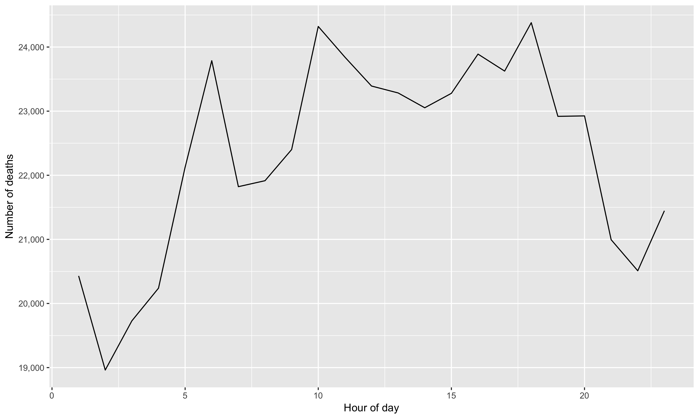
<p class="caption">(\#fig:unnamed-chunk-2)Temporal pattern of all causes of death</p>
</div>

Do you find anything unusual or unexpected? The figure shows several peaks within a day, indicating some increased risk of death during certain times of the day. What could generate these patterns? 

Wickham, the author, finds; 

> The causes of [unusual] death fall into three main groups: murder, drowning, and transportation related. Murder is more common at night, drowning in the afternoon, and transportation related deaths during commute times [@Wickham2014]. 


<div class="figure">
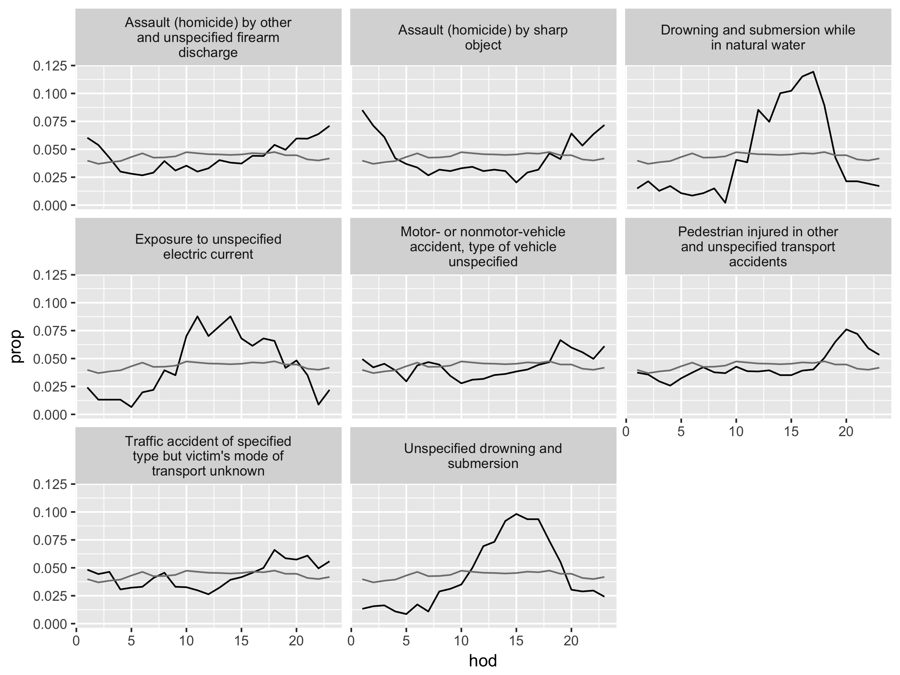
<p class="caption">(\#fig:unusual-big)Causes of death with unusual temporal courses. Hour of day (hod) on the x-axis and proportion (prop) on the y-axis. Overall hourly death rate shown in grey. Causes of death with more than 350 deaths over a year. </p>
</div>


We will use two datasets: `deaths` containing the timing and coded causes of deaths and `codes` containing the look-up table for the coded causes. 

<!--
# ```{r, echo=FALSE} 
# DT::datatable(deaths08[1:200,],
#       colnames =  c("Year of Death (yod)", "Month of Death (mod)", 
#                     "Day of Death (dod)", "Hour of Death (hod)", "Cause of Death (cod)")
# )
# ```
-->

The dataset `deaths` has over 53,000 records (rows), so we use `head()` to look at the first several rows.


```r
# "deaths08b" is a renamed dataset with easier-to-read column names 
head(deaths08b) 
```

```
##   Year of Death (yod) Month of Death (mod) Day of Death (dod)
## 1                2008                    1                  1
## 2                2008                    1                  1
## 3                2008                    1                  1
## 4                2008                    1                  1
## 5                2008                    1                  1
## 6                2008                    1                  1
##   Hour of Death (hod) Cause of Death (cod)
## 1                   1                  B20
## 2                   1                  B22
## 3                   1                  C18
## 4                   1                  C34
## 5                   1                  C50
## 6                   1                  C50
```


The dataset `codes` has 1851 records. 

<!--html_preserve--><div id="htmlwidget-c9868b574a170d8d610e" style="width:100%;height:auto;" class="datatables html-widget"></div>
<script type="application/json" data-for="htmlwidget-c9868b574a170d8d610e">{"x":{"filter":"none","data":[["1","2","3","4","5","6","7","8","9","10","11","12","13","14","15","16","17","18","19","20","21","22","23","24","25","26","27","28","29","30","31","32","33","34","35","36","37","38","39","40","41","42","43","44","45","46","47","48","49","50","51","52","53","54","55","56","57","58","59","60","61","62","63","64","65","66","67","68","69","70","71","72","73","74","75","76","77","78","79","80","81","82","83","84","85","86","87","88","89","90","91","92","93","94","95","96","97","98","99","100","101","102","103","104","105","106","107","108","109","110","111","112","113","114","115","116","117","118","119","120","121","122","123","124","125","126","127","128","129","130","131","132","133","134","135","136","137","138","139","140","141","142","143","144","145","146","147","148","149","150","151","152","153","154","155","156","157","158","159","160","161","162","163","164","165","166","167","169","170","171","172","173","174","175","176","177","178","179","180","181","182","183","184","185","186","187","188","189","190","191","192","193","194","195","196","197","198","199","200","201","202","203","204","205","206","207","208","209","210","211","212","213","215","216","217","218","219","220","221","222","223","224","225","226","227","228","229","230","231","232","233","234","235","236","237","238","239","240","241","242","243","244","245","246","247","248","249","250","251","252","253","254","255","256","257","259","260","261","262","263","264","265","266","267","268","269","270","271","272","273","274","275","276","277","278","279","280","281","282","283","284","285","286","287","288","289","290","291","292","293","294","295","296","297","298","299","300","301","302","303","304","305","306","307","308","309","310","311","312","313","314","315","316","317","318","319","320","321","322","323","324","325","326","327","328","329","330","331","332","333","334","335","336","337","338","339","340","341","342","343","344","345","346","347","348","349","350","351","352","353","354","355","356","357","358","359","360","361","362","363","364","365","366","367","368","369","370","371","372","373","374","375","376","377","378","379","380","381","382","383","384","385","386","387","388","389","390","391","392","393","394","395","396","397","398","399","400","401","402","403","404","405","406","407","408","409","410","411","412","413","414","415","416","417","418","419","420","421","422","423","424","425","426","427","428","429","430","431","432","433","434","435","436","437","438","439","440","441","442","443","444","445","446","447","448","449","450","451","452","453","454","455","456","457","458","459","460","461","462","463","464","465","466","467","468","469","470","471","472","473","474","475","476","477","478","479","480","481","482","483","484","485","487","488","489","490","491","492","493","494","495","496","497","498","499","500","501","502","503","504","505","506","507","508","509","510","511","512","513","514","515","516","517","518","519","520","521","522","523","524","525","526","527","528","529","530","531","532","533","534","535","536","537","538","539","540","541","542","543","544","545","546","547","548","549","550","551","552","553","554","555","556","557","558","559","561","562","563","564","565","566","567","568","569","570","571","572","573","574","575","576","577","578","579","580","581","582","583","584","585","586","587","588","589","590","591","592","593","594","595","596","597","598","599","600","601","602","603","604","605","606","607","608","609","610","611","612","613","614","615","616","617","618","619","620","621","622","623","624","625","626","627","628","629","630","631","632","633","634","635","636","637","638","639","640","641","642","643","644","645","646","647","648","649","650","651","652","653","654","655","656","657","658","659","660","661","662","663","664","665","666","667","668","669","670","671","672","673","674","675","676","677","678","679","680","681","682","683","684","685","686","687","688","689","690","691","692","693","694","695","696","697","698","699","700","701","702","703","704","705","706","707","708","709","710","711","712","713","714","715","716","717","718","719","720","721","722","723","724","725","726","727","728","729","730","731","732","733","734","735","736","737","738","739","740","741","742","743","744","745","746","747","748","749","750","751","752","753","754","755","756","757","758","759","760","761","762","763","764","765","766","767","768","769","770","771","772","773","774","775","776","777","778","779","780","781","782","783","784","785","786","787","788","789","790","791","792","793","794","795","796","797","798","799","800","801","802","803","804","805","806","807","808","809","810","811","812","813","814","815","816","817","818","819","820","821","822","823","824","825","826","827","828","829","830","831","832","833","834","835","836","837","838","839","840","841","842","843","844","845","846","847","848","849","850","851","852","853","854","855","856","857","858","859","860","861","862","863","864","865","866","867","868","869","870","871","872","873","874","875","876","877","878","879","880","881","882","883","884","885","886","887","888","889","890","891","892","893","894","895","896","897","898","899","900","901","902","903","904","905","906","907","908","909","910","911","912","913","914","915","916","917","918","919","920","921","922","923","924","925","926","927","928","929","930","931","932","933","934","935","936","937","938","939","940","941","942","943","944","945","946","947","948","949","950","951","952","953","954","955","956","957","958","959","960","961","962","963","964","965","966","967","968","969","970","971","972","973","974","975","976","977","978","979","980","981","982","983","984","985","986","987","988","989","990","991","993","994","995","996","997","998","999","1000","1001","1002","1003","1004","1005","1006","1007","1008","1009","1010","1011","1012","1013","1014","1015","1016","1017","1018","1019","1020","1021","1022","1023","1024","1025","1026","1027","1028","1029","1030","1031","1032","1033","1034","1035","1036","1037","1038","1039","1040","1041","1042","1043","1044","1045","1046","1047","1048","1049","1050","1051","1052","1053","1054","1055","1056","1057","1058","1059","1060","1061","1062","1063","1064","1065","1066","1067","1068","1069","1070","1071","1072","1073","1074","1075","1076","1077","1078","1079","1080","1081","1082","1083","1084","1085","1086","1087","1088","1089","1090","1091","1092","1093","1094","1095","1096","1097","1098","1099","1100","1101","1102","1103","1104","1105","1106","1107","1108","1109","1110","1111","1112","1113","1114","1115","1116","1117","1118","1119","1120","1121","1122","1123","1124","1125","1126","1127","1128","1129","1130","1131","1132","1133","1134","1135","1136","1137","1138","1139","1140","1141","1142","1143","1144","1145","1146","1147","1148","1149","1150","1151","1152","1153","1154","1155","1156","1157","1158","1159","1160","1161","1162","1163","1164","1165","1166","1167","1168","1169","1170","1171","1172","1173","1174","1175","1176","1177","1178","1179","1180","1181","1182","1183","1184","1185","1186","1187","1188","1189","1190","1191","1192","1193","1194","1195","1196","1197","1198","1199","1200","1201","1202","1203","1204","1205","1206","1207","1208","1209","1210","1211","1212","1213","1214","1215","1216","1217","1218","1219","1220","1221","1222","1223","1224","1225","1226","1227","1228","1229","1230","1231","1232","1233","1234","1235","1236","1237","1238","1239","1240","1241","1242","1243","1244","1245","1246","1247","1248","1249","1250","1251","1252","1253","1254","1255","1256","1257","1258","1259","1260","1261","1262","1263","1264","1265","1266","1267","1268","1269","1270","1271","1272","1273","1274","1275","1276","1277","1278","1279","1280","1281","1282","1283","1284","1285","1286","1287","1288","1289","1290","1291","1292","1293","1294","1295","1296","1297","1298","1299","1300","1301","1302","1303","1304","1305","1306","1307","1308","1309","1310","1311","1312","1313","1314","1315","1316","1317","1318","1319","1320","1321","1322","1323","1324","1325","1326","1327","1328","1329","1330","1331","1332","1333","1334","1335","1336","1337","1338","1339","1340","1341","1342","1343","1344","1345","1346","1347","1348","1349","1350","1351","1352","1353","1354","1355","1356","1357","1358","1359","1360","1361","1362","1363","1364","1365","1366","1367","1368","1369","1370","1371","1372","1373","1374","1375","1376","1377","1378","1379","1380","1381","1382","1383","1384","1385","1386","1387","1388","1389","1390","1391","1392","1393","1394","1395","1396","1397","1398","1399","1400","1401","1402","1403","1404","1405","1406","1407","1408","1409","1410","1411","1412","1413","1414","1415","1416","1417","1418","1419","1420","1421","1422","1423","1424","1425","1426","1427","1428","1429","1430","1431","1432","1433","1434","1435","1436","1437","1438","1439","1440","1441","1442","1443","1444","1445","1446","1447","1448","1449","1450","1451","1452","1453","1454","1455","1456","1457","1458","1459","1460","1461","1462","1463","1464","1465","1466","1467","1468","1469","1470","1471","1473","1474","1475","1476","1477","1478","1479","1480","1481","1482","1483","1484","1485","1486","1487","1488","1489","1490","1491","1492","1493","1494","1495","1496","1497","1498","1499","1500","1501","1502","1503","1504","1505","1506","1507","1508","1509","1510","1511","1512","1513","1514","1515","1516","1517","1518","1519","1520","1521","1522","1523","1524","1525","1526","1527","1528","1529","1530","1531","1532","1533","1534","1535","1536","1537","1538","1539","1540","1541","1542","1543","1544","1545","1546","1547","1548","1549","1550","1551","1552","1553","1554","1555","1556","1557","1558","1559","1560","1561","1562","1563","1564","1565","1566","1567","1568","1569","1570","1571","1572","1573","1574","1575","1576","1577","1578","1579","1580","1581","1582","1583","1584","1585","1586","1587","1588","1589","1590","1591","1592","1593","1594","1595","1596","1597","1598","1599","1600","1601","1602","1603","1604","1605","1606","1607","1608","1609","1610","1611","1612","1613","1614","1615","1616","1617","1618","1619","1620","1621","1622","1623","1624","1625","1626","1627","1628","1629","1630","1631","1632","1633","1634","1635","1636","1637","1638","1639","1640","1641","1642","1643","1644","1645","1646","1647","1648","1649","1650","1651","1652","1653","1654","1655","1656","1657","1658","1659","1660","1661","1662","1663","1664","1665","1666","1667","1668","1669","1670","1671","1672","1673","1674","1675","1676","1677","1678","1679","1680","1681","1682","1683","1684","1685","1686","1687","1688","1689","1690","1691","1692","1693","1694","1695","1696","1697","1698","1699","1700","1701","1702","1703","1704","1705","1706","1707","1708","1709","1710","1711","1712","1713","1714","1715","1716","1717","1718","1719","1720","1721","1722","1723","1724","1725","1726","1727","1728","1729","1730","1731","1732","1733","1734","1735","1736","1737","1738","1739","1740","1741","1742","1743","1744","1745","1746","1747","1748","1749","1750","1751","1752","1753","1754","1755","1756","1757","1758","1759","1760","1761","1762","1763","1764","1765","1766","1767","1768","1769","1770","1771","1772","1773","1774","1775","1776","1777","1778","1779","1780","1781","1782","1783","1784","1785","1786","1787","1788","1789","1790","1791","1792","1793","1794","1795","1796","1797","1798","1799","1800","1801","1802","1803","1804","1805","1806","1807","1808","1809","1810","1811","1812","1813","1814","1815","1816","1817","1818","1819","1820","1821","1822","1823","1824","1825","1826","1827","1828","1829","1830","1831","1832","1833","1834","1835","1836","1837","1838","1839","1840","1841","1842","1843","1844","1845","1846","1847","1848","1849","1850","1851","1852","1853","1854","1855","1856","1857","1858"],["A00","A01","A02","A03","A04","A05","A06","A07","A08","A09","A16","A17","A18","A19","A20","A21","A22","A23","A24","A25","A26","A27","A28","A30","A31","A32","A33","A34","A35","A36","A37","A38","A39","A40","A41","A42","A43","A44","A46","A48","A49","A50","A51","A52","A53","A54","A55","A56","A57","A58","A59","A60","A63","A64","A65","A66","A67","A68","A69","A70","A71","A74","A75","A77","A78","A79","A80","A81","A82","A83","A84","A85","A86","A87","A88","A89","A90","A91","A92","A93","A94","A95","A96","A98","A99","B00","B01","B02","B03","B04","B05","B06","B07","B08","B09","B15","B16","B17","B18","B19","B20","B21","B22","B23","B24","B25","B26","B27","B30","B33","B34","B35","B36","B37","B38","B39","B40","B41","B42","B43","B44","B45","B46","B47","B48","B49","B50","B51","B52","B53","B54","B55","B56","B57","B58","B59","B60","B64","B65","B66","B67","B68","B69","B70","B71","B72","B73","B74","B75","B76","B77","B78","B79","B80","B81","B82","B83","B85","B86","B87","B88","B89","B90","B91","B92","B94","B99","C00","C01","C02","C03","C04","C05","C06","C07","C08","C09","C10","C11","C12","C13","C14","C15","C16","C17","C18","C19","C20","C21","C22","C23","C24","C25","C26","C30","C31","C32","C33","C34","C37","C38","C39","C40","C41","C43","C44","C45","C46","C47","C48","C49","C50","C51","C52","C53","C54","C55","C56","C57","C58","C60","C61","C62","C63","C64","C65","C66","C67","C68","C69","C70","C71","C72","C73","C74","C75","C76","C77","C78","C79","C80","C81","C82","C83","C84","C85","C88","C90","C91","C92","C93","C94","C95","C96","C97","D00","D01","D02","D03","D04","D05","D06","D07","D09","D10","D11","D12","D13","D14","D15","D16","D17","D18","D19","D20","D21","D22","D23","D24","D25","D26","D27","D28","D29","D30","D31","D32","D33","D34","D35","D36","D37","D38","D39","D40","D41","D42","D43","D44","D45","D46","D47","D48","D50","D51","D52","D53","D55","D56","D57","D58","D59","D60","D61","D62","D64","D65","D66","D67","D68","D69","D70","D71","D72","D73","D74","D75","D76","D80","D81","D82","D83","D84","D86","D89","E00","E01","E02","E03","E04","E05","E06","E07","E10","E11","E12","E13","E14","E15","E16","E20","E21","E22","E23","E24","E25","E26","E27","E28","E29","E30","E31","E32","E34","E40","E41","E42","E43","E44","E45","E46","E50","E51","E52","E53","E54","E55","E56","E58","E59","E60","E61","E63","E64","E65","E66","E67","E68","E70","E71","E72","E73","E74","E75","E76","E77","E78","E79","E80","E83","E84","E85","E86","E87","E88","E89","F01","F03","F04","F05","F06","F07","F09","F10","F11","F12","F13","F14","F15","F16","F17","F18","F19","F20","F21","F22","F23","F24","F25","F28","F29","F30","F31","F32","F33","F34","F38","F39","F40","F41","F42","F43","F44","F45","F48","F50","F51","F52","F53","F54","F55","F59","F60","F61","F62","F63","F64","F65","F66","F68","F69","F70","F71","F72","F73","F78","F79","F80","F81","F82","F83","F84","F88","F89","F90","F91","F92","F93","F94","F95","F98","F99","G00","G03","G04","G06","G08","G09","G10","G11","G12","G20","G21","G23","G24","G25","G30","G31","G35","G36","G37","G40","G41","G43","G44","G45","G47","G50","G51","G52","G54","G56","G57","G58","G60","G61","G62","G64","G70","G71","G72","G80","G81","G82","G83","G90","G91","G92","G93","G95","G96","G97","G98","H00","H01","H02","H04","H05","H10","H11","H15","H16","H17","H18","H20","H21","H25","H26","H27","H30","H31","H33","H34","H35","H40","H43","H44","H46","H47","H49","H50","H51","H52","H53","H54","H55","H57","H59","H60","H61","H65","H66","H68","H69","H70","H71","H72","H73","H74","H80","H81","H83","H90","H91","H92","H93","H95","I00","I01","I02","I05","I06","I07","I08","I09","I10","I11","I12","I13","I15","I20","I21","I22","I24","I25","I26","I27","I28","I30","I31","I33","I34","I35","I36","I37","I38","I40","I42","I44","I45","I46","I47","I48","I49","I50","I51","I60","I61","I62","I63","I64","I67","I69","I70","I71","I72","I73","I74","I77","I78","I80","I81","I82","I83","I84","I85","I86","I87","I88","I89","I95","I97","I99","J00","J01","J02","J03","J04","J05","J06","J09","J10","J11","J12","J13","J14","J15","J16","J18","J20","J21","J22","J30","J31","J32","J33","J34","J35","J36","J37","J38","J39","J40","J41","J42","J43","J44","J45","J46","J47","J60","J61","J62","J63","J64","J65","J66","J67","J68","J69","J70","J80","J81","J82","J84","J85","J86","J90","J92","J93","J94","J95","J96","J98","K00","K01","K02","K03","K04","K05","K06","K07","K08","K09","K10","K11","K12","K13","K14","K20","K21","K22","K25","K26","K27","K28","K29","K30","K31","K35","K36","K37","K38","K40","K41","K42","K43","K44","K45","K46","K50","K51","K52","K55","K56","K57","K58","K59","K60","K61","K62","K63","K65","K66","K70","K71","K72","K73","K74","K75","K76","K80","K81","K82","K83","K85","K86","K90","K91","K92","L00","L01","L02","L03","L04","L05","L08","L10","L11","L12","L13","L20","L21","L22","L23","L24","L25","L26","L27","L28","L29","L30","L40","L41","L42","L43","L44","L50","L51","L52","L53","L55","L56","L57","L58","L59","L60","L63","L64","L65","L66","L67","L68","L70","L71","L72","L73","L74","L75","L80","L81","L82","L83","L84","L85","L87","L88","L89","L90","L91","L92","L93","L94","L95","L97","L98","M00","M02","M05","M06","M08","M10","M11","M12","M13","M15","M16","M17","M18","M19","M20","M21","M22","M23","M24","M25","M30","M31","M32","M33","M34","M35","M40","M41","M42","M43","M45","M46","M47","M48","M50","M51","M53","M54","M60","M61","M62","M65","M66","M67","M70","M71","M72","M75","M76","M77","M79","M80","M81","M83","M84","M85","M86","M87","M88","M89","M91","M92","M93","M94","M95","M96","M99","N00","N01","N02","N03","N04","N05","N06","N07","N10","N11","N12","N13","N14","N15","N17","N18","N19","N20","N21","N23","N25","N26","N27","N28","N30","N31","N32","N34","N35","N36","N39","N40","N41","N42","N43","N44","N45","N46","N47","N48","N49","N50","N60","N61","N62","N63","N64","N70","N71","N72","N73","N75","N76","N80","N81","N82","N83","N84","N85","N86","N87","N88","N89","N90","N91","N92","N93","N94","N95","N96","N97","N98","N99","O00","O01","O02","O03","O04","O05","O06","O07","O08","O10","O11","O12","O13","O14","O15","O16","O20","O21","O22","O23","O24","O25","O26","O28","O29","O30","O31","O32","O33","O34","O35","O36","O40","O41","O42","O43","O44","O45","O46","O47","O48","O60","O61","O62","O63","O64","O65","O66","O67","O68","O69","O70","O71","O72","O73","O74","O75","O85","O86","O87","O88","O89","O90","O91","O92","O95","O96","O97","O98","O99","P00","P01","P02","P03","P04","P05","P07","P08","P10","P11","P12","P13","P14","P15","P20","P21","P22","P23","P24","P25","P26","P27","P28","P29","P35","P36","P37","P38","P39","P50","P51","P52","P53","P54","P55","P56","P57","P58","P59","P60","P61","P70","P71","P72","P74","P76","P77","P78","P80","P81","P83","P90","P91","P92","P93","P94","P96","Q00","Q01","Q02","Q03","Q04","Q05","Q06","Q07","Q10","Q11","Q12","Q13","Q14","Q15","Q16","Q17","Q18","Q20","Q21","Q22","Q23","Q24","Q25","Q26","Q27","Q28","Q30","Q31","Q32","Q33","Q34","Q35","Q36","Q37","Q38","Q39","Q40","Q41","Q42","Q43","Q44","Q45","Q50","Q51","Q52","Q53","Q54","Q55","Q56","Q60","Q61","Q62","Q63","Q64","Q65","Q66","Q67","Q68","Q69","Q70","Q71","Q72","Q73","Q74","Q75","Q76","Q77","Q78","Q79","Q80","Q81","Q82","Q83","Q84","Q85","Q86","Q87","Q89","Q90","Q91","Q92","Q93","Q95","Q96","Q97","Q98","Q99","R00","R01","R02","R03","R04","R05","R06","R07","R09","R10","R11","R12","R13","R14","R15","R16","R17","R18","R19","R20","R21","R22","R23","R25","R26","R27","R29","R30","R31","R32","R33","R34","R35","R36","R39","R40","R41","R42","R43","R44","R45","R46","R47","R48","R49","R50","R51","R52","R53","R54","R55","R56","R57","R58","R59","R60","R61","R62","R63","R64","R68","R70","R71","R72","R73","R74","R75","R76","R77","R78","R79","R80","R81","R82","R83","R84","R85","R86","R87","R89","R90","R91","R92","R93","R94","R95","R96","R98","R99","S00","S01","S02","S03","S04","S05","S06","S07","S08","S09","S10","S11","S12","S13","S14","S15","S16","S17","S18","S19","S20","S21","S22","S23","S24","S25","S26","S27","S28","S29","S30","S31","S32","S33","S34","S35","S36","S37","S38","S39","S40","S41","S42","S43","S44","S45","S46","S47","S48","S49","S50","S51","S52","S53","S54","S55","S56","S57","S58","S59","S60","S61","S62","S63","S64","S65","S66","S67","S68","S69","S70","S71","S72","S73","S74","S75","S76","S77","S78","S79","S80","S81","S82","S83","S84","S85","S86","S87","S88","S89","S90","S91","S92","S93","S94","S95","S96","S97","S98","S99","T00","T01","T02","T03","T04","T05","T06","T07","T08","T09","T10","T11","T12","T13","T14","T15","T16","T17","T18","T19","T20","T21","T22","T23","T24","T25","T26","T27","T28","T30","T31","T32","T33","T34","T35","T36","T37","T38","T39","T40","T41","T42","T43","T44","T45","T46","T47","T48","T49","T50","T51","T52","T53","T54","T55","T56","T57","T58","T59","T60","T61","T62","T63","T64","T65","T66","T67","T68","T69","T70","T71","T73","T74","T75","T78","T79","T80","T81","T82","T83","T84","T85","T86","T87","T88","T90","T91","T92","T93","T94","T95","T96","T97","T98","U04","V01","V02","V03","V04","V05","V06","V09","V10","V11","V12","V13","V14","V15","V16","V17","V18","V19","V20","V21","V22","V23","V24","V25","V26","V27","V28","V29","V30","V31","V32","V33","V34","V35","V36","V37","V38","V39","V40","V41","V42","V43","V44","V45","V46","V47","V48","V49","V50","V51","V52","V53","V54","V55","V56","V57","V58","V59","V60","V61","V62","V63","V64","V65","V66","V67","V68","V69","V70","V71","V72","V73","V74","V75","V76","V77","V78","V79","V80","V81","V82","V83","V84","V85","V86","V87","V88","V89","V90","V91","V92","V93","V94","V95","V96","V97","V98","V99","W00","W01","W02","W03","W04","W05","W06","W07","W08","W09","W10","W11","W12","W13","W14","W15","W16","W17","W18","W19","W20","W21","W22","W23","W24","W25","W26","W27","W28","W29","W30","W31","W32","W33","W34","W35","W36","W37","W38","W39","W40","W41","W42","W43","W44","W45","W46","W49","W50","W51","W52","W53","W54","W55","W56","W57","W58","W59","W60","W64","W65","W66","W67","W68","W69","W70","W73","W74","W75","W76","W77","W78","W79","W80","W81","W83","W84","W85","W86","W87","W88","W89","W90","W91","W92","W93","W94","W99","X00","X01","X02","X03","X04","X05","X06","X08","X09","X10","X11","X12","X13","X14","X15","X16","X17","X18","X19","X20","X21","X22","X23","X24","X25","X26","X27","X28","X29","X30","X31","X32","X33","X34","X35","X36","X37","X38","X39","X40","X41","X42","X43","X44","X45","X46","X47","X48","X49","X50","X51","X52","X53","X54","X57","X58","X59","X60","X61","X62","X63","X64","X65","X66","X67","X68","X69","X70","X71","X72","X73","X74","X75","X76","X77","X78","X79","X80","X81","X82","X83","X84","X85","X86","X87","X88","X89","X90","X91","X92","X93","X94","X95","X96","X97","X98","X99","Y00","Y01","Y02","Y03","Y04","Y05","Y06","Y07","Y08","Y09","Y10","Y11","Y12","Y13","Y14","Y15","Y16","Y17","Y18","Y19","Y20","Y21","Y22","Y23","Y24","Y25","Y26","Y27","Y28","Y29","Y30","Y31","Y32","Y33","Y34","Y35","Y36","Y40","Y41","Y42","Y43","Y44","Y45","Y46","Y47","Y48","Y49","Y50","Y51","Y52","Y53","Y54","Y55","Y56","Y57","Y58","Y59","Y60","Y61","Y62","Y63","Y64","Y65","Y66","Y69","Y70","Y71","Y72","Y73","Y74","Y75","Y76","Y77","Y78","Y79","Y80","Y81","Y82","Y83","Y84","Y85","Y86","Y87","Y88","Y89"],["Cholera","Typhoid and paratyphoid\nfevers","Other salmonella infections","Shigellosis","Other bacterial intestinal\ninfections","Other bacterial foodborne\nintoxications, not elsewhere\nclassified","Amebiasis","Other protozoal intestinal\ndiseases","Viral and other specified\nintestinal infections","Diarrhea and gastroenteritis\nof infectious origin","Respiratory tuberculosis, not\nconfirmed bacteriologically\nor histologically","Tuberculosis of nervous\nsystem","Tuberculosis of other organs","Miliary tuberculosis","Plague","Tularemia","Anthrax","Brucellosis","Glanders and melioidosis","Rat-bite fevers","Erysipeloid","Leptospirosis","Other zoonotic bacterial\ndiseases, not elsewhere\nclassified","Leprosy [Hansen's disease]","Infection due to other\nmycobacteria","Listeriosis","Tetanus neonatorum","Obstetrical tetanus","Other tetanus","Diphtheria","Whooping cough","Scarlet fever","Meningococcal infection","Streptococcal septicemia","Other septicemia","Actinomycosis","Nocardiosis","Bartonellosis","Erysipelas","Other bacterial diseases, not\nelsewhere classified","Bacterial infection of\nunspecified site","Congenital syphilis","Early syphilis","Late syphilis","Other and unspecified\nsyphilis","Gonococcal infection","Chlamydial lymphogranuloma\n(venereum)","Other sexually transmitted\nchlamydial diseases","Chancroid","Granuloma inguinale","Trichomoniasis","Anogenital herpesviral\n[herpes simplex] infection","Other predominantly sexually\ntransmitted diseases, not\nelsewhere classified","Unspecified sexually\ntransmitted disease","Nonvenereal syphilis","Yaws","Pinta [carate]","Relapsing fevers","Other spirochetal infections","Chlamydia psittaci infection","Trachoma","Other diseases caused by\nchlamydiae","Typhus fever","Spotted fever [tick-borne\nrickettsioses]","Q fever","Other rickettsioses","Acute poliomyelitis","Atypical virus infections of\ncentral nervous system","Rabies","Mosquito-borne viral\nencephalitis","Tick-borne viral encephalitis","Other viral encephalitis, not\nelsewhere classified","Unspecified viral\nencephalitis","Viral meningitis","Other viral infections of the\ncentral nervous system, not\nelsewhere classified","Unspecified viral infection\nof central nervous system","Dengue fever [classical\ndengue]","Dengue hemorrhagic fever","Other mosquito-borne viral\nfevers","Other arthropod-borne viral\nfevers, not elsewhere\nclassified","Unspecified arthropod-borne\nviral fever","Yellow fever","Arenaviral hemorrhagic fever","Other viral hemorrhagic\nfevers, not elsewhere\nclassified","Unspecified viral hemorrhagic\nfever","Herpesviral [herpes simplex]\ninfections","Varicella [chickenpox]","Zoster [herpes zoster]","Smallpox","Monkeypox","Measles","Rubella [German measles]","Viral warts","Other viral infections\ncharacterized by skin and\nmucous membrane lesions, not\nelsewhere classified","Unspecified viral infection\ncharacterized by skin and\nmucous membrane lesions","Acute hepatitis A","Acute hepatitis B","Other acute viral hepatitis","Chronic viral hepatitis","Unspecified viral hepatitis","Human immunodeficiency virus\n[HIV] disease with infectious\nand parasitic diseases","Human immunodeficiency virus\n[HIV] disease with malignant\nneoplasms","Human immunodeficiency virus\n[HIV] disease with other\nspecified diseases","Human immunodeficiency virus\n[HIV] disease with other\nconditions","Unspecified human\nimmunodeficiency virus [HIV]\ndisease","Cytomegaloviral disease","Mumps","Infectious mononucleosis","Viral conjunctivitis","Other viral diseases, not\nelsewhere classified","Viral infection of\nunspecified site","Dermatophytosis","Other superficial mycoses","Candidiasis","Coccidioidomycosis","Histoplasmosis","Blastomycosis","Paracoccidioidomycosis","Sporotrichosis","Chromomycosis and pheomycotic\nabscess","Aspergillosis","Cryptococcosis","Zygomycosis","Mycetoma","Other mycoses, not elsewhere\nclassified","Unspecified mycosis","Plasmodium falciparum malaria","Plasmodium vivax malaria","Plasmodium malariae malaria","Other parasitologically\nconfirmed malaria","Unspecified malaria","Leishmaniasis","African trypanosomiasis","Chagas' disease","Toxoplasmosis","Pneumocystosis","Other protozoal diseases, not\nelsewhere classified","Unspecified protozoal disease","Schistosomiasis\n[bilharziasis]","Other fluke infections","Echinococcosis","Teniasis","Cysticercosis","Diphyllobothriasis and\nsparganosis","Other cestode infections","Dracunculiasis","Onchocerciasis","Filariasis","Trichinellosis","Hookworm diseases","Ascariasis","Strongyloidiasis","Trichuriasis","Enterobiasis","Other intestinal\nhelminthiases, not elsewhere\nclassified","Unspecified intestinal\nparasitism","Other helminthiases","Pediculosis and phthiriasis","Scabies","Myiasis","Other infestations","Unspecified parasitic disease","Sequelae of tuberculosis","Sequelae of poliomyelitis","Sequelae of leprosy","Sequelae of other and\nunspecified infectious and\nparasitic diseases","Other infectious diseases","Malignant neoplasm of lip","Malignant neoplasm of base of\ntongue","Malignant neoplasm of other\nand unspecified parts of\ntongue","Malignant neoplasm of gum","Malignant neoplasm of floor\nof mouth","Malignant neoplasm of palate","Malignant neoplasm of other\nand unspecified parts of\nmouth","Malignant neoplasm of parotid\ngland","Malignant neoplasm of other\nand unspecified major\nsalivary glands","Malignant neoplasm of tonsil","Malignant neoplasm of\noropharynx","Malignant neoplasm of\nnasopharynx","Malignant neoplasm of\npyriform sinus","Malignant neoplasm of\nhypopharynx","Malignant neoplasm of other\nand ill-defined sites in the\nlip, oral cavity, and pharynx","Malignant neoplasm of\nesophagus","Malignant neoplasm of stomach","Malignant neoplasm of small\nintestine","Malignant neoplasm of colon","Malignant neoplasm of\nrectosigmoid junction","Malignant neoplasm of rectum","Malignant neoplasm of anus\nand anal canal","Malignant neoplasm of liver\nand intrahepatic bile ducts","Malignant neoplasm of\ngallbladder","Malignant neoplasm of other\nand unspecified parts of\nbiliary tract","Malignant neoplasm of\npancreas","Malignant neoplasm of other\nand ill-defined digestive\norgans","Malignant neoplasm of nasal\ncavity and middle ear","Malignant neoplasm of\naccessory sinuses","Malignant neoplasm of larynx","Malignant neoplasm of trachea","Malignant neoplasm of\nbronchus and lung","Malignant neoplasm of thymus","Malignant neoplasm of heart,\nmediastinum, and pleura","Malignant neoplasm of other\nand ill-defined sites in the\nrespiratory system and\nintrathoracic organs","Malignant neoplasm of bone\nand articular cartilage of\nlimbs","Malignant neoplasm of bone\nand articular cartilage of\nother and unspecified sites","Malignant melanoma of skin","Other malignant neoplasms of\nskin","Mesothelioma","Kaposi's sarcoma","Malignant neoplasm of\nperipheral nerves and\nautonomic nervous system","Malignant neoplasm of\nretroperitoneum and\nperitoneum","Malignant neoplasm of other\nconnective and soft tissue","Malignant neoplasm of breast","Malignant neoplasm of vulva","Malignant neoplasm of vagina","Malignant neoplasm of cervix\nuteri","Malignant neoplasm of corpus\nuteri","Malignant neoplasm of uterus,\npart unspecified","Malignant neoplasm of ovary","Malignant neoplasm of other\nand unspecified female\ngenital organs","Malignant neoplasm of\nplacenta","Malignant neoplasm of penis","Malignant neoplasm of\nprostate","Malignant neoplasm of testis","Malignant neoplasm of other\nand unspecified male genital\norgans","Malignant neoplasm of kidney,\nexcept renal pelvis","Malignant neoplasm of renal\npelvis","Malignant neoplasm of ureter","Malignant neoplasm of bladder","Malignant neoplasm of other\nand unspecified urinary\norgans","Malignant neoplasm of eye and\nadnexa","Malignant neoplasm of\nmeninges","Malignant neoplasm of brain","Malignant neoplasm of spinal\ncord, cranial nerves, and\nother parts of central\nnervous system","Malignant neoplasm of thyroid\ngland","Malignant neoplasm of adrenal\ngland","Malignant neoplasm of other\nendocrine glands and related\nstructures","Malignant neoplasm of other\nand ill_defined sites","Secondary and unspecified\nmalignant neoplasm of lymph\nnodes","Secondary malignant neoplasm\nof respiratory and digestive\norgans","Secondary malignant neoplasm\nof other sites","Malignant neoplasm without\nspecification of site","Hodgkin's disease","Follicular [nodular]\nnon-Hodgkin's lymphoma","Diffuse non-Hodgkin's\nlymphoma","Peripheral and cutaneous\nT-cell lymphomas","Other and unspecified types\nof non-Hodgkin's lymphoma","Malignant immunoproliferative\ndiseases","Multiple myeloma and\nmalignant plasma cell\nneoplasms","Lymphoid leukemia","Myeloid leukemia","Monocytic leukemia","Other leukemias of specified\ncell type","Leukemia of unspecified cell\ntype","Other and unspecified\nmalignant neoplasms of\nlymphoid, hematopoietic, and\nrelated tissue","Malignant neoplasms of\nindependent (primary)\nmultiple sites","Carcinoma in situ of oral\ncavity, esophagus, and\nstomach","Carcinoma in situ of other\nand unspecified digestive\norgans","Carcinoma in situ of middle\near and respiratory system","Melanoma in situ","Carcinoma in situ of skin","Carcinoma in situ of breast","Carcinoma in situ of cervix\nuteri","Carcinoma in situ of other\nand unspecified genital\norgans","Carcinoma in situ of other\nand unspecified sites","Benign neoplasm of mouth and\npharynx","Benign neoplasm of major\nsalivary glands","Benign neoplasm of colon,\nrectum, anus, and anal canal","Benign neoplasm of other and\nill-defined parts of\ndigestive system","Benign neoplasm of middle ear\nand respiratory system","Benign neoplasm of other and\nunspecified intrathoracic\norgans","Benign neoplasm of bone and\narticular cartilage","Benign lipomatous neoplasm","Hemangioma and lymphangioma,\nany site","Benign neoplasm of\nmesothelial tissue","Benign neoplasm of soft\ntissue of retroperitoneum and\nperitoneum","Other benign neoplasms of\nconnective and other soft\ntissue","Melanocytic nevi","Other benign neoplasms of\nskin","Benign neoplasm of breast","Leiomyoma of uterus","Other benign neoplasms of\nuterus","Benign neoplasm of ovary","Benign neoplasm of other and\nunspecified female genital\norgans","Benign neoplasm of male\ngenital organs","Benign neoplasm of urinary\norgans","Benign neoplasm of eye and\nadnexa","Benign neoplasm of meninges","Benign neoplasm of brain and\nother parts of central\nnervous system","Benign neoplasm of thyroid\ngland","Benign neoplasm of other and\nunspecified endocrine glands","Benign neoplasm of other and\nunspecified sites","Neoplasm of uncertain or\nunknown behavior of oral\ncavity and digestive organs","Neoplasm of uncertain or\nunknown behavior of middle\near and respiratory and\nintrathoracic organs","Neoplasm of uncertain or\nunknown behavior of female\ngenital organs","Neoplasm of uncertain or\nunknown behavior of male\ngenital organs","Neoplasm of uncertain or\nunknown behavior of urinary\norgans","Neoplasm of uncertain or\nunknown behavior of meninges","Neoplasm of uncertain or\nunknown behavior of brain and\ncentral nervous system","Neoplasm of uncertain or\nunknown behavior of endocrine\nglands","Polycythemia vera","Myelodysplastic syndromes","Other neoplasms of uncertain\nor unknown behavior of\nlymphoid, hematopoietic, and\nrelated tissue","Neoplasm of uncertain or\nunknown behavior of other and\nunspecified sites","Iron deficiency anemia","Vitamin B12 deficiency anemia","Folate deficiency anemia","Other nutritional anemias","Anemia due to enzyme\ndisorders","Thalassemia","Sickle-cell disorders","Other hereditary hemolytic\nanemias","Acquired hemolytic anemia","Acquired pure red cell\naplasia [erythroblastopenia]","Other aplastic anemias","Acute posthemorrhagic anemia","Other anemias","Disseminated intravascular\ncoagulation [defibrination\nsyndrome]","Hereditary factor VIII\ndeficiency","Hereditary factor IX\ndeficiency","Other coagulation defects","Purpura and other hemorrhagic\nconditions","Agranulocytosis","Functional disorders of\npolymorphonuclear neutrophils","Other disorders of white\nblood cells","Diseases of spleen","Methemoglobinemia","Other diseases of blood and\nblood-forming organs","Certain diseases involving\nlymphoreticular tissue and\nreticulohistiocytic system","Immunodeficiency with\npredominantly antibody\ndefects","Combined immunodeficiencies","Immunodeficiency associated\nwith other major defects","Common variable\nimmunodeficiency","Other immunodeficiencies","Sarcoidosis","Other disorders involving the\nimmune mechanism, not\nelsewhere classified","Congenital iodine-deficiency\nsyndrome","Iodine-deficiency-related\nthyroid disorders and allied\nconditions","Subclinical iodine-deficiency\nhypothyroidism","Other hypothyroidism","Other nontoxic goiter","Thyrotoxicosis\n[hyperthyroidism]","Thyroiditis","Other disorders of thyroid","Insulin-dependent diabetes\nmellitus","Non-insulin-dependent\ndiabetes mellitus","Malnutrition-related diabetes\nmellitus","Other specified diabetes\nmellitus","Unspecified diabetes mellitus","Nondiabetic hypoglycemic coma","Other disorders of pancreatic\ninternal secretion","Hypoparathyroidism","Hyperparathyroidism and other\ndisorders of parathyroid\ngland","Hyperfunction of pituitary\ngland","Hypofunction and other\ndisorders of the pituitary\ngland","Cushing's syndrome","Adrenogenital disorders","Hyperaldosteronism","Other disorders of adrenal\ngland","Ovarian dysfunction","Testicular dysfunction","Disorders of puberty, not\nelsewhere classified","Polyglandular dysfunction","Diseases of thymus","Other endocrine disorders","Kwashiorkor","Nutritional marasmus","Marasmic kwashiorkor","Unspecified severe\nprotein-energy malnutrition","Protein-energy malnutrition\nof moderate and mild degree","Retarded development\nfollowing protein-energy\nmalnutrition","Unspecified protein-energy\nmalnutrition","Vitamin A deficiency","Thiamin deficiency","Niacin deficiency [pellagra]","Deficiency of other B group\nvitamins","Ascorbic acid deficiency","Vitamin D deficiency","Other vitamin deficiencies","Dietary calcium deficiency","Dietary selenium deficiency","Dietary zinc deficiency","Deficiency of other nutrient\nelements","Other nutritional\ndeficiencies","Sequelae of malnutrition and\nother nutritional\ndeficiencies","Localized adiposity","Obesity","Other hyperalimentation","Sequelae of hyperalimentation","Disorders of aromatic\namino-acid metabolism","Disorders of branched-chain\namino-acid metabolism and\nfatty-acid metabolism","Other disorders of amino-acid\nmetabolism","Lactose intolerance","Other disorders of\ncarbohydrate metabolism","Disorders of sphingolipid\nmetabolism and other lipid\nstorage disorders","Disorders of\nglycosaminoglycan metabolism","Disorders of glycoprotein\nmetabolism","Disorders of lipoprotein\nmetabolism and other\nlipidemias","Disorders of purine and\npyrimidine metabolism","Disorders of porphyrin and\nbilirubin metabolism","Disorders of mineral\nmetabolism","Cystic fibrosis","Amyloidosis","Volume depletion","Other disorders of fluid,\nelectrolyte, and acid-base\nbalance","Other metabolic disorders","Postprocedural endocrine and\nmetabolic disorders, not\nelsewhere classified","Vascular dementia","Unspecified dementia","Organic amnesic syndrome, not\ninduced by alcohol and other\npsychoactive substances","Delirium, not induced by\nalcohol and other\npsychoactive substances","Other mental disorders due to\nbrain damage and dysfunction\nand to physical disease","Personality and behavioral\ndisorders due to brain\ndisease, damage, and\ndysfunction","Unspecified organic or\nsymptomatic mental disorder","Mental and behavioral\ndisorders due to use of\nalcohol","Mental and behavioral\ndisorders due to use of\nopioids","Mental and behavioral\ndisorders due to use of\ncannabinoids","Mental and behavioral\ndisorders due to use of\nsedatives or hypnotics","Mental and behavioral\ndisorders due to use of\ncocaine","Mental and behavioral\ndisorders due to use of other\nstimulants, including\ncaffeine","Mental and behavioral\ndisorders due to use of\nhallucinogens","Mental and behavioral\ndisorders due to use of\ntobacco","Mental and behavioral\ndisorders due to use of\nvolatile solvents","Mental and behavioral\ndisorders due to multiple\ndrug use and use of other\npsychoactive substances","Schizophrenia","Schizotypal disorder","Persistent delusional\ndisorders","Acute and transient psychotic\ndisorders","Induced delusional disorder","Schizoaffective disorders","Other nonorganic psychotic\ndisorders","Unspecified nonorganic\npsychosis","Manic episode","Bipolar affective disorder","Depressive episode","Recurrent depressive disorder","Persistent mood [affective]\ndisorders","Other mood [affective]\ndisorders","Unspecified mood [affective]\ndisorder","Phobic anxiety disorders","Other anxiety disorders","Obsessive-compulsive disorder","Reaction to severe stress,\nand adjustment disorders","Dissociative [conversion]\ndisorders","Somatoform disorders","Other neurotic disorders","Eating disorders","Nonorganic sleep disorders","Sexual dysfunction, not\ncaused by organic disorder or\ndisease","Mental and behavioral\ndisorders associated with the\npuerperium, not elsewhere\nclassified","Psychological and behavioral\nfactors associated with\ndisorders or diseases\nclassified elsewhere","Abuse of\nnon-dependence-producing\nsubstances","Unspecified behavioral\nsyndromes associated with\nphysiological disturbances\nand physical factors","Specific personality\ndisorders","Mixed and other personality\ndisorders","Enduring personality changes,\nnot attributable to brain\ndamage and disease","Habit and impulse disorders","Gender identity disorders","Disorders of sexual\npreference","Psychological and behavioral\ndisorders associated with\nsexual development and\norientation","Other disorders of adult\npersonality and behavior","Unspecified disorder of adult\npersonality and behavior","Mild mental retardation","Moderate mental retardation","Severe mental retardation","Profound mental retardation","Other mental retardation","Unspecified mental\nretardation","Specific developmental\ndisorders of speech and\nlanguage","Specific developmental\ndisorders of scholastic\nskills","Specific developmental\ndisorder of motor function","Mixed specific developmental\ndisorders","Pervasive developmental\ndisorders","Other disorders of\npsychological development","Unspecified disorder of\npsychological development","Hyperkinetic disorders","Conduct disorders","Mixed disorders of conduct\nand emotions","Emotional disorders with\nonset specific to childhood","Disorders of social\nfunctioning with onset\nspecific to childhood and\nadolescence","Tic disorders","Other behavioral and\nemotional disorders with\nonset usually occurring in\nchildhood and adolescence","Mental disorder, not\notherwise specified","Bacterial meningitis, not\nelsewhere classified","Meningitis due to other and\nunspecified causes","Encephalitis, myelitis, and\nencephalomyelitis","Intracranial and intraspinal\nabscess and granuloma","Intracranial and intraspinal\nphlebitis and\nthrombophlebitis","Sequelae of inflammatory\ndiseases of central nervous\nsystem","Huntington's disease","Hereditary ataxia","Spinal muscular atrophy and\nrelated syndromes","Parkinson's disease","Secondary parkinsonism","Other degenerative diseases\nof basal ganglia","Dystonia","Other extrapyramidal and\nmovement disorders","Alzheimer's disease","Other degenerative diseases\nof nervous system, not\nelsewhere classified","Multiple sclerosis","Other acute disseminated\ndemyelination","Other demyelinating diseases\nof central nervous system","Epilepsy","Status epilepticus","Migraine","Other headache syndromes","Transient cerebral ischemic\nattacks and related syndromes","Sleep disorders","Disorders of trigeminal nerve","Facial nerve disorders","Disorders of other cranial\nnerves","Nerve root and plexus\ndisorders","Mononeuropathies of upper\nlimb","Mononeuropathies of lower\nlimb","Other mononeuropathies","Hereditary and idiopathic\nneuropathy","Inflammatory polyneuropathy","Other polyneuropathies","Other disorders of peripheral\nnervous system","Myasthenia gravis and other\nmyoneural disorders","Primary disorders of muscles","Other myopathies","Infantile cerebral palsy","Hemiplegia","Paraplegia and tetraplegia","Other paralytic syndromes","Disorders of autonomic\nnervous system","Hydrocephalus","Toxic encephalopathy","Other disorders of brain","Other diseases of spinal cord","Other disorders of central\nnervous system","Postprocedural disorders of\nnervous system, not elsewhere\nclassified","Other disorders of nervous\nsystem, not elsewhere\nclassified","Hordeolum and chalazion","Other inflammation of eyelid","Other disorders of eyelid","Disorders of lacrimal system","Disorders of orbit","Conjunctivitis","Other disorders of\nconjunctiva","Disorders of sclera","Keratitis","Corneal scars and opacities","Other disorders of cornea","Iridocyclitis","Other disorders of iris and\nciliary body","Senile cataract","Other cataract","Other disorders of lens","Chorioretinal inflammation","Other disorders of choroid","Retinal detachments and\nbreaks","Retinal vascular occlusions","Other retinal disorders","Glaucoma","Disorders of vitreous body","Disorders of globe","Optic neuritis","Other disorders of optic\n[second] nerve and visual\npathways","Paralytic strabismus","Other strabismus","Other disorders of binocular\nmovement","Disorders of refraction and\naccommodation","Visual disturbances","Blindness and low vision","Nystagmus and other irregular\neye movements","Other disorders of eye and\nadnexa","Postprocedural disorders of\neye and adnexa, not elsewhere\nclassified","Otitis externa","Other disorders of external\near","Nonsuppurative otitis media","Suppurative and unspecified\notitis media","Eustachian salpingitis and\nobstruction","Other disorders of Eustachian\ntube","Mastoiditis and related\nconditions","Cholesteatoma of middle ear","Perforation of tympanic\nmembrane","Other disorders of tympanic\nmembrane","Other disorders of middle ear\nand mastoid","Otosclerosis","Disorders of vestibular\nfunction","Other diseases of inner ear","Conductive and sensorineural\nhearing loss","Other hearing loss","Otalgia and effusion of ear","Other disorders of ear, not\nelsewhere classified","Postprocedural disorders of\near and mastoid process, not\nelsewhere classified","Rheumatic fever without\nmention of heart involvement","Rheumatic fever with heart\ninvolvement","Rheumatic chorea","Rheumatic mitral valve\ndiseases","Rheumatic aortic valve\ndiseases","Rheumatic tricuspid valve\ndiseases","Multiple valve diseases","Other rheumatic heart\ndiseases","Essential (primary)\nhypertension","Hypertensive heart disease","Hypertensive renal disease","Hypertensive heart and renal\ndisease","Secondary hypertension","Angina pectoris","Acute myocardial infarction","Subsequent myocardial\ninfarction","Other acute ischemic heart\ndiseases","Chronic ischemic heart\ndisease","Pulmonary embolism","Other pulmonary heart\ndiseases","Other diseases of pulmonary\nvessels","Acute pericarditis","Other diseases of pericardium","Acute and subacute\nendocarditis","Nonrheumatic mitral valve\ndisorders","Nonrheumatic aortic valve\ndisorders","Nonrheumatic tricuspid valve\ndisorders","Pulmonary valve disorders","Endocarditis, valve\nunspecified","Acute myocarditis","Cardiomyopathy","Atrioventricular and left\nbundle-branch block","Other conduction disorders","Cardiac arrest","Paroxysmal tachycardia","Atrial fibrillation and\nflutter","Other cardiac arrhythmias","Heart failure","Complications and ill-defined\ndescriptions of heart disease","Subarachnoid hemorrhage","Intracerebral hemorrhage","Other nontraumatic\nintracranial hemorrhage","Cerebral infarction","Stroke, not specified as\nhemorrhage or infarction","Other cerebrovascular\ndiseases","Sequelae of cerebrovascular\ndisease","Atherosclerosis","Aortic aneurysm and\ndissection","Other aneurysm","Other peripheral vascular\ndiseases","Arterial embolism and\nthrombosis","Other disorders of arteries\nand arterioles","Diseases of capillaries","Phlebitis and\nthrombophlebitis","Portal vein thrombosis","Other venous embolism and\nthrombosis","Varicose veins of lower\nextremities","Hemorrhoids","Esophageal varices","Varicose veins of other sites","Other disorders of veins","Nonspecific lymphadenitis","Other noninfective disorders\nof lymphatic vessels and\nlymph nodes","Hypotension","Postprocedural disorders of\ncirculatory system, not\nelsewhere classified","Other and unspecified\ndisorders of circulatory\nsystem","Acute nasopharyngitis [common\ncold]","Acute sinusitis","Acute pharyngitis","Acute tonsillitis","Acute laryngitis and\ntracheitis","Acute obstructive laryngitis\n[croup] and epiglottitis","Acute upper respiratory\ninfections of multiple and\nunspecified sites","Influenza due to identified\navian influenza virus","Influenza due to identified\ninfluenza virus","Influenza, virus not\nidentified","Viral pneumonia, not\nelsewhere classified","Pneumonia due to\nStreptococcus pneumoniae","Pneumonia due to Hemophilus\ninfluenzae","Bacterial pneumonia, not\nelsewhere classified","Pneumonia due to other\ninfectious organisms, not\nelsewhere classified","Pneumonia, organism\nunspecified","Acute bronchitis","Acute bronchiolitis","Unspecified acute lower\nrespiratory infection","Vasomotor and allergic\nrhinitis","Chronic rhinitis,\nnasopharyngitis, and\npharyngitis","Chronic sinusitis","Nasal polyp","Other disorders of nose and\nnasal sinuses","Chronic diseases of tonsils\nand adenoids","Peritonsillar abscess","Chronic laryngitis and\nlaryngotracheitis","Diseases of vocal cords and\nlarynx, not elsewhere\nclassified","Other diseases of upper\nrespiratory tract","Bronchitis, not specified as\nacute or chronic","Simple and mucopurulent\nchronic bronchitis","Unspecified chronic\nbronchitis","Emphysema","Other chronic obstructive\npulmonary disease","Asthma","Status asthmaticus","Bronchiectasis","Coalworker's pneumoconiosis","Pneumoconiosis due to\nasbestos and other mineral\nfibers","Pneumoconiosis due to dust\ncontaining silica","Pneumoconiosis due to other\ninorganic dusts","Unspecified pneumoconiosis","Pneumoconiosis associated\nwith tuberculosis","Airway disease due to\nspecific organic dust","Hypersensitivity pneumonitis\ndue to organic dust","Respiratory conditions due to\ninhalation of chemicals,\ngases, fumes, and vapors","Pneumonitis due to solids and\nliquids","Respiratory conditions due to\nother external agents","Adult respiratory distress\nsyndrome","Pulmonary edema","Pulmonary eosinophilia, not\nelsewhere classified","Other interstitial pulmonary\ndiseases","Abscess of lung and\nmediastinum","Pyothorax","Pleural effusion, not\nelsewhere classified","Pleural plaque","Pneumothorax","Other pleural conditions","Postprocedural respiratory\ndisorders, not elsewhere\nclassified","Respiratory failure, not\nelsewhere classified","Other respiratory disorders","Disorders of tooth\ndevelopment and eruption","Embedded and impacted teeth","Dental caries","Other diseases of hard\ntissues of teeth","Diseases of pulp and\nperiapical tissues","Gingivitis and periodontal\ndiseases","Other disorders of gingiva\nand edentulous alveolar ridge","Dentofacial anomalies\n[including malocclusion]","Other disorders of the teeth\nand supporting structures","Cysts of oral region, not\nelsewhere classified","Other diseases of jaws","Diseases of salivary glands","Stomatitis and related\nlesions","Other diseases of lip and\noral mucosa","Diseases of tongue","Esophagitis","Gastroesophageal reflux\ndisease","Other diseases of esophagus","Gastric ulcer","Duodenal ulcer","Peptic ulcer, site\nunspecified","Gastrojejunal ulcer","Gastritis and duodenitis","Dyspepsia","Other diseases of stomach and\nduodenum","Acute appendicitis","Other appendicitis","Unspecified appendicitis","Other diseases of appendix","Inguinal hernia","Femoral hernia","Umbilical hernia","Ventral hernia","Diaphragmatic hernia","Other abdominal hernia","Unspecified abdominal hernia","Crohn's disease [regional\nenteritis]","Ulcerative colitis","Other noninfective\ngastroenteritis and colitis","Vascular disorders of\nintestine","Paralytic ileus and\nintestinal obstruction\nwithout hernia","Diverticular disease of\nintestine","Irritable bowel syndrome","Other functional intestinal\ndisorders","Fissure and fistula of anal\nand rectal regions","Abscess of anal and rectal\nregions","Other diseases of anus and\nrectum","Other diseases of intestine","Peritonitis","Other disorders of peritoneum","Alcoholic liver disease","Toxic liver disease","Hepatic failure, not\nelsewhere classified","Chronic hepatitis, not\nelsewhere classified","Fibrosis and cirrhosis of\nliver","Other inflammatory liver\ndiseases","Other diseases of liver","Cholelithiasis","Cholecystitis","Other diseases of gallbladder","Other diseases of biliary\ntract","Acute pancreatitis","Other diseases of pancreas","Intestinal malabsorption","Postprocedural disorders of\ndigestive system, not\nelsewhere classified","Other diseases of digestive\nsystem","Staphylococcal scalded skin\nsyndrome","Impetigo","Cutaneous abscess, furuncle,\nand carbuncle","Cellulitis","Acute lymphadenitis","Pilonidal cyst","Other local infections of\nskin and subcutaneous tissue","Pemphigus","Other acantholytic disorders","Pemphigoid","Other bullous disorders","Atopic dermatitis","Seborrheic dermatitis","Diaper [napkin] dermatitis","Allergic contact dermatitis","Irritant contact dermatitis","Unspecified contact\ndermatitis","Exfoliative dermatitis","Dermatitis due to substances\ntaken internally","Lichen simplex chronicus and\nprurigo","Pruritus","Other dermatitis","Psoriasis","Parapsoriasis","Pityriasis rosea","Lichen planus","Other papulosquamous\ndisorders","Urticaria","Erythema multiforme","Erythema nodosum","Other erythematous conditions","Sunburn","Other acute skin changes due\nto ultraviolet radiation","Skin changes due to chronic\nexposure to nonionizing\nradiation","Radiodermatitis","Other disorders of skin and\nsubcutaneous tissue related\nto radiation","Nail disorders","Alopecia areata","Androgenic alopecia","Other nonscarring hair loss","Cicatricial alopecia\n[scarring hair loss]","Hair color and hair shaft\nabnormalities","Hypertrichosis","Acne","Rosacea","Follicular cysts of skin and\nsubcutaneous tissue","Other follicular disorders","Eccrine sweat disorders","Apocrine sweat disorders","Vitiligo","Other disorders of\npigmentation","Seborrheic keratosis","Acanthosis nigricans","Corns and callousities","Other epidermal thickening","Transepidermal elimination\ndisorders","Pyoderma gangrenosum","Decubitus ulcer","Atrophic disorders of the\nskin","Hypertrophic disorders of the\nskin","Granulomatous disorders of\nskin and subcutaneous tissue","Lupus erythematosus","Other localized connective\ntissue disorders","Vasculitis limited to the\nskin, not elsewhere\nclassified","Ulcer of lower limb, not\nelsewhere classified","Other disorders of skin and\nsubcutaneous tissue, not\nelsewhere classified","Pyogenic arthritis","Reactive arthropathies","Seropositive rheumatoid\narthritis","Other rheumatoid arthritis","Juvenile arthritis","Gout","Other crystal arthropathies","Other specific arthropathies","Other arthritis","Polyarthrosis","Coxarthrosis [arthrosis of\nhip]","Gonarthrosis [arthrosis of\nknee]","Arthrosis of first\ncarpometacarpal joint","Other arthrosis","Acquired deformities of\nfingers and toes","Other acquired deformities of\nlimbs","Disorders of patella","Internal derangement of knee","Other specific joint\nderangements","Other joint disorders, not\nelsewhere classified","Polyarteritis nodosa and\nrelated conditions","Other necrotizing\nvasculopathies","Systemic lupus erythematosus","Dermatopolymyositis","Systemic sclerosis","Other systemic involvement of\nconnective tissue","Kyphosis and lordosis","Scoliosis","Spinal osteochondrosis","Other deforming dorsopathies","Ankylosing spondylitis","Other inflammatory\nspondylopathies","Spondylosis","Other spondylopathies","Cervical disc disorders","Other intervertebral disc\ndisorders","Other dorsopathies, not\nelsewhere classified","Dorsalgia","Myositis","Calcification and\nossification of muscle","Other disorders of muscle","Synovitis and tenosynovitis","Spontaneous rupture of\nsynovium and tendon","Other disorders of synovium\nand tendon","Soft tissue disorders related\nto use, overuse, and pressure","Other bursopathies","Fibroblastic disorders","Shoulder lesions","Enthesopathies of lower limb,\nexcluding foot","Other enthesopathies","Other soft tissue disorders,\nnot elsewhere classified","Osteoporosis with\npathological fracture","Osteoporosis without\npathological fracture","Adult osteomalacia","Disorders of continuity of\nbone","Other disorders of bone\ndensity and structure","Osteomyelitis","Osteonecrosis","Paget's disease of bone\n[osteitis deformans]","Other disorders of bone","Juvenile osteochondrosis of\nhip and pelvis","Other juvenile\nosteochondrosis","Other osteochondropathies","Other disorders of cartilage","Other acquired deformities of\nmusculoskeletal system and\nconnective tissue","Postprocedural\nmusculoskeletal disorders,\nnot elsewhere classified","Biomechanical lesions, not\nelsewhere classified","Acute nephritic syndrome","Rapidly progressive nephritic\nsyndrome","Recurrent and persistent\nhematuria","Chronic nephritic syndrome","Nephrotic syndrome","Unspecified nephritic\nsyndrome","Isolated proteinuria with\nspecified morphological\nlesion","Hereditary nephropathy, not\nelsewhere classified","Acute tubulo-interstitial\nnephritis","Chronic tubulo-interstitial\nnephritis","Tubulo-interstitial\nnephritis, not specified as\nacute or chronic","Obstructive and reflux\nuropathy","Drug- and heavy-metal-induced\ntubulo-interstitial and\ntubular conditions","Other renal\ntubulo-interstitial diseases","Acute renal failure","Chronic renal failure","Unspecified renal failure","Calculus of kidney and ureter","Calculus of lower urinary\ntract","Unspecified renal colic","Disorders resulting from\nimpaired renal tubular\nfunction","Unspecified contracted kidney","Small kidney of unknown cause","Other disorders of kidney and\nureter, not elsewhere\nclassified","Cystitis","Neuromuscular dysfunction of\nbladder, not elsewhere\nclassified","Other disorders of bladder","Urethritis and urethral\nsyndrome","Urethral stricture","Other disorders of urethra","Other disorders of urinary\nsystem","Hyperplasia of prostate","Inflammatory diseases of\nprostate","Other disorders of prostate","Hydrocele and spermatocele","Torsion of testis","Orchitis and epididymitis","Male infertility","Redundant prepuce, phimosis,\nand paraphimosis","Other disorders of penis","Inflammatory disorders of\nmale genital organs, not\nelsewhere classified","Other disorders of male\ngenital organs","Benign mammary dysplasia","Inflammatory disorders of\nbreast","Hypertrophy of breast","Unspecified lump in breast","Other disorders of breast","Salpingitis and oophoritis","Inflammatory disease of\nuterus, except cervix","Inflammatory disease of\ncervix uteri","Other female pelvic\ninflammatory diseases","Diseases of Bartholin's gland","Other inflammation of vagina\nand vulva","Endometriosis","Female genital prolapse","Fistulae involving female\ngenital tract","Noninflammatory disorders of\novary, fallopian tube, and\nbroad ligament","Polyp of female genital tract","Other noninflammatory\ndisorders of uterus, except\ncervix","Erosion and ectropion of\ncervix uteri","Dysplasia of cervix uteri","Other noninflammatory\ndisorders of cervix uteri","Other noninflammatory\ndisorders of vagina","Other noninflammatory\ndisorders of vulva and\nperineum","Absent, scanty, and rare\nmenstruation","Excessive, frequent, and\nirregular menstruation","Other abnormal uterine and\nvaginal bleeding","Pain and other conditions\nassociated with female\ngenital organs and menstrual\ncycle","Menopausal and other\nperimenopausal disorders","Habitual aborter","Female infertility","Complications associated with\nartificial fertilization","Other disorders of the\ngenitorurinary system","Ectopic pregnancy","Hydatidiform mole","Other abnormal products of\nconception","Spontaneous abortion","Medical abortion","Other abortion","Unspecified abortion","Failed attempted abortion","Complications following\nabortion and ectopic and\nmolar pregnancy","Pre-existing hypertension\ncomplicating pregnancy,\nchildbirth and the puerperium","Preexisting hypertensive\ndisorder with superimposed\nproteinuria","Gestational\n[pregnancy-induced] edema and\nproteinuria without\nhypertension","Gestational\n[pregnancy-induced]\nhypertension without\nsignificant proteinuria","Gestational\n[pregnancy-induced]\nhypertension with significant\nproteinuria","Eclampsia","Unspecified maternal\nhypertension","Hemorrhage in early pregnancy","Excessive vomiting in\npregnancy","Venous complications in\npregnancy","Infections of genitourinary\ntract in pregnancy","Diabetes mellitus in\npregnancy","Malnutrition in pregnancy","Maternal care for other\nconditions predominantly\nrelated to pregnancy","Abnormal findings on\nantenatal screening of mother","Complications of anesthesia\nduring pregnancy","Multiple gestation","Complications specific to\nmultiple gestation","Maternal care for known or\nsuspected malpresentation of\nfetus","Maternal care for known or\nsuspected disproportion","Maternal care for known or\nsuspected abnormality of\npelvic organs","Maternal care for known or\nsuspected fetal abnormality\nand damage","Maternal care for other known\nor suspected fetal problems","Polyhydramnios","Other disorders of amniotic\nfluid and membranes","Premature rupture of\nmembranes","Placental disorders","Placenta previa","Premature separation of\nplacenta [abruptio placentae]","Antepartum hemorrhage, not\nelsewhere classified","False labor","Prolonged pregnancy","Preterm delivery","Failed induction of labor","Abnormality of forces of\nlabor","Long labor","Obstructed labor due to\nmalposition and\nmalpresentation of fetus","Obstructed labor due to\nmaternal pelvic abnormality","Other obstructed labor","Labor and delivery\ncomplicated by intrapartum\nhemorrhage, not elsewhere\nclassified","Labor and delivery\ncomplicated by fetal stress\n[distress]","Labor and delivery\ncomplicated by umbilical cord\ncomplications","Perineal laceration during\ndelivery","Other obstetric trauma","Postpartum hemorrhage","Retained placenta and\nmembranes, without hemorrhage","Complications of anesthesia\nduring labor and delivery","Other complications of labor\nand delivery, not elsewhere\nclassified","Puerperal sepsis","Other puerperal infections","Venous complications in the\npuerperium","Obstetric embolism","Complications of anesthesia\nduring the puerperium","Complications of the\npuerperium, not elsewhere\nclassified","Infections of breast\nassociated with childbirth","Other disorders of breast and\nlactation associated with\nchildbirth","Obstetric death of\nunspecified cause","Death from any obstetric\ncause occurring more than 42\ndays but less than 1 year\nafter delivery","Death from sequelae of direct\nobstetric causes","Maternal infectious and\nparasitic diseases\nclassifiable elsewhere but\ncomplicating pregnancy,\nchildbirth, and the\npuerperium","Other maternal diseases\nclassifiable elsewhere but\ncomplicating pregnancy,\nchildbirth, and the\npuerperium","Newborn affected by maternal\nconditions that may be\nunrelated to present\npregnancy","Newborn affected by maternal\ncomplications of pregnancy","Newborn affected by\ncomplications of placenta,\ncord, and membranes","Newborn affected by other\ncomplications of labor and\ndelivery","Newborn affected by noxious\ninfluences transmitted via\nplacenta or breast milk","Slow fetal growth and fetal\nmalnutrition","Disorders related to short\ngestation and low\nbirthweight, not elsewhere\nclassified","Disorders related to long\ngestation and high\nbirthweight","Intracranial laceration and\nhemorrhage due to birth\ninjury","Other birth injuries to\ncentral nervous system","Birth injury to scalp","Birth injury to skeleton","Birth injury to peripheral\nnervous system","Other birth injuries","Intrauterine hypoxia","Birth asphyxia","Respiratory distress of\nnewborn","Congenital pneumonia","Neonatal aspiration syndromes","Interstitial emphysema and\nrelated conditions\noriginating in the perinatal\nperiod","Pulmonary hemorrhage\noriginating in the perinatal\nperiod","Chronic respiratory disease\noriginating in the perinatal\nperiod","Other respiratory conditions\noriginating in the perinatal\nperiod","Cardiovascular disorders\noriginating in the perinatal\nperiod","Congenital viral diseases","Bacterial sepsis of newborn","Other congenital infectious\nand parasitic diseases","Omphalitis of newborn with or\nwithout mild hemorrhage","Other infections specific to\nthe perinatal period","Fetal blood loss","Umbilical hemorrhage of\nnewborn","Intracranial nontraumatic\nhemorrhage of fetus and\nnewborn","Hemorrhagic disease of\nnewborn","Other neonatal hemorrhages","Hemolytic disease of fetus\nand newborn","Hydrops fetalis due to\nhemolytic disease","Kernicterus","Neonatal jaundice due to\nother excessive hemolysis","Neonatal jaundice from other\nand unspecified causes","Disseminated intravascular\ncoagulation of newborn","Other perinatal hematological\ndisorders","Transitory disorders of\ncarbohydrate metabolism\nspecific to newborn","Transitory neonatal disorders\nof calcium and magnesium\nmetabolism","Other transitory neonatal\nendocrine disorders","Other transitory neonatal\nelectrolyte and metabolic\ndisturbances","Other intestinal obstruction\nof newborn","Necrotizing enterocolitis of\nnewborn","Other perinatal digestive\nsystem disorders","Hypothermia of newborn","Other disturbances of\ntemperature regulation of\nnewborn","Other conditions of\nintegument specific to\nnewborn","Convulsions of newborn","Other disturbances of\ncerebral status of newborn","Feeding problems of newborn","Reactions and intoxications\ndue to drugs administered to\nnewborn","Disorders of muscle tone of\nnewborn","Other conditions originating\nin the perinatal period","Anencephaly and similar\nmalformations","Encephalocele","Microcephaly","Congenital hydrocephalus","Other congenital\nmalformations of brain","Spina bifida","Other congenital\nmalformations of spinal cord","Other congenital\nmalformations of nervous\nsystem","Congenital malformations of\neyelid, lacrimal apparatus,\nand orbit","Anophthalmos, microphthalmos,\nand macrophthalmos","Congenital lens malformations","Congenital malformations of\nanterior segment of eye","Congenital malformations of\nposterior segment of eye","Other congenital\nmalformations of eye","Congenital malformations of\near causing impairment of\nhearing","Other congenital\nmalformations of ear","Other congenital\nmalformations of face and\nneck","Congenital malformations of\ncardiac chambers and\nconnections","Congenital malformations of\ncardiac septa","Congenital malformations of\npulmonary and tricuspid\nvalves","Congenital malformations of\naortic and mitral valves","Other congenital\nmalformations of heart","Congenital malformations of\ngreat arteries","Congenital malformations of\ngreat veins","Other congenital\nmalformations of peripheral\nvascular system","Other congenital\nmalformations of circulatory\nsystem","Congenital malformations of\nnose","Congenital malformations of\nlarynx","Congenital malformations of\ntrachea and bronchus","Congenital malformations of\nlung","Other congenital\nmalformations of respiratory\nsystem","Cleft palate","Cleft lip","Cleft palate with cleft lip","Other congenital\nmalformations of tongue,\nmouth and pharynx","Congenital malformations of\nesophagus","Other congenital\nmalformations of upper\nalimentary tract","Congenital absence, atresia,\nand stenosis of small\nintestine","Congenital absence, atresia,\nand stenosis of large\nintestine","Other congenital\nmalformations of intestine","Congenital malformations of\ngallbladder, bile ducts, and\nliver","Other congenital\nmalformations of digestive\nsystem","Congenital malformations of\novaries, fallopian tubes, and\nbroad ligaments","Congenital malformations of\nuterus and cervix","Other congenital\nmalformations of female\ngenitalia","Undescended testicle","Hypospadias","Other congenital\nmalformations of male genital\norgans","Indeterminate sex and\npseudohermaphroditism","Renal agenesis and other\nreduction defects of kidney","Cystic kidney disease","Congenital obstructive\ndefects of renal pelvis and\ncongenital malformations of\nureter","Other congenital\nmalformations of kidney","Other congenital\nmalformations of urinary\nsystem","Congenital deformities of hip","Congenital deformities of\nfeet","Congenital musculoskeletal\ndeformities of head, face,\nspine, and chest","Other congenital\nmusculoskeletal deformities","Polydactyly","Syndactyly","Reduction defects of upper\nlimb","Reduction defects of lower\nlimb","Reduction defects of\nunspecified limb","Other congenital\nmalformations of limb(s)","Other congenital\nmalformations of skull and\nface bones","Congenital malformations of\nspine and bony thorax","Osteochondrodysplasia with\ndefects of growth of tubular\nbones and spine","Other osteochondrodysplasias","Congenital malformations of\nmusculoskeletal system, not\nelsewhere classified","Congenital ichthyosis","Epidermolysis bullosa","Other congenital\nmalformations of skin","Congenital malformations of\nbreast","Other congenital\nmalformations of integument","Phakomatoses, not elsewhere\nclassified","Congenital malformation\nsyndromes due to known\nexogenous causes, not\nelsewhere classified","Other specified congenital\nmalformation syndromes\naffecting multiple systems","Other congenital\nmalformations, not elsewhere\nclassified","Down's syndrome","Edwards' syndrome and Patau's\nsyndrome","Other trisomies and partial\ntrisomies of autosomes, not\nelsewhere classified","Monosomies and deletions from\nthe autosomes, not elsewhere\nclassified","Balanced rearrangements and\nstructural markers, not\nelsewhere classified","Turner's syndrome","Other sex chromosome\nabnormalities, female\nphenotype, not elsewhere\nclassified","Other sex chromosome\nabnormalities, male\nphenotype, not elsewhere\nclassified","Other chromosome\nabnormalities, not elsewhere\nclassified","Abnormalities of heart beat","Cardiac murmurs and other\ncardiac sounds","Gangrene, not elsewhere\nclassified","Abnormal blood-pressure\nreading, without diagnosis","Hemorrhage from respiratory\npassages","Cough","Abnormalities of breathing","Pain in throat and chest","Other symptoms and signs\ninvolving the circulatory and\nrespiratory systems","Abdominal and pelvic pain","Nausea and vomiting","Heartburn","Dysphagia","Flatulence and related\nconditions","Fecal incontinence","Hepatomegaly and\nsplenomegaly, not elsewhere\nclassified","Unspecified jaundice","Ascites","Other symptoms and signs\ninvolving the digestive\nsystem and abdomen","Disturbances of skin\nsensation","Rash and other nonspecific\nskin eruption","Localized swelling, mass, and\nlump of skin and subcutaneous\ntissue","Other skin changes","Abnormal involuntary\nmovements","Abnormalities of gait and\nmobility","Other lack of coordination","Other symptoms and signs\ninvolving the nervous and\nmusculoskeletal systems","Pain associated with\nmicturition","Unspecified hematuria","Unspecified urinary\nincontinence","Retention of urine","Anuria and oliguria","Polyuria","Urethral discharge","Other symptoms and signs\ninvolving the urinary system","Somnolence, stupor, and coma","Other symptoms and signs\ninvolving cognitive functions\nand awareness","Dizziness and giddiness","Disturbances of smell and\ntaste","Other symptoms and signs\ninvolving general sensations\nand perceptions","Symptoms and signs involving\nemotional state","Symptoms and signs involving\nappearance and behavior","Speech disturbances, not\nelsewhere classified","Dyslexia and other symbolic\ndysfunctions, not elsewhere\nclassified","Voice disturbances","Fever of unknown origin","Headache","Pain, not elsewhere\nclassified","Malaise and fatigue","Senility","Syncope and collapse","Convulsions, not elsewhere\nclassified","Shock, not elsewhere\nclassified","Hemorrhage, not elsewhere\nclassified","Enlarged lymph nodes","Edema, not elsewhere\nclassified","Hyperhidrosis","Lack of expected normal\nphysiological development","Symptoms and signs concerning\nfood and fluid intake","Cachexia","Other general symptoms and\nsigns","Elevated erythrocyte\nsedimentation rate and\nabnormality of plasma\nviscosity","Abnormality of red blood\ncells","Abnormality of white blood\ncells, not elsewhere\nclassified","Elevated blood glucose level","Abnormal serum enzyme levels","Laboratory evidence of human\nimmunodeficiency virus [HIV]","Other abnormal immunological\nfindings in serum","Other abnormalities of plasma\nproteins","Findings of drugs and other\nsubstances, not normally\nfound in blood","Other abnormal findings of\nblood chemistry","Isolated proteinuria","Glycosuria","Other abnormal findings in\nurine","Abnormal findings in\ncerebrospinal fluid","Abnormal findings in\nspecimens from respiratory\norgans and thorax","Abnormal findings in\nspecimens from digestive\norgans and abdominal cavity","Abnormal findings in\nspecimens from male genital\norgans","Abnormal findings in\nspecimens from female genital\norgans","Abnormal findings in\nspecimens from other organs,\nsystems, and tissues","Abnormal findings on\ndiagnostic imaging of central\nnervous system","Abnormal findings on\ndiagnostic imaging of lung","Abnormal findings on\ndiagnostic imaging of breast","Abnormal findings on\ndiagnostic imaging of other\nbody structures","Abnormal results of function\nstudies","Sudden infant death syndrome","Other sudden death, cause\nunknown","Unattended death","Other ill-defined and\nunspecified causes of\nmortality","Superficial injury of head","Open wound of head","Fracture of skull and facial\nbones","Dislocation, sprain, and\nstrain of joints and\nligaments of head","Injury of cranial nerves","Injury of eye and orbit","Intracranial injury","Crushing injury of head","Traumatic amputation of part\nof head","Other and unspecified\ninjuries of head","Superficial injury of neck","Open wound of neck","Fracture of neck","Dislocation, sprain, and\nstrain of joints and\nligaments at neck level","Injury of nerves and spinal\ncord at neck level","Injury of blood vessels at\nneck level","Injury of muscle and tendon\nat neck level","Crushing injury of neck","Traumatic amputation at neck\nlevel","Other and unspecified\ninjuries of neck","Superficial injury of thorax","Open wound of thorax","Fracture of rib(s), sternum,\nand thoracic spine","Dislocation, sprain, and\nstrain of joints and\nligaments of thorax","Injury of nerves and spinal\ncord at thorax level","Injury of blood vessels of\nthorax","Injury of heart","Injury of other and\nunspecified intrathoracic\norgans","Crushing injury of thorax and\ntraumatic amputation of part\nof thorax","Other and unspecified\ninjuries of thorax","Superficial injury of\nabdomen, lower back, and\npelvis","Open wound of abdomen, lower\nback, and pelvis","Fracture of lumbar spine and\npelvis","Dislocation, sprain, and\nstrain of joints and\nligaments of lumbar spine and\npelvis","Injury of nerves and lumbar\nspinal cord at abdomen, lower\nback, and pelvis level","Injury of blood vessels at\nabdomen, lower back, and\npelvis level","Injury of intra-abdominal\norgans","Injury of pelvic organs","Crushing injury and traumatic\namputation of part of\nabdomen, lower back, and\npelvis","Other and unspecified\ninjuries of abdomen, lower\nback, and pelvis","Superficial injury of\nshoulder and upper arm","Open wound of shoulder and\nupper arm","Fracture of shoulder and\nupper arm","Dislocation, sprain, and\nstrain of joints and\nligaments of shoulder girdle","Injury of nerves at shoulder\nand upper arm level","Injury of blood vessels at\nshoulder and upper arm level","Injury of muscle and tendon\nat shoulder and upper arm\nlevel","Crushing injury of shoulder\nand upper arm","Traumatic amputation of\nshoulder and upper arm","Other and unspecified\ninjuries of shoulder and\nupper arm","Superficial injury of forearm","Open wound of elbow and\nforearm","Fracture of forearm","Dislocation, sprain, and\nstrain of joints and\nligaments of elbow","Injury of nerves at forearm\nlevel","Injury of blood vessels at\nforearm level","Injury of muscle and tendon\nat forearm level","Crushing injury of forearm","Traumatic amputation of\nforearm","Other and unspecified\ninjuries of forearm","Superficial injury of wrist\nand hand","Open wound of wrist and hand","Fracture at wrist and hand\nlevel","Dislocation, sprain, and\nstrain of joints and\nligaments at wrist and hand\nlevel","Injury of nerves at wrist and\nhand level","Injury of blood vessels at\nwrist and hand level","Injury of muscle and tendon\nat wrist and hand level","Crushing injury of wrist and\nhand","Traumatic amputation of wrist\nand hand","Other and unspecified\ninjuries of wrist and hand","Superficial injury of hip and\nthigh","Open wound of hip and thigh","Fracture of femur","Dislocation, sprain, and\nstrain of joint and ligaments\nof hip","Injury of nerves at hip and\nthigh level","Injury of blood vessels at\nhip and thigh level","Injury of muscle and tendon\nat hip and thigh level","Crushing injury of hip and\nthigh","Traumatic amputation of hip\nand thigh","Other and unspecified\ninjuries of hip and thigh","Superficial injury of lower\nleg","Open wound of lower leg","Fracture of lower leg,\nincluding ankle","Dislocation, sprain, and\nstrain of joints and\nligaments of knee","Injury of nerves at lower leg\nlevel","Injury of blood vessels at\nlower leg level","Injury of muscle and tendon\nat lower leg level","Crushing injury of lower leg","Traumatic amputation of lower\nleg","Other and unspecified\ninjuries of lower leg","Superficial injury of ankle\nand foot","Open wound of ankle and foot","Fracture of foot except ankle","Dislocation, sprain, and\nstrain of joints and\nligaments at ankle and foot\nlevel","Injury of nerves at ankle and\nfoot level","Injury of blood vessels at\nankle and foot level","Injury of muscle and tendon\nat ankle and foot level","Crushing injury of ankle and\nfoot","Traumatic amputation of ankle\nand foot","Other and unspecified\ninjuries of ankle and foot","Superficial injuries\ninvolving multiple body\nregions","Open wounds involving\nmultiple body regions","Fractures involving multiple\nbody regions","Dislocations, sprains, and\nstrains involving multiple\nbody regions","Crushing injuries involving\nmultiple body regions","Traumatic amputations\ninvolving multiple body\nregions","Other injuries involving\nmultiple body regions, not\nelsewhere classified","Unspecified multiple injuries","Fracture of spine, level\nunspecified","Other injuries of spine and\ntrunk, level unspecified","Fracture of upper limb, level\nunspecified","Other injuries of upper limb,\nlevel unspecified","Fracture of lower limb, level\nunspecified","Other injuries of lower limb,\nlevel unspecified","Injury of unspecified body\nregion","Foreign body on external eye","Foreign body in ear","Foreign body in respiratory\ntract","Foreign body in alimentary\ntract","Foreign body in genitourinary\ntract","Burn and corrosion of head\nand neck","Burn and corrosion of trunk","Burn and corrosion of\nshoulder and upper limb\nexcept wrist and hand","Burn and corrosion of wrist\nand hand","Burn and corrosion of hip and\nlower limb except ankle and\nfoot","Burn and corrosion of ankle\nand foot","Burn and corrosion confined\nto eye and adnexa","Burn and corrosion of\nrespiratory tract","Burn and corrosion of other\ninternal organs","Burn and corrosion, body\nregion unspecified","Burns classified according to\nextent of body surface\ninvolved","Corrosions classified\naccording to extent of body\nsurface involved","Superficial frostbite","Frostbite with tissue\nnecrosis","Frostbite involving multiple\nbody regions and unspecified\nfrostbite","Poisoning by systemic\nantibiotics","Poisoning by other systemic\nanti_infectives and\nantiparasitics","Poisoning by hormones and\ntheir synthetic substitutes\nand antagonists, not\nelsewhere classified","Poisoning by nonopioid\nanalgesics, antipyretics, and\nantirheumatics","Poisoning by narcotics and\npsychodysleptics\n[hallucinogens]","Poisoning by anesthetics and\ntherapeutic gases","Poisoning by antiepileptic,\nsedative-hypnotic, and\nantiparkinsonism drugs","Poisoning by psychotropic\ndrugs, not elsewhere\nclassified","Poisoning by drugs primarily\naffecting the autonomic\nnervous system","Poisoning by primarily\nsystemic and hematological\nagents, not elsewhere\nclassified","Poisoning by agents primarily\naffecting the cardiovascular\nsystem","Poisoning by agents primarily\naffecting the\ngastrointestinal system","Poisoning by agents primarily\nacting on smooth and skeletal\nmuscles and the respiratory\nsystem","Poisoning by topical agents\nprimarily affecting skin and\nmucous membrane and by\nophthalmological,\notorhinolaryngological, and\ndental drugs","Poisoning by diuretics and\nother and unspecified drugs,\nmedicaments, and biological\nsubstances","Toxic effect of alcohol","Toxic effect of organic\nsolvents","Toxic effect of halogen\nderivatives of aliphatic and\naromatic hydrocarbons","Toxic effect of corrosive\nsubstances","Toxic effect of soaps and\ndetergents","Toxic effect of metals","Toxic effect of other\ninorganic substances","Toxic effect of carbon\nmonoxide","Toxic effect of other gases,\nfumes, and vapors","Toxic effect of pesticides","Toxic effect of noxious\nsubstances eaten as seafood","Toxic effect of other noxious\nsubstances eaten as food","Toxic effect of contact with\nvenomous animals","Toxic effect of aflatoxin and\nother mycotoxin food\ncontaminants","Toxic effect of other and\nunspecified substances","Unspecified effects of\nradiation","Effects of heat and light","Hypothermia","Other effects of reduced\ntemperature","Effects of air pressure and\nwater pressure","Asphyxiation","Effects of other deprivation","Maltreatment syndrome","Effects of other external\ncauses","Adverse effects, not\nelsewhere classified","Certain early complications\nof trauma","Complications following\ninfusion, transfusion, and\ntherapeutic injection","Complications of procedures,\nnot elsewhere classified","Complications of cardiac and\nvascular prosthetic devices,\nimplants, and grafts","Complications of\ngenitourinary prosthetic\ndevices, implants, and grafts","Complications of internal\northopedic prosthetic\ndevices, implants, and grafts","Complications of other\ninternal prosthetic devices,\nimplants, and grafts","Failure and rejection of\ntransplanted organs and\ntissues","Complications peculiar to\nreattachment and amputation","Other complications of\nsurgical and medical care,\nnot elsewhere classified","Sequelae of injuries of head","Sequelae of injuries of neck\nand trunk","Sequelae of injuries of upper\nlimb","Sequelae of injuries of lower\nlimb","Sequelae of injuries\ninvolving multiple and\nunspecified body regions","Sequelae of burns,\ncorrosions, and frostbite","Sequelae of poisoning by\ndrugs, medicaments, and\nbiological substances","Sequelae of toxic effects of\nsubstances chiefly\nnonmedicinal as to source","Sequelae of other and\nunspecified effects of\nexternal causes","Severe acute respiratory\nsyndrome [SARS]","Pedestrian injured in\ncollision with pedal cycle","Pedestrian injured in\ncollision with two- or\nthree-wheeled motor vehicle","Pedestrian injured in\ncollision with car, pickup\ntruck, or van","Pedestrian injured in\ncollision with heavy\ntransport vehicle or bus","Pedestrian injured in\ncollision with railway train\nor railway vehicle","Pedestrian injured in\ncollision with other nonmotor\nvehicle","Pedestrian injured in other\nand unspecified transport\naccidents","Pedal cyclist injured in\ncollision with pedestrian or\nanimal","Pedal cyclist injured in\ncollision with other pedal\ncycle","Pedal cyclist injured in\ncollision with two- or\nthree-wheeled motor vehicle","Pedal cyclist injured in\ncollision with car, pickup\ntruck, or van","Pedal cyclist injured in\ncollision with heavy\ntransport vehicle or bus","Pedal cyclist injured in\ncollision with railway train\nor railway vehicle","Pedal cyclist injured in\ncollision with other nonmotor\nvehicle","Pedal cyclist injured in\ncollision with fixed or\nstationary object","Pedal cyclist injured in\nnoncollision transport\naccident","Pedal cyclist injured in\nother and unspecified\ntransport accidents","Motorcycle rider injured in\ncollision with pedestrian or\nanimal","Motorcycle rider injured in\ncollision with pedal cycle","Motorcycle rider injured in\ncollision with two- or\nthree-wheeled motor vehicle","Motorcycle rider injured in\ncollision with car, pickup\ntruck, or van","Motorcycle rider injured in\ncollision with heavy\ntransport vehicle or bus","Motorcycle rider injured in\ncollision with railway train\nor railway vehicle","Motorcycle rider injured in\ncollision with other nonmotor\nvehicle","Motorcycle rider injured in\ncollision with fixed or\nstationary object","Motorcycle rider injured in\nnoncollision transport\naccident","Motorcycle rider injured in\nother and unspecified\ntransport accidents","Occupant of three-wheeled\nmotor vehicle injured in\ncollision with pedestrian or\nanimal","Occupant of three-wheeled\nmotor vehicle injured in\ncollision with pedal cycle","Occupant of three-wheeled\nmotor vehicle injured in\ncollision with two- or\nthree-wheeled motor vehicle","Occupant of three-wheeled\nmotor vehicle injured in\ncollision with car, pickup\ntruck, or van","Occupant of three-wheeled\nmotor vehicle injured in\ncollision with heavy\ntransport vehicle or bus","Occupant of three-wheeled\nmotor vehicle injured in\ncollision with railway train\nor railway vehicle","Occupant of three-wheeled\nmotor vehicle injured in\ncollison with other nonmotor\nvehicle","Occupant of three-wheeled\nmotor vehicle injured in\ncollision with fixed or\nstationary object","Occupant of three-wheeled\nmotor vehicle injured in\nnoncollision transport\naccident","Occupant of three-wheeled\nmotor vehicle injured in\nother and unspecified\ntransport accidents","Car occupant injured in\ncollision with pedestrian or\nanimal","Car occupant injured in\ncollision with pedal cycle","Car occupant injured in\ncollision with two- or\nthree-wheeled motor vehicle","Car occupant injured in\ncollision with car, pickup\ntruck, or van","Car occupant injured in\ncollision with heavy\ntransport vehicle or bus","Car occupant injured in\ncollision with railway train\nor railway vehicle","Car occupant injured in\ncollision with other nonmotor\nvehicle","Car occupant injured in\ncollision with fixed or\nstationary object","Car occupant injured in\nnoncollision transport\naccident","Car occupant injured in other\nand unspecified transport\naccidents","Occupant of pickup truck or\nvan injured in collision with\npedestrian or animal","Occupant of pickup truck or\nvan injured in collision with\npedal cycle","Occupant of pickup truck or\nvan injured in collision with\ntwo- or three-wheeled motor\nvehicle","Occupant of pickup truck or\nvan injured in collision with\ncar, pickup truck, or van","Occupant of pickup truck or\nvan injured in collision with\nheavy transport vehicle or\nbus","Occupant of pickup truck or\nvan injured in collision with\nrailway train or railway\nvehicle","Occupant of pickup truck or\nvan injured in collision with\nother nonmotor vehicle","Occupant of pickup truck or\nvan injured in collision with\nfixed or stationary object","Occupant of pickup truck or\nvan injured in noncollision\ntransport accident","Occupant of pickup truck or\nvan injured in other and\nunspecified transport\naccidents","Occupant of heavy transport\nvehicle injured in collision\nwith pedestrian or animal","Occupant of heavy transport\nvehicle injured in collision\nwith pedal cycle","Occupant of heavy transport\nvehicle injured in collision\nwith two- or three-wheeled\nmotor vehicle","Occupant of heavy transport\nvehicle injured in collision\nwith car, pickup truck, or\nvan","Occupant of heavy transport\nvehicle injured in collision\nwith heavy transport vehicle\nor bus","Occupant of heavy transport\nvehicle injured in collision\nwith railway train or railway\nvehicle","Occupant of heavy transport\nvehicle injured in collision\nwith other nonmotor vehicle","Occupant of heavy transport\nvehicle injured in collision\nwith fixed or stationary\nobject","Occupant of heavy transport\nvehicle injured in\nnoncollision transport\naccident","Occupant of heavy transport\nvehicle injured in other and\nunspecified transport\naccidents","Bus occupant injured in\ncollision with pedestrian or\nanimal","Bus occupant injured in\ncollision with pedal cycle","Bus occupant injured in\ncollision with two- or\nthree-wheeled motor vehicle","Bus occupant injured in\ncollision with car, pickup\ntruck, or van","Bus occupant injured in\ncollision with heavy\ntransport vehicle or bus","Bus occupant injured in\ncollision with railway train\nor railway vehicle","Bus occupant injured in\ncollision with other nonmotor\nvehicle","Bus occupant injured in\ncollision with fixed or\nstationary object","Bus occupant injured in\nnoncollision transport\naccident","Bus occupant injured in other\nand unspecified transport\naccidents","Animal-rider or occupant of\nanimal-drawn vehicle injured\nin transport accident","Occupant of railway train or\nrailway vehicle injured in\ntransport accident","Occupant of streetcar injured\nin transport accident","Occupant of special vehicle\nmainly used on industrial\npremises injured in transport\naccident","Occupant of special vehicle\nmainly used in agriculture\ninjured in transport accident","Occupant of special\nconstruction vehicle injured\nin transport accident","Occupant of special\nall-terrain or other motor\nvehicle designed primarily\nfor off-road use, injured in\ntransport accident","Traffic accident of specified\ntype but victim's mode of\ntransport unknown","Nontraffic accident of\nspecified type but victim's\nmode of transport unknown","Motor- or nonmotor-vehicle\naccident, type of vehicle\nunspecified","Accident to watercraft\ncausing drowning and\nsubmersion","Accident to watercraft\ncausing other injury","Water-transport-related\ndrowning and submersion\nwithout accident to\nwatercraft","Accident onboard watercraft\nwithout accident to\nwatercraft, not causing\ndrowning and submersion","Other and unspecified water\ntransport accidents","Accident to powered aircraft\ncausing injury to occupant","Accident to nonpowered\naircraft causing injury to\noccupant","Other specified air transport\naccidents","Other specified transport\naccidents","Unspecified transport\naccident","Fall on same level involving\nice and snow","Fall on same level from\nslipping, tripping, and\nstumbling","Fall involving ice skates,\nskis, roller skates, or\nskateboards","Other fall on same level due\nto collision with, or pushing\nby, another person","Fall while being carried or\nsupported by other persons","Fall involving wheelchair","Fall involving bed","Fall involving chair","Fall involving other\nfurniture","Fall involving playground\nequipment","Fall on and from stairs and\nsteps","Fall on and from ladder","Fall on and from scaffolding","Fall from, out of, or through\nbuilding or structure","Fall from tree","Fall from cliff","Diving or jumping into water\ncausing injury other than\ndrowning or submersion","Other fall from one level to\nanother","Other fall on same level","Unspecified fall","Struck by thrown, projected,\nor falling object","Striking against or struck by\nsports equipment","Striking against or struck by\nother objects","Caught, crushed, jammed, or\npinched in or between objects","Contact with lifting and\ntransmission devices, not\nelsewhere classified","Contact with sharp glass","Contact with knife, sword, or\ndagger","Contact with nonpowered hand\ntool","Contact with powered lawn\nmower","Contact with other powered\nhand tools and household\nmachinery","Contact with agricultural\nmachinery","Contact with other and\nunspecified machinery","Handgun discharge","Rifle, shotgun, and larger\nfirearm discharge","Discharge from other and\nunspecified firearms","Explosion and rupture of\nboiler","Explosion and rupture of gas\ncylinder","Explosion and rupture of\npressurized tire, pipe, or\nhose","Explosion and rupture of\nother specified pressurized\ndevices","Discharge of firework","Explosion of other materials","Exposure to high pressure jet","Exposure to noise","Exposure to vibration","Foreign body entering into or\nthrough eye or natural\norifice","Foreign body or object\nentering through skin","Contact with hypodermic\nneedle","Exposure to other and\nunspecified inanimate\nmechanical forces","Hit, struck, kicked, twisted,\nbitten, or scratched by\nanother person","Striking against or bumped\ninto by another person","Crushed, pushed, or stepped\non by crowd or human stampede","Bitten by rat","Bitten or struck by dog","Bitten or struck by other\nmammals","Contact with marine animal","Bitten or stung by\nnonvenomous insect and other\nnonvenomous arthropods","Bitten or struck by crocodile\nor alligator","Bitten or crushed by other\nreptiles","Contact with plant thorns,\nspines, and sharp leaves","Exposure to other and\nunspecified animate\nmechanical forces","Drowning and submersion while\nin bathtub","Drowning and submersion\nfollowing fall into bathtub","Drowning and submersion while\nin swimming pool","Drowning and submersion\nfollowing fall into swimming\npool","Drowning and submersion while\nin natural water","Drowning and submersion\nfollowing fall into natural\nwater","Other specified drowning and\nsubmersion","Unspecified drowning and\nsubmersion","Accidental suffocation and\nstrangulation in bed","Other accidental hanging and\nstrangulation","Threat to breathing due to\ncave-in, falling earth, and\nother substances","Inhalation of gastric\ncontents","Inhalation and ingestion of\nfood causing obstruction of\nrespiratory tract","Inhalation and ingestion of\nother objects causing\nobstruction of respiratory\ntract","Confined to or trapped in a\nlow-oxygen environment","Other specified threats to\nbreathing","Unspecified threat to\nbreathing","Exposure to electric\ntransmission lines","Exposure to other specified\nelectric current","Exposure to unspecified\nelectric current","Exposure to ionizing\nradiation","Exposure to man_made visible\nand ultraviolet light","Exposure to other nonionizing\nradiation","Exposure to unspecified type\nof radiation","Exposure to excessive heat of\nman-made origin","Exposure to excessive cold of\nman-made origin","Exposure to high and low air\npressure and changes in air\npressure","Exposure to other and\nunspecified man-made\nenvironmental factors","Exposure to uncontrolled fire\nin building or structure","Exposure to uncontrolled\nfire, not in building or\nstructure","Exposure to controlled fire\nin building or structure","Exposure to controlled fire,\nnot in building or structure","Exposure to ignition of\nhighly flammable material","Exposure to ignition or\nmelting of nightwear","Exposure to ignition or\nmelting of other clothing and\napparel","Exposure to other specified\nsmoke, fire, and flames","Exposure to unspecified\nsmoke, fire, and flames","Contact with hot drinks,\nfood, fats, and cooking oils","Contact with hot tap water","Contact with other hot fluids","Contact with steam and hot\nvapors","Contact with hot air and\ngases","Contact with hot household\nappliances","Contact with hot heating\nappliances, radiators, and\npipes","Contact with hot engines,\nmachinery, and tools","Contact with other hot metals","Contact with other and\nunspecified heat and hot\nsubstances","Contact with venomous snakes\nand lizards","Contact with venomous spiders","Contact with scorpions","Contact with hornets, wasps,\nand bees","Contact with centipedes and\nvenomous millipedes\n(tropical)","Contact with other specified\nvenomous arthropods","Contact with venomous marine\nanimals and plants","Contact with other specified\nvenomous animals","Contact with other specified\nvenomous plants","Contact with unspecified\nvenomous animal or plant","Exposure to excessive natural\nheat","Exposure to excessive natural\ncold","Exposure to sunlight","Victim of lightning","Victim of earthquake","Victim of volcanic eruption","Victim of avalanche,\nlandslide, and other earth\nmovements","Victim of cataclysmic storm","Victim of flood","Exposure to other and\nunspecified forces of nature","Accidental poisoning by and\nexposure to nonopioid\nanalgesics, antipyretics, and\nantirheumatics","Accidental poisoning by and\nexposure to antiepileptic,\nsedative-hypnotic,\nantiparkinsonism, and\npsychotropic drugs, not\nelsewhere classified","Accidental poisoning by and\nexposure to narcotics and\npsychodysleptics\n[hallucinogens], not\nelsewhere classified","Accidental poisoning by and\nexposure to other drugs\nacting on the autonomic\nnervous system","Accidental poisoning by and\nexposure to other and\nunspecified drugs,\nmedicaments, and biological\nsubstances","Accidental poisoning by and\nexposure to alcohol","Accidental poisoning by and\nexposure to organic solvents\nand halogenated hydrocarbons\nand their vapors","Accidental poisoning by and\nexposure to other gases and\nvapors","Accidental poisoning by and\nexposure to pesticides","Accidental poisoning by and\nexposure to other and\nunspecified chemicals and\nnoxious substances","Overexertion and strenuous or\nrepetitive movements","Travel and motion","Prolonged stay in weightless\nenvironment","Lack of food","Lack of water","Unspecified privation","Exposure to other specified\nfactors","Exposure to unspecified\nfactor","Intentional self-poisoning\n(suicide) by and exposure to\nnonopioid analgesics,\nantipyretics, and\nantirheumatics","Intentional self-poisoning\n(suicide) by and exposure to\nantiepileptic,\nsedative-hypnotic,\nantiparkinsonism, and\npsychotropic drugs, not\nelsewhere classified","Intentional self-poisoning\n(suicide) by and exposure to\nnarcotics and\npsychodysleptics\n[hallucinogens], not\nelsewhere classified","Intentional self-poisoning\n(suicide) by and exposure to\nother drugs acting on the\nautonomic nervous system","Intentional self-poisoning\n(suicide) by and exposure to\nother and unspecified drugs,\nmedicaments, and biological\nsubstances","Intentional self-poisoning\n(suicide) by and exposure to\nalcohol","Intentional self-poisoning\n(suicide) by and exposure to\norganic solvents and\nhalogenated hydrocarbons and\ntheir vapors","Intentional self-poisoning\n(suicide) by and exposure to\nother gases and vapors","Intentional self-poisoning\n(suicide) by and exposure to\npesticides","Intentional self-poisoning\n(suicide) by and exposure to\nother and unspecified\nchemicals and noxious\nsubstances","Intentional self-harm\n(suicide) by hanging,\nstrangulation, and\nsuffocation","Intentional self-harm\n(suicide) by drowning and\nsubmersion","Intentional self-harm\n(suicide) by handgun\ndischarge","Intentional self-harm\n(suicide) by rifle, shotgun,\nand larger firearm discharge","Intentional self-harm\n(suicide) by other and\nunspecified firearm discharge","Intentional self-harm\n(suicide) by explosive\nmaterial","Intentional self-harm\n(suicide) by smoke, fire, and\nflames","Intentional self-harm\n(suicide) by steam, hot\nvapors, and hot objects","Intentional self-harm\n(suicide) by sharp object","Intentional self-harm\n(suicide) by blunt object","Intentional self-harm\n(suicide) by jumping from a\nhigh place","Intentional self-harm\n(suicide) by jumping or lying\nbefore moving object","Intentional self-harm\n(suicide) by crashing of\nmotor vehicle","Intentional self-harm\n(suicide) by other specified\nmeans","Intentional self-harm\n(suicide) by unspecified\nmeans","Assault (homicide) by drugs,\nmedicaments, and biological\nsubstances","Assault (homicide) by\ncorrosive substance","Assault (homicide) by\npesticides","Assault (homicide) by gases\nand vapors","Assault (homicide) by other\nspecified chemicals and\nnoxious substances","Assault (homicide) by\nunspecified chemical or\nnoxious substance","Assault (homicide) by\nhanging, strangulation, and\nsuffocation","Assault (homicide) by\ndrowning and submersion","Assault (homicide) by handgun\ndischarge","Assault (homicide) by rifle,\nshotgun, and larger firearm\ndischarge","Assault (homicide) by other\nand unspecified firearm\ndischarge","Assault (homicide) by\nexplosive material","Assault (homicide) by smoke,\nfire, and flames","Assault (homicide) by steam,\nhot vapors, and hot objects","Assault (homicide) by sharp\nobject","Assault (homicide) by blunt\nobject","Assault (homicide) by pushing\nfrom high place","Assault (homicide) by pushing\nor placing victim before\nmoving object","Assault (homicide) by\ncrashing of motor vehicle","Assault (homicide) by bodily\nforce","Sexual assault (homicide) by\nbodily force","Neglect and abandonment","Other maltreatment syndromes","Assault (homicide) by other\nspecified means","Assault (homicide) by\nunspecified means","Poisoning by and exposure to\nnonopioid analgesics,\nantipyretics, and\nantirheumatics, undetermined\nintent","Poisoning by and exposure to\nantiepileptic,\nsedative-hypnotic,\nantiparkinsonism, and\npsychotropic drugs, not\nelsewhere classified,\nundetermined intent","Poisoning by and exposure to\nnarcotics and\npsychodysleptics\n[hallucinogens], not\nelsewhere classified,\nundetermined intent","Poisoning by and exposure to\nother drugs acting on the\nautonomic nervous system,\nundetermined intent","Poisoning by and exposure to\nother and unspecified drugs,\nmedicaments, and biological\nsubstances, undetermined\nintent","Poisoning by and exposure to\nalcohol, undetermined intent","Poisoning by and exposure to\norganic solvents and\nhalogenated hydrocarbons and\ntheir vapors, undetermined\nintent","Poisoning by and exposure to\nother gases and vapors,\nundetermined intent","Poisoning by and exposure to\npesticides, undetermined\nintent","Poisoning by and exposure to\nother and unspecified\nchemicals and noxious\nsubstances, undetermined\nintent","Hanging, strangulation, and\nsuffocation, undetermined\nintent","Drowning and submersion,\nundetermined intent","Handgun discharge,\nundetermined intent","Rifle, shotgun, and larger\nfirearm discharge,\nundetermined intent","Other and unspecified firearm\ndischarge, undetermined\nintent","Contact with explosive\nmaterial, undetermined intent","Exposure to smoke, fire, and\nflames, undetermined intent","Contact with steam, hot\nvapors, and hot objects,\nundetermined intent","Contact with sharp object,\nundetermined intent","Contact with blunt object,\nundetermined intent","Falling, jumping, or pushed\nfrom a high place,\nundetermined intent","Falling, lying, or running\nbefore or into moving object,\nundetermined intent","Crashing of motor vehicle,\nundetermined intent","Other specified events,\nundetermined intent","Unspecified event,\nundetermined intent","Legal intervention","Operations of war","Adverse effects in\ntherapeutic use, systemic\nantibiotics","Adverse effects in\ntherapeutic use, other\nsystemic anti-infectives and\nantiparasitics","Adverse effects in\ntherapeutic use, hormones and\ntheir synthetic substitutes\nand antagonists, not\nelsewhere classified","Adverse effects in\ntherapeutic use, primarily\nsystemic agents","Adverse effects in\ntherapeutic use, agents\nprimarily affecting blood\nconstituents","Adverse effects in\ntherapeutic use, analgesics,\nantipyretics, and\nanti-inflammatory drugs","Adverse effects in\ntherapeutic use,\nantiepileptics and\nantiparkinsonism drugs","Adverse effects in\ntherapeutic use, sedatives,\nhypnotics, and antianxiety\ndrugs","Adverse effects in\ntherapeutic use, anesthetics\nand therapeutic gases","Adverse effects in\ntherapeutic use, psychotropic\ndrugs, not elsewhere\nclassified","Adverse effects in\ntherapeutic use, central\nnervous system stimulants,\nnot elsewhere classified","Adverse effects in\ntherapeutic use, drugs\nprimarily affecting the\nautonomic nervous system","Adverse effects in\ntherapeutic use, agents\nprimarily affecting the\ncardiovascular system","Adverse effects in\ntherapeutic use, agents\nprimarily affecting the\ngastrointestinal system","Adverse effects in\ntherapeutic use, agents\nprimarily affecting water\nbalance and mineral and uric\nacid metabolism","Adverse effects in\ntherapeutic use, agents\nprimarily acting on smooth\nand skeletal muscles and the\nrespiratory system","Adverse effects in\ntherapeutic use, topical\nagents primarily affecting\nskin and mucous membrane and\nophthalmological,\notorhinolaryngological, and\ndental drugs","Adverse effects in\ntherapeutic use, other and\nunspecified drugs and\nmedicaments","Adverse effects in\ntherapeutic use, bacterial\nvaccines","Adverse effects in\ntherapeutic use, other and\nunspecified vaccines and\nbiological substances","Unintentional cut, puncture,\nperforation, or hemorrhage\nduring surgical and medical\ncare","Foreign object accidentally\nleft in body during surgical\nand medical care","Failure of sterile\nprecautions during surgical\nand medical care","Failure in dosage during\nsurgical and medical care","Contaminated medical or\nbiological substances","Other misadventures during\nsurgical and medical care","Nonadministration of surgical\nand medical care","Unspecified misadventure\nduring surgical and medical\ncare","Anesthesiology devices\nassociated with adverse\nincidents","Cardiovascular devices\nassociated with adverse\nincidents","Otorhinolaryngological\ndevices associated with\nadverse incidents","Gastroenterology and urology\ndevices associated with\nadverse incidents","General hospital and\npersonal-use devices\nassociated with adverse\nincidents","Neurological devices\nassociated with adverse\nincidents","Obstetric and gynecological\ndevices associated with\nadverse incidents","Ophthalmic devices associated\nwith adverse incidents","Radiological devices\nassociated with adverse\nincidents","Orthopedic devices associated\nwith adverse incidents","Physical medicine devices\nassociated with adverse\nincidents","General- and plastic-surgery\ndevices associated with\nadverse incidents","Other and unspecified medical\ndevices associated with\nadverse incidents","Surgical operation and other\nsurgical procedures as the\ncause of abnormal reaction of\nthe patient, or of later\ncomplication, without mention\nof misadventure at the time\nof the procedure","Other medical procedures as\nthe cause of abnormal\nreaction of the patient, or\nof later complication,\nwithout mention of\nmisadventure at the time of\nthe procedure","Sequelae of transport\naccidents","Sequelae of other accidents","Sequelae of intentional self\nharm, assault, and events of\nundetermined intent","Sequelae with surgical and\nmedical care as external\ncause","Sequelae of other external\ncauses"]],"container":"<table class=\"display\">\n  <thead>\n    <tr>\n      <th> <\/th>\n      <th>Cause of Death (cod)<\/th>\n      <th>Disease<\/th>\n    <\/tr>\n  <\/thead>\n<\/table>","options":{"order":[],"autoWidth":false,"orderClasses":false,"columnDefs":[{"orderable":false,"targets":0}]}},"evals":[],"jsHooks":[]}</script><!--/html_preserve-->

This table is generated by [DT](https://rstudio.github.io/DT/) and [webshot](https://cran.r-project.org/web/packages/webshot/vignettes/intro.html) packages. In the search box, you can type in key words like "bacteria", "nutrition", and "fever", as well as "assault" and "exposure" to see what items are in the data.  

We will reproduce this case study and practice using functions of `dplyr` and `ggplot2`. 


### Arts & Crafts {-}

Let's recap the key ingredients of [dplyr](http://docs.ggplot2.org/current/) and [ggplot2](http://docs.ggplot2.org/current/) from the introduction in Section \@ref(intro).

The six important functions in `dplyr` are:

* `filter()`: extracts rows (e.g., observations) of a data frame. We put logical vectors in its arguments.  

* `select()`: extracts columns (e.g., variables) of a data frame. We put column names in its arguments. 

* `arrange()`: orders rows of a data frame. We put column names in its arguments. 

* `summarise()`: collapses a data frame into summary statistics. We put **summary functions**  (e.g., statistics functions) using column names in its arguments.     

* `mutate()`: creates new variables and adds them to the existing columns. We put  **window functions** (e.g., transforming operations) using column names in its arguments.  

* `group_by()`: assigns rows into groups within a data frame. We put column names in its arguments.  


We use piping operator `%>%` (read as *then*) to translate a sentence of sequential instructions. For example, take dataset `deaths08`, `%>%` (*then*) group the data by month of death, and `%>%` (*then*) summarize the grouped data for the number of observations.   


```r
deaths08 %>% 
  group_by(mod) %>% # mod: month of death
  summarise(nobs = n()) # n(): a dplyr funciton to count rows 
```

```
## # A tibble: 12 × 2
##      mod  nobs
##    <int> <int>
## 1      1 49002
## 2      2 41685
## 3      3 44433
## 4      4 39845
## 5      5 41710
## 6      6 38592
## 7      7 40198
## 8      8 40297
## 9      9 39481
## 10    10 41671
## 11    11 43341
## 12    12 42265
```


The graphics with `ggplot2`  consist of three components: 

* **data**: a data frame e.g., the first argument in `ggplot(data, ...)`.    

* **geom**: geometric objects such as points, lines, bars, etc. with parameters in parenthesis; e.g., `geom_point()`, `geom_line()`, `geom_histogram()`  

* **aes**:  specifications for x-y variables, as well as variables to differentiate **geom** objects by color, shape, or size. e.g., `aes(x = var_x, y = var_y, shape = var_z)` 
 

We specify **data** and **aes** in `ggplot()` and then add **geom** objects followed by `+` symbol (read as *add a layer of*);  e.g., `ggplot(data = dataset, mapping = aes(x = ...)) + geom_point()`. The order of layers added by `+` symbol is generally interchangeable. 

Combined with `%>%` operator, we can think of the code as a sentence. For example, take dataset `deaths08`, `%>%` (*then*) plot with `gglpot()` with `aes()` featuring hour of day on the x-axis, `+` (*and add a player of*) geom object `geom_histogram()`.       


```r
#  a histogram version of the line-graph for the total number of deaths above
deaths08 %>% 
  ggplot(aes(x = hod)) + geom_histogram(binwidth = 1, color = "white") 
```

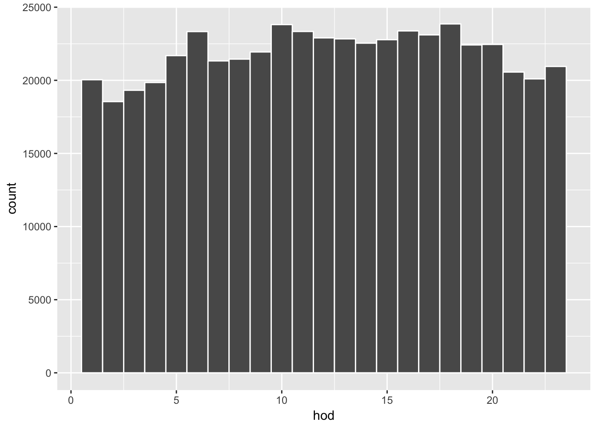


```r
# a summary by month of day and hour of day.
# e.g, Jan-1am, ..,Jan-12pm, Feb-1am,..., Feb-12pm, ...   
n_month_hour <- deaths08 %>%
  group_by(mod, hod) %>%
  summarise( nobs = n() )

n_month_hour %>%
  ggplot(aes(x = hod, y = nobs, color = as.factor(mod))) + 
  geom_point() 
```

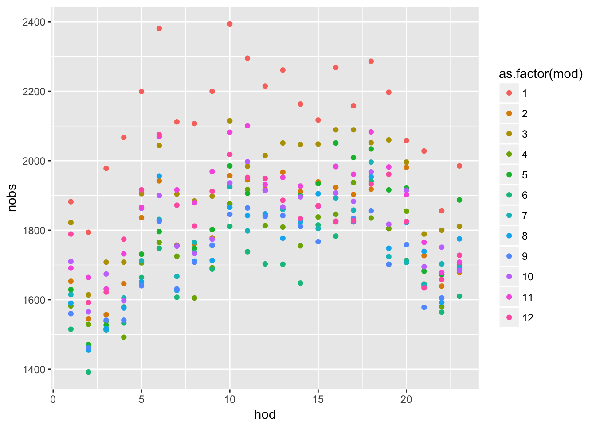

```r
# "last_plot() + " allows for adding more layers to the previous plot
last_plot() + geom_line()
```

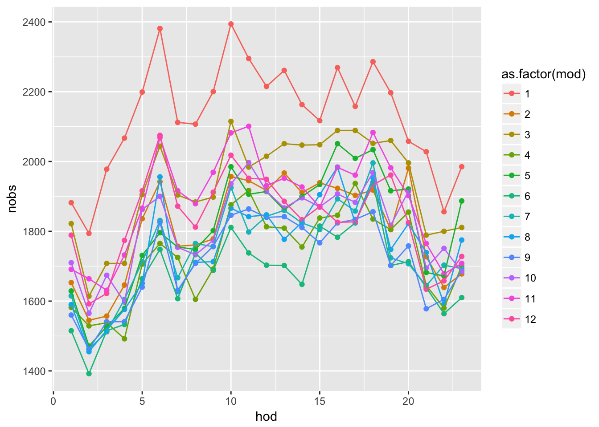
 

### Exercise {-}

Now it is your turn. The exercise is to reproduce the above results for the unusual causes of deaths. 

1. Download materials: [case study paper](http://vita.had.co.nz/papers/tidy-data.html) and [case study data](https://github.com/kotamine/piecemealR/raw/master/tidy_case_study/tidy_case_study.RData)

2.  Set working directly: `setwd(your_directory)`

3. Load libraries: `library(dplyr)`, `library(ggplot2)`, `library(MASS)` (used for fitting data by robust regression)

* Note 1: There is a minor error in the case study where the author accidentally kept several records of data from years other than 2008. This has virtually no effect on the results, and we are seeking to produce the same results as that case study.     

* Note 2: You could look at the code in the paper for hints. However, the code is written with the functions of [plyr](https://cran.r-project.org/web/packages/plyr/index.html) package, or the predecessor of `dplyr`. Do not load both `plyr` and `dplyr` libraries in the same R session; they do not seem to have good compatibility. Restart R if you accidentally loaded both.  

#### Part A. Display overall hourly deaths {-}

We will reproduce:


Hints:

* Filter `NA` in the hour of day (hod) variable

* Use `group_by()`,  `summarise()`, `n()` to obtain death counts by group

* Use `ggplot() + geom_line()` to produce plot  

* Use `+ labs( x = "x lable", y = "y label")` for axis labels

* see help file of `scale_y_continous()` for comma (use `?function_name` for help) 


#### Part B. Count deaths per hour, per disease {-}

We will reproduce: 

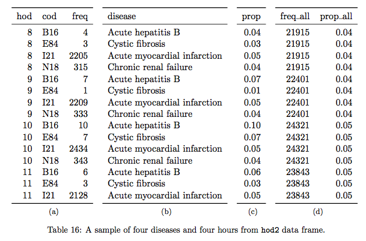
<!--
<figure>

</figure>
-->

Panel (a) of the table contains the frequency (i.e. the number of rows) for each combination of hour of day (hod) and cause of death (cod), supplemented by the disease description in panel (b). Panel (c) shows the proportion (prop) of each hod-cod combination in the total deaths by the cod. Panel (d) contains the frequency and proportion (freq_all and prop_all) of the deaths by hour of day.  

That is, panel (a) is the raw counts (e.g., frequency) of observations by **each pair** of hour of day (hod) and cause of death (cod), and panel (b) makes it easy to see the cause of death (cod). Panel (c) converts this frequency of *hod-cod pair* into the relative frequency within the total frequency of **cod**, so that we see at which **hour** a disproportionately large number of deaths occurs for  **cod**. Panel (d), on the other hand, presents the overall hourly death rates; if every hour has the same probability of death, we would see prop_all $\approx$ 0.042 (i.e., 1/24). Here, we see the author's idea of identifying "unusual deaths" by looking at how "prop" of each **hod-cod pairs** deviates from "prop_all" (see figure \@ref(fig:unusual-big)).  


Hints for creating panel (a) 

* Use more than one variable in `group_by()` 

* Use `summarise()` with `n()` to obtain death counts by group

Hints for creating panel (b)

* Use `left_join()` to add the information from dataset `codes` 

Hints for creating panel (c)

* Use `mutate()` with `sum()` on the joined dataset 

Hints for creating panel (d) 

* Create a new data frame by using `summarise()` on the joined and mutated data frame. `summarise()` will reduce the dimension of the data frame to its summary, which is the basis of panel (d). Once the desired summary is created, merge it to the data frame of panels (a)-(c).

* Before using `summarise()` above, use `group_by()` to specify new grouping

* First create `freq_all` variable via `summarise()` with `n()` and then create `prop_all` variable via `mutate()` with `sum()` (call this data frame `overall_freq`, which will be used again at the very end)  

* Use `left_join()` to join panels (a)-(c) and panel (d) (`overall_freq`), which we refer to as `master_hod` data frame.  

Hints for extracting the same rows as in the Table 16 above 

* Create a subset of the `master_hod` data under a new name 

* Use `filter()` to select  `cod` being either  "I21", "N18", "E84", or "B16" and `hod` being greater or equal to 8 and smaller or less than 11

* Use `select()` to pick columns in a desired order and `arrange()` to sort


#### Part C. Find outliers {-}

We will reproduce: 


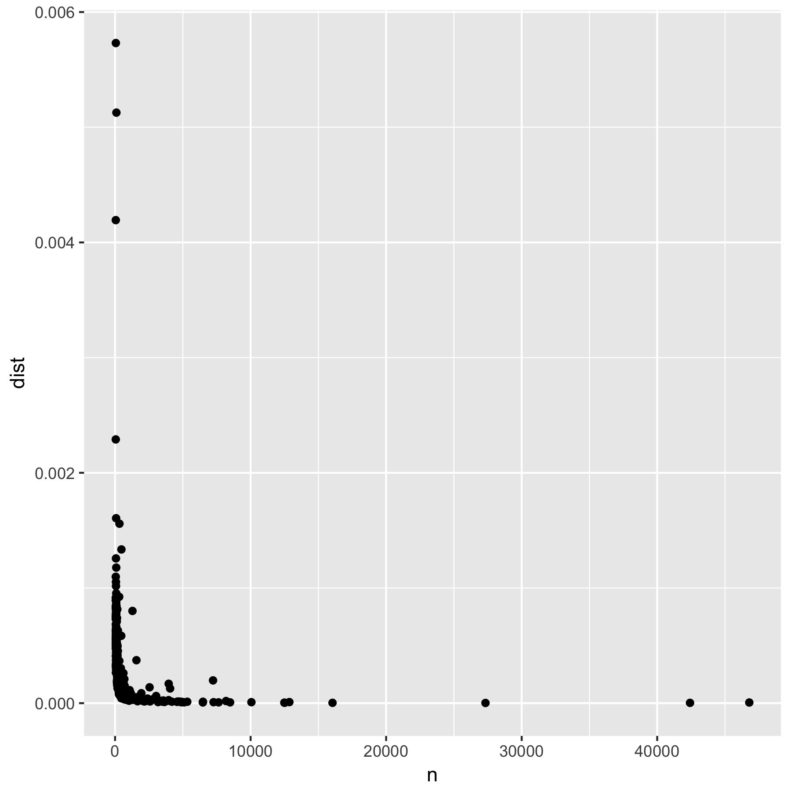
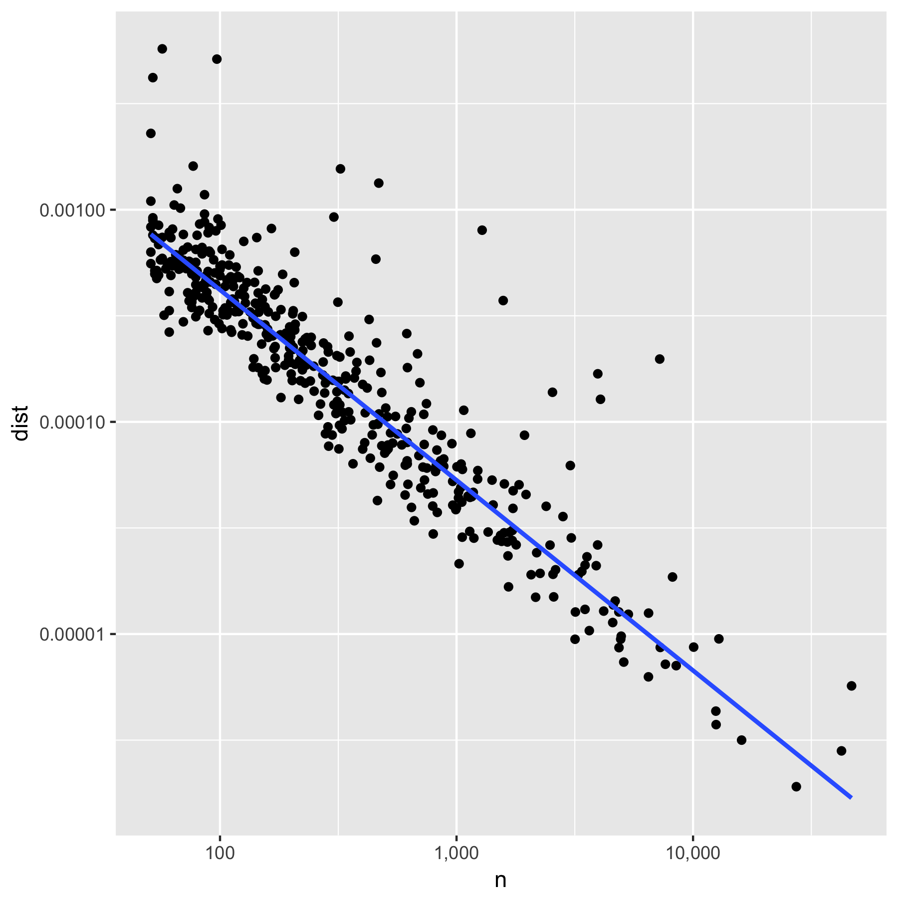

<!--

-->

We will create a deviation variable named `dist` by taking the mean of squared differences between `prop` and `prop_all`. The above figures show the the number of observations `n` and this distance measure `dist` by cause of death in the raw scale (left) and in the log scale (right).     

This is the author's linear model that describes how each cause of death tends to exhibit a similar pattern of hourly death rates with the overall pattern.  Once the model is defined, we can define "outliers", which do not follow the model's prediction. 

Hints

* Use `group_by()` and `summarise()` on the `master_hod` data frame to generate `n` with function `sum()` and `dist` by `mean((prop - prop_all)^2)`

* Filter this summary for `n > 50` and call it `devi_cod` (deviations by cause of death)

* Use `ggplot() + geom_point()` with  `data = devi_cod` to produce the raw-scale figure 

* Additionally use `scale_x_log10()`, `scale_y_log10()`, and `geom_smooth(method = "rlm", se = FALSE)` to produce the log-scale figure 

* See help for `scale_x_log10()` to adjust axis labels (look for "comma")

* Technically speaking, we should change the axis labels to indicate the logarithmic transformation, but we skip it here.  

* Let's not worry about  reproducing the exact grids as they appear in the paper


#### Part D. Fit data by a regression and plot residuals {-}

We will reproduce:

<!--
<figure>
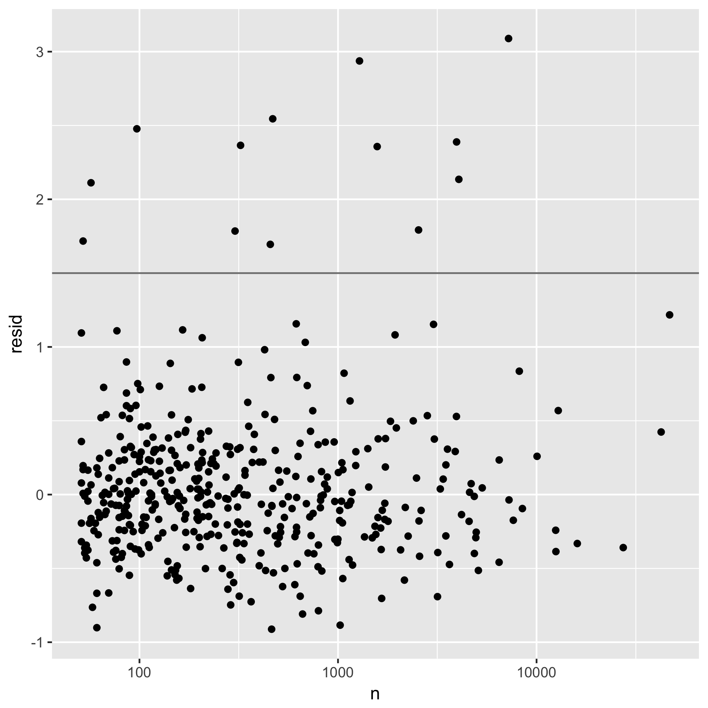
</figure>
--> 


The figure is a plot of the regression residuals `resid` of `log(dist)` on `log(n)`. By visual inspection, the points lying above the horizontal line at `resid=1.5` are considered to be "unusual causes of deaths" by the author.

Here the author used the robust linear model (`rlm()`) regression, but the syntax is mostly the same as that of the standard linear model regression (`lm()` ).  

Here is an example of regression by `lm()`. 


```r
df <- data.frame(
  x1 <-  c(1:10),
  y1 <-  c(1,3,2,4,6,5,7,5,7,8)
)

df %>% 
  ggplot(aes(x = x1, y = y1)) + geom_point() +
  geom_smooth(method = "lm", se = FALSE)
```

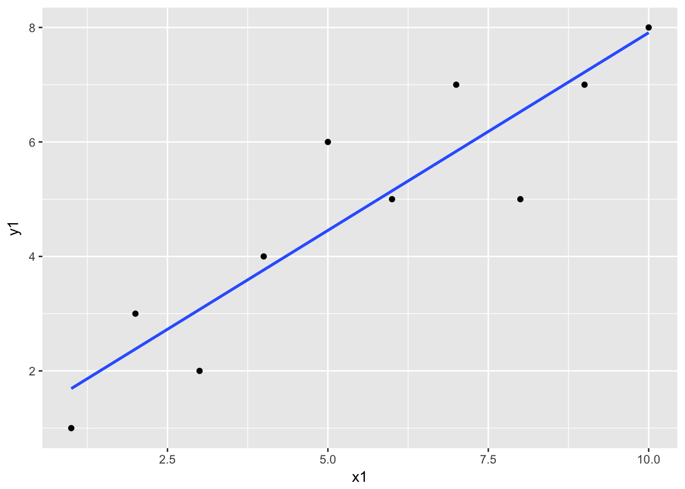

The `geom_smooth()` is estimating the following linear regression:
$$ y1 = intercept + coefficient * x1 + residual$$
The model is estimated by `lm()` as follows; 


```r
f1 <- lm(formula = y1 ~ x1,  data = df) 
```

Now let's see what we get out of the estimation results `f1`. 


```r
class(f1)    # class "lm"
```

```
## [1] "lm"
```

```r
summary(f1)  # summary() knows how to summarise an object of class "lm" 
```

```
## 
## Call:
## lm(formula = y1 ~ x1, data = df)
## 
## Residuals:
##      Min       1Q   Median       3Q      Max 
## -1.52727 -0.57273 -0.02727  0.52273  1.54545 
## 
## Coefficients:
##             Estimate Std. Error t value Pr(>|t|)    
## (Intercept)   1.0000     0.6924   1.444 0.186656    
## x1            0.6909     0.1116   6.192 0.000262 ***
## ---
## Signif. codes:  0 '***' 0.001 '**' 0.01 '*' 0.05 '.' 0.1 ' ' 1
## 
## Residual standard error: 1.014 on 8 degrees of freedom
## Multiple R-squared:  0.8273,	Adjusted R-squared:  0.8058 
## F-statistic: 38.34 on 1 and 8 DF,  p-value: 0.0002618
```

```r
coefficients(f1)  # coefficient point estimate
```

```
## (Intercept)          x1 
##   1.0000000   0.6909091
```

```r
vcov(f1)          # coefficient variance-covariance matrix
```

```
##             (Intercept)          x1
## (Intercept)  0.47939394 -0.06848485
## x1          -0.06848485  0.01245179
```

```r
predict(f1)       # predicted (fitted) values with the estimated coefficients 
```

```
##        1        2        3        4        5        6        7        8 
## 1.690909 2.381818 3.072727 3.763636 4.454545 5.145455 5.836364 6.527273 
##        9       10 
## 7.218182 7.909091
```

```r
resid(f1)         # residuals:  
```

```
##           1           2           3           4           5           6 
## -0.69090909  0.61818182 -1.07272727  0.23636364  1.54545455 -0.14545455 
##           7           8           9          10 
##  1.16363636 -1.52727273 -0.21818182  0.09090909
```

Now let's get back to our exercise and reproduce the figure above. 

Hints 

* Run a regression by `rlm` with `formula = log(dist) ~ log(n)` and store the residuals in `devi_cod` data. To read more about linear regressions, see the help file of `lm()` (type `?lm`).  For adding a column of residuals, you can use assignment `devi_cod$resid <- your_residuals`.  

* Plot the residual against log-scale `n` 

* Note: Check the dataset `devi_cod` for missing values of `dist` and `n` before running a regression (you should not have missing values in this case).  Most regression functions, including `lm()` and `rlm()`, drop any row with missing values from the estimation. This becomes an issue if we want to add a new column containing predicted values or residuals to the original dataset. (When rows containing missing values are dropped, the vector generated by `predict()` or  `resid()` will be shorter than the number of rows in the original dataset.)      

* Use `ggplot() + geom_point()` structure for the plot

* Add  `+ scale_x_log10()` and `+ geom_hline(yintercept = 1.5)` 


#### Part E. Visualize unusual causes of death {-}

We will reproduce:

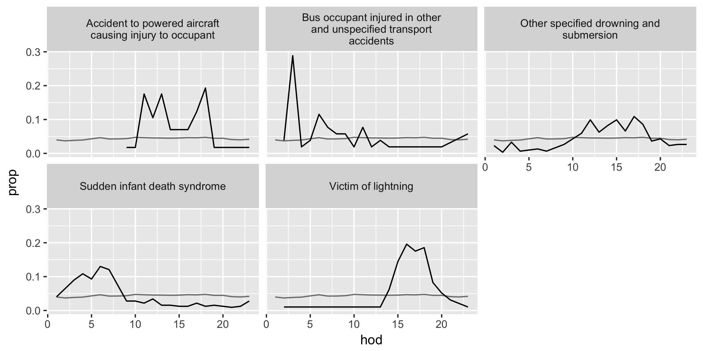
<!--
<figure>


</figure>
--> 

The first figure is the unusual causes of deaths in `devi_cod` with a relatively large number of deaths  (`n > 350`) and the second is that of a relatively small number of deaths (`n <= 350`). 

Hints

* Using the cut-toff value `resid > 1.5`, filter `devi_cod` and call it `unusual` data frame. Join `master_hod` and `unusual` data frames. Then create two subsets of data with conditions  `n > 350` and `n <= 350`.  

* Use `ggplot() + geom_line()` structure with `+ facet_warp(~ disease, ncol = 3)` 

* To include the overall hourly proportions of deaths (`prop_all`) representing the average of all causes of deaths in a given hour, add another layer by `geom_line(aes(...), data = overall_freq)` with a local `aes()` argument and a data argument. With the data argument, variables in another data frame can be combined (assuming the axes have the same measurements), and here we use the `overall_freq` data frame from the panel (d) portion of Table 16 above.  

* `last_plot() %+% another_data_frame `  reproduces a plot of the same structure with a different data frame


### The Key {-}

<a href="tidy_case_study/04_01_key.nb.html">Click here</a>

<!--

[Solution using dplyr](https://github.com/kotamine/piecemealR/blob/master/tidy_case_study/tidy_case_study.R)

[Solution using plyr](https://github.com/kotamine/piecemealR/blob/master/tidy_case_study/tidy_case_study_plyr.R)

-->

### Reflections {-}

Let's recap. The author (Wickham) investigates the temporal pattern of death in Mexico to find the causes of death that have unusual temporal patterns within a day.  Here are the five steps used in his approach. 

* A. Visualize the overall hourly frequency of death within a day 

* B. Construct variables to compare the relative frequency of death per hour per cause with the overall hourly death rate

* C. Plot the data to identify a general relationship among key variables 

* D. Create a linear model (i.e., data point = model prediction + residual)

* E. Visualize the temporal pattern of the "unusual" cases, or the causes of death that have relatively large residuals  

In a typical application, it will be unlikely that these steps can be followed in order. Most likely, we will have to go back and forth between these steps to define variables, visualize data, and refine a model till we reach the final results. Also, the purpose of creating a model may vary from making predictions to identifying certain parameters or outliers. However, the thought process and techniques in the above exercise will be applicable to many situations of data analysis.               


Just in case you need to see more examples, here are additional `dplyr` tutorials.  

* [100 Free Tutorials for Learning R](http://www.listendata.com/p/r-programming-tutorials.html)

* [RPubs - Data Processing with dplyr &amp; tidyr](https://rpubs.com/bradleyboehmke/data_wrangling)

* [Discovering Python & R](https://pythonandr.com/2015/12/17/data-manipulation-in-r-with-dplyr-part-1/)

* [Aggregating and analyzing data with dplyr](http://tracykteal.github.io/R-genomics/04-dplyr.html)

* [genomics class dplyr tutorial](http://genomicsclass.github.io/book/pages/dplyr_tutorial.html)

* [dplyr Tutorial (With 50 Examples)](http://www.listendata.com/2016/08/dplyr-tutorial.html)


