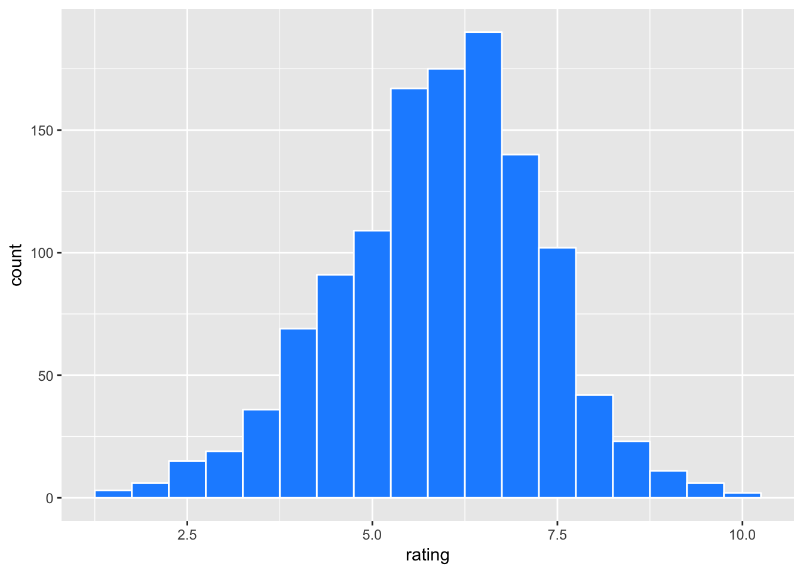
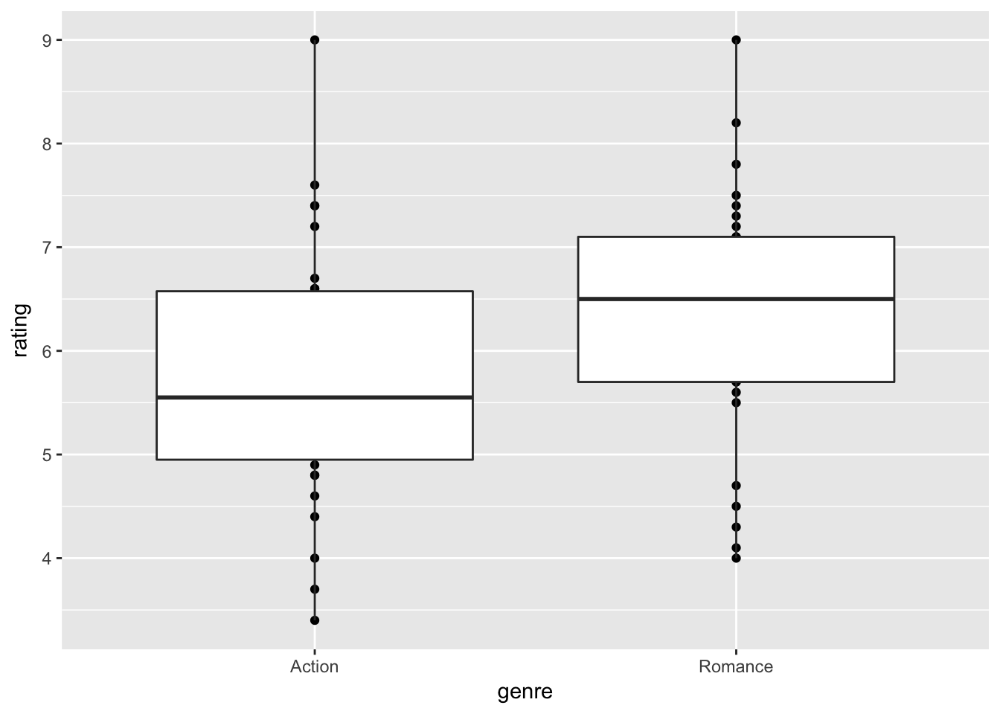
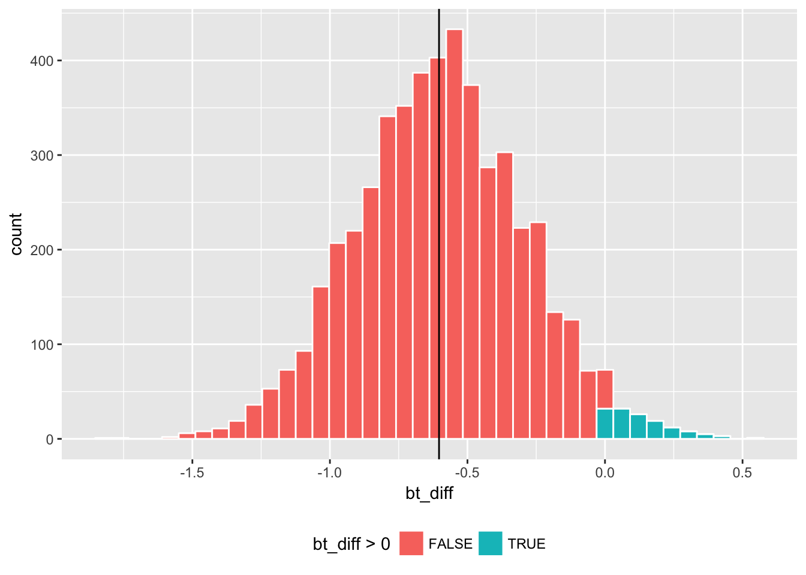
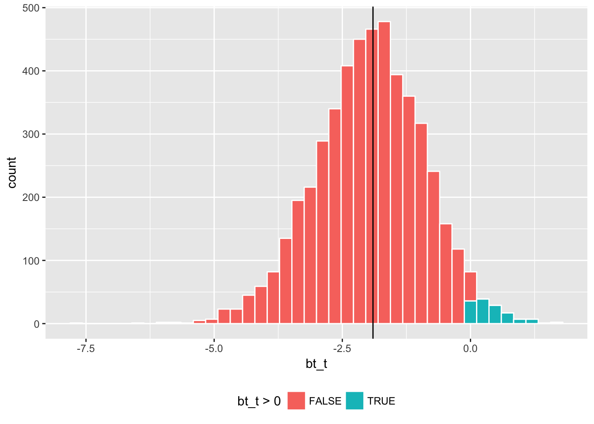
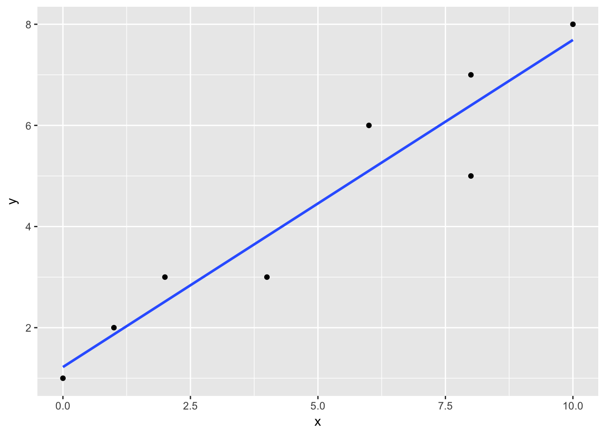

<!--  --- -->
<!-- title: "Random Sampling, Bootstrapping, and Linear Models" -->
<!-- # output: html_notebook -->
<!-- --- -->

## Action, Romance, and Chicks {#boot}


### Materials {-}

This session covers brief introductions to **t-test**, **bootstrapping**, and **linear regressions**. Learning these concepts in the same context will help you see how they are related to each other. 

We will use a dataset on movies.  

```r
library(ggplot2movies)
movies2 <- movies %>% dplyr::select(title, year, budget, rating, Action, Romance) %>% 
   filter((Action ==1 | Romance ==1),
          !( Action == 1 & Romance == 1), 
          budget > 0, year >= 1970) %>% 
  mutate(budget = budget/10^6) 
summary(movies2)
```

```
##     title                year          budget            rating     
##  Length:1206        Min.   :1970   Min.   :  0.001   Min.   :1.500  
##  Class :character   1st Qu.:1992   1st Qu.:  3.500   1st Qu.:5.025  
##  Mode  :character   Median :1998   Median : 15.000   Median :6.000  
##                     Mean   :1996   Mean   : 27.549   Mean   :5.902  
##                     3rd Qu.:2002   3rd Qu.: 40.000   3rd Qu.:6.800  
##                     Max.   :2005   Max.   :200.000   Max.   :9.800  
##      Action          Romance      
##  Min.   :0.0000   Min.   :0.0000  
##  1st Qu.:0.0000   1st Qu.:0.0000  
##  Median :1.0000   Median :0.0000  
##  Mean   :0.5887   Mean   :0.4113  
##  3rd Qu.:1.0000   3rd Qu.:1.0000  
##  Max.   :1.0000   Max.   :1.0000
```

The extracted data `movies2`  contain IMDB ratings of Action and Romance movies (excluding those of both Action and Romance genres) that are released between 1970 and 2005 and have known budgets.  Action and Romance movies are about 59% and 41% of the data respectively. The average rating is 5.9.    

Let's look at the distribution of the release years and ratings in this dataset. 

```r
movies2$year %>% table
```

```
## .
## 1970 1971 1972 1973 1974 1975 1976 1977 1978 1979 1980 1981 1982 1983 1984 
##   12   10   11    8   11    7    9   10    7    4   11   16   10    8   13 
## 1985 1986 1987 1988 1989 1990 1991 1992 1993 1994 1995 1996 1997 1998 1999 
##   27   17   18   15   22   22   19   20   30   32   51   55   64   77   64 
## 2000 2001 2002 2003 2004 2005 
##   80   94  110  103  103   36
```
We see that more data are available for years 1999-2004 than other years.  


```r
movies2 %>% ggplot(aes(x=rating)) + 
  geom_histogram(binwidth = 0.5, color = "white", fill = "dodgerblue")
```



The distribution of rating is somewhat skewed to the left. 

Let's see how Action and Romance movies compare. 

```r
movies2 <- movies2 %>% mutate(genre = ifelse(Action==1, "Action", "Romance"))
movies2 %>% ggplot(aes(x=rating)) + 
  geom_histogram(binwidth = 0.5, color = "white", fill = "dodgerblue") + 
  facet_grid(genre ~ .)
```


```r
movies2 %>% group_by(genre) %>% 
  summarise(mean = mean(rating),
            sd = sd(rating),
            n = n())
```

```
## # A tibble: 2 × 4
##     genre     mean       sd     n
##     <chr>    <dbl>    <dbl> <int>
## 1  Action 5.729859 1.419404   710
## 2 Romance 6.147581 1.262879   496
```

Romance genre gets a slightly higher average rating than the Action.  For the sake of discussion, suppose that `movies2` is the **population** (or the **universe**) of our movie data, meaning that *it contains all possible observations (movies) that fit our criteria* (i.e. Action or Romance movies released in 1970-2005 with known budgets). Then, the *population* mean ratings for Action and Romance movies are 5.73 and 6.15 respectively. 

Now consider a sampling world. In almost all situations, the researcher does not have **population data** and has to work with a **sample** drawn from the population. Knowing that what we have is *only a sample*, we make **statistical inferences** for the property of the population. For example, using a sample of Action and Romance movies, we can compare their average ratings to see if one genre has a higher rating than the other at a certain statistical significance.          

Let's create our sampling world. Here we randomly draw 30 observations from each genre and calculate summary statistics. 


```r
set.seed(2017)  # Fix a starting point of random number generations for reproducibility 

movie_sample <- movies2 %>% 
  group_by(genre) %>%
  sample_n(30)

movie_sample %>% ggplot(aes(x=rating)) + 
  geom_histogram(binwidth = 0.5, color = "white", fill = "dodgerblue") + 
  facet_grid(genre ~ .)
```


```r
movie_sample %>% group_by(genre) %>% 
  summarize(mean = mean(rating),
            std_dev = sd(rating),
            n = n()) %>% kable()
```


genre          mean    std_dev    n
--------  ---------  ---------  ---
Action     5.730000   1.248489   30
Romance    6.333333   1.208114   30

Here is an another view;

```r
movie_sample %>% ggplot(aes( x = genre, y = rating)) + geom_point() + geom_boxplot()
```



To compare the mean ratings between genres, a common practice is to test the equality of means, say $\mu_A$ and $\mu_R$ for Action and Romance movies respectively. 

The null and alternative hypotheses are:

$H_0:  \mu_A = \mu_R$ (equivalently,  $\mu_A - \mu_R = 0$)

$H_A:   \mu_A \neq \mu_R$


<!--### Arts & Crafts {-}-->

### t-test {-}
Here are some  fundamental building blocks of statistics. Let $y_{i}$ is an *independently and identically distributed (i.i.d.)* random variable for observation $i = 1, .., N$  drawn from some distribution with population mean $\mu = E[y_i]$ and standard deviation $\sigma = \sqrt{E[(y_i - \mu)^2]}$ where $E[.]$ is an expectation operator over the random variable.  The sample mean and standard deviation of $y_{i}$ are defined as 
$$\bar{y} = \frac{\sum_i y_i}{N}, \quad  s =\sqrt{\frac{\sum_i (y_{i} - \bar{y})^2}{(N-1)}}.$$

So, we take the average  $\bar{y}$, which serves as an unbiased estimate of $\mu$. Yet, how close is $\bar{y}$ to $\mu$?  The statistical theory gives us a probabilistic answer for the inferences about population mean $\mu$.  For example, if we know that $y_i$ is *normally distributed*  with  mean $\mu$ and standard deviation $\sigma$, then it follows that the sample mean $\bar{y}$ is normally distributed with mean $\mu$ and standard deviation $\sigma/\sqrt{N}$.  The distribution of an estimate like this is called **sampling distribution**, and in special cases it is exactly known.  With *known* $\mu$ and $\sigma$, we know how fast the sample mean $\bar{y}$ probabilistically approaches to the population mean $\mu$ as the sample size  $N$ increases.  This is done by calculating the z-statistic        
$$z = \frac{\bar{y} - \mu}{\sigma/\sqrt N}$$

and comparing it to **the standard normal distribution** table. In other words, we don't just look at $\bar{y}$; we look at the relationship of $\bar{y}$, $\mu$,  $\sigma$,  and $N$ as described in the z-statistic, for which the shape of the distribution is known. This allows us to calculate the probability that the sample mean in the next random sample could be greater or smaller than observed $\bar{y}$. To put it differently, we can infer how representative observed $\bar{y}$ would be if we were to repeat random samples of size $N$ and calculate the mean many times.   

In most situations, we do not know $\mu$ or $\sigma$ of the population, and we would not be sure whether the underlying distribution is really normal. But, that's okay. We can still make statistical inferences for the population mean $\mu$. 

Under some regularity conditions (e.g. the existence of a finite mean and variance of the random variable), the **Central Limit Theorem** tells us that regardless the underlying distribution, the sampling distribution of $\bar{y}$ is *approximately normal*. 

In a world with *unknown* $\mu$ or $\sigma$, we approximate the standard normal distribution with **a Student's t distribution**. The  t-statistic is calculated as 
$$t = \frac{\bar{y} - \mu}{s/\sqrt N}$$

where $s$ is the consistent estimate of $\sigma$, and we compare it to the t distribution table at $N-1$ degrees of freedom (one degree of freedom is reduced for the estimate $s$).  The Student's t distribution is fatter-tailed than the standard normal distribution (due to the *estimated standard error* on the denominator), but it approaches to the standard normal distribution as the sample size $N$ increases.  For given significance level $\alpha$, the $1-\alpha$ confidence interval is 

$$t_{N, 1-\alpha/2} \le \frac{\bar{y} - \mu}{s/\sqrt N} \le t_{N, \alpha/2}$$

where $t_{N, 1-\alpha/2}$ and  $t_{N, 1-\alpha/2}$ are the lower and upper bounds of the t-statistic and are found in the t-distribution table. Since the t-distribution is symmetric,  $- t_{N, 1-\alpha/2} = t_{N, 1-\alpha/2}$. For example, at $\alpha=0.05$ and $N>1000$, we have $t_{N, 1-\alpha/2} \approx -1.96$ and $t_{N, 1-\alpha/2}=1.96$.  Thus, for a large $N$, the confidence interval of $\mu$ is given by         
$$ \bar{y} -  1.96 \:\: s/\sqrt{N} \le  \mu \le \bar{y} + 1.96 \:\: s/\sqrt{N}.$$ 

Let's get back to the comparison of ratings between genres. How do we test our hypothesis $\mu_A = \mu_R$?  Intuitively, we can make estimates of $\mu_A$ and $\mu_R$ by the corresponding sample means $\bar{y}_A$ and $\bar{y}_R$. Then, it's a matter of making statistical inferences about $\bar{y}_A - \bar{y}_R$ for how close they would be to $\mu_A - \mu_R$. We calculate the t-statistic of $\bar{y}_A - \bar{y}_R$ and infer the probability of rejecting $H_0: \mu_A - \mu_R = 0$.  

Let $\bar{y}_{A}$ and $s_A$ be the sample mean and standard deviation of ratings for Action movies and $\bar{y}_{R}$ and $s_R$ be those for Romance movies. A typical approach called Welch's t-test statistic uses 
$$t = \frac{\bar{y}_A - \bar{y}_R}{s_\Delta}$$

where 
$$s_\Delta = \sqrt{\frac{s_A^2}{N_A} + \frac{s^2_R}{N_R}}$$ 

is sort of a joint standard deviation of $y_{iA} - y_{iR}$. Its degree of freedom has a somewhat complicated form but is approximately $(N_A-1) + (N_R-1)$ in many situations. For your information (not need to memorize), it is formally given as 
$$d.f. = \frac{s^2_\Delta}{(s_A^2/N_A)^2/(N_A - 1) + (s_R^2/N_R)^2/(N_R - 1) }.$$ 

 
The Welch's t-test statistic can be manually calculated as follows.    

```r
#  Welch's t-stat for the mean difference of two groups 
mean_ratings <- movie_sample %>% group_by(genre) %>%
  summarize(mean = mean(rating), sd = sd(rating))

sample_diff <- mean_ratings$mean[1] - mean_ratings$mean[2]
sample_diff_sd <- sqrt(mean_ratings$sd[1]^2/30 + mean_ratings$sd[2]^2/30)  # N = 30
sample_t <- sample_diff/sample_diff_sd

c(sample_diff, sample_diff_sd, sample_t) 
```

```
## [1] -0.6033333  0.3171889 -1.9021261
```
The observed mean difference is -0.603, for which the t-statistic is -1.902 at approximately 58 degrees of freedom.  

Let's visualize this t-statistic against its theoretical distribution, which can be approximated by many random draws from the Student's t distribution. 


```r
many_t_df58 <- data.frame(t = rt(10^6, 58))  
    # one million random draws from t-dist with 58 d.f. 
many_t_df58 %>% ggplot(aes(x=t)) + geom_histogram(color='white', binwidth = 0.1) + 
  geom_vline(xintercept = sample_t) # add vertical line at -1.902
```


The t distribution is centered at zero and has symmetric tails. We can think of the area of each bar representing the probability that a random draw of t-stat falls in that bin, and the total area of bars on the left of our t-statistic (-1.902) represents the probability that a random draw of t-stat is smaller than -1.902.  

By applying the two-tail t test, we can calculate the probability that a random draw of t-stat is more extreme than our t-statistic  (i.e., being located toward either of the tails);   

```r
nrow(subset(many_t_df58, abs(t)>= abs(sample_t)))/nrow(many_t_df58)
```

```
## [1] 0.061964
```

Let's visualize this probability; 

```r
many_t_df58 %>% ggplot(aes(x=t)) + geom_histogram(color='white', binwidth = 0.1) + 
  geom_histogram(data = subset(many_t_df58, abs(t)>= abs(sample_t)), 
                 color='white', fill="red", binwidth = 0.1) +
  geom_vline(xintercept = sample_t)
```


where the highlighted area represents the probability of **type I** error, or the rejection of the null hypothesis $H_0$ when it is in fact true, and represents the  **p-value** (0.062 in this case). If we set our tolerance level for making a type I error at the probability of 10% or less ($\alpha = 0.1$), we conclude that we *reject the null hypothesis $H_0$* (i.e., a finding of a statistically significant difference in ratings between Action and Romance genres) since the p-value is smaller than $\alpha$. If we set our tolerance level at $\alpha = 0.05$, we *fail to reject $H_0$* (no statistically significant effect).       

We can visualize how the probability of rejections (called **rejection regions**) associated with $\alpha = 0.1$ (orange below) and $\alpha = 0.05$ (green) compare to our t-statistic;   

```r
many_t_df58 %>% ggplot(aes(x=t)) + geom_histogram(color='white', binwidth = 0.1) + 
  # rejection regions with critical val for a = 0.1
  geom_histogram(data = subset(many_t_df58, abs(t)>= abs(qt(.95,58))),  
                 color='white', fill="orange", binwidth = 0.1) +
  # rejection regions with  critical val for a = 0.05
    geom_histogram(data = subset(many_t_df58, abs(t)>= abs(qt(.975,58))), 
                 color='white', fill="green", binwidth = 0.1) +
  geom_vline(xintercept = sample_t)
```


Now that we know what the Welch's t-test does, we can simply use R's function to conduct a t-test;   

```r
movie_sample %>% with(t.test( rating ~ genre ))  # using "formula" input
```

```
## 
## 	Welch Two Sample t-test
## 
## data:  rating by genre
## t = -1.9021, df = 57.937, p-value = 0.06213
## alternative hypothesis: true difference in means is not equal to 0
## 95 percent confidence interval:
##  -1.23827054  0.03160388
## sample estimates:
##  mean in group Action mean in group Romance 
##              5.730000              6.333333
```
Recall that we started with knowing that the population mean rating is slightly higher for Romance than for Action. Here, it seems reasonable that a random sample of 30 observations from each genre leads us to find a statistically significant difference at the 10% level.    

### Bootstrapping {-}

Now we will introduce a concept of **bootstrapping**.  Recall that our statistic, say $\bar{y}$, *conceptually* has its *distribution*, depending on the version of random sample that we happen to draw. The idea here is to mimic the process of having many versions of random samples through simulations, so that we generate *a simulated distribution* of the statistic. Then, we can make statistical inferences without invoking the statistical theory of the approximate distribution via the Central Limit Theorem.   

There are many ways to conduct bootstrapping. For simplicity, we will use some of the most common practices.    

First, we make many random draws of $y_{iA}$ and $y_{iR}$ from our sample `movie_sample`  with replacement (i.e., each time the drawn observation is put back into the pool). We can use `do()` from `mosaic` package and `sample_n()` from `dplyr` package.     

```r
set.seed(2017)

boot1 <- mosaic::do(5000) * # repeat the following expression ({...}) for 5000 times 
  ({  movie_sample %>% 
      group_by(genre) %>%
       # sample 30 obs from each genre with replacement
      sample_n(30, replace=TRUE) %>% 
      summarize(mean = mean(rating),
                sd = sd(rating),
                n =n()) %>% 
      data.frame()
  })

head(boot1)
```

```
##     genre     mean        sd  n .row .index
## 1  Action 5.536667 1.0473228 30    1      1
## 2 Romance 6.173333 1.3284508 30    2      1
## 3  Action 5.683333 1.3164957 30    1      2
## 4 Romance 6.760000 1.0682244 30    2      2
## 5  Action 5.630000 0.8317617 30    1      3
## 6 Romance 6.333333 1.1931799 30    2      3
```
The column `.index` shows the index of bootstrap replications, and the column `.row`  nested in `.index` gives the indicator of calculated results by genre  within each replication.      

Next, we calculate the bootstrap version of our estimates such as $\bar{y}_A - \bar{y}_R$ and Welch's t statistic. 

```r
boot1_w <-  boot1 %>% dplyr::select(-.row) %>%  # get rid of .row column 
  reshape(idvar= ".index", timevar="genre",     # reshape into a "wide-form" dataset 
           direction="wide")
head(boot1_w)
```

```
##    .index mean.Action sd.Action n.Action mean.Romance sd.Romance n.Romance
## 1       1    5.536667 1.0473228       30     6.173333   1.328451        30
## 3       2    5.683333 1.3164957       30     6.760000   1.068224        30
## 5       3    5.630000 0.8317617       30     6.333333   1.193180        30
## 7       4    5.480000 1.0768408       30     6.170000   1.303087        30
## 9       5    5.513333 1.1340295       30     6.293333   1.235937        30
## 11      6    5.950000 1.2601998       30     6.440000   1.131554        30
```

```r
boot1_w  <- boot1_w %>%
  mutate(
    bt_diff  = (mean.Action - mean.Romance),  # difference 
    bt_sd = sqrt(sd.Action^2/30 + sd.Romance^2/30),
    bt_t = bt_diff/bt_sd                # Welch's t-stat
    ) 
```

Here is how sample estimate `sample_diff` compares with the histogram of its bootstrap counterpart `bt_diff`.  

```r
boot1_w %>% 
  ggplot(aes(x = bt_diff, fill = bt_diff > 0)) +
  geom_histogram(color = "white", bins = 40) +
  geom_vline(xintercept = sample_diff) + theme(legend.position="top")
```



Here the `bt_diff` values that are greater than zero are marked by a different color since they suggest the opposite conclusion that the mean rating is higher for Action than for Romance.  Depending on the random draw of a bootstrap replication, one could have the opposite result in some of the times. The question is how often that happens.    

Using the bootstrap estimates, we can estimate the confidence interval in a few ways.  For example, to estimate a 95% confidence interval, one can take the 2.5th and 97.5th percentiles of the distribution shown above in the histogram. 

```r
# confidence interval
quantile(boot1_w$bt_diff, c(0.025, 0.975))  # version 1
```

```
##        2.5%       97.5% 
## -1.20333333  0.01333333
```

Another approach is to calculate a bootstrap standard deviation and apply $t_{df,\alpha/2} \le (\bar{y}_A - \bar{y}_R)/s_{bt} \le t_{df,1-\alpha/2}$ where $\bar{y}_A - \bar{y}_R$ is the mean difference in ratings between Action and Romance movies,  $s_{bt}$ is an estimate of the standard deviation of $\bar{y}_A - \bar{y}_R$, and $- t_{df,\alpha/2}=t_{df,\alpha/2}=2.00$ for the t distribution with 58 degrees of freedom.  Note that here  we do not need $\sqrt{N}$ in the confidence interval calculation (unlike the above discussion where $s$ was the standard deviation of rating $y_i$ instead of the standard deviation of the average).      

```r
sample_diff_sd_boot <- sd(boot1_w$bt_diff)
sample_diff_sd_boot 
```

```
## [1] 0.307742
```

```r
# version 2
c(sample_diff - 2.00 * sample_diff_sd_boot, sample_diff + 2.00 * sample_diff_sd_boot) 
```

```
## [1] -1.21881724  0.01215058
```

Recall that in the case of two-tail test, we would look for extreme values on both tails of the distribution. We can visualize this by centering the above graph at `sample_diff` and identifying the values that are farther from the center than sample estimate `sample_diff` is. In the previous plot, we drew a histogram of `bt_diff` with fill code `bt_diff > 0`.  By subtracting `sample_diff` and taking the absolute values, we have `bt_diff - sample_diff` with fill code `abs(bt_diff - sample_diff) > abs(sample_diff)`. Essentially, we are approximating the distribution of  $\bar{y}_A-\bar{y}_R  - (\mu_A -\mu_R)$  (`sample_diff` compared to the population difference) by the distribution of  $\bar{y}^*_A-\bar{y}^*_R  - (\bar{y}_A-\bar{y}_R )$  ( bootstrap estimate $\bar{y}^*_A-\bar{y}^*_R =$ `bt_diff` compared to `sample_diff`.   


```r
boot1_w %>% 
  ggplot(aes(x = bt_diff - sample_diff, 
             fill = abs(bt_diff - sample_diff) > abs(sample_diff))) +
  geom_histogram(color = "white", bins = 40) + theme(legend.position="top")
```


The centered histogram makes it easier to see whether our sample estimate `sample_diff` is representative; how closely are the bootstrap estimates centered around `sample_diff` and how do they spread?  In this sense, the areas of the extreme values correspond to the rejection regions for the two-tail t-test, and the middle part corresponds to the confidence interval. By taking the area of the rejection regions, we can estimate the p-value; 

```r
# p-value
boot1_w %>% with(sum(abs(bt_diff - sample_diff) > abs(sample_diff))/length(bt_diff))  
```

```
## [1] 0.0512
```
which represents the probability that a bootstrap estimate falls in either of the colored tails.   

Previously, we noted there are many ways to do bootstrapping. Another version here is to bootstrap Welch's t-statistic instead of the mean difference. An estimate in the form of t-statistic has a **pivotal quality**, meaning that the distribution of the statistic does not depend on unknown parameters. Welch's t-statistic follows the Student's t distribution with a given degree of freedom, which does not depend on any unknown parameter such as the population mean or variance. It may be recommended to use a pivotal statistic for bootstrapping.     

Here are the parallel results for bootstrapping Welch's t-statistic. 

```r
boot1_w %>% 
  ggplot(aes(x = bt_t, fill = bt_t > 0)) +
  geom_histogram(color = "white", bins = 40) +
  geom_vline(xintercept = sample_t) + theme(legend.position="top")
```



To convert a confidence interval of Welch's t-statistic $(\bar{y}_A - \bar{y}_R)/s_\Delta$  into a confidence interval of the difference in mean ratings $\bar{y}_A - \bar{y}_R$, we multiply the former by $s_\Delta=$ `sample_diff_sd `;   

```r
# confidence interval
quantile(boot1_w$bt_t, c(0.025, 0.975)) * sample_diff_sd  # version 1 
```

```
##        2.5%       97.5% 
## -1.31094136  0.01345958
```

```r
sample_t_sd_boot <- boot1_w %>% with(sd(bt_t - mean(bt_t)))  
# version 2
c(sample_t - 2.00 * sample_t_sd_boot, sample_t + 2.00 * sample_t_sd_boot)  * sample_diff_sd  
```

```
## [1] -1.27547455  0.06880788
```


```r
# centered at observed Welch's t-statistic
boot1_w %>% 
  ggplot(aes(x = bt_t - sample_t, fill = abs(bt_t - sample_t) > abs(sample_t))) +
  geom_histogram(color = "white", bins = 40) + theme(legend.position="top")
```


```r
# p-value 
boot1_w %>% with(sum(abs(bt_t - sample_t) > abs(sample_t))/length(bt_t))  
```

```
## [1] 0.0716
```

### Linear Models {-}

Let's extend our bootstrapping experiment to a regression framework. While we have not formally covered regressions in this site yet, we can develop an intuitive understanding on how they works.  

A simple form of linear regression is 
$$ y_i = a_0 + b_1 x_{i} + \varepsilon_i$$
where $y_i$ is the dependent variable of observation $i$, $x_i$ is an independent variable, $a_0$ and $b_1$ are parameters for  the intercept and the slope of $x$ to be estimated, and $\varepsilon_i$ is the residual error term. Depending on the assumption on the error term $\varepsilon_i$, we can run different models on the same equation.  Regardless, we are required to assume that the error $\varepsilon_i$ is uncorrelated with the independent variable $x_i$.       

Here is an example. By default, `lm()` assumes a set of the standard assumptions for the Ordinary Least Squares (OLS). 

```r
d0 <- data.frame( y = c(1, 3, 5, 2, 6, 7, 8, 3),
                  x = c(0, 2, 8, 1, 6, 8, 10, 4))

lm( y ~ x, data = d0) %>% summary()
```

```
## 
## Call:
## lm(formula = y ~ x, data = d0)
## 
## Residuals:
##     Min      1Q  Median      3Q     Max 
## -1.3966 -0.3683  0.2207  0.5145  0.8972 
## 
## Coefficients:
##             Estimate Std. Error t value Pr(>|t|)    
## (Intercept)   1.2213     0.5109   2.390 0.053994 .  
## x             0.6469     0.0856   7.557 0.000279 ***
## ---
## Signif. codes:  0 '***' 0.001 '**' 0.01 '*' 0.05 '.' 0.1 ' ' 1
## 
## Residual standard error: 0.8338 on 6 degrees of freedom
## Multiple R-squared:  0.9049,	Adjusted R-squared:  0.8891 
## F-statistic: 57.11 on 1 and 6 DF,  p-value: 0.0002787
```

Coefficient estimates are $a_0 = 1.2213$ and $b_1 = 0.6469$ with the standard errors of $sd(a_0) = 0.5109$ and $sd(b1) = 0.0856$, suggesting that the t-values of $2.390$ and $7.557$ for testing whether these coefficients are statistically different from zero, or $H_0: a_0=0$ and $H_0: b_1 =0$. The standard error for the residual is estimated with the assumption that $\varepsilon_i$ is *i.i.d.* normal with mean zero and some standard deviation $\sigma$. "Pr(>|t|)" shows the p-values of the coefficient estimates, and the statistical significance is indicated with symbols "\*\*\*", "\*\*" etc. Let's not worry about other metrics here.      

Let's visualize the above regression;

```r
d0 %>% ggplot(aes( x = x, y = y)) + geom_point() + geom_smooth(method = "lm", se=FALSE)
```


 
With only two variables, the plot like this gives us a clear picture of how the regression relates to the data points. The straight line is the fitted regression equation $\widehat{a}_0 + \widehat{b}_1 x_i$ where hat $\widehat{}$ notation represents an estimate, and the vertical distance (and its direction) from this line is the predicted residual $\widehat{\varepsilon_i}=y_i - \widehat{a}_0 + \widehat{b}_1 x_i$. The OLS estimates are **the best linear unbiased estimators (BLUE)**.      
 
Now, let $y_{ij}$ be the rating of movie $i$ in genre $j$ where $j$ is either $A$ (Action) or $R$ (Romance). Also, let $1(A)$ be the indicator function that takes a value of one if condition $A$ is true and zero otherwise. Then, we can formulate a linear regression equation to test the mean difference in movie ratings between Action and Romance as follows.  
$$ y_{ij} = b_A \: 1(j=A) + b_R \: 1(j=R) + \varepsilon_{ij}$$ 
where the means of Action and Romance movies are estimated as $b_A$ and $b_R$ respectively. Under the standard OLS assumptions, $b_A$ and $b_R$ are equivalent to the sample means (calculated by the usual summing and dividing by the number of observations), and the estimates of the variances for $\hat{b}_A$ and $\hat{b}_R$ are obtained by matrix algebra (which we will cover in a future session). 

For rotational brevity, this equation may be written as      
$$ y_{ij} = \alpha_j + \varepsilon_{ij}$$ 
where $\alpha_j$ is $\alpha_A = b_A$ for $j=A$ and $\alpha_R = b_R$ for $j=R$.  This model yields the following;  

```r
# "0 +" eliminates the intercept 
lm(rating ~ 0 + genre, data = movie_sample) %>% summary() 
```

```
## 
## Call:
## lm(formula = rating ~ 0 + genre, data = movie_sample)
## 
## Residuals:
##     Min      1Q  Median      3Q     Max 
## -2.3333 -0.6583 -0.1300  0.7942  3.2700 
## 
## Coefficients:
##              Estimate Std. Error t value Pr(>|t|)    
## genreAction    5.7300     0.2243   25.55   <2e-16 ***
## genreRomance   6.3333     0.2243   28.24   <2e-16 ***
## ---
## Signif. codes:  0 '***' 0.001 '**' 0.01 '*' 0.05 '.' 0.1 ' ' 1
## 
## Residual standard error: 1.228 on 58 degrees of freedom
## Multiple R-squared:  0.9615,	Adjusted R-squared:  0.9602 
## F-statistic:   725 on 2 and 58 DF,  p-value: < 2.2e-16
```

Note that the t-statistics test hypotheses $H_0: b_A = 0$ and $H_0: b_R = 0$, which differ from our interest, $H_0: b_A = b_R$.   


We can rewrite the above equation as   
$$ y_{ij} = a_0  + \beta_R \: 1(j=R) + \varepsilon_{ij}$$   

where $\beta_R = b_R - b_A$. Alternatively, 
$$ y_{ij} = a_0  + \alpha_j + \varepsilon_{ij}$$ 
where $\alpha_A$ serves as a reference group and hence is excluded from the coefficient estimates.   

This yields; 

```r
ols1 <- lm( rating ~ genre, data = movie_sample)  
summary(ols1)
```

```
## 
## Call:
## lm(formula = rating ~ genre, data = movie_sample)
## 
## Residuals:
##     Min      1Q  Median      3Q     Max 
## -2.3333 -0.6583 -0.1300  0.7942  3.2700 
## 
## Coefficients:
##              Estimate Std. Error t value Pr(>|t|)    
## (Intercept)    5.7300     0.2243  25.548   <2e-16 ***
## genreRomance   0.6033     0.3172   1.902   0.0621 .  
## ---
## Signif. codes:  0 '***' 0.001 '**' 0.01 '*' 0.05 '.' 0.1 ' ' 1
## 
## Residual standard error: 1.228 on 58 degrees of freedom
## Multiple R-squared:  0.05872,	Adjusted R-squared:  0.04249 
## F-statistic: 3.618 on 1 and 58 DF,  p-value: 0.06212
```

where the estimate of $\alpha_R$ is equivalent with the calculated difference `sample_diff`, and its t-statistic is approximately the same as `sample_t` above. The sign is switched since our estimate here is $b_R - b_A$ instead of $b_A - b_R$.  

The OLS output provides the estimate of standard errors for the coefficients based on the statistical theory like the output from Welch's t-statistic above.  Now we derive our estimate of standard errors by applying bootstrapping to the OLS model.   

In doing so, we create several functions here. The first two functions extract "formula" and the dependent variable from a `lm` class object.   

```r
getFormula <- function(model) gsub("()","", model$call[2])  # gsub() substitues characters
getFormula(ols1)
```

```
## [1] "rating ~ genre"
```

```r
getDependentVar <- function(model) {
  str <- getFormula(model) 
  gsub(" ","", substr(str, 1, (regexpr("~",str)[1]-1)))　 # substr() takes a substring
  }
getDependentVar(ols1)
```

```
## [1] "rating"
```

The next function takes a `lm` class object (i.e., a result by `lm()`) and the number of bootstrap replications for its inputs and produces bootstrap versions of the coefficient estimates as an output.  We assume that the distribution of $\varepsilon_i$ is a normal distribution with mean $0$ and variance $\hat{\sigma}^2$ where $\hat{\sigma} = \sum\widehat{\varepsilon}^2_i/(N-k)$ is the OLS estimate of $\sigma$ with $N-k$ degrees of freedom (Num. obs minus num. of parameters). Then, we can generate a bootstrapped dependent variable by combining the predicted part of the linear model $ \widehat{a}_0  + \widehat{\alpha}_j$ and an random draw of bootstrap error term $\varepsilon^b_i$, or  $y^b_{ij} =  \widehat{a}_0  + \widehat{\alpha}_j + \varepsilon^b_i$. In each bootstrap replication $b=1, .., B$, we replace $y_{ij}$  with its bootstrap counterpart $y^b_{ij}$ and run the OLS estimation, and we repeat this process for $B$ times (we set $B=5000$).    

```r
run_ols_boot <- function(lm_rlt, num_do = 5000) {
  
  # calculate the standard deviation of the residuals
  N <- length(lm_rlt$residuals)
  sd_res <- (sum(lm_rlt$residuals^2)/lm_rlt$df.residual) %>% sqrt()
  dep_var <- getDependentVar(lm_rlt)

  do(num_do) * 
    ({  
        data_bt <- lm_rlt$model
        # replace the dependent variable with its bootstrap counterpart
        data_bt[[dep_var]] <- lm_rlt$fitted.values +    #  the predicted component
          + rnorm(N, mean = 0, sd = sd_res)     #  random draws from the error distribution 
         
        # run the OLS model with the same formula but with a new, bootstrap dataset  
        ols_bt <- lm(as.formula(getFormula(lm_rlt)), data = data_bt)  
        coef(ols_bt)  # get coefficients 
    }) 
}

set.seed(2007)
# run bootstrap with our function 
bt_est_ols1 <- run_ols_boot(ols1, 5000) 
```

Let's compare the estimates of standard errors between the default OLS and our bootstrap results.  

```r
sample_ols1 <- tidy(ols1) # summary of the original OLS estimates 

bt_sd_ols1 <- apply(bt_est_ols1, 2, sd) # calculate bootstrap standard errors 
bt_ols1 <- cbind(coeff = sample_ols1$estimate, # copy the coeff from the OLS result
                 sd = bt_sd_ols1,              # use bootstrap standard errors
                 tstat = sample_ols1$estimate/bt_sd_ols1) 

# OLS estimates with statistical inferences by statistic theory
sample_ols1 
```

```
##           term  estimate std.error statistic      p.value
## 1  (Intercept) 5.7300000 0.2242864 25.547688 2.999063e-33
## 2 genreRomance 0.6033333 0.3171889  1.902126 6.212427e-02
```

```r
# OLS estimates with statistical inferences by bootstrapping
bt_ols1 
```

```
##                  coeff        sd     tstat
## Intercept    5.7300000 0.2262160 25.329774
## genreRomance 0.6033333 0.3231541  1.867014
```
In this case they are pretty close. 

Let's visualize this. 

```r
sample_Romance <- sample_ols1$estimate[2]
bt_est_ols1 %>% 
  ggplot(aes(x = genreRomance - sample_Romance, 
             fill = (abs(genreRomance - sample_Romance) >= abs(sample_Romance)))) +
  geom_histogram(color = "white", bins = 40) + theme(legend.position="top")
```


Here are estimates of the confidence interval and the p-value by bootstrapping. 

```r
# confidence interval by bootstrapping
quantile(bt_est_ols1$genreRomance, c(0.025, 0.975))  # version 1 
```

```
##        2.5%       97.5% 
## -0.01984114  1.24606817
```

```r
c('2.5%' = sample_Romance - 2.00 * bt_sd_ols1[2], 
  '97.5%' = sample_Romance  + 2.00 * bt_sd_ols1[2])   # version 2
```

```
##  2.5%.genreRomance 97.5%.genreRomance 
##        -0.04297487         1.24964154
```

```r
# p-value 
bt_est_ols1 %>% with(
  sum(abs(genreRomance - sample_Romance) > abs(sample_Romance))/length(genreRomance)
  ) 
```

```
## [1] 0.0604
```
These results are also very close to what we saw for the Welch's t-statistic and its bootstrap estimates above. 

Now let's get a bit deeper into the *modeling* aspect of the linear models.   

The regression allows us to utilize additional variables in the model. Let's try adding a linear effect of movie budget. It seems reasonable to hypothesize that the higher the budget, the better a movie can be since the director can hire famous actors and actresses and use expensive movie settings and computer graphics. Then, our estimation equation becomes      
$$ y_{ij} = a_0  + \alpha_j + \beta_1 \:budget_i + \varepsilon_{ij}.$$ 
   


```r
ols2 <- lm( rating ~ genre + budget,  data = movie_sample)
summary(ols2)
```

```
## 
## Call:
## lm(formula = rating ~ genre + budget, data = movie_sample)
## 
## Residuals:
##      Min       1Q   Median       3Q      Max 
## -2.20205 -0.69226 -0.07884  0.71999  2.92299 
## 
## Coefficients:
##              Estimate Std. Error t value Pr(>|t|)    
## (Intercept)  5.424309   0.304038  17.841   <2e-16 ***
## genreRomance 0.753435   0.330186   2.282   0.0263 *  
## budget       0.006944   0.004717   1.472   0.1465    
## ---
## Signif. codes:  0 '***' 0.001 '**' 0.01 '*' 0.05 '.' 0.1 ' ' 1
## 
## Residual standard error: 1.216 on 57 degrees of freedom
## Multiple R-squared:  0.09319,	Adjusted R-squared:  0.06137 
## F-statistic: 2.929 on 2 and 57 DF,  p-value: 0.06155
```
The new estimate of $\alpha_R$ is 0.753 with standard error 0.330. A common interpretation goes like this; the relative effect of Romance to Action genre on the movie rating is 0.753 at the 5% significance level, while controlling for the effect of movie budget. Note that the effect of budget itself is not statistically significant even at the 10% level, but having this variable allows for more robust results.  

Recall that an important assumption in regression analysis is that the error term is uncorrelated with independent variables. Here our model is using the assumption that 
$$E[\varepsilon_{ij} \:| \: genre_j,\: budget_i] = E[\varepsilon_{ij} ] = 0$$
where $E[v | u]$ denotes the conditional mean of $v$ given $u$.  It says that the information of $genre_j$ and $budget_i$ does not  affect the mean of the error distribution. There is no definitive way to test this assumption, so that has to hold at least *conceptually*.  The assumption may be violated in several ways. The most relevant case here is what is known as **omitted variable bias**; some unobserved attributes of the movie (which are conceptually a part of the error $\varepsilon_{ij}$) may be correlated with both $y_{ij}$ and $budget_i$.  

For example, many people think that the use of explosions make action movies more exciting and romance movies more dramatic. Then, suppose that the story taking place in the World War setting can increase the movie rating and also inflate the movie budget. In such a case, the OLS estimates could be biased via the omitted variable (an indicator for having a World War setting). In a future session, we will talk more about the potential sources of bias. Let's not worry about them here.   

The bottom line: every model is incorrect when applied to some real-world data, and the "error term" captures the difference. The correctness is always a matter of degree, and that's why we care about the error term; how big are its dispersion and its tails? is it systematically varying with independent variables? and so forth. Predicted error can be diagnosed for certain properties, yet the true error is essentially *conceptual*, for which some judgement on the side of the analyst is necessarily involved. This is why developing sound intuitions is crucial. It is no secret that the statistical modeling of real-world data is an art as much as a science. 

Okay, let's get back to our topic.  Now how about adding another variable to our model? The movies in the dataset were released between 1970 and 2005, during  which movie-goers' preferences or movie production costs may have shifted.  By accounting for a quadratic time trend, we estimate the following
$$ y_{ij} = a_0  + \alpha_j + \beta_1 \:budget_i + \beta_2 \: year_i  + \beta_3 \: year^2_i + \varepsilon_{ij}$$ 


```r
ols3 <- lm( rating ~ genre + budget + year + I(year^2),  data = movie_sample) 
  # I() allows the user to construct a new variable on the fly. 
summary(ols3)
```

```
## 
## Call:
## lm(formula = rating ~ genre + budget + year + I(year^2), data = movie_sample)
## 
## Residuals:
##      Min       1Q   Median       3Q      Max 
## -2.02921 -0.70194  0.03311  0.60606  3.00738 
## 
## Coefficients:
##                Estimate Std. Error t value Pr(>|t|)  
## (Intercept)   5.108e+03  7.024e+03   0.727   0.4701  
## genreRomance  7.918e-01  3.254e-01   2.434   0.0182 *
## budget        8.452e-03  4.700e-03   1.798   0.0776 .
## year         -5.087e+00  7.058e+00  -0.721   0.4741  
## I(year^2)     1.268e-03  1.773e-03   0.715   0.4776  
## ---
## Signif. codes:  0 '***' 0.001 '**' 0.01 '*' 0.05 '.' 0.1 ' ' 1
## 
## Residual standard error: 1.196 on 55 degrees of freedom
## Multiple R-squared:  0.1544,	Adjusted R-squared:  0.09288 
## F-statistic:  2.51 on 4 and 55 DF,  p-value: 0.05214
```

When accounting for the time trend, the coefficient for budget is statistically significant at the 10% level, and the residual standard error is slightly reduced from 1.216 to 1.196. That seems like an improvement, and the model equation looks sensible.  Now do we feel confident in our results?     

Let's see if we can do more to check the results.  We assumed a common quadratic time trend for Action and Romance movies. Let's take a step back and visualize the time trend in the data using `ggplot() + geom_jitter() + geom_smooth()`. By default `geom_smooth()` uses a flexible form to fit the relationship between x and y variables. 

```r
movie_sample %>% 
  ggplot(aes( x = year, y = rating, color = genre)) + geom_jitter() + geom_smooth(se =F)
```

```
## `geom_smooth()` using method = 'loess'
```


We immediately spot that in our sample, we only have a few movies from the 1970-1984 period. Also, we see that the time trend seems to be shifted around year 2000.  Let's set aside those older movies in our model.  Also, we can use our estimate $\hat{\beta_1}$ to control for the varying impacts of movie budget ($\hat{\beta_1} \: budget_i$), which we replace with the sample average ($\hat{\beta_1} \: E[budget_i]$). And here is an update;     

```r
movie_sample %>% filter(year >= 1985) %>%
  ggplot(aes( x = year, 
              y = rating - ols3$coefficients['budget']*(budget - mean(budget)), 
              color = genre)) + 
  geom_jitter() + geom_smooth(se =FALSE)
```

```
## `geom_smooth()` using method = 'loess'
```


We still see the shift in time trend around 2000, at which the trends between Action and Romance movies start to diverge. Year 2000 may be the beginning of increasing computer graphics usage due to its decreasing costs.  That could be a turning point, especially for Action movies.  

Now what can we do? 

Assigning different time trends for Action and Romance would be a possibility if our objective were to simply find the model that best fits the data. But, that may not be a good idea if we are interested in comparing the average ratings of the two genres. After all, the genre-specific time trend is a part of the difference between genres that we want to compare.  The best we could do seems that we let the time trend vary before and after 2000, while assuming the common trend for both genres.     

Here is a relatively simple solution.  
$$ 
\begin{align} 
\nonumber y_{ij} &= a_0  + \alpha_{j} + \beta_1 \:budget_i + \beta_2 \: year_i  + \beta_3 \: year^2_i 
\\ 
\nonumber &+ (a_{0,M}  + \alpha_{j, M} + \beta_{1,M} \:budget_i  + \beta_{2,M} \: year_i  + \beta_{3,M} \: year^2_i) \:M_i + \varepsilon_{ij} 
\end{align}
$$ 
where $M_i = 1(year_i\ge2000)$ is an indicator variable for post-millennium years. The items in parenthesis multiplied by $M_i$ are the interaction terms between the baseline variables and the millennium indicator. These additional terms captures the additional effects that only apply to post-millennium movies.  The interaction terms can be constructed with \* symbol in `lm()`.       

```r
ols4 <- lm( rating ~ genre*I(year>=2000) + budget*I(year>=2000) + 
              year*I(year>=2000) + I(year^2)*I(year>=2000),  
            data = subset(movie_sample, year>=1985))
summary(ols4)
```

```
## 
## Call:
## lm(formula = rating ~ genre * I(year >= 2000) + budget * I(year >= 
##     2000) + year * I(year >= 2000) + I(year^2) * I(year >= 2000), 
##     data = subset(movie_sample, year >= 1985))
## 
## Residuals:
##     Min      1Q  Median      3Q     Max 
## -1.8226 -0.6920 -0.1258  0.6058  3.5089 
## 
## Coefficients:
##                                    Estimate Std. Error t value Pr(>|t|)
## (Intercept)                      -1.649e+05  5.796e+04  -2.845 0.006515
## genreRomance                      1.801e+00  4.946e-01   3.642 0.000662
## I(year >= 2000)TRUE              -8.242e+04  4.076e+05  -0.202 0.840627
## budget                            1.448e-02  8.152e-03   1.776 0.082040
## year                              1.656e+02  5.820e+01   2.846 0.006498
## I(year^2)                        -4.159e-02  1.461e-02  -2.847 0.006482
## genreRomance:I(year >= 2000)TRUE -1.497e+00  7.143e-01  -2.096 0.041371
## I(year >= 2000)TRUE:budget       -4.906e-03  1.100e-02  -0.446 0.657487
## I(year >= 2000)TRUE:year          8.120e+01  4.072e+02   0.199 0.842791
## I(year >= 2000)TRUE:I(year^2)    -2.000e-02  1.017e-01  -0.197 0.844965
##                                     
## (Intercept)                      ** 
## genreRomance                     ***
## I(year >= 2000)TRUE                 
## budget                           .  
## year                             ** 
## I(year^2)                        ** 
## genreRomance:I(year >= 2000)TRUE *  
## I(year >= 2000)TRUE:budget          
## I(year >= 2000)TRUE:year            
## I(year >= 2000)TRUE:I(year^2)       
## ---
## Signif. codes:  0 '***' 0.001 '**' 0.01 '*' 0.05 '.' 0.1 ' ' 1
## 
## Residual standard error: 1.119 on 48 degrees of freedom
## Multiple R-squared:  0.3259,	Adjusted R-squared:  0.1995 
## F-statistic: 2.578 on 9 and 48 DF,  p-value: 0.01649
```
The results show that accounting for the effects of budget and distinct time trends for two time spans 1985-1999 and 2000-2005, on average the Romance movie has a 1.801 ($\alpha \le 0.001$) higher rating during 1985-1999 and 0.304 ( = 1.801 - 1.497) higher rating during 2000-2005, compared to the Action movie. 

To see whether the total effect for the latter period ($\alpha_R + \alpha_{R,M}$) is statistically different from zero, we can use Wald test (using a function from `aod` package). The standard notation is 
$$H_0: \Gamma \beta = r$$
where $\beta$ is the coefficients of the linear model,  $\Gamma$ is a matrix that specifies linear combinations of  $\beta$, and $r$ is a column vector of constants. In this case, we only have a single equation for $H_0$ (i.e. a single row), namely $H_0: \alpha_R + \alpha_{R, M} = 0$. This corresponds to $\Gamma = [0\: 1\: 0\: 0\: 0\: 0\: 1\: 0\: 0\: 0]$ (the second and sixth coefficients corresponding to $\alpha_R$ and $\alpha_{R, M}$) and $r = [0\: 0\: 0\: 0\: 0\: 0\: \: 0\: 0\: 0]'$. The test statistic  $\alpha_R + \alpha_{R, M}$ approximately follows the chi-square distribution.   

```r
gamma <- matrix(c(0, 1, 0, 0, 0, 0, 1, 0, 0, 0), nrow=1)
wald.test(Sigma = vcov(ols4), b=coef(ols4), L=gamma)
```

```
## Wald test:
## ----------
## 
## Chi-squared test:
## X2 = 0.35, df = 1, P(> X2) = 0.56
```
which shows the p-value of 0.56. Thus, we fail to reject $H_0: \alpha_R + \alpha_{R, M} = 0$ at the 10% significance level.  This means that there is not significant difference between genres for the  2000-2005 period. 

We can visualize the results in a plot.  We plot fitted values as data points and their time trends that are approximated by `geom_smooth()` with a polynomial fit (i.e., having two quadratic time trends is akin to a polynomial of degree 4). We are looking to see whether these predicted trends resemble the raw-data time trends we saw above.     

```r
movie_sample$ols4_fitted <- NA
movie_sample$ols4_fitted[movie_sample$year>=1985] <- ols4$fitted.values 
  
movie_sample %>% filter(year >= 1985) %>%
  ggplot(aes( x = year, y = ols4_fitted, color = genre)) + geom_jitter() +
  geom_smooth(formula = y ~ x + x^2 + x^3 + x^4, se =FALSE)
```

```
## `geom_smooth()` using method = 'loess'
```


It appears that the model captured the central features of the original time trends.  

Using the predicted parameters $\widehat{\beta}_{1}$ and $\widehat{\beta}_{1,M}$, we can further account for the varying effects of budget ($\widehat{\beta}_1 \:budget_i + \widehat{\beta}_{1,M} \:budget_i \: M_i$) by replacing them with the sample average ($\widehat{\beta}_1 \:E[budget_i] + \widehat{\beta}_{1,M} \:E[budget_i | M_i] \: M_i$). This shows the prediction net the effect of budgets.

```r
repl_avg_budget <- movie_sample %>% filter(year>=1985) %>% 
  mutate(budget_after_2000  = budget*(year>=2000)) %>%
  with(
       ols4$coefficients['budget']*(budget - mean(budget)) +
      + ols4$coefficients['I(year >= 2000)TRUE:budget']*
        (budget_after_2000 - mean(budget_after_2000)) 
  )

movie_sample$ols4_fitted2 <- NA
movie_sample$ols4_fitted2[movie_sample$year>=1985] <- ols4$fitted.values - repl_avg_budget
  
movie_sample %>% filter(year >= 1985) %>%
  ggplot(aes( x = year, y = ols4_fitted2, color = genre)) + geom_jitter() + 
  #  geom_smooth( formula = y ~ (x + x^2)*I(x >= 2000), se =FALSE)  # alternative
  geom_smooth( formula = y ~ x + x^2 + x^3 + x^4, se =FALSE)
```

```
## `geom_smooth()` using method = 'loess'
```


In summary, we find that accounting for the time trends and movie budgets, the Romance movie has a 1.801 ($\alpha ≤0.001$) higher rating than the Action movie for 1985-1999, but the difference is insignificant for 2000-2005. The results from the two sample t-test and various regression models may be correct in their own light, but we see that the conclusions may differ depending on what question we ask and how we execute the analysis.  Rarely do we ask the right question in our first try, and that is why the tools of and intuitions for exploratory data analysis are so valuable.        

### Exercise {-}

Now it is your turn. 

1. Download materials:  We will use the same [movie2 data](https://github.com/kotamine/piecemealR/raw/master/bootstrap/movies2.RData) data as shown above 

2.  Set working directly: `setwd(your_directory)`

3. Load libraries: `library(dplyr)`, `library(ggplot2)`,  `library(broom)`, `library(tidyr)`, `library(mosaic)`, `library(lme4)`

    
#### Part A: Observe the Central Limit Theorem (CLT) {-}

Load `movies2` data, which we consider as the population of interest. Let rating $y_{ij}$ for observation $i$ in genre $j$ where $j$ is either $A$ for Action or $R$ for Romance.  

a. Calculate population means $\mu_{A}$ and $\mu_{R}$ and standard errors $\sigma_{A}$ and $\sigma_{R}$ for Action and Romance movies.    

b. Calculate the population mean and standard deviation of difference $y_{iA} - y_{iR}$. Hint: the variance of [the sum of uncorrelated variables](https://en.wikipedia.org/wiki/Variance#Sum_of_uncorrelated_variables_.28Bienaym.C3.A9_formula.29) is $Var[a + b] = Var[a]$ and $Var[b]$ for variables $a$ and $b$.   

c. What is the predicted distribution of the sample mean difference $\bar{y}_{A} - \bar{y}_{R}$ by the CLT? 

d. Draw a random sample of 30 observations from each genre and summarize them for stats (mean, sd, and number of observations). The sampling function in  `dplyr` is `sample_n()`. Hint: Look back to see what we did above and copy the procedure; having the same format is important for the later part of the exercise.        

e. Turn the previous step d into a function, for which the input argument is a sample size and the output is the summary stats by genre.  

f. Apply this function to generate a set of 100 bootstrap replications using `mosaic::do(100) * { function(N=30) }`. 

g. Reshape the bootstrap results, plot its density distribution, and calculate summary statistics using the following functions;


```r
reshape_movie_samples <- function(bt_samples) {
  bt_samples %>% data.frame() %>%  # don't forget to use data.frame()
    dplyr::select(-.row) %>% 
    reshape(idvar= ".index", timevar="genre",
            direction="wide") %>%
    mutate(bt_diff  = (mean.Action - mean.Romance))  
}

density_sample_movies <- function(rehsaped_samples, N, B) {
  rehsaped_samples %>%
    ggplot(aes(x = bt_diff)) +
    geom_density(fill = "steelblue", adjust = 2, alpha = .75) + xlim(c(-2, 2) + pop_diff) +
    geom_vline(xintercept = mean(rehsaped_samples$bt_diff), color = "steelblue", size = 1) +
    geom_vline(xintercept = pop_diff, color = "yellow", size = 1) + # CTL prediction mean
    stat_function(fun = dnorm, colour = "yellow", size =1, # CTL prediction distribution 
                  args = list(mean = pop_diff,
                              sd = pop_sigma/sqrt(rehsaped_samples$n.Action[1]))) +
     labs(title = paste0("Bootstrop: ", B, ",  Num observations:", N ))
}

stats_sample_movies <- function(reshaped_samples) {
  reshaped_samples %>%   
    summarize(
      diff_mean = mean(bt_diff),
      diff_sd = sd(bt_diff),
      p_val = sum(bt_diff>0)/length(bt_diff)*2, 
      theory_mean = pop_diff, 
      theory_sd = pop_sigma/sqrt(length(bt_diff)),
      abs_error_mean = abs(diff_mean - theory_mean),
      abs_error_sd = abs(diff_sd - theory_sd)
    )
}
```

h.  Review the above functions to understand each line. Use `?function_name` for look-up.  Observe how `p_val` in     `stats_sample_movies()` relates to the area of the density generated by `density_sample_movies()`. Also, check what theoretical sd in  `stats_sample_movies()` calculates (sd of what?).  

i. Change N and B several times to observe how they affect the results. 


#### Part B: Analyze the performance of CLT {-}

a. Pick 6 values between 0 and 120 for the number of observations `N` and store them as a vector named `loc_N`: i.e., `loc_N <- c(20, 30, ...)`. Pick 5 values between 100 and 5000 for the number of bootstrap replications `B` and store them as a vector named `loc_B`. 

b. Conduct 30 experiments of bootstrapping for each combination of `N` and `B` from `loc_N` and `loc_B` and store the results of density plots and summary stats in nested lists using the following code;   


```r
list_density <- list()
list_stats <- list()

# This will take some time
for (idx_N in 1:length(loc_N)) { 
  list_density[[idx_N]] <- list()
  list_stats[[idx_N]] <- list()
  for (idx_B in 1:length(loc_B)) {
    print(paste0('N =', loc_N[idx_N],', B = ', loc_B[idx_B]))
    my_boot1 <- mosaic::do(loc_B[idx_B]) * {
      my_movie_samples(loc_N[idx_N]) 
    }
    reshaped_my_boot1 <- reshape_movie_samples(my_boot1)
    list_density[[idx_N]][[idx_B]] <- density_sample_movies(reshaped_my_boot1, loc_N[idx_N], loc_B[idx_B])
    list_stats[[idx_N]][[idx_B]]  <- stats_sample_movies(reshaped_my_boot1)
  }
}
```

c. Print the density plots and observe how they vary with $N$. Do this for the largest $B$ first, then the smallest $B$.  You can use the following code and use the arrows (`<-`, `->`)  in the Plots Pane of Rstudio.  How would you characterize the results?      


```r
# Use Plots Pane in RStudio  <- -> to observe the influence of N  
for (idx_N in 1:length(loc_N)) print(list_density[[idx_N]][[which(loc_B==max(loc_B))]])

# dispersion decreases with N
for (idx_N in 1:length(loc_N)) print(list_density[[idx_N]][[which(loc_B==min(loc_B))]]) 
```

d. Use the following code to extract the results from the nested lists. 


```r
extract_list_stats_N <- function(seq, idx_B, stat) {
  lapply(c(1:length(seq)), 
         function (idx_N) list_stats[[idx_N]][[idx_B]][[stat]]) %>% unlist()
}

extract_list_stats_B <- function(seq, idx_N, stat) {
  lapply(c(1:length(seq)), 
         function (idx_B) list_stats[[idx_N]][[idx_B]][[stat]]) %>% unlist()
}

max_B <- which(loc_B==max(loc_B)) # index of max B
max_N <- which(loc_N==max(loc_N)) # index of max N

results_N <- data.frame(
  N = loc_N,
  p_val =  extract_list_stats_N(loc_N, max_B, "p_val"),
  abs_error_mean =  extract_list_stats_N(loc_N, max_B, "abs_error_mean"),
  abs_error_sd  =  extract_list_stats_N(loc_N, max_B, "abs_error_sd")
  )

results_B <- data.frame(
  B = loc_B,
  p_val =  extract_list_stats_B(loc_B, max_N, "p_val"),
  abs_error_mean = extract_list_stats_B(loc_B, max_N, "abs_error_mean"),
  abs_error_sd  =  extract_list_stats_B(loc_B, max_N, "abs_error_sd")
)
```

e. Use `ggplot()` on `results_N` to characterize the relationships between sample size `N` and `p_val`, between `N` and `abs_error_mean`, and between `N` and `abs_error_sd`. Which relationship shows a clear pattern? Why?   Hint: use `geom_point()` and `geom_smooth()`.  How does this relate to the CLT?  

f. [Not essential.] Use `ggplot()` on `results_B` to characterize the relationships between bootstrap size `B` and `p_val`, between `B` and `abs_error_mean`, and between `B` and `abs_error_sd`. Which relationship shows a clear pattern? Why?   


#### Part C: Analyze data with linear models  {-}

You will analyze `ChickWeight` data that is a part of the sample datasets automatically loaded when you start R. You will run linear models and get some practice on fixed effects (FE) and random effects (RE) models. 

The `ChickWeight` dataset contains data of a diet experiment on early growth of chicks. There are four variables: weight (gm), Time (days), Chick (id), and Diet (1 through 4 types).  Run the following code to observe the basic structure of the data.

```r
?ChickWeight # description shows up in the Help pane
ChickWeight2 <- ChickWeight  # make a copy that we may modify 
head(ChickWeight2)

table(ChickWeight2$Chick)
table(ChickWeight2$Diet)
table(ChickWeight2$Chick, ChickWeight2$Diet)

ChickWeight2 %>% 
 ggplot(aes(x = Time, y = weight, color = Diet)) + 
 geom_point(size = .25, alpha=.5) + facet_wrap(~Chick)
```

How would you go about analyzing the effect of Diets on the weight growth?  

Let $weight_{ijt}$ be the weight of chick $i$ in Diet group $j$ observed in time $t$. 
Compose the following linear models with `lm()`, see the summary via `summary()`, and interpret the effects of four Diet types.    

a. Let' start with a model of diet-specific intercepts and a quadratic time trend given by
$$ weight_{ijt} = \alpha_j + \beta_1\: time_t + \beta_2 \: time^2_t + \varepsilon_{ijt}. $$
Hint: Use `I(Time^2)` in the formula.


b. Next try a FE model given by
$$ weight_{ijt} = \alpha_j + \beta_1\: time_t + \beta_2 \: time^2_t + \alpha_i + \varepsilon_{ijt} $$ 
where $\alpha_i$ is a fixed effect representing a fixed intercept for each Chick. You may be surprised by the result.    

c.  Next try a RE model given by
$$ weight_{ijt} = \alpha_j + \beta_1\: time_t + \beta_2 \: time^2_t + v_{it}, \quad  v_{it} = \alpha_i + \varepsilon_{ijt}$$ 
where $\alpha_i$ is a random effect representing a random intercept for each Chick assumed to be normally distributed.  Use `lmer()` from `lme4` package instead of `lm()` and replace variable `Chick` with random intercept `(1 | Chick)` in the formula. 

d. Now try another RE model given by
$$ weight_{ijt} = \alpha_0 + \beta_1\: time_t + \beta_2 \: time^2_t + v_{ijt}, \quad  v_{ijt} =\alpha_j + \alpha_i + \varepsilon_{ijt}$$ 
where $\alpha_j$ and $\alpha_i$ are a Diet random effect and a Chick random effect respectively. This model gives you a decomposition of random variation into the random effects and the unexplained residual. Depending on your research objective, this type of model may be appropriate. To see which Diet has a larger effect, you need to take additional steps to obtain the *conditional means* of random effect intercepts. Try `model@u` and `fitted(model)` for your Siamese `model`.     


You probably observed that the above models yield very different results (except for the similarity between a and c). Why? 

Are *some* of these models wrong?  The right answer would be that *all* of them are wrong.

In the experiment, Diet types are probably randomly assigned across Chicks, and there are no obvious sources of bias in linear model construction.  Thus, you should get similar results across models if your modeling *approach* is on the right track.  Now go back to the initial plot of weight growth by chick and think about how else you could approach the problem. 

Did it occur to you that the weight probably started out about the same across Diet groups and then took different paths given the Diet type? 

e. Let's try varying linear time trends with the shared initial average weight at $Time_t=0$.   
$$ weight_{ijt} = \alpha_{0} + \beta_{1j}\: time_t + \varepsilon_{ijt}$$ 
where $\beta_{1j}$ is a (fixed) Diet-specific linear time trend.  Hint: use `Diet*Time` and `-Diet` in the formula to create the interaction terms between `Time` and `Diet` and suppress the fixed intercept of `Diet`.  

f. Now try 
$$ weight_{ijt} = \alpha_{0} + \beta_{1j}\: time_t + \alpha_i + \varepsilon_{ijt}$$ 

where $\alpha_i$ is a Chick fixed effect. 

g. Now try 
$$ weight_{ijt} = \alpha_{0} + \beta_{1j}\: time_t + v_{ijt}, \quad v_{ijt} =\alpha_i + \varepsilon_{ijt}$$ 

where $\alpha_i$ is a Chick random effect. 

This time you should get pretty similar results across models in e, f, and g.  How would you interpret the coefficient $\beta_{1j}$ of  interaction terms between `Time` and `Diet`? 

h. Now try Diet-specific quadratic time trends;    
$$ weight_{ijt} = \alpha_{0} + \beta_{1j}\: time_t + \beta_{2j} \: time^2_t + \varepsilon_{ijt}$$ 
where $\alpha_0$ is the common intercept across Diets. Given quadratic factorization $a t^2 +bt + c = a(t + b/2a)^2 +c- b^2/4$, we may again suppress Diet-specific intercepts (using `-Diet`) by assuming that the average weight was the same across Diet groups at $Time = 0$.  Repeat this for the fixed effect and random effect models.  

How would you interpret the coefficient estimates on those quadratic time trends? 


i. Let's check whether our assumption on the common intercept $\alpha_0$ in model h was playing a significant role in the estimation. Run the model without `-Diet` term to obtain  
$$ weight_{ijt} = \alpha_{0j} + \beta_{1j}\: time_t + \beta_{2j} \: time^2_t + \varepsilon_{ijt}$$ 
where $\alpha_{0j}$ now varies with Diet group $j$.  See whether the results on $\alpha_{0j}$ are statistically significant and whether $\beta_{1j}$ and $\beta_{2j}$ are similar to the previous model. 

j. You may wonder if there is a way to visually pick up hints early on from the data. Well, let's try to produce such a plot in retrospect. Modify the earlier plot and examine time trends by Diet groups using `geom_smooth()`.     


#### Part D Apply bootstrapping to linear models {-} 

Earlier we looked at how we could apply bootstrapping to a linear model. Recall that we obtained bootstrap standard errors for the OLS coefficient estimates.  

Here you will apply bootstrapping to the models in e, f, and g above. 

a. Start with model e: $$weight_{ijt} = \alpha_{0} + \beta_{1j}\: time_t + \varepsilon_{ijt}$$ and apply the procedure that we generated `sample_ols1` and `bt_ols1` above.  

Then copy the following functions and apply them to your results. 

```r
# function generating a matrix of ones 
ones <- function(r,c) matrix(c(rep(1,r*c)),nrow=r,ncol=c)

# confidence interval by bootstrapping
# version 1 
ci_ver1 <- function(est_bt, alpha = 0.05) {
  # est_bt: bootstrap estimates with  row = boot replications, col = coefficients 
  apply(est_bt, 2, function(x) quantile(x, c(alpha/2, 1 - alpha/2))) %>% t() 
}

# version 2 
ci_ver2 <- function(est_sample, bt_sd, df, alpha = 0.05) {
  # est_semple: sample estimate vector 
  # bt_sd: bootstrap sd estimates of est_sample-vector  
  # df: model degree of freedom 
    cbind('2.5%' = est_sample + qt(alpha/2, df) * bt_sd, 
      '97.5%' = est_sample + qt(1-alpha/2, df) * bt_sd) 
}
  
# bootstrap p-value 
bt_p_val <- function(est_sample, est_bt) {
  # est_semple: sample estimate vector 
  # est_bt: bootstrap estimates with  row = boot replications, col = coefficients 
  
  est_bt_long <- est_bt %>% data.frame() %>% gather()  
  
  est_bt_long <- est_bt_long %>%
    mutate(
        center_var = kronecker(ones(nrow(est_bt),1), matrix(est_sample, nrow=1)) %>% c(),
        extremes = abs(value - center_var) >= abs(center_var)
    )
    
  p_val <- est_bt_long %>% 
    group_by(key) %>% 
    summarise(p_val = sum(extremes)/nrow(est_bt))
  return(list(p_val=p_val, df_long=est_bt_long))
}
```

You can follow what goes into the input arguments of these functions by observing and mimicking the following.   

```r
ci_ver1(bt_est_ols1)
```

```
##                     2.5%    97.5%
## Intercept     5.29713352 6.176960
## genreRomance -0.01984114 1.246068
```

```r
ci_ver2(sample_ols1$estimate, bt_sd_ols1, ols1$df.residual)
```

```
##                     2.5%    97.5%
## Intercept     5.27717949 6.182821
## genreRomance -0.04352989 1.250197
```

```r
bt_p_val(sample_ols1$estimate, bt_est_ols1)$p_val 
```

```
## # A tibble: 2 × 2
##            key  p_val
##          <chr>  <dbl>
## 1 genreRomance 0.0604
## 2    Intercept 0.0000
```

Do the same for the histogram representation of bootstrap results; 

```r
# histogram visualization  
coeff_bt_histogram <- function(est_sample, est_bt, centering =FALSE) { 
  # est_semple: sample estimate vector 
  # est_bt: bootstrap estimates with  row = boot replications, col = coefficients 

  est_bt_long <- bt_p_val(est_sample, est_bt)$df_long
  
  if (centering) {
    est_bt_long <- est_bt_long %>%
      mutate(
          key = paste(key, " - center"),
          value = value - center_var,
          fill_var = extremes
      )
    legend_lab <- "Extremes: | value - center | > | center |"
    x_lab <- "value - center"
  } else {
    est_bt_long <- est_bt_long %>%
      mutate(
        sign = kronecker(ones(nrow(est_bt),1), 
                         matrix(ifelse(est_sample>0,1,-1), nrow=1)) %>% c(), 
        fill_var = value * sign <= 0
      )
    legend_lab <- "Crossing zero?"
    x_lab <- "value"
  }
  
  est_bt_long %>% 
    ggplot(aes(x = value, fill = fill_var)) +
    geom_histogram(color = "white", bins = 40) + theme(legend.position="top") +
    facet_wrap(~key, scales = "free") + labs(fill = legend_lab, x = x_lab)
}
```

Here is how you use it; 

```r
coeff_bt_histogram(sample_ols1$estimate, bt_est_ols1, centering=FALSE)
```


```r
coeff_bt_histogram(sample_ols1$estimate, bt_est_ols1, centering=TRUE)
```


b. Repeat it for model f: $$ weight_{ijt} = \alpha_{0} + \beta_{1j}\: time_t + \alpha_i+ \varepsilon_{ijt}$$. For the histogram, there are too many parameters to plot in one figure; split them into time trends and chick effects by applying
`filter(df_sample_est, grepl("Intercept", term) | grepl("Time", term))` and `filter(df_sample_est, grepl("Chick", term))` to your sample estimate `df_sample_est` and `select(df_bt_est, contains("Intercept"), contains("Time"))` and `select(df_bt_est, contains("Chick"))` to your bootstrap estimate `df_bt_est` (note: put `dplyr::` before `select()` function to indicate that we want the one from the `dplyr` package. Try `?select` to see if any other package has a function with the same name). For the chick part, just draw the histogram for the first six chicks. 

c. Now we will extend the bootstrapping algorithm to deal with Chick random effects for model g: $$ weight_{ijt} = \alpha_{0} + \beta_{1j}\: time_t + v_{ijt}, \:\: v_{ijt} = \alpha_i+ \varepsilon_{ijt}$$.   Use the modified bootstrap function for the random effect model;   


```r
getFormula <- function(model, lmer=FALSE) gsub("()","",
                                               ifelse(!lmer, model$call[2], model@call[2])) 

getDependentVar <- function(model, lmer=FALSE) {
  str <- getFormula(model, lmer=lmer) 
  gsub(" ","", substr(str, 1, (regexpr("~",str)[1]-1)))　 
  }

run_lmer_boot <- function(lmer_rlt, num_do = 5000) {
  # Randome effects (RE) model bootstrapping (random intercepts, not random slopes) 
  
  rlt <- list()
  rlt$model <- lmer_rlt@pp$X        # model data for the part of fixed coefficients
  N <- length(residuals(lmer_rlt))
  
  rlt$fitted_no_RE <- rlt$model %*% matrix(fixef(lmer_rlt), ncol=1)
  RE_vals <- lmer_rlt@flist[[1]] %>% unique()  #  RE variable values
  N_RE <- length(RE_vals)                 # number of RE variable values
  rlt$RE_idx <- rep(NA, N)                # index of RE variable values
  for (i in 1:N_RE) rlt$RE_idx[which(lmer_rlt@flist[[1]] == RE_vals[i])] <- i  
 
  sd_res <-  sigma(lmer_rlt)        # standard deviation of the residuals
  sd_RE <-  lmer_rlt@theta * sd_res   # standard deviation of RE
  dep_var <- getDependentVar(lmer_rlt, lmer=TRUE) 

  do(num_do) * 
    ({  
        data_bt <- data.frame(lmer_rlt@frame)
    
        # replace the dependent variable with its bootstrap counterpart
       
        data_bt[[dep_var]] <- rlt$fitted_no_RE +               # the predicted component 
          + rnorm(N_RE, mean = 0, sd = sd_RE)[rlt$RE_idx] +    # random draws of the RE 
          + rnorm(N, mean = 0, sd = sd_res)                 # random draws of the residual
         
        # run the RE model with the same formula but with a new, bootstrap dataset  
        lmer_bt <- lmer(as.formula(getFormula(lmer_rlt, lmer=TRUE)), data = data_bt)  
        sd_res_bt <-  sigma(lmer_bt)  
        sd_RE_bt <-  lmer_bt@theta * sd_res_bt
        c(fixef(lmer_bt), sigma_RE = sd_RE_bt, sigma_res = sd_res_bt)  # get parameters
    }) 
}
```
Inside `do(num_do)({...})`, observe the additional random component for the random effects. It draws a vector of random intercepts at length being the number of Chicks, and then assign those to individual Chicks.  

Note that in the version 2 confidence interval calculation, the degree of freedom is given as the number of observations minus the number of parameters (fixed coefficient parameters plus two standard error parameters for RE and residuals). 


### The Key {-}

<a href="bootstrap/key_boot.nb.html">Click here</a>


### Reflections {-}

To be written. 
