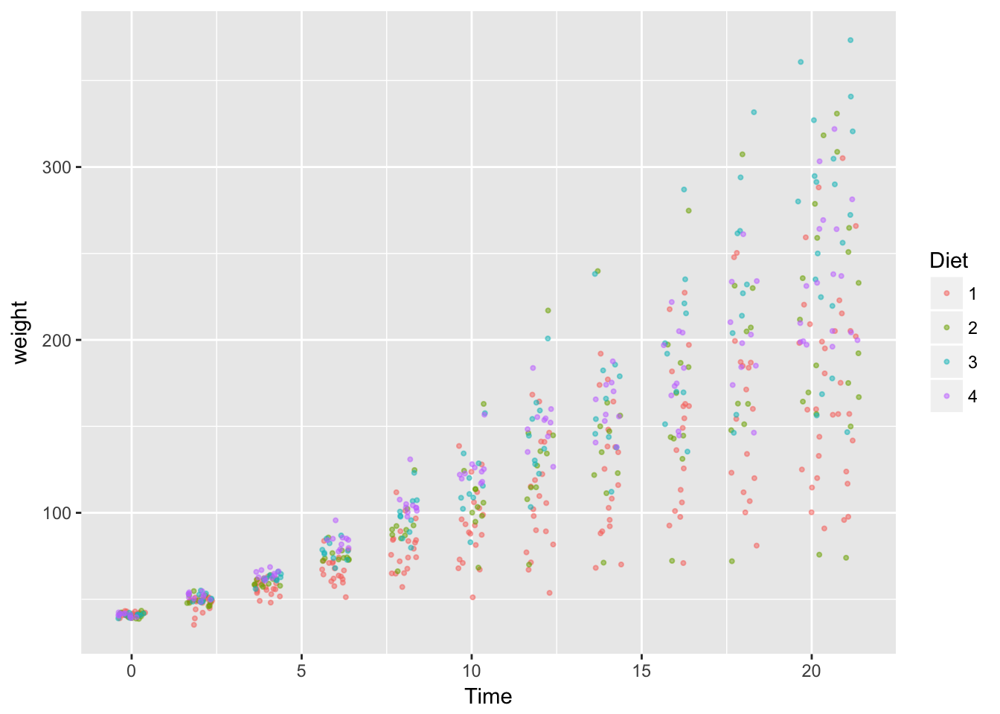
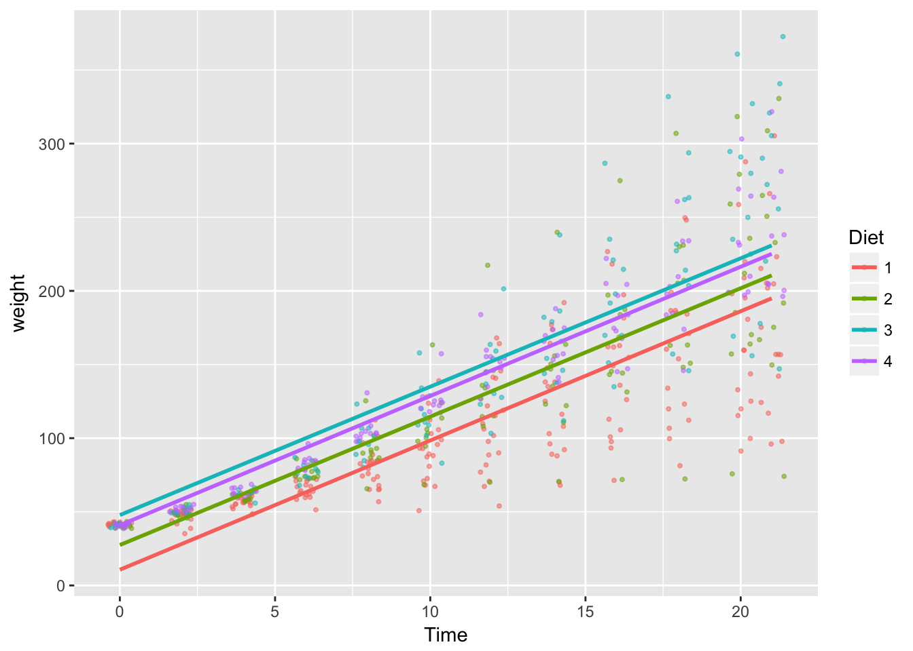
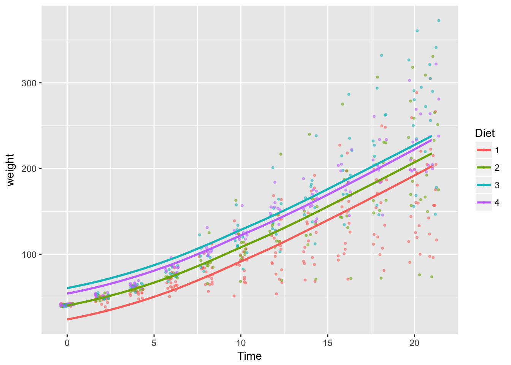
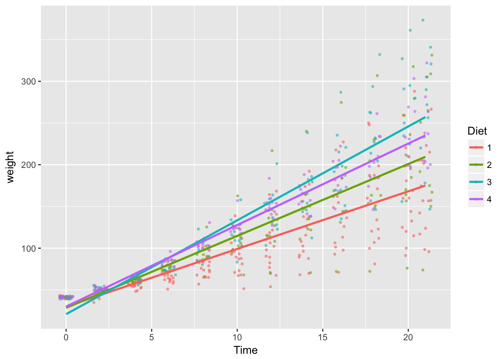

## Demo. Mixed Effects Models and LSMEANS {#mixed}


Mixed effects models employing fixed and random parameters are popular in the analysis of experimental data.  In some disciplines, there is a strong tradition of summarizing results with "LSMEANS", a [SAS's terminology](http://andrey-myslivets.tumblr.com/post/92630498431/en).  

Here we will briefly  demonstrate mixed effect estimation and
[lsmeans](https://www.google.com/url?sa=t&rct=j&q=&esrc=s&source=web&cd=1&cad=rja&uact=8&ved=0ahUKEwjk4-XQo_LbAhVk4oMKHXY4ACUQFggoMAA&url=https%3A%2F%2Fcran.r-project.org%2Fweb%2Fpackages%2Flsmeans%2Fvignettes%2Fusing-lsmeans.pdf&usg=AOvVaw2kxQsw-sISiXmxlP2kTzj4) in R.   


```r
library(dplyr)
library(ggplot2)
library(lme4)
library(lsmeans)

# make a copy of dataset
ChickWeight2 <- ChickWeight
```

### Mixed Effect Models {-}

Let $weight_{ijt}$ be the weight of chick $i$ in Diet group $j$ observed in time $t$.  Consider modeling the effect of Diet on weight. (If you are new to R estimation syntax, [reading this](http://conjugateprior.org/2013/01/formulae-in-r-anova/)
 may be helpful.) 

#### Model 1 linear time trend $\beta_{1}$, Diet fixed effects $\alpha_{j}$,  Chick random effects $u_i$ {-}

$$ weight_{ijt} = \alpha_{j} + \beta_{1}\: time_t + v_{ijt}, \:\: v_{ijt} = u_i+ \varepsilon_{ijt}$$
where $ v_{ijt}$ is a composite error term consisting of Chick random effects $u_i$  and random error component $\varepsilon_{ijt}$.  


```r
model_1 <- ChickWeight2 %>% 
  with(lmer(weight ~  Diet + Time  + (1 | Chick))) 

# summary including marginal effects (coefficients) 
summary(model_1)
```

```
## Linear mixed model fit by REML ['lmerMod']
## Formula: weight ~ Diet + Time + (1 | Chick)
## 
## REML criterion at convergence: 5584
## 
## Scaled residuals: 
##     Min      1Q  Median      3Q     Max 
## -3.0591 -0.5779 -0.1182  0.4962  3.4515 
## 
## Random effects:
##  Groups   Name        Variance Std.Dev.
##  Chick    (Intercept) 525.4    22.92   
##  Residual             799.4    28.27   
## Number of obs: 578, groups:  Chick, 50
## 
## Fixed effects:
##             Estimate Std. Error t value
## (Intercept)  11.2438     5.7887   1.942
## Diet2        16.2100     9.4643   1.713
## Diet3        36.5433     9.4643   3.861
## Diet4        30.0129     9.4708   3.169
## Time          8.7172     0.1755  49.684
## 
## Correlation of Fixed Effects:
##       (Intr) Diet2  Diet3  Diet4 
## Diet2 -0.550                     
## Diet3 -0.550  0.339              
## Diet4 -0.550  0.339  0.339       
## Time  -0.307 -0.015 -0.015 -0.011
```

```r
# lsmeans: projected mean for each Diet 
lsmeans(model_1, specs=c("Diet"))
```

```
## Loading required namespace: lmerTest
```

```
##  Diet   lsmean       SE    df  lower.CL upper.CL
##  1    104.6748 5.510541 47.38  93.59138 115.7582
##  2    120.8848 7.694168 45.64 105.40941 136.3602
##  3    141.2181 7.694168 45.64 125.74275 156.6935
##  4    134.6877 7.702571 45.83 119.19541 150.1800
## 
## Degrees-of-freedom method: satterthwaite 
## Confidence level used: 0.95
```

#### Model 2: discrete time fixed effects $\beta_{t}$, Diet fixed effects $\alpha_{j}$ and Chick random effects $u_i$ {-}

$$ weight_{ijt} = \alpha_{j} + \beta_{t} + v_{ijt}, \:\: v_{ijt} = u_i+ \varepsilon_{ijt}$$


```r
# add a factor time variable
ChickWeight2 <- ChickWeight2 %>% mutate(Time_fac = as.factor(Time)) 

model_2 <- ChickWeight2 %>%
  with(lmer(weight ~  Diet + Time_fac + (1 | Chick)))

# summary including marginal effects (coefficients) 
summary(model_2)
```

```
## Linear mixed model fit by REML ['lmerMod']
## Formula: weight ~ Diet + Time_fac + (1 | Chick)
## 
## REML criterion at convergence: 5499.1
## 
## Scaled residuals: 
##     Min      1Q  Median      3Q     Max 
## -3.3235 -0.5158 -0.0179  0.4625  3.2968 
## 
## Random effects:
##  Groups   Name        Variance Std.Dev.
##  Chick    (Intercept) 523.3    22.87   
##  Residual             770.2    27.75   
## Number of obs: 578, groups:  Chick, 50
## 
## Fixed effects:
##             Estimate Std. Error t value
## (Intercept)   24.424      6.616   3.692
## Diet2         16.310      9.427   1.730
## Diet3         36.643      9.427   3.887
## Diet4         30.230      9.434   3.205
## Time_fac2      8.160      5.550   1.470
## Time_fac4     18.660      5.587   3.340
## Time_fac6     33.006      5.587   5.908
## Time_fac8     49.945      5.587   8.940
## Time_fac10    66.537      5.587  11.909
## Time_fac12    87.945      5.587  15.741
## Time_fac14   101.947      5.620  18.141
## Time_fac16   125.667      5.653  22.229
## Time_fac18   147.774      5.653  26.139
## Time_fac20   167.253      5.687  29.407
## Time_fac21   175.710      5.723  30.703
```

```
## 
## Correlation matrix not shown by default, as p = 15 > 12.
## Use print(x, correlation=TRUE)  or
## 	 vcov(x)	 if you need it
```

```r
# lsmeans: projected mean for each Diet 
lsmeans(model_2, specs=c("Diet"))
```

```
##  Diet   lsmean       SE    df  lower.CL upper.CL
##  1    106.3072 5.488820 47.51  95.26823 117.3461
##  2    122.6167 7.664476 45.76 107.20212 138.0312
##  3    142.9500 7.664476 45.76 127.53546 158.3645
##  4    136.5373 7.672861 45.96 121.10587 151.9687
## 
## Results are averaged over the levels of: Time_fac 
## Degrees-of-freedom method: satterthwaite 
## Confidence level used: 0.95
```

```r
# lsmeans: projected mean for each combination of Time_fac and Diet 
lsmeans(model_2, specs=c("Time_fac","Diet"))
```

```
##  Time_fac Diet    lsmean       SE     df  lower.CL  upper.CL
##  0        1     24.42351 6.615760  99.01  11.29643  37.55059
##  2        1     32.58351 6.615760  99.01  19.45643  45.71059
##  4        1     43.08306 6.669652 101.11  29.84904  56.31707
##  6        1     57.43000 6.669652 101.11  44.19598  70.66401
##  8        1     74.36877 6.669652 101.11  61.13476  87.60278
##  10       1     90.96061 6.669652 101.11  77.72660 104.19462
##  12       1    112.36877 6.669652 101.11  99.13476 125.60278
##  14       1    126.37031 6.707010 103.14 113.06217 139.67845
##  16       1    150.09078 6.744365 105.23 136.70852 163.47304
##  18       1    172.19716 6.744365 105.23 158.81490 185.57942
##  20       1    191.67605 6.768521 106.60 178.24586 205.10624
##  21       1    200.13339 6.805510 108.76 186.62981 213.63698
##  0        2     40.73301 8.543480  70.20  23.78093  57.68510
##  2        2     48.89301 8.543480  70.20  31.94093  65.84510
##  4        2     59.39256 8.555171  70.64  42.41728  76.36785
##  6        2     73.73950 8.555171  70.64  56.76422  90.71479
##  8        2     90.67828 8.555171  70.64  73.70299 107.65356
##  10       2    107.27012 8.555171  70.64  90.29483 124.24540
##  12       2    128.67828 8.555171  70.64 111.70299 145.65356
##  14       2    142.67982 8.571485  71.16 125.67216 159.68747
##  16       2    166.40029 8.588795  71.72 149.35829 183.44229
##  18       2    188.50667 8.588795  71.72 171.46467 205.54867
##  20       2    207.98556 8.607256  72.31 190.90693 225.06419
##  21       2    216.44290 8.626723  72.94 199.32564 233.56016
##  0        3     61.06635 8.543480  70.20  44.11426  78.01844
##  2        3     69.22635 8.543480  70.20  52.27426  86.17844
##  4        3     79.72590 8.555171  70.64  62.75061  96.70118
##  6        3     94.07284 8.555171  70.64  77.09755 111.04812
##  8        3    111.01161 8.555171  70.64  94.03633 127.98690
##  10       3    127.60345 8.555171  70.64 110.62816 144.57873
##  12       3    149.01161 8.555171  70.64 132.03633 165.98690
##  14       3    163.01315 8.571485  71.16 146.00549 180.02080
##  16       3    186.73362 8.588795  71.72 169.69162 203.77562
##  18       3    208.84000 8.588795  71.72 191.79800 225.88200
##  20       3    228.31889 8.607256  72.31 211.24026 245.39752
##  21       3    236.77623 8.626723  72.94 219.65897 253.89349
##  0        4     54.65362 8.547798  70.33  37.69297  71.61428
##  2        4     62.81362 8.547798  70.33  45.85297  79.77428
##  4        4     73.31317 8.559459  70.77  56.32938  90.29696
##  6        4     87.66011 8.559459  70.77  70.67632 104.64390
##  8        4    104.59889 8.559459  70.77  87.61509 121.58268
##  10       4    121.19072 8.559459  70.77 104.20693 138.17452
##  12       4    142.59889 8.559459  70.77 125.61509 159.58268
##  14       4    156.60042 8.575756  71.29 139.58429 173.61655
##  16       4    180.32089 8.593047  71.85 163.27046 197.37133
##  18       4    202.42728 8.593047  71.85 185.37684 219.47772
##  20       4    221.90616 8.630538  73.05 204.78134 239.03099
##  21       4    230.36351 8.650333  73.70 213.19940 247.52761
## 
## Degrees-of-freedom method: satterthwaite 
## Confidence level used: 0.95
```


#### Model 3: Diet fixed effects on liear-time growth rates $\beta_{1j}$,  Chick random effects $u_i$ {-}

$$ weight_{ijt} = \alpha_{0} + \beta_{1j}\: time_t + v_{ijt}, \:\: v_{ijt} = u_i+ \varepsilon_{ijt}$$

Note: we assume common intercept $\alpha_{0}$ at Time=0 across Diet types.


```r
model_3 <- ChickWeight2 %>% 
  with(lmer(weight ~ Diet*Time - Diet + (1 | Chick))) 

# summary including marginal effects (coefficients)
summary(model_3)
```

```
## Linear mixed model fit by REML ['lmerMod']
## Formula: weight ~ Diet * Time - Diet + (1 | Chick)
## 
## REML criterion at convergence: 5488
## 
## Scaled residuals: 
##     Min      1Q  Median      3Q     Max 
## -3.3226 -0.5908 -0.0699  0.5435  3.5918 
## 
## Random effects:
##  Groups   Name        Variance Std.Dev.
##  Chick    (Intercept) 532.9    23.09   
##  Residual             643.0    25.36   
## Number of obs: 578, groups:  Chick, 50
## 
## Fixed effects:
##             Estimate Std. Error t value
## (Intercept)  28.1852     3.8206   7.377
## Time          6.7729     0.2435  27.818
## Diet2:Time    1.8442     0.3857   4.782
## Diet3:Time    4.4756     0.3857  11.605
## Diet4:Time    2.9418     0.3906   7.532
## 
## Correlation of Fixed Effects:
##            (Intr) Time   Dt2:Tm Dt3:Tm
## Time       -0.287                     
## Diet2:Time  0.008 -0.581              
## Diet3:Time  0.008 -0.581  0.366       
## Diet4:Time  0.004 -0.573  0.361  0.361
```

```r
# lsmeans: projected mean for each Diet at given Time values 
lsmeans(model_3, specs=c("Diet"), at=list(Time=c(5, 10, 20)))
```

```
## Loading required namespace: lmerTest
```

```
##  Diet Time    lsmean       SE     df  lower.CL  upper.CL
##  1       5  62.04951 3.661222  60.89  54.72817  69.37084
##  2       5  71.27029 3.808503  68.67  63.65444  78.88614
##  3       5  84.42731 3.808503  68.67  76.81146  92.04317
##  4       5  76.75832 3.814692  68.99  69.13009  84.38655
##  1      10  95.91377 3.895676  71.79  88.12360 103.70394
##  2      10 114.35534 4.399435 101.23 105.55780 123.15287
##  3      10 140.66939 4.399435 101.23 131.87185 149.46692
##  4      10 125.33140 4.432729 103.29 116.46729 134.19551
##  1      20 163.64230 5.254660 164.97 153.13457 174.15003
##  2      20 200.52543 6.624401 248.93 187.27864 213.77222
##  3      20 253.15353 6.624401 248.93 239.90674 266.40033
##  4      20 222.47756 6.728268 255.00 209.02306 235.93206
## 
## Degrees-of-freedom method: satterthwaite 
## Confidence level used: 0.95
```

#### Model 4: Diet fixed effects on quadratic-time growth rates $\beta_{1j}$ and  $\beta_{2j}$,  Chick random effects $u_i$ {-}

$$ weight_{ijt} = \alpha_{0} + \beta_{1j}\: time_t + \beta_{2j}\: time_t^2 + v_{ijt}, \:\: v_{ijt} = u_i+ \varepsilon_{ijt}$$

Note: we assume common intercept $\alpha_{0}$ at Time=0 across Diet types.


```r
model_4 <- ChickWeight2 %>%
  with(lmer(weight ~ Diet:Time + Diet:I(Time^2) - Diet  + (1 | Chick)))

# summary including marginal effects (coefficients)
summary(model_4)
```

```
## Linear mixed model fit by REML ['lmerMod']
## Formula: weight ~ Diet:Time + Diet:I(Time^2) - Diet + (1 | Chick)
## 
## REML criterion at convergence: 5463.7
## 
## Scaled residuals: 
##     Min      1Q  Median      3Q     Max 
## -4.0129 -0.5185 -0.0110  0.5288  3.4598 
## 
## Random effects:
##  Groups   Name        Variance Std.Dev.
##  Chick    (Intercept) 522.4    22.86   
##  Residual             600.6    24.51   
## Number of obs: 578, groups:  Chick, 50
## 
## Fixed effects:
##                 Estimate Std. Error t value
## (Intercept)     37.99451    4.14966   9.156
## Diet1:Time       4.53465    0.85256   5.319
## Diet2:Time       5.78814    1.12549   5.143
## Diet3:Time       5.11572    1.12549   4.545
## Diet4:Time       7.79434    1.13449   6.870
## Diet1:I(Time^2)  0.10316    0.03995   2.583
## Diet2:I(Time^2)  0.13111    0.05262   2.491
## Diet3:I(Time^2)  0.29413    0.05262   5.589
## Diet4:I(Time^2)  0.08703    0.05356   1.625
## 
## Correlation of Fixed Effects:
##             (Intr) Dt1:Tm Dt2:Tm Dt3:Tm Dt4:Tm D1:I(T D2:I(T D3:I(T
## Diet1:Time  -0.349                                                 
## Diet2:Time  -0.259  0.090                                          
## Diet3:Time  -0.259  0.090  0.067                                   
## Diet4:Time  -0.259  0.090  0.067  0.067                            
## Dt1:I(Tm^2)  0.281 -0.961 -0.073 -0.073 -0.073                     
## Dt2:I(Tm^2)  0.207 -0.072 -0.962 -0.053 -0.053  0.058              
## Dt3:I(Tm^2)  0.207 -0.072 -0.053 -0.962 -0.053  0.058  0.043       
## Dt4:I(Tm^2)  0.206 -0.072 -0.053 -0.053 -0.961  0.058  0.043  0.043
```

```r
# lsmeans: projected mean for each Diet at given Time values 
lsmeans(model_4, specs=c("Diet"), at=list(Time=c(5, 10, 20)))
```

```
## NOTE: Results may be misleading due to involvement in interactions
```

```
##  Diet   lsmean       SE     df lower.CL upper.CL
##  1    108.9524 4.349821  88.98 100.3094 117.5954
##  2    128.4676 5.413575 131.34 117.7109 139.2243
##  3    149.1506 5.413575 131.34 138.3939 159.9073
##  4    144.1593 5.415879 131.77 133.3981 154.9206
## 
## Results are averaged over the levels of: Time 
## Degrees-of-freedom method: satterthwaite 
## Confidence level used: 0.95
```


### Visualizing Model Fit {-}

#### Raw data {-}

```r
# raw data plot 
base_plot <- 
  ChickWeight2 %>%
    ggplot(aes( x = Time, 
                y = weight, 
                color = Diet)) + 
    geom_jitter(size =.75, alpha=.5) 

base_plot
```



#### Model 1 fit (approx.) {-}


```r
# overlay model_1, approximated by  y ~ x
base_plot +
  geom_smooth(
    aes(x = Time, 
        y = fitted.values(model_1),
        color = Diet),
    method='lm', formula = y ~ x, se=FALSE)
```



#### Model 2 fit (approx.) {-}

```r
# overlay model_2, approximated by loess 
base_plot +
  geom_smooth(
    aes(x = Time, 
        y = fitted.values(model_2),
        color = Diet), se=FALSE)
```

```
## `geom_smooth()` using method = 'loess'
```



#### Model 3 fit (approx.) {-}

```r
# overlay model_3, approximated by  y ~ x
base_plot +
  geom_smooth(
    aes(x = Time, 
        y = fitted.values(model_3),
        color = Diet),
    method='lm', formula = y ~ x, se=FALSE)
```



#### Model 4 fit (approx.) {-}

```r
# overlay model_4, approximated by  y ~ x + x^2 
base_plot +
  geom_smooth(
    aes(x = Time, 
        y = fitted.values(model_4),
        color = Diet),
    method='lm', formula = y ~ x + I(x^2), se=FALSE)
```


